# SD_01 프로세스 설계서 — Buildcare AI
**Buildcare AI · SD_01 · BPMN 2.0 의미 대응 PlantUML (프로세스 지도 + 프로세스별 IPO·다이어그램 + 인계 계약 + 게이트 맵)**

---

> **문서 식별**: `Design/SD_01_프로세스설계서_Buildcare AI.md`
> **작성일**: 2026-10-02
> **입력**: `Design/usecases/UC_00_개요_Buildcare AI.md` (§3 목록 · §4 Actor · §5 L1 다이어그램) + `UC_01`~`UC_08` 전건(기본흐름·대체·예외흐름·업무규칙·Sequence Diagram)
> **원천(SoT)**: `Intent-Specify.md` — Buildcare AI 의도명세
> **작성 프롬프트**: `Design/분석설계 프롬프트 - 프로세스.md`
> **다이어그램**: 모든 PlantUML 소스는 사내 Kroki `plantuml.sumzip.com` 에서 렌더 검증했다(HTTP 200 · image/svg+xml · Syntax Error 없음 · 링크 복호 소스 = 코드블록).

---

## 목차

1. 범위·설계 원칙
2. 프로세스 지도 (L0)
3. P0 정기점검 기한 감시
4. P1 분석 이용권 확보
5. P2 하자 사진 AI 분석
6. P3 현장 점검·보수 기록
7. P4 분석 결과 전문가 검증
8. P5 건물 이력·반복 하자 조회
9. P6 유지관리 우선순위 판단
10. P7 정기점검 계획·추적
11. P8 전문가 점검 연결
12. 프로세스 간 인계 계약
13. 게이트 맵
14. 원천 추적성
15. 미해결·확인 필요

---

## 1. 범위·설계 원칙

### 1-1 왜 유스케이스만으로는 부족한가

UC 문서 8건은 액터의 목표 단위로 잘려 있다. 그러나 사용자가 실제로 겪는 것은 "사진을 올렸다 → 현장에서 고쳤다 → 전문가가 확인했다 → 건물 단위로 다음 조치를 정했다"는 **하나의 시간축**이다. 이 문서는 그 시간축과 그 위의 차단 지점을 복원한다.

| UC가 답하지 않는 것 | 프로세스가 답하는 것 |
|---|---|
| UC1 결과가 UC3·UC4·UC7로 **어떤 산출물 형태로** 넘어가는가 | §12 인계 계약 — 분석 결과·이력 레코드·검증 대상·전문가 판정의 필수 항목과 무효 조건 |
| 무료 체험 소진(UC1 E4)과 결제(UC2)는 **어느 쪽이 먼저**인가 | P2 2.1 게이트 G2 에서 막히고 P1 으로 넘어갔다가 P2 로 복귀한다 |
| UC3 E2 불일치는 **누가 언제** 받는가 | P3 3.6 에서 검증 대상이 생성되어 P4 대기 목록으로 인계된다 |
| 여러 UC의 "위험 시 전문가 점검 권고"(UC1 EXT1 · UC4 E4 · UC6 E3)는 **어디로 모이는가** | 모두 P8 전문가 점검 연결의 진입점이다 |
| UC6 "도래 알림·지연 알림"은 **누가 실행하는가** | 사람이 아니라 시간이 트리거하므로 상시 배치 P0 로 분리했다 |
| 예외흐름 29개 중 **무엇이 진행을 멈추는가** | §13 게이트 맵 — 처리 중단·출력 차단으로 끝나는 분기만 G0~G10 으로 승격했다 |

### 1-2 도출 원칙

1. **UC를 쪼개거나 발명하지 않는다.** 각 프로세스는 UC 하나를 그대로 담거나(P1~P8), 한 UC의 시간 트리거 단계만 상시 배치로 옮긴다(P0 ← UC6 기본흐름 4·E1). UC에 없는 단계는 만들지 않았다.
2. **Sequence 메시지가 IPO 단계의 근거다.** 모든 IPO 행의 `근거` 열은 `UCn 기본흐름 k` · `En` · `INCn` 처럼 문서·절 단위로 지목한다.
3. **`alt` 중 "처리 중단·출력 차단"으로 끝나는 것만 게이트다.** 연동 실패 후 내부 데이터로 계속하는 분기(UC5 E1 · UC8 E2), 표시만 덧붙이는 분기(UC1 E3 · UC8 E1), 다른 UC로 넘기기만 하는 분기(UC3 E2 · UC4 E2·E4 · UC6 E3)는 프로세스 내부 분기로 두었다.
4. **사용자 관점으로 이름 붙인다.** "UC1 실행"이 아니라 "하자 사진 AI 분석", "UC8 실행"이 아니라 "유지관리 우선순위 판단"이다.
5. **없는 것을 만들지 않는다.** 응답시간·점검 주기·수수료 요율·데이터 충분성 기준처럼 원천에 없는 값은 지어내지 않고 §15 에 남겼다.

### 1-3 UC → 프로세스 매핑

| 프로세스 | 명칭 | 성격 | 포함 UC | 주 사용자 |
|:--:|---|---|---|---|
| P0 | 정기점검 기한 감시 | 상시 배치 (시간 트리거) | UC6 기본흐름 4 · E1 | 시스템 (수신: 시설관리자·건물관리자) |
| P1 | 분석 이용권 확보 | 1단계 · 수익화 | UC2 · INC3 | 일반 사용자 |
| P2 | 하자 사진 AI 분석 | 1단계 · 본류 진입 | UC1 · INC1 · INC2 · EXT1 | 일반 사용자 (시설관리자 포함) |
| P3 | 현장 점검·보수 기록 | 2단계 · 이력 축적 | UC3 · INC3 | 시설관리자 |
| P4 | 분석 결과 전문가 검증 | 2단계 · 신뢰도 관리 | UC4 · INC3 | 전문가 |
| P5 | 건물 이력·반복 하자 조회 | 3단계 · 조회 | UC5 · INC3 | 건물관리자 |
| P6 | 유지관리 우선순위 판단 | 3단계 · 의사결정 | UC8 · INC3 | 기업 관리자 |
| P7 | 정기점검 계획·추적 | 3단계 · 예방정비 | UC6 (기본흐름 1~3·5, E2·E3) · INC3 | 건물관리자 |
| P8 | 전문가 점검 연결 | 3단계 · 전문가 연계 | UC7 · INC3 | 건물관리자 |

**묶은 근거**

- **P2 = UC1 + INC1 + INC2 + EXT1.** UC_00 §3 포함 관계표가 INC1(AI 이미지 분석)·INC2(1차 참고용 고지)를 UC1이 **항상** 포함한다고 정의한다. EXT1(전문가 점검 권고)은 UC1 확장점(위험 가능성 판정 시)에서만 호출되는 «extend» 이므로 별도 프로세스가 아니라 P2 내부 분기(2.6)로 두었다.
- **INC3 로그인·권한 확인은 프로세스가 아니라 게이트 G0 이다.** UC_00 §3 이 INC3을 UC2~UC8 이 모두 포함한다고 정의하고, 각 UC Sequence 의 첫 `alt`(권한 없음 → 접근 거부)가 처리 중단으로 끝난다. 그래서 7개 프로세스의 첫 단계에 같은 게이트로 배치했다.

**분리한 근거**

- **P0 을 P7(UC6)에서 분리했다.** UC6 Sequence 에서 "도래 알림"·"지연 표시(E1)"는 건물관리자의 조작이 아니라 기한 도래가 트리거한다. UC6 기본흐름 4 의 액터 행위는 "확인"뿐이고, E1 은 "기한이 지났는데 결과가 없다"는 시간 조건이다. 사람이 앉아서 끝내는 덩어리(P7)와 실행 주체가 다르므로 상시 배치로 옮겼다. 단계를 새로 만들지는 않았다.
- **P5(UC5)와 P6(UC8)을 묶지 않았다.** 둘 다 이력을 조회하지만 주 액터(건물관리자 / 기업 관리자)와 범위(건물 하나 / 관리 건물 전체), 산출물(반복 하자 패턴 / 우선순위 목록)이 다르다. UC8 사전조건(2) 기업 라이선스는 UC5 에 없다.
- **P1(UC2)을 P2(UC1)에 흡수하지 않았다.** UC2 는 UC1 E4 에서 진입하지만 A1(무료 체험이 남은 상태의 자발적 진입)이 있어 독립 실행이 가능하고, 외부 액터(결제 수단)와 산출물(이용권)이 따로 있다.
- **P3(UC3)와 P4(UC4)를 묶지 않았다.** UC3 → UC4 는 «include» 가 아닌 조건부 인계(UC3 E2)이고 수행자가 다르다(시설관리자 / 전문가). 시간축도 비동기다 — 전문가는 검증 대기 목록에서 나중에 꺼낸다(UC4 기본흐름 1).

### 1-4 BPMN 2.0 - PlantUML 표기 대응표

| BPMN 2.0 요소 | PlantUML 구문 | 규약 |
|---|---|---|
| Pool · Lane | `\|레인명\|` · `\|#E3F0E3\|레인명\|` | 레인 = 수행 주체(액터·시스템·외부기관). 한 도면 3~5개 |
| Start Event | `start` | 도면당 **1개** |
| Task | `:작업명;` | 동사로 끝낸다. 명사 나열 금지 |
| Sub-Process | `partition "P1 요청 접수" { … }` | L0 지도에서 프로세스 덩어리를 표현할 때 |
| Exclusive Gateway (XOR) | `if (조건) then (분기) … else (분기) … endif` | 2갈래 |
| Exclusive Gateway 3갈래 이상 | `switch (판정) case (…) … endswitch` | 게이트 판정에 권장 |
| Parallel Gateway (AND) | `fork` / `fork again` / `end fork` | 동시 수행 |
| Inclusive 분기 | `split` / `split again` / `end split` | |
| Loop Activity | `repeat … repeat while (조건) is (예) not (아니오)` | 보완·재시도 |
| End Event | `stop` | 정상 종료 |
| Terminate End Event | `kill` | **게이트 차단 종료에 쓴다** — 정상 종료와 시각적으로 구분된다 |
| Error Boundary Event | 게이트 분기 → 담당 레인 전환 → `#FFD9D9:중단 사유  E1;` → `kill` | 예외흐름 ID를 작업명에 **병기** |
| Data Object | `note right: 산출물 - intake_snapshot v1` | 인계물 표기 |
| Text Annotation | `note` | |

---

## 2. 프로세스 지도 (L0)

본류는 1단계(이용권 → 분석) → 2단계(현장 기록 → 조건부 전문가 검증) → 3단계(건물 이력·우선순위 → 점검·전문가 연결)로 흐른다. 3단계는 쌓인 이력을 읽는 두 갈래(P5·P6)와 조치를 실행하는 두 갈래(P7·P8)로 나뉜다. P0 은 P7 이 만든 점검 일정을 상시 감시한다.

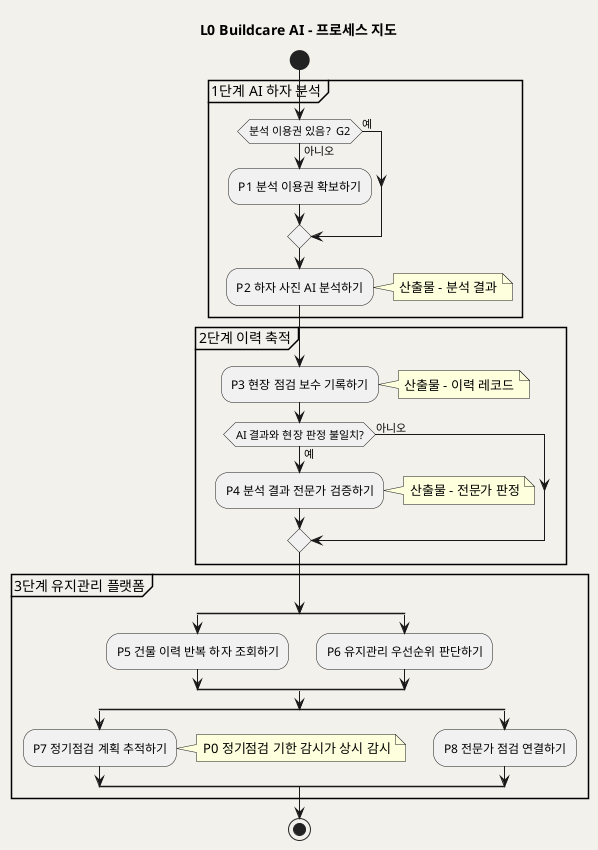

**[「L0 Buildcare AI - 프로세스 지도」 PlantUML 뷰어로 열기](https://plantuml.sumzip.com/plantuml/svg/eNqNk81u2lAQhfd-ilGySRaVAvRPdJE0VVNV6oJXcIMBK46NbKMuqkhOexdWoQpSseogg4yUn1Zl4QaKqERfyHf8Dh1jQ0xKq-58R3Pu-ebM9Z5hirrZOFYE40hW66IuHsNr8fCoqmsNtfxMUzQdNg8KB7nn-5kOoyaWtTeyWoWKqBiSYMqmIsGrHdhvyEr5UNQlePoS7kHUYXzgIZvihwvAa4ufMUGYOwp0EalkTYWNHG9-CUcslkSOi_028AlD1tuAtwKAXIGt5AzYG2P3azhpAfZt7LV2AV7kt8GsSSpsoWtvU7tEPHRwGG_a6F7EJYBiKQd_3BGdO3w0JsdwGjyJlWpZrghxc37Bge-GeD0HS9S3zapmSqDL1ZpZpK4AJx4fzmji1CW8CcLRTDjJjplPxyQC7l8CThz0T5MZi6UCRC7DPpX9dnhjAZGh7QK58cF_2KZ3ct_GXx3-yUtzI_CEBM-thUHUaqPvECglOMOf7u6dAGOa-6tzEBTjw2kYWFSw8CoD9A-kpSZxXL-bJPSVnAqLnDyfnkw4tvjVkF5Si_e_RWezJDCjrshmCvsAwu_j2HMRQuDy0Y_lCgdB1G3dAs-VIFZFWU31D1edsBsg89H20GMxOtGsvJGld5bhEY3rUE-6PcKPuh9pxR1a8d_CKu3cEU2DyPEgDNrY9OLc8P0pfaWFteiPMymnt-DngJa2jviE_jytLuxRhf733yes9P8=)** — 클릭 시 브라우저로 연결됩니다.

| 진입 경로 | 출발 | 도착 | 근거 |
|---|---|---|---|
| 이용권 없음 | P2 2.1 (G2) | P1 | UC1 E4 · UC2 기본흐름 1 |
| 결제 완료 후 복귀 | P1 1.6 | P2 | UC2 기본흐름 6 |
| 분석 결과 연결 | P2 | P3 3.2 | UC3 기본흐름 2 |
| 불일치 검증 대상 | P3 3.6 | P4 | UC3 E2 · BR-DEF-07 |
| 위험 권고 | P2 2.6 · P4 4.5 · P7 7.5 | P8 | UC1 EXT1 · UC4 E4 · UC6 E3 · UC7 A1 |
| 이력에서 조치 | P5 5.6 | P7 · P8 | UC5 A1 · A2 |
| 우선순위에서 조치 | P6 6.5 | P7 · P8 | UC8 기본흐름 5 |
| 배정 점검 수행 | P7 7.3 | P3 | UC6 기본흐름 3·5 · UC6 UseCase Diagram "점검 결과 연결" |

---

## 3. P0 정기점검 기한 감시

### 3-1 단계별 IPO

| # | 단계 | Input | Process | Output | 근거 |
|:--:|---|---|---|---|---|
| 0.1 | 감시 대상 수집 | 점검 일정(P7 산출) | 완료되지 않은 일정을 감시 목록으로 모은다 | 감시 목록 | UC6 기본흐름 4 · Sequence "4. 도래 일정 확인" |
| 0.2 | 도래 알림 | 감시 목록 · 기준일 | 기한이 도래한 일정의 담당자에게 알린다 | 도래 알림 | UC6 기본흐름 4 · Sequence "SVC -> FM : 도래 알림" |
| 0.3 | 지연 판정 | 감시 목록 · 이력 레코드 연결 여부 | 기한이 지났는데 연결된 결과가 없으면 지연으로 바꾸고 알린다 | 지연 상태 · 지연 알림 | UC6 E1 · Sequence `alt 기한 경과·결과 없음 (E1)` |

### 3-2 프로세스 다이어그램

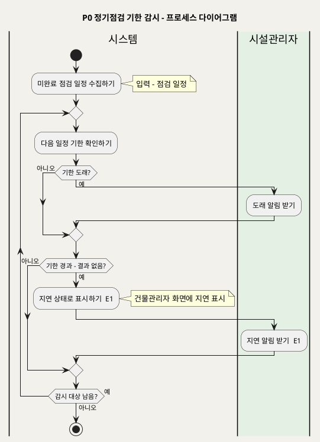

**[「P0 정기점검 기한 감시 - 프로세스 다이어그램」 PlantUML 뷰어로 열기](https://plantuml.sumzip.com/plantuml/svg/eNqNksFq21AQRffvKy5k4ywKCd6pi4YWe51fUGvZFnEkI72QjRduowRTG-pAVCtUNi51kxQCURxBtXB_SG_0DxlbcmvTTXYPZubee-bNgSt1R54ct4R7ZFpt3dGP8V7_cNRw7BOr9s5u2Q52quXqfuXtRofb1Gv2qWk1UNdbriGkKVsGDvdAUz9NIpoO03kX_Mr8EGk0pH6IV8iuPPU9JC-hzzOo_ozGMX2N09-JmtwJ0eEmLmTnYUesQglNPSR07akfAxSKNF6wA6gX0O1l5gfs8FpYtjTgmI2m1ECTczX9yV5bA8Ix2oYuBaCtbAdroSJhdu3TOFnrAWYdpaKkvnhqErzZhWwaFkoU9Ha5AejsVMrVvUp5ldqbpXFX3dzTZNhZVbV8DOQP1M0CKvpWKPPgBiZg8PZY1fdUv0fBbKltWDWzvh0inf9JnxZMlc6j5YNGFwzxfyiNbrs0ikBnH7OzkHeN7DJkv5wMqOznGTY3lj7G6n7xNz_v4kr9imk0RCGWS7wEeu2-Cf3P9IXg-VfhtGnyRZWK21GDLjNBfbrLuU03p16SbKm40m6LA1bii34Gp0tr7Q==)** — 클릭 시 브라우저로 연결됩니다.

### 3-3 설계 주의

이 프로세스에는 게이트가 없다. 지연(E1)은 진행을 막는 것이 아니라 **늦었다는 사실을 드러내는** 분기이기 때문이다. 원천 `[부정적 영향]` 이 "점검 지연"을 위험으로 명시하므로, 지연을 조용한 상태값으로만 두면 안 된다. 반드시 건물관리자 화면 표시와 담당자 알림이 **둘 다** 나가야 한다. 하나만 나가면 SD_02 에서 "지연 배지는 있는데 아무도 모르는" 화면이 나온다.

완료 판정은 P3 이력 레코드가 일정에 연결되었는지로만 한다(UC6 기본흐름 5). 감시 주기, 도래 판정 기준일(며칠 전), 알림 수단은 원천에 없다(§15).

---

## 4. P1 분석 이용권 확보

### 4-1 단계별 IPO

| # | 단계 | Input | Process | Output | 근거 |
|:--:|---|---|---|---|---|
| 1.1 | 구매 진입·로그인 확인 | 구매 요청 | 로그인 여부를 확인한다 — G0 | 식별된 사용자 | UC2 기본흐름 1 · INC3 · E3 · Sequence `alt 미로그인 (E3)` |
| 1.2 | 요금제 제시 | 사용자 ID | 무료 체험 상태를 조회하고 건별 유료 분석·월 구독을 제시한다 | 체험 상태 · 요금제 목록 | UC2 기본흐름 1~2 · BR-DEF-05 |
| 1.3 | 요금제 선택 | 선택한 요금제 | 금액·이용 조건을 표시한다 | 결제 대상 | UC2 기본흐름 3 |
| 1.4 | 결제 | 결제 정보 | 결제 수단에 결제를 요청한다 — G1 | 승인 또는 거절 | UC2 기본흐름 4 · E1 · Sequence `alt 결제 거절·실패 (E1)` |
| 1.5 | 이용권 부여 | 결제 승인 | 계정에 선택한 이용 권한을 부여한다 | **분석 이용권** | UC2 기본흐름 5 · 사후조건 2 |
| 1.6 | 분석 복귀 | 분석 이용권 | UC1 화면으로 복귀시킨다 | P2 재진입 | UC2 기본흐름 6 |

### 4-2 프로세스 다이어그램

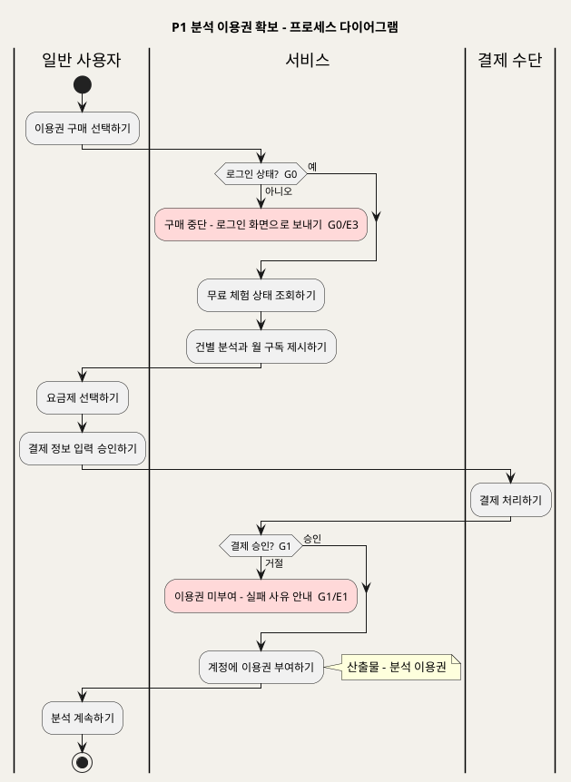

**[「P1 분석 이용권 확보 - 프로세스 다이어그램」 PlantUML 뷰어로 열기](https://plantuml.sumzip.com/plantuml/svg/eNp1k1Fv0lAUx9_vpziJL-PBTLKndQ8uOvDVr1ClQEPXLtDFFx503JlmxTgTkI4VwmJVljSxg4pdwifqPf0OnlY6COrr7Tm_c_6_e3vYMuWmeXqssVZD1U_kpnwMr-TXjVrTONUrzw3NaMKj8l65WHq2UdGqyxXjjarXoCprLYWZqqkp8LIIYsGRjwBHIQ5v40UXkqu-mIfwGJIeFzcu8ggvPBC2l5Z8DuNfkRhPGWvjaCkCB_DMp0YcX7ZZthiT1qj4py--e4B8knRGSd-Jo-CAGrkr7jlB20ytwg7NICaOIsDOu6TjPgV48aQAZl3RYQf7XNgWOl6BAaUqH-0f7Us51vsk7CktuiYkVz1xG6K7pCOgFOIspJkpcLe0d0CIhqppTCEBhHasAlP0ilplkvBD8aULOAuTgbPaA_AmSIbdfG0pvgvFnK98xfMl4HUvS_jxHHDiou2uE_6lRsJhL44sqtuyIcWzIDudZNZxfC4mXwEv7inOAy-vsRwK3F73zBzxzf-f17woQ6VSi7nU-I6-WJtG11cmfkRi8RYHPnlF20u60yyGOwHsW6Qz5eyWitsusyEPOuM5pzw4uNx4Vn-o-bK6YSrQVGt1UyJ-gAtX-Mv0Krde4z9drorSKe8_5MSWaZywQ1qA_ozf4n2z2A==)** — 클릭 시 브라우저로 연결됩니다.

### 4-3 설계 주의

G1 은 **결제 승인 이전에 이용권이 생기지 않게** 하는 게이트다. 승인 응답 전에 낙관적으로 권한을 열어 두면 거절 시 회수해야 하고, 그 사이 P2 분석(AI API 비용, `[비용] 1단계`)이 이미 소진된다. 이용권 부여(1.5)는 반드시 승인 수신 뒤에 둔다.

월 구독 만료(UC2 E2)는 이 프로세스가 아니라 P2 의 G2 에서 걸린다(UC2 Sequence 주석: "UC1 진입 시 권한 확인에서 처리"). 금액·무료 체험 횟수·결제 수단(PG)·환불·해지(UC2 A2)는 원천에 없다(§15).

---

## 5. P2 하자 사진 AI 분석

### 5-1 단계별 IPO

| # | 단계 | Input | Process | Output | 근거 |
|:--:|---|---|---|---|---|
| 2.1 | 사진 접수·이용권 확인 | 하자 사진 | 사진을 받고 분석 이용 권한(무료 체험·건별·구독)을 확인한다 — G2 | 접수 사진 | UC1 기본흐름 1 · E4 · Sequence `alt 무료 체험 소진 (E4)` · BR-DEF-05 |
| 2.2 | 설명 입력 | 간단한 설명 | 설명을 사진과 묶어 분석 요청 단위로 만든다 | 분석 요청 | UC1 기본흐름 2 · A2 · BR-DEF-03 |
| 2.3 | 사진 품질 확인 | 분석 요청 | 분석에 적합한 품질인지 판정한다 — G3 | 적합 판정 요청 | UC1 기본흐름 3 · E1 · Sequence `alt 사진 품질 부적합 (E1)` · BR-DEF-04 |
| 2.4 | AI 이미지 분석 | 이미지 + 설명 | Gemini Vision 에 분석을 요청한다 — G4 | AI 응답 | UC1 기본흐름 3~4 · INC1 · E2 · Sequence `alt API 실패·무응답 (E2)` |
| 2.5 | 결과 구조화·고지 | AI 응답 | 원인·대응방안으로 구조화하고 '1차 참고용'과 진단 책임 범위를 붙인다 | **분석 결과** | UC1 기본흐름 4~5 · INC2 · BR-DEF-01 · BR-DEF-11 |
| 2.6 | 위험 권고 | 분석 결과 | 위험 가능성이나 낮은 신뢰도가 있으면 전문가 점검 권고를 덧붙인다 | 전문가 점검 권고 | UC1 기본흐름 6 · EXT1 · E3 · Sequence `opt 위험 가능성 또는 신뢰도 낮음` · BR-DEF-02 |

### 5-2 프로세스 다이어그램

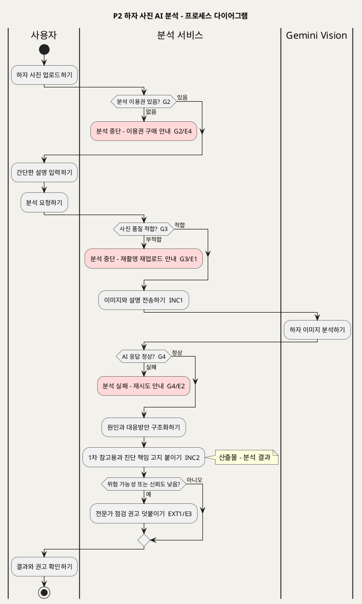

**[「P2 하자 사진 AI 분석 - 프로세스 다이어그램」 PlantUML 뷰어로 열기](https://plantuml.sumzip.com/plantuml/svg/eNqFlEFvElEUhffzK27ipl0YQmFTurDaQtONcWGMW5QpnQAzDUzjhgXUR0MKRqqMBRwImGkAgzqtFDHpL5p35z94H8xAq43dTd7MOe98597MZk6PZ_XDTFrKpRT1IJ6NZ-BV_HUqmdUO1cSWltay8CAWigWjT258kduPJ7Q3ipqEvXg6J0u6oqdleLYGrtHATg3waIR9Bo93gU8YsjY8BLfOeM9ENsUTC3jFwvYYP42dX1PeGUhSXihaQ9LmpVkiKXLbCs9KJOcfTTp2pvaGlPeckZn8NyPTvKTswYp_Su6toTOpAnbK2K4-AthZWwV9X1ZhBc-O6WhVAiKLba9vr0d8lXXKKwMKu5Q7VyPetwCNMj8aC5NANLxBypSSTksysZPd7IZVSVYTyt4tkohjMzJ0DZNiWvxridKUePfcZ1jc26rj5bd7yLwi3A9l7JcBu0XXGAqskI_FJ4X56X_JOiMcj7BRnD35pS75QoFo8G8-z3TOF6Fu-I8p9gvYLCywugyPe3MAgN2nW-SR35EziqrACyWnaGp-OVBf7-3GPdi0Q9im8Fd0iYFviwI5vJhkxXKrg7t4Zy883orJ37MlYjgQXfsHUVgvET_XsD11fl4DrxbE7faQ1GIXsGe7zfpifkG0B4A2fdoV-0ICGpEoGi9K2GEgzmegTaL2u6HLVU2XIask9_UILbiNE5OPrimtl965tMlrPnWTuWcNcOwCPzlHdgG8UeMndQLs8i-24OJH38WCLypplEUfERoJH01JR73VnMsC0DZTHODv-jfiRF8-DwaioQ2_B4PSl7Fh3b3Ns1hi7J6X2zSoJ7-NnK4dSJuko7_JH-nbQ2k=)** — 클릭 시 브라우저로 연결됩니다.

### 5-3 설계 주의

이 프로세스의 핵심은 **고지(2.5)가 게이트가 아니라 출력의 일부**라는 점이다. INC2 는 «include» 이므로 분석 결과는 '1차 참고용' 표시 없이 존재할 수 없다(BR-DEF-01). SD_03 에서 고지 문구를 결과와 별도 테이블로 두고 조인에 실패하면 고지 없는 결과가 나간다 — 원천 `[부정적 영향]` 이 경고한 "AI 결과 과신"이 바로 그 화면에서 생긴다. 고지는 분석 결과 레코드의 필수 속성으로 둔다.

E3(신뢰도 낮음)은 게이트로 승격하지 않았다. 결과를 막지 않고 권고를 **덧붙이는** 분기이기 때문이다. 반대로 G3(품질 부적합)는 AI 호출 **전에** 막는다. 순서를 바꾸면 부적합 사진에도 API 비용(`[비용] 1단계`)이 발생하고, 오판 가능성(`[핵심 장벽] 1단계`)이 높은 결과가 고지만 붙은 채 나간다.

---

## 6. P3 현장 점검·보수 기록

### 6-1 단계별 IPO

| # | 단계 | Input | Process | Output | 근거 |
|:--:|---|---|---|---|---|
| 3.1 | 건물 선택·권한 확인 | 건물 | 기록 권한을 확인하고 기존 이력 요약을 보여준다 — G0 | 건물 이력 요약 | UC3 기본흐름 1 · INC3 · E3 · Sequence `alt 권한 없음 (E3)` |
| 3.2 | 분석 결과 연결 | 분석 결과(P2) | 선택한 분석 결과로 기록 양식을 채운다. 신규 하자는 건너뛴다 | 기록 초안 | UC3 기본흐름 2 · A2 |
| 3.3 | 핵심 항목 입력 | 건물 유형 · 위치 · 하자 종류 | 형식을 검증한다 | 기록 초안 | UC3 기본흐름 3 |
| 3.4 | 현장 사진·점검 내용 | 현장 사진 · 점검 내용 | 사진을 저장한다. 실패하면 텍스트만 임시 저장하고 재업로드를 받는다 | 사진 참조 | UC3 기본흐름 4 · E4 · Sequence `alt 사진 저장 실패 (E4)` |
| 3.5 | 보수 결과 입력 | 보수 방법 · 완료 여부 | 보수 결과를 기록하고 AI 결과와의 일치 여부를 표시한다 | 일치 여부 | UC3 기본흐름 5 · A1 |
| 3.6 | 저장·분류 | 기록 초안 | 필수 항목을 검증하고 — G5 — 저장해 하자 유형별로 분류한다. 불일치면 검증 대상으로 등록한다 | **이력 레코드** · 검증 대상 | UC3 기본흐름 6 · E1 · E2 · Sequence `alt 필수 항목 누락 (E1)` · `opt 불일치 (E2)` · BR-DEF-06 · BR-DEF-07 |

### 6-2 프로세스 다이어그램

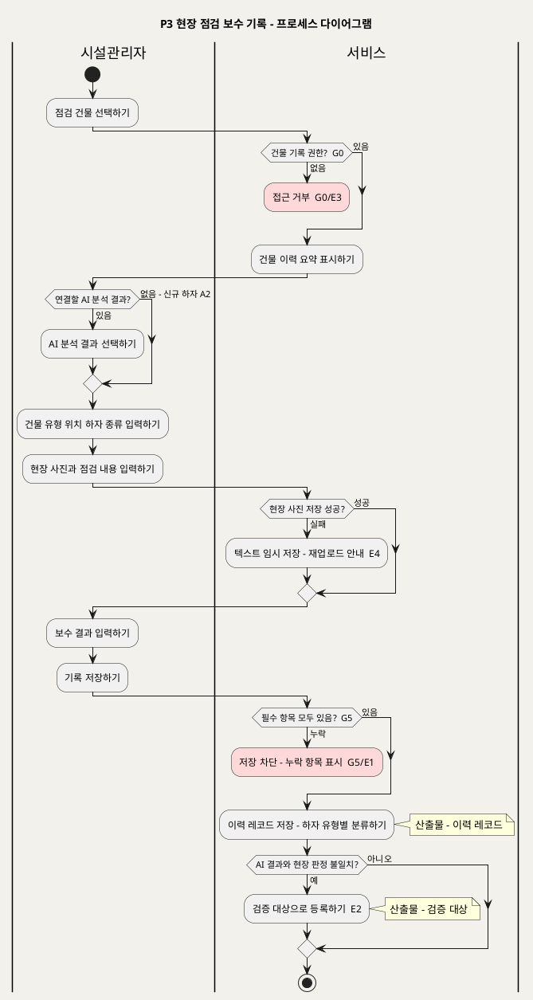

**[「P3 현장 점검 보수 기록 - 프로세스 다이어그램」 PlantUML 뷰어로 열기](https://plantuml.sumzip.com/plantuml/svg/eNp9lM9OGlEUxvfzFCfpRhfGqu1CXKit0HTXV6B1hAkIBsZ044LqpZkITTAydWpmyNigRUOTQaaICbzQ3HPfoWeGuVowdsWfOec753e-DzbKerqk7-_mlXJOK-ylS-ld-Jj-lMuUivuF7bfFfLEEL1IrqaXkm38qytn0dvGzVsjATjpfVhVd0_MqfFgBYTFsXQK6jeC2Arzvo2FBMPT4hQMLIJqMX9jIhnjcBl5ro-Pjdz-4G_JWR1EOsEbP2oFf4VddbDUOlGg3JRGrBT2fd0eAzBVHjjAtkl2jJmbze0aCB4q2A3NxUTwyGNSFaa8DvHs5D3pWLcAcnn1Fpz6vAGGltla3Vkn-JLijlp7HB5WwdDG5skbPc1o-r6iER00tI2pSC9vajpKQmzg-dwn2vInmGMSJTQCPe83ChNvhmRfcesJ0YfM98AFDRjveekF_tP6wXzwKIDFbM4Merxbx0HGx5gZ3NtBTGgeby0-2tV1hmfTC8N6SZfizyi8twFaVSKRwQrp42MVfLBoc-3no4_n1TPWsA1PN1FmJPrFe0P_zCFlri3onghTVb9Qqjocky-hosoOAWl08q1Jg-Cl9axo0HSD56gE8kpSUT--dkOmLbzeNGAdkMuxZFJOFCsL8zW-ugd90-AmdLDIozNRricMNxp3xdKYm2F6H1zrEMqmQSpOohAqLyaX_Ry3OGHcNHDejQ8jzSAcjW3mfhVkhLyVLoairUNIyWT1BXng4sMMQLMCsYARKSZucCX9U5G9Y1BvomqRK-4woMo_mWUbkHCUCrxzg9QoefUF7RE4BP-3RWSc7kFnLIdxzm0z1S3qT8ZqBVlseoKwX95QNek9_UX8BSw98hg==)** — 클릭 시 브라우저로 연결됩니다.

### 6-3 설계 주의

G5 의 필수 항목 네 개(건물 유형·위치·하자 종류·보수 결과, BR-DEF-06)는 `[핵심 데이터] 2단계` 그대로이고, P5·P6 의 반복 하자 패턴과 우선순위가 **이 네 칸으로 집계된다**. 하나라도 비어 있는 레코드가 들어가면 하류 집계에서 조용히 빠지거나 "미분류"로 뭉친다. 다만 A1(점검 먼저, 보수 결과는 나중에)이 있으므로, 보수 결과는 "미완료"라는 **명시적 값**으로 채울 수 있어야 한다 — 빈칸 허용과는 다르다. 이 구분은 SD_03 의 CHECK 제약으로 이어진다.

E4(사진 저장 실패)의 임시 저장 레코드는 이력 레코드가 아니다. 임시 상태를 그대로 인계하면 P4 전문가가 사진 없는 건을 판정하게 되고 그 건은 G6(판정 불가)에서 다시 막힌다.

---

## 7. P4 분석 결과 전문가 검증

### 7-1 단계별 IPO

| # | 단계 | Input | Process | Output | 근거 |
|:--:|---|---|---|---|---|
| 4.1 | 대기 목록 열기 | 검증 대상(P3) | 전문가 권한을 확인하고 검증 대상 목록을 보여준다 — G0 | 검증 대기 목록 | UC4 기본흐름 1 · INC3 · E3 · Sequence `alt 권한 없음 (E3)` |
| 4.2 | 검증 건 선택 | 검증 대상 1건 | 사진·설명·AI 원인·대응방안·현장 이력을 나란히 보여준다. 하자 종류로 거를 수 있다 | 검토 화면 | UC4 기본흐름 2 · A2 |
| 4.3 | 판정 | 검토 내용 | 판정할 수 있는지 확인하고 — G6 — 일치·불일치를 기록한다 | 판정 | UC4 기본흐름 3 · E1 · Sequence `alt 판정 불가 (E1)` |
| 4.4 | 의견 입력 | 판정 | 전문가 의견을 판정과 함께 저장한다. 일치 승인이면 생략할 수 있다 | 판정 + 의견 | UC4 기본흐름 4 · A1 |
| 4.5 | 판정 데이터 축적 | 판정 + 의견 | 전문가 판정 데이터로 축적하고, 불일치면 차이를 신뢰도 지표에 반영하고, 위험이 크면 관리자에 통지한다 | **전문가 판정** · 신뢰도 지표 · 위험 통지 | UC4 기본흐름 5 · E2 · E4 · Sequence `opt 불일치 (E2)` · `opt 위험 큼 (E4)` · BR-DEF-07 · BR-DEF-02 |

### 7-2 프로세스 다이어그램

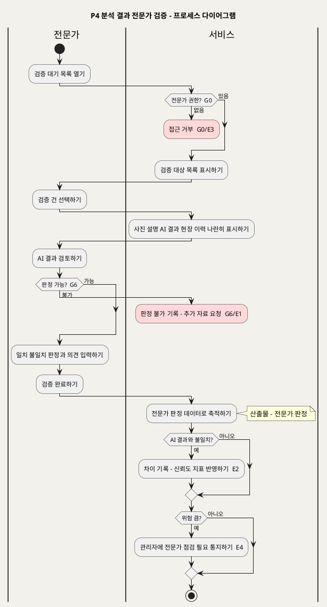

**[「P4 분석 결과 전문가 검증 - 프로세스 다이어그램」 PlantUML 뷰어로 열기](https://plantuml.sumzip.com/plantuml/svg/eNp9lM1u2lAQhfd-ipG6aRZRmiaqFFgkbQNVd30FWv4siInAUTcsDLlBKFCVSLg4lY2cFpI0opJDKSEST-Q79x06Bi6m6c_O9j0z58x3R94r6YmifnSQV0o5VTtMFBMH8DbxLpcpFo605MtCvlCER_Gt-GbsxYqilE0kC-9VLQPpRL6UUnRVz6fgzTbwMUPmgD_0_B9TQJfxwcT3DPpg4KUD6yDajF_YyCZ42gPe6KEzwk8j_27Cu9eKUl5WlJVZMCWyqORNw594wG--8QsHsDOityjpmc3vGfUqK2oaHq8YjpvCtHcBXj1ZAz2b0uiwU0OnuaYADRTf39nfiaB75t9Nwb_1-NgIpBuxrSid59R8XknRYFTUrc-KUlpSTa-mweOKTCPObGzYwrQWmcIZpN6_HQEyVxw7oSpMHsHqAK8YKXr85gSev5b8hMWw2wdixN0-8KrFu4bo1v9nGBaTtai5UhTQEc0WuiaQkJ_2AzTPJBo-rtPXAM1qrhDUonIuA2oYjL0OOG4H79ht8a9NwM9tHH4P2m7ENh9gnHtKjL8lRmeK91bQe_E0N5vtj2P5wwH1P6H55SSSKZ4zcv07z-UayOAfPIIoGOW2KbWJbkUWagU9BUU1k9UjgFUPxzYfTIPZHvSYEVzSxXMjTLy73DCrHjCMoHdNdiucGi7_4vGPdMVXBl0ecM9CaxEBIPY0KrfNZLxRR6snSc2W2maiQ1gq0z-M_JHBLwfEHzutlcTotggSCJPRnYCo_Qxspdn2P81KeuFQ2aNn-h38ApdjLmo=)** — 클릭 시 브라우저로 연결됩니다.

### 7-3 설계 주의

G6 의 "판정 불가"는 일치·불일치와 **같은 축의 세 번째 값이 아니다.** 판정 불가 건을 판정 데이터에 섞으면 신뢰도 지표의 분모가 오염된다 — AI가 맞았는지 틀렸는지 모르는 건이 "불일치"나 "일치"로 집계된다. 판정 불가는 축적에서 제외하고 추가 자료 요청 상태로 따로 둔다. 해제 주체가 전문가 본인이 아니라 자료를 가진 쪽(기록한 시설관리자 또는 분석 요청자)이므로, SD_02 에서는 "재촬영 요청 보내기" 액션이 된다.

판정 이력은 변경 추적이 필요하다(UC4 특별 요구사항 1, `[핵심 장벽] 3단계` 진단 책임). 판정을 덮어쓰는 구조로 두면 "누가 언제 무엇을 판정했는가"를 되짚을 수 없다.

---

## 8. P5 건물 이력·반복 하자 조회

### 8-1 단계별 IPO

| # | 단계 | Input | Process | Output | 근거 |
|:--:|---|---|---|---|---|
| 5.1 | 건물 목록 | 로그인 사용자 | 권한 범위 안의 건물 목록을 보여준다 | 건물 목록 | UC5 기본흐름 1 · INC3 |
| 5.2 | 건물 선택·이력 통합 | 건물 | 권한을 확인하고 — G0 — 내부 이력과 건물관리시스템 이력을 시간순으로 통합한다. 연동이 실패하면 내부 이력만 보여준다 | 통합 이력 | UC5 기본흐름 2 · E1 · E2 · Sequence `alt 권한 밖 건물 (E2)` · `alt 연동 실패 (E1)` |
| 5.3 | 필터 | 기간 · 하자 종류 | 조건에 맞는 이력만 다시 보여준다 | 필터된 이력 | UC5 기본흐름 3 |
| 5.4 | 상세 | 이력 항목 | 사진·AI 결과·전문가 판정·보수 결과를 보여준다 | 이력 상세 | UC5 기본흐름 4 |
| 5.5 | 반복 하자 | 통합 이력 | 데이터가 충분한지 확인하고 — G7 — 같은 위치·종류의 재발 패턴을 산출한다 | **반복 하자 패턴** | UC5 기본흐름 5 · E3 · Sequence `alt 데이터 부족 (E3)` · BR-DEF-12 |
| 5.6 | 후속 조치 이동 | 반복 하자 패턴 | 정기점검 계획(P7) 또는 전문가 연결(P8)로 이동한다 | 조치 진입 | UC5 A1 · A2 |

### 8-2 프로세스 다이어그램

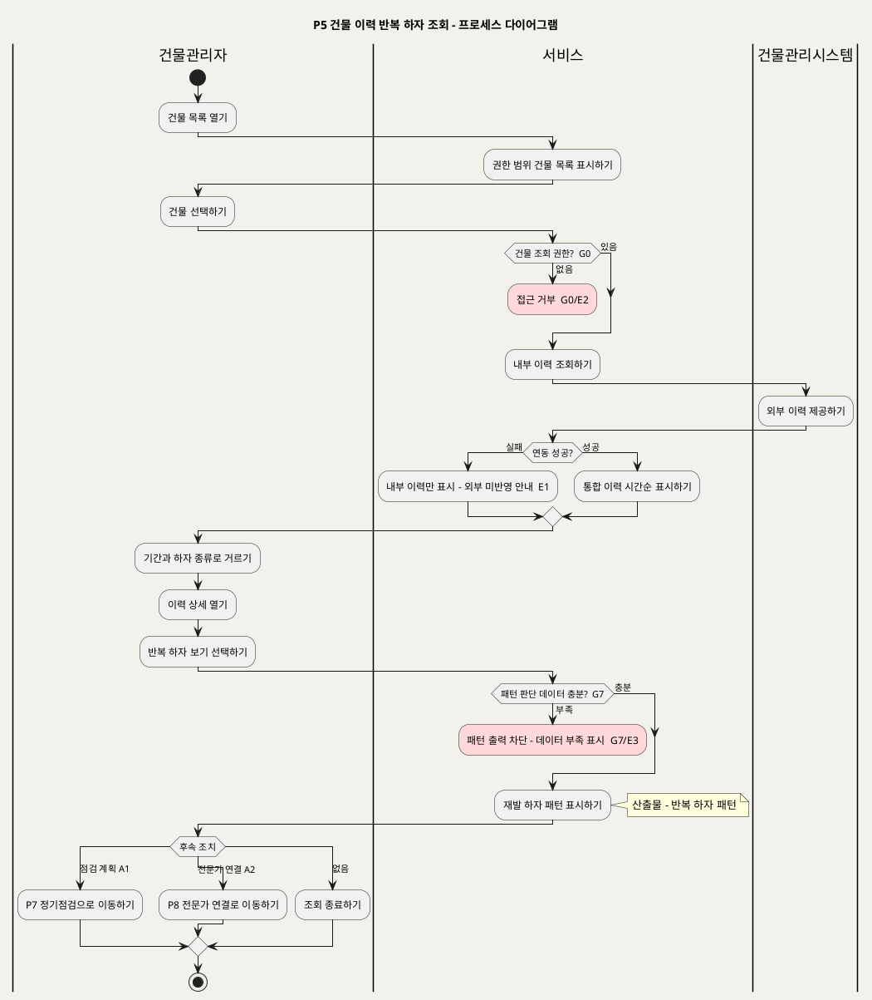

**[「P5 건물 이력 반복 하자 조회 - 프로세스 다이어그램」 PlantUML 뷰어로 열기](https://plantuml.sumzip.com/plantuml/svg/eNqFVE1P20AQvftXjNQLHBAFVFHMAWgJvfIXXEiIRUhQYsQlBz4WhBojQCJNoJsoaaENVaQuxAQj5Rd5Z_9Dx3ZsJSmoR3vnvXkz7-0uFiwjb-1sZbTCppndNvLGFnw21jY38rmd7PrHXCaXhzcrMytTiQ8DFYW0sZ7bNbMbkDIyhaRmmVYmCavvwLt3ZLsHWHNk4xakqMrOI6hyFevngE2hrm2YAHXJZJMjc_HLDcjSDVXjV8d7cmW9pWnFkMNz9uTPNuGKWiBR0_vc8vedbNYAK47ninmtiIzLZ0ZURSrp2qrMQT5cImcwDFAXHEuctISwf7pE_Mga6rAW1w3QmykYi4rCWcJ-CwCf3o6DlU5mYQwrx1izxzWgta0szy3P6di48J56pEbI7p5fOpmYnqfzTTOT0ZK0PgLVTwJQMrtupjRdHjh-aX-LYa-XhZc4KVNHnOTjlTsIanCv8_jaFFgR8uyKRr2nooVYeulG2S1f-rAC-cvub4_M67eRf1xyF6v7gOUTqgZITM1H0wS0AY86Jg13sagS9wTDEz5iRjj2S5a4ggBepxdn6PuRvK1SeoJ13oYR0CP6w30KVZwMfTh-suP__o-9NL9iDij7XJZaIE8FUStGqO6d7DLf6NloW7QFbN4PGt0HY5cHakTL55gYYAkh0S6JazIxM5qEoFGcBKy3peDRCJG6oeVlc1YS8uZG2tIBD4TfnQI6MXL5QuhLl2vXtNbSNPk3hsenftjwuTqurRmBmsa597AHXoep61NYmgo8XZ2ldJWpd3iKvOf74XtwdhWJiuBMtl1PUJAqwnsQsDQdMryH0aNXKeLrpPfvnB-BH_ZAdMIJ6JXIbWuL9E2P2V8dOKff)** — 클릭 시 브라우저로 연결됩니다.

### 8-3 설계 주의

E1(연동 실패)과 G7(데이터 부족)은 비슷해 보이지만 성격이 반대다. E1 은 **일부 데이터로 계속** 보여주고 "외부 이력 미반영"을 붙이는 분기다 — 막으면 연동 장애 하나로 건물 이력 전체가 안 보인다. G7 은 **출력 자체를 막는** 게이트다 — 이력 한두 건으로 "반복 하자"를 그리면 그것이 곧 원천이 경고한 과신(`[부정적 영향]`)의 재료가 된다. 둘을 같은 경고 배너로 처리하면 안 된다.

이 프로세스는 조회 전용이다(UC5 사후조건 3). 어떤 단계도 이력 레코드를 수정하지 않는다. 데이터 충분성의 기준(몇 건 이상, 몇 년 이상)은 원천에 없다(§15).

---

## 9. P6 유지관리 우선순위 판단

### 9-1 단계별 IPO

| # | 단계 | Input | Process | Output | 근거 |
|:--:|---|---|---|---|---|
| 6.1 | 대시보드 진입 | 로그인 사용자 | 기업·역할 권한을 확인하고 — G0 — 관리 건물 요약을 보여준다 | 관리 건물 요약 | UC8 기본흐름 1 · INC3 · 사전조건 1~2 |
| 6.2 | 범위 선택·집계 | 건물 범위 · 기간 | 권한 밖 건물을 빼고, 내부 이력과 건물관리시스템 데이터를 집계한다. 연동이 실패하면 내부 데이터만 쓴다 | 집계 데이터 | UC8 기본흐름 2 · E2 · E3 · Sequence `opt 권한 밖 건물 포함 (E3)` · `alt 연동 실패 (E2)` |
| 6.3 | 반복 하자 현황 | 집계 데이터 | 하자 발생 패턴을 분석해 반복 하자를 보여준다 | 반복 하자 현황 | UC8 기본흐름 3 · BR-DEF-12 |
| 6.4 | 우선순위 산출 | 반복 하자 현황 | 우선순위를 산출하고, 데이터가 부족하면 신뢰도 낮음을 붙이고, 참고용 표시와 진단 책임 고지를 항상 붙인다 | **우선순위 목록** | UC8 기본흐름 4 · E1 · E4 · Sequence `alt 데이터 부족 (E1)` · BR-DEF-01 · BR-DEF-11 |
| 6.5 | 조치 지정 | 상위 항목 | 정기점검(P7) 또는 전문가 연결(P8)로 넘긴다. 조치 없이 끝낼 수 있다 | 조치 지정 | UC8 기본흐름 5 · A1 |

### 9-2 프로세스 다이어그램

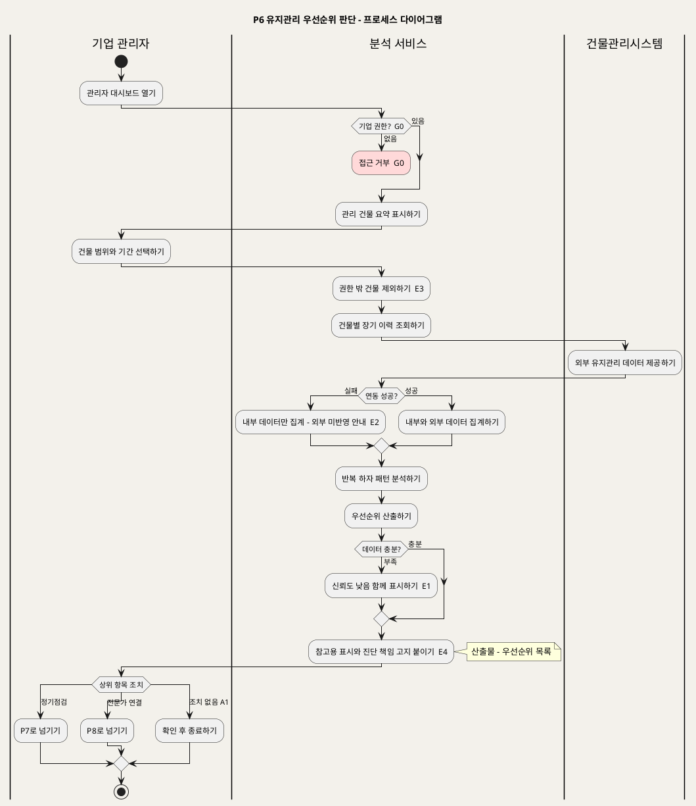

**[「P6 유지관리 우선순위 판단 - 프로세스 다이어그램」 PlantUML 뷰어로 열기](https://plantuml.sumzip.com/plantuml/svg/eNp9VM1OGmEU3c9T3KQbXZjU2rQVFtpW7dZXoIoyEcHAGDcsUD8aU6appiBgBzJYLdjYdpARx9S-0Nw779D7zTAjRNMlH-ece879mfm8lshp25tpJb-hZrYSucQmvE-sbKznstuZ1bfZdDYHT5ZmlqYX34wg8qnEanZHzazDWiKdTyqaqqWTsPwCyDCpU3TtIn6_BDqxSJh0YJAhwNMPsdyFKfAqAtsGCYc-ngGWz6hp07Ht3jjY6ipKwXUsqpUgkKDWYUHxHSqx6AVQL1LZwL6NXwygms2UuFLAgSDRBBIG3grWLijqGkyEcgPdqxpzAO-eToKWSmZggmofqKlPKsD5lhZmF2ZjZB65N3fg9iwcFCU0zn9uqOm0kuSQzGgd-IxkZlVdCw0x3MbLOw5boepf8I4M9uZV64Gph2liQzxeVbgt1CgCY1xLsHHT229GzIdxYkEIQOs4Kmoa1HACDsDiTDyUxz4Lts7lM_cXzXOgtuWd6PfGfNjQV9ngAl7J4BosJ8OPzRE_WSziCUvWc_vX__EoW041Cz83-LXH2Lmo3eUzT-_Kdsdwz5Y1Ilns6ECdI5c9T8HQAP520KpTfReoesAETvcsHs7BVx6Rkl0MefdefcXQ63BmrIn9a-BXuUhsyBM2BDFCZGxsbWnPokE0TxlvpMLggqlRQmmk3fNtUdnEU-6CANz7xTvDBbvun_rYdnCi6SiRrxRtFlmO2zfp5GJI8PN1hLwf6pWoJUD-3eG0gwZ7CcSex5VMVktCTl1PabGhcbkkU-OHiD8usN189NB2VG0lxW72d_2Lrf5krFwcuq1PKisJ36lZlUTz0L0q-lGXX_I1AwoZye9RiBN46bgWG69Z7pUVYF89jvUrQHCQ8Hrax3qNKjUd8L7yDE5L-E0fmWRglD8M2S1lnn_z5-sfA1CmbA==)** — 클릭 시 브라우저로 연결됩니다.

### 9-3 설계 주의

P6 에는 G0 외에 게이트가 없다. UC8 의 데이터 부족(E1)은 P5 의 G7 과 달리 **출력을 막지 않고** 신뢰도 낮음을 붙여 보여준다(UC8 Sequence `alt 데이터 부족 (E1)` → "우선순위 + 신뢰도 낮음 표시"). 같은 "데이터 부족"이 P5 에서는 차단, P6 에서는 표시인 것은 UC 문서가 그렇게 정의했기 때문이다. 이 비대칭이 의도인지는 §15 에서 확인이 필요하다.

권한 밖 건물(E3)은 접근 거부가 아니라 **조용히 제외**한다. 그러므로 집계 결과에는 "몇 개 건물이 제외되었는지"가 남아야 한다. 그렇지 않으면 기업 관리자는 일부 건물만으로 산출된 우선순위를 전체의 결과로 읽는다. 기업 라이선스 유효성(UC8 사전조건 2)은 UC에 `alt` 가 없어 게이트로 승격하지 않았다(§15).

---

## 10. P7 정기점검 계획·추적

### 10-1 단계별 IPO

| # | 단계 | Input | Process | Output | 근거 |
|:--:|---|---|---|---|---|
| 7.1 | 화면 진입 | 건물 | 관리 권한을 확인하고 — G0 — 현재 점검 일정과 상태를 보여준다 | 일정·상태 | UC6 기본흐름 1 · INC3 · E2 · Sequence `alt 권한 없음 (E2)` |
| 7.2 | 주기·항목 설정 | 점검 주기 · 점검 항목 | 일정을 만든다. 기존 일정은 수정·취소한다. 반복 하자를 근거로 항목을 더할 수 있다 | 점검 일정 | UC6 기본흐름 2 · A1 · A2 |
| 7.3 | 담당 배정 | 시설관리자 | 담당자를 배정하고 통지한다 | **점검 일정**(배정 포함) · 배정 통지 | UC6 기본흐름 3 · Sequence "SVC -> FM : 배정 통지" |
| 7.4 | 완료 처리 | 이력 레코드(P3) | 기록된 결과를 일정에 연결하고 완료로 처리한다 | 완료 일정 | UC6 기본흐름 5 · Sequence "UC3 이력과 연결·완료 처리" |
| 7.5 | 위험 권고 | 점검 결과 | 위험 가능성이 있으면 전문가 연결을 권고한다 | 전문가 연결 권고 | UC6 E3 · Sequence `opt 위험 가능성 (E3)` · BR-DEF-02 |

UC6 기본흐름 4(도래 확인)와 E1(지연)은 P0 이 수행한다(§1-3 분리한 근거).

### 10-2 프로세스 다이어그램

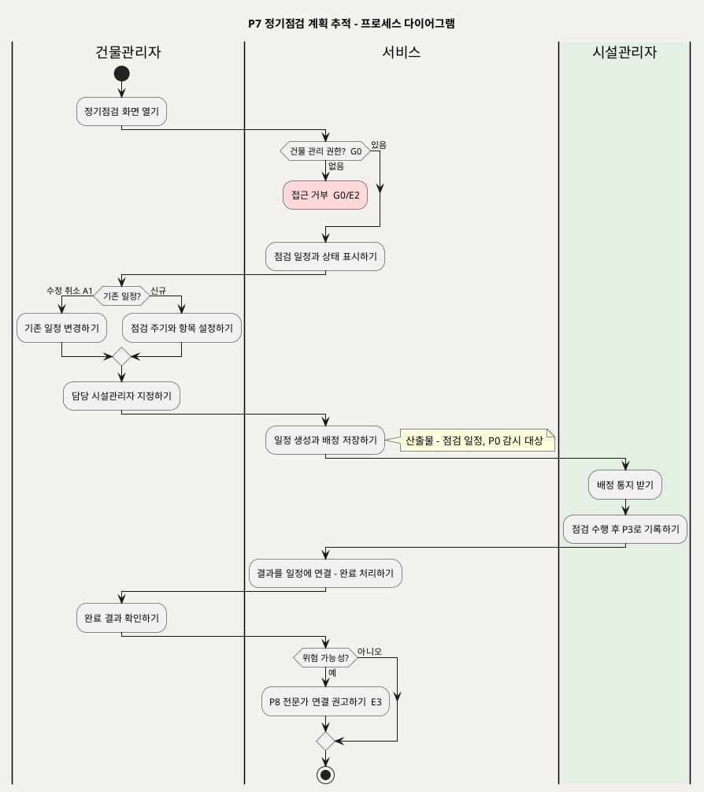

**[「P7 정기점검 계획 추적 - 프로세스 다이어그램」 PlantUML 뷰어로 열기](https://plantuml.sumzip.com/plantuml/svg/eNp1k81u2lAQhfd-ipGySaRGJWXRhiyStoFueQVaDFg4EIGjbrxwioVooBKRQjCJjYwCbVJRyYALRKIvdO_4HTo2P4U23eF755z5zszlqKgkCsrZiSwUs1LuNFFInMD7xIdsupA_yyXf5uV8AbZi4dhe9M1aRTGTSOY_Srk0pBJyURQUSZFFiL8EtBts6qBdZ0MN2Ej3br4Ajq_QPodd8K503jFRn-JFF3i1i5aL1y6bTHn7XhBUNnB5f8ZcjX_tY7uuCgGaENnw9FpX_MEFbLp0diCoqJv8USdDVZBSsD33gLkJsHHNa5iHAO9CO6BkxBxsY7OMVm1HAEoVO94_3if7SzYhycDhY80vfR59cUD3WUmWBZHSkahdCURiLimlfKAABa2ZjzaaAZbOvZIJ3qWJVdNrGHO0f_IEgJSk4y60hyuqikGfgJN7LNfg9Z7PF9koBT7S2PDX0nzBVbXZxAyKl0x3M1_WokE1fvDvD4B6l9Qr2TwAr7q8-ggES9crQMBv2lrt-mgjCwgsWagP_MjccYIDW8N2bynJ5RURClI6o0QAPzk4Nv1l7MLGwJ5BPATMqVN34DWNZieoW9FwLBQNq38RUeNFH6_8k-io623QaBW3YnjXn8G71SEeprcFdMs71pMR2NAhcN6bLTiwSYmbDh37hC2d39UAhwZ1_v8GI4u6uRc9xgZa06e6-atGU_eaBkXV-EWPxvZn20Yl2Fn8FU1G5_0plSxR6MmykT23BIiGV6tu6LxaQaO7fIVFJX8qHNFv-u_-BhZEEWI=)** — 클릭 시 브라우저로 연결됩니다.

### 10-3 설계 주의

P7 은 **일정만 만들고 현장 기록은 만들지 않는다.** 시설관리자의 점검 결과는 P3 이 만든 이력 레코드이며, P7 은 그것을 일정에 연결할 뿐이다(UC6 개요: "실제 현장 기록은 UC3 에서 이루어지며 이 UC는 그 기록을 일정에 연결해 완료를 관리한다"). P7 화면에 별도의 점검 결과 입력란을 만들면 같은 사실이 두 곳에 쌓이고 P5·P6 집계가 중복된다.

일정 취소(A1)는 P0 감시 목록에서 즉시 빠져야 한다. 그렇지 않으면 취소된 일정에 지연 알림이 나간다. 점검 주기·항목 기준·알림 수단은 원천에 없다(§15).

---

## 11. P8 전문가 점검 연결

### 11-1 단계별 IPO

| # | 단계 | Input | Process | Output | 근거 |
|:--:|---|---|---|---|---|
| 8.1 | 요청 진입 | 하자 건(분석 결과 또는 이력 항목) | 권한을 확인하고 — G0 — 사진·AI 결과·이력 요약을 보여준다 | 하자 건 요약 | UC7 기본흐름 1 · INC3 · E4 · A1 · Sequence `alt 권한 없음 (E4)` |
| 8.2 | 조건 입력 | 전문 분야 · 희망 일정 | 조건에 맞는 전문가 후보를 찾는다 — G8 | 후보 목록 | UC7 기본흐름 2 · E1 · Sequence `alt 후보 없음 (E1)` |
| 8.3 | 선택·고지 | 선택한 전문가 | 연결 수수료와 공유될 자료 범위를 고지한다 | 고지 내용 | UC7 기본흐름 3 · E3 · BR-DEF-09 · BR-DEF-11 |
| 8.4 | 요청 확정·전달 | 공유 동의 | 동의를 확인하고 — G9 — 요청과 하자 자료를 전문가에게 전달한다 | 연결 요청 | UC7 기본흐름 4 · E3 · Sequence "4. 요청 확정 (공유 동의)" |
| 8.5 | 수락·확정 | 전문가 응답 | 수락을 확인하고 — G10 — 연결을 확정해 수수료와 연결 이력을 기록한다 | **전문가 연결** | UC7 기본흐름 5 · E2 · Sequence `alt 거절·무응답 (E2)` · BR-DEF-09 |

### 11-2 프로세스 다이어그램

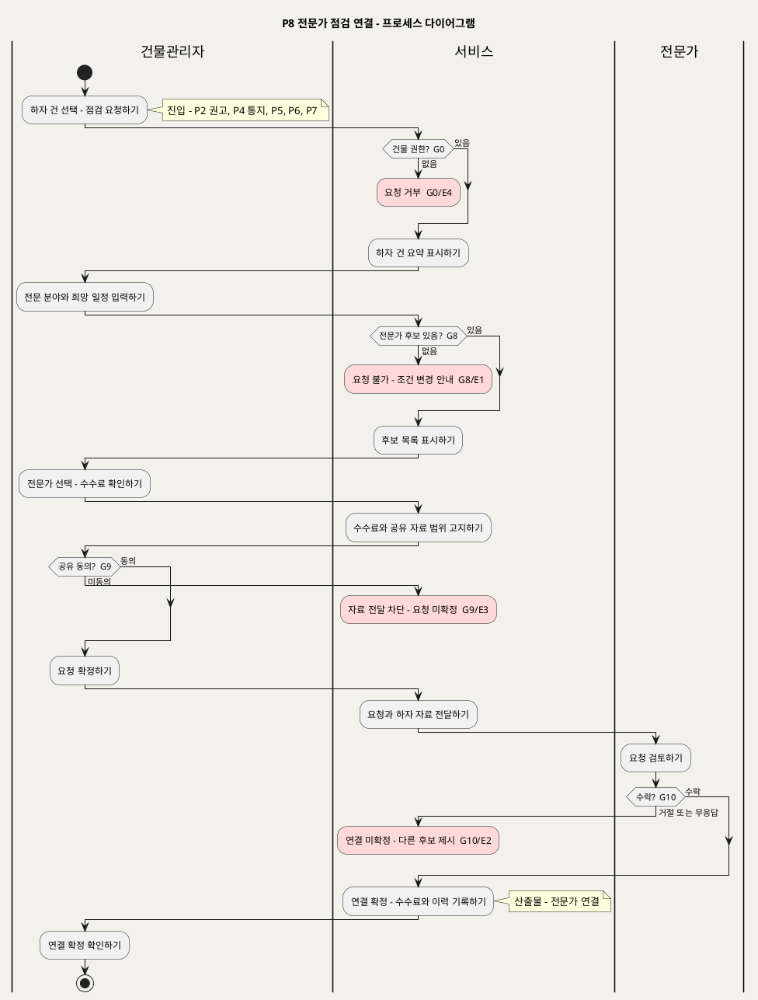

**[「P8 전문가 점검 연결 - 프로세스 다이어그램」 PlantUML 뷰어로 열기](https://plantuml.sumzip.com/plantuml/svg/eNqNVFtvEmEQfd9fMYkvbWKDvaiFPthoqa_9Cyi3TSk0sI0vPJC6ElKaSBPWgu6SbWwFDaYrUFwT-od2Zv-D8-2W5SJaEzbsZebMOWdmvu2CEssrRwcZqbAvZw9j-dgBvIq93k_lc0fZ-ItcJpeHB7vru6vR51MRhXQsnnsjZ1OQjGUKCUmRlUwC9jaBTBW7tmOV-K7m9Pjv3HJ6FqyAW1fxQifVppNLwOolGQP6MHB-2tjqSFLR-THA7sgZlPBLl1q1ouTxkiKu1uBH4M9Aqum-NRhqDP2xTr3vHODY1paUzSkJyMuptBIBaqvUeseRe2vgDE-dvvkQ9jbALd9Qu8S3j_l6wtdTqUiqjr9U5lSU5CQs-TREkqvpzwBePloGJZ3IwhKdl8k4XZaA7djdCe-EI359pmbhsCRCQ9GNLf6-L2cyUoJt4aRWxUtKZONyclYMJ2u34J7pVNXHGv50IeIbCjhUSRtRswSu0cW2AWSMyNSAZaJ5FeTPqZl0w_2kYp-renyErs17deGwIjLZ7gtLMMZ-yendAmkVPB4IhFB09R65flH89hUvjP-V6s1O0OlKg3_4-RTcpkaGvUhoJAgS9jj9G9JNFloTWdirk67yS5Mb__fSXuf9RHzfJKMhHAqPHcJr238rTJquPGWZX04oqHaBrA5WO4L-nZPXtqDP7WLUUHR9zrUxuO_aImN8GB9jsQVehNMfwd2IzRCapIwdnoDyIrllcxzhDQ17adwKB1aD4ecZJ7MC2KjhSR2wOyDjDKs3_zDEX_uJ8hWx83hlB5NoimnwioSia_Nz5FEIHJlR6gMHqDPN5zOFtwFYCg_cwoPh2KKhLjZ8Zfqo8jAXOj9TbXYGC0ruUNpminx4_gbIldI1)** — 클릭 시 브라우저로 연결됩니다.

### 11-3 설계 주의

G9(공유 동의)는 **자료 전달보다 앞에** 있어야 한다. 하자 자료에는 사진·위치·건물정보가 들어가고(`[핵심 장벽] 3단계` 개인정보·건물정보 보안), 한 번 전문가에게 넘어간 자료는 회수할 수 없다. 동의를 사후 확인으로 두면 G9 는 게이트가 아니라 기록이 된다.

수수료(BR-DEF-09)는 **연결 확정(G10 통과) 시점에만** 발생한다. 요청 확정(8.4) 시점에 수수료를 기록하면 거절·무응답 건에도 수수료가 남는다. 전문가 무응답의 판정 시한, 수수료 요율·정산, 일반 사용자의 연결 허용 여부(UC7 A2)는 원천에 없다(§15).

---

## 12. 프로세스 간 인계 계약

| 인계물 | 생산 → 소비 | 필수 포함 항목 | 만료·무효 조건 | 근거 |
|---|---|---|---|---|
| 분석 이용권 | P1 → P2 | 사용자 ID · 요금제 종류(건별·월 구독) · 잔여 건수 또는 유효 기간 · 결제 승인 참조 | 건별 이용권은 분석 1회 완료 시 소진. 월 구독은 기간 만료 시 무효(UC2 E2). 결제 승인 없이는 생성되지 않는다(G1) | UC2 사후조건 2 · E2 · BR-DEF-05 |
| 분석 결과 | P2 → P3 · P4 · P8 | 하자 사진 · 사용자 설명 · 원인 · 대응방안 · 1차 참고용 고지 · 진단 책임 고지 · 위험 권고 여부 | G3·G4 미통과 시 생성되지 않는다. 고지 없는 결과는 무효(BR-DEF-01). 보존 기간은 자료 없음 | UC1 사후조건 1~4 · INC2 · EXT1 |
| 이력 레코드 | P3 → P4 · P5 · P6 · P7 | 건물 · 건물 유형 · 위치 · 하자 종류 · 보수 결과(미완료 포함) · 현장 사진 · 점검 내용 · 연결 분석 결과(선택) · AI 일치 여부 · 하자 유형 분류 | 필수 항목 누락 시 저장 불가(G5). 사진 저장 실패의 임시 저장 상태는 인계 불가(E4) | UC3 사후조건 1~3 · BR-DEF-06 |
| 검증 대상 | P3 → P4 | 이력 레코드 참조 · 분석 결과 참조 · 불일치 내용 | 전문가 판정 완료 시 대기 목록에서 닫힌다. 판정 불가(G6)면 추가 자료 요청 상태로 남는다 | UC3 E2 · UC4 사전조건 2 · BR-DEF-07 |
| 전문가 판정 | P4 → P5 · P6 | 검증 대상 참조 · 판정(일치·불일치) · 전문가 의견 · AI와의 차이 내용 · 판정자 · 판정 시각 | 판정 불가는 판정 데이터로 축적하지 않는다. 덮어쓰지 않고 변경 이력을 남긴다 | UC4 사후조건 1~3 · 특별 요구사항 1 |
| 위험 통지 | P2 · P4 · P7 → P8 | 하자 건 참조 · 권고 출처(분석 권고 · 전문가 위험 판정 · 점검 결과) | 연결 확정 또는 건물관리자가 닫을 때까지 유효. 만료 기준은 자료 없음 | UC1 EXT1 · UC4 E4 · UC6 E3 · UC7 A1 |
| 반복 하자 패턴 | P5 → P7 · P8 | 건물 · 위치 · 하자 종류 · 재발 횟수 · 근거 이력 참조 · 외부 이력 반영 여부 | 데이터 부족이면 생성되지 않는다(G7). 이력이 추가되면 다시 산출한다 | UC5 사후조건 2 · E1 · E3 · BR-DEF-12 |
| 우선순위 목록 | P6 → P7 · P8 | 대상 건물 범위 · 기간 · 순위 항목 · 신뢰도 표시 · 참고용 고지 · 진단 책임 고지 · 제외 건물 수 · 외부 데이터 반영 여부 | 고지 없는 목록은 무효(BR-DEF-01). 집계 주기는 자료 없음 | UC8 사후조건 1~3 · E1~E4 |
| 점검 일정 | P7 → P0 · P3 | 건물 · 점검 주기 · 점검 항목 · 담당 시설관리자 · 기한 · 상태(예정·도래·지연·완료·취소) | 취소(A1) 시 감시 대상에서 즉시 제외. 완료는 이력 레코드 연결로만 판정 | UC6 사후조건 1~3 · A1 · E1 |
| 전문가 연결 | P8 → P5 | 하자 건 참조 · 전문가 · 전문 분야 · 희망 일정 · 공유 동의 기록 · 공유 자료 범위 · 연결 수수료 · 확정 시각 | 거절·무응답 시 확정되지 않는다(G10). 수수료는 확정 건에만 기록 | UC7 사후조건 1~4 · BR-DEF-09 |

### 12-1 인계물 참조 사슬

이 사슬은 SD_03 의 주요 엔티티와 외래키 방향이 된다. 화살표는 "뒤가 앞을 참조한다"는 뜻이다. 점검 일정 → 이력 레코드, 전문가 연결 → 반복 하자 패턴처럼 거꾸로 도는 화살표는 3단계 순환(조치 결과가 다시 이력이 됨)을 나타낸다.

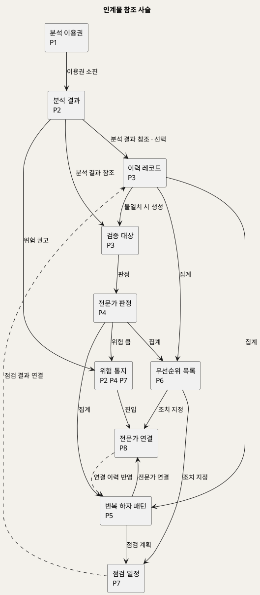

**[「인계물 참조 사슬」 PlantUML 뷰어로 열기](https://plantuml.sumzip.com/plantuml/svg/eNp1k81u01AQhff3KUZlnUr94UcsUCFKlWwiy62yYmOaNERNHWS7YusQU0UQpFRQ1YriylmAKcrCNG0VpPBC9vgdmOubS-1StjPfzJxzrr1lWpphHR22mXnQ0t9ohnYIr7S9g6bROdLrxU67Y8CD7Y3ttdKLDGG-1uqdty29Cfta22wwq2W1G4DePJo58XQBGM5xEgK-m-KHKWNGY8_S9CYhK_GNg45H6BWOLqKbwUtdWVsBzYRSdfceLroMo9mCoPUUeq5mGVoS-18h9vv4-0v8eUzYRoqVc1h0aeM3D-KBjb3uX6ZWya3ySfc8Cm1IBkP0TwnbFLJqOWzsJGcuJMfXGNhcFSiboDxOSbWa0x-68ewaklMXz4e09HviXNHAwxRVclZxFKLjY39M2yH-cRFPPCIfCTJv2B-SGQpvISSKw5Wd-53gWUjxEfYkxYpVxihkKBSeUY7w9PYNAI8HGDiMqrxZ5s1c_vI9C0BCk54nyVrlPyQr54A-V_zLBfw4Bux56Pxk1OFAqUaAiFwuVatcmwiaxEUznxF1t5N0F_KIssvLwQl9e5LMliSl_ktlSooIprLDSyJmKiejT7JTTI_fCZcpamZsEqYmA5u7WXbEWK5DNm47gYPn7xnNr64uk5fXl3mKOwRzQPhKSyC__tBFt8u2Gnqd_uI_UWOu-w==)** — 클릭 시 브라우저로 연결됩니다.

---

## 13. 게이트 맵

| 게이트 | 위치 | 조건 | 미통과 시 결과 | 해제 주체 | 근거 UC·BR |
|:--:|---|---|---|---|---|
| G0 | P1 1.1 · P3 3.1 · P4 4.1 · P5 5.2 · P6 6.1 · P7 7.1 · P8 8.1 | 로그인되어 있고 대상(건물·검증 대상·기업)에 대한 권한이 있다 | 처리 중단 — 미로그인은 로그인 화면으로, 권한 없음은 접근 거부 | 미로그인: 본인(로그인). 권한 없음: 권한 부여자 — `[추론]` 해당 건물·기업의 관리 권한자, 자료 없음 — 확인 필요 | INC3 · UC2 E3 · UC3 E3 · UC4 E3 · UC5 E2 · UC6 E2 · UC7 E4 · UC8 사전조건 1 · BR-DEF-08 |
| G1 | P1 1.4 | 결제 수단이 결제를 승인했다 | 이용권 미부여, 실패 사유와 재시도 안내 | 일반 사용자(결제 정보 변경 후 재시도) | UC2 E1 |
| G2 | P2 2.1 | 무료 체험 잔여 또는 유효한 건별·구독 이용권이 있다 | 분석 중단, P1 이용권 구매로 안내 | 일반 사용자(P1 결제) | UC1 E4 · UC2 E2 · BR-DEF-05 |
| G3 | P2 2.3 | 사진 품질이 분석에 적합하다 | AI 호출 전 분석 중단, 재촬영·재업로드 안내 | 일반 사용자(재촬영·재업로드) | UC1 E1 · BR-DEF-04 |
| G4 | P2 2.4 | Gemini Vision 이 정상 응답했다 | 분석 실패, 재시도 안내 — 결과 미생성 | 일반 사용자(재시도). 장애 지속 시 서비스 운영자 — 자료 없음 — 확인 필요 | UC1 E2 |
| G5 | P3 3.6 | 건물 유형·위치·하자 종류·보수 결과가 모두 있다 | 저장 차단, 누락 항목 표시 | 시설관리자(누락 항목 입력) | UC3 E1 · BR-DEF-06 |
| G6 | P4 4.3 | 사진·자료가 판정에 충분하다 | 판정 불가 기록, 판정 데이터 축적 차단, 추가 자료 요청 | 자료 보유자 — 기록한 시설관리자 또는 분석 요청자(재촬영·추가 자료 제공). 요청 수신자는 `[추론]`, 확인 필요 | UC4 E1 |
| G7 | P5 5.5 | 반복 하자 패턴을 판단할 만큼 이력이 있다 | 패턴 출력 차단, 데이터 부족 표시 | 시설관리자·전문가(P3·P4 로 이력 축적). 충분성 기준은 자료 없음 | UC5 E3 · BR-DEF-12 |
| G8 | P8 8.2 | 조건(분야·일정)에 맞는 전문가 후보가 있다 | 요청 불가, 조건 변경 안내 | 건물관리자(조건 변경) | UC7 E1 |
| G9 | P8 8.4 | 건물관리자가 공유 범위 고지에 동의했다 | 자료 전달 차단, 요청 미확정 | 건물관리자(동의) | UC7 E3 · BR-DEF-11 |
| G10 | P8 8.5 | 전문가가 요청을 수락했다 | 연결 미확정·수수료 미발생, 다른 후보 제시 | 전문가(수락) 또는 건물관리자(다른 후보 선택) | UC7 E2 · BR-DEF-09 |

### 13-1 게이트 성격 분류

| 성격 | 게이트 | 무엇을 지키는가 | 하류 귀결(예상) |
|---|---|---|---|
| 접근 통제 | G0 | 개인정보·건물정보 보안(`[핵심 장벽] 3단계`) | SD_02 진입 차단 화면 · SD_04 인가 미들웨어 · API 401·403 |
| 자격·과금 | G1 · G2 | 무료 체험 후 유료화(`[수익] 1단계`), AI API 비용(`[비용] 1단계`) | SD_02 분석 버튼 비활성 · SD_03 이용권 잔여 CHECK · API 402·409 |
| 입력 품질 | G3 · G5 | 사진 품질·기록 표준화(`[핵심 장벽] 1단계` · `[혜택] 2단계`) | SD_02 저장·요청 버튼 비활성 · SD_03 NOT NULL·CHECK · API 422 |
| 외부 의존 | G4 · G10 | 외부 AI·전문가 응답이 있어야 결과·연결이 생긴다 | SD_02 재시도·다른 후보 액션 · API 502·409 |
| 판단 충분성 | G6 · G7 | AI 과신 방지 — 근거가 부족하면 판단을 내지 않는다(`[부정적 영향]` · `[핵심 장벽] 2단계`) | SD_02 «요청 보내기» 액션 · SD_03 판정 불가 상태 분리 |
| 동의 | G9 | 정보 공유 범위 고지(`[핵심 장벽] 3단계` 고지) | SD_02 동의 전 확정 버튼 비활성 · SD_03 동의 기록 필수 |
| 공급 | G8 | 전문가 네트워크 규모(`[비용] 3단계`) | SD_02 조건 변경 액션 |

**게이트로 승격하지 않은 분기** — UC1 E3(신뢰도 낮음 → 권고 추가) · UC3 E2(불일치 → 검증 대상 등록) · UC3 E4(사진 저장 실패 → 임시 저장) · UC4 E2(불일치 기록) · UC4 E4(위험 통지) · UC5 E1(연동 실패 → 내부만 표시) · UC6 E1(지연 표시) · UC6 E3(전문가 연결 권고) · UC8 E1(신뢰도 낮음 표시) · UC8 E2(연동 실패 → 내부만 집계) · UC8 E3(권한 밖 제외) · UC8 E4(고지 상시 부착). 모두 처리를 계속하거나 다른 프로세스로 넘기는 분기다.

---

## 14. 원천 추적성

### 14-1 UC 커버리지

| UC | 명칭 | 프로세스 | IPO 단계 | 미사상 단계 |
|:--:|---|:--:|---|:--:|
| UC1 | 하자사진분석요청 | P2 | 2.1~2.6 (기본흐름 1~6 전부) | 없음 |
| UC2 | 유료분석구독 | P1 | 1.1~1.6 (기본흐름 1~6 전부). E2 는 P2 G2 | 없음 |
| UC3 | 점검보수이력기록 | P3 | 3.1~3.6 (기본흐름 1~6 전부) | 없음 |
| UC4 | 분석결과전문가검증 | P4 | 4.1~4.5 (기본흐름 1~5 전부) | 없음 |
| UC5 | 건물별유지관리이력조회 | P5 | 5.1~5.6 (기본흐름 1~5 + A1·A2) | A3 보고서 출력 — 형식 자료 없음 |
| UC6 | 정기점검관리 | P7 · P0 | P7 7.1~7.5 (기본흐름 1~3·5) · P0 0.1~0.3 (기본흐름 4·E1) | 없음 |
| UC7 | 전문가점검연결요청 | P8 | 8.1~8.5 (기본흐름 1~5 전부) | A2 일반 사용자 허용 — 자료 없음 |
| UC8 | 유지관리우선순위조회 | P6 | 6.1~6.5 (기본흐름 1~5 전부) | A2 예측 서비스 — 범위 자료 없음 |
| INC1 | AI 이미지 분석 | P2 | 2.4 | 없음 |
| INC2 | 1차 참고용 고지 | P2 | 2.5 | 없음 |
| INC3 | 로그인·권한 확인 | P1 · P3~P8 | G0 | 없음 |
| EXT1 | 전문가 점검 권고 | P2 | 2.6 | 없음 |

**미사상 UC 0건.** 미사상 대체흐름 3건(UC5 A3 · UC7 A2 · UC8 A2)은 원천 자료가 없어 단계로 만들지 않았다.

### 14-2 BR 부착 단계

| BR | 규칙 | 부착 단계 · 게이트 |
|---|---|---|
| BR-DEF-01 | 결과·우선순위는 1차 참고용 표시 | P2 2.5 · P6 6.4 |
| BR-DEF-02 | 위험 시 전문가 점검 권고 | P2 2.6 · P4 4.5 · P7 7.5 → P8 |
| BR-DEF-03 | 분석 입력은 사진 + 설명 | P2 2.2 |
| BR-DEF-04 | 부적합 사진은 분석 전 재업로드 | P2 2.3 · G3 |
| BR-DEF-05 | 무료 체험 후 유료·구독 | P1 1.2 · P2 2.1 · G2 |
| BR-DEF-06 | 이력 필수 4항목 | P3 3.6 · G5 · P5 5.2 |
| BR-DEF-07 | 불일치는 검증 대상·신뢰도 데이터 | P3 3.6 · P4 4.5 |
| BR-DEF-08 | 권한관리로 접근 제한 | G0 (P1 · P3~P8) · P6 6.2 |
| BR-DEF-09 | 연결 확정 시 수수료 | P8 8.3 · 8.5 · G10 |
| BR-DEF-10 | 기업 요금은 건물 수·사용자 수 기준 | 부착 단계 없음 — UC8 에 과금 단계가 없다(§15) |
| BR-DEF-11 | 진단 책임·공유 범위 고지 | P2 2.5 · P6 6.4 · P8 8.3 · G9 |
| BR-DEF-12 | 반복 하자·우선순위는 장기 이력·패턴 근거 | P5 5.5 · G7 · P6 6.3 |

---

## 15. 미해결·확인 필요

원천과 UC 문서에 없어 지어내지 않은 항목이다. 하류 문서(SD_02~SD_04) 착수 전에 확정해야 한다.

| # | 항목 | 영향 | 관련 |
|:--:|---|---|---|
| 1 | 응답시간 목표("즉시 확인"의 수치) | P2 2.4 타임아웃·G4 판정 기준 | UC1 특별 요구사항 1 |
| 2 | 1단계 로그인 필요 여부 | P2 에 G0 를 둘지 여부 — 현재는 두지 않음 | UC1 사전조건 4 |
| 3 | 권한 부여 주체와 절차 | G0 "권한 없음"의 해제 주체 — 현재 `[추론]` | INC3 · BR-DEF-08 |
| 4 | 사진 품질 판정 기준 | G3 판정 로직 | BR-DEF-04 |
| 5 | AI 장애 재시도 한도·운영자 개입 기준 | G4 해제 주체 | UC1 E2 |
| 6 | 요금·무료 체험 횟수·결제 수단(PG)·해지·환불 | P1 · G1 · G2 · 이용권 인계 계약 | UC2 A2 · BR-DEF-05 |
| 7 | 판정 불가 시 추가 자료 요청의 수신자 | G6 해제 주체 — 현재 `[추론]` | UC4 E1 |
| 8 | 반복 하자 데이터 충분성 기준 | G7 판정 로직 | UC5 E3 |
| 9 | P5(차단)·P6(표시)의 데이터 부족 처리 비대칭이 의도인지 | G7 범위 | UC5 E3 · UC8 E1 |
| 10 | 기업 라이선스 유효성 검증 방식 — 게이트로 둘지 | P6 진입 | UC8 사전조건 2 · BR-DEF-10 |
| 11 | 기업 요금(건물 수·사용자 수) 산정·과금 단계 | BR-DEF-10 부착 단계 없음 | UC8 |
| 12 | 점검 주기·항목 기준·도래 판정 기준일·알림 수단·감시 주기 | P0 · P7 | UC6 특별 요구사항 |
| 13 | 전문가 무응답 판정 시한 | G10 판정 시점 | UC7 E2 |
| 14 | 수수료 요율·정산 | P8 8.5 | BR-DEF-09 |
| 15 | 일반 사용자의 전문가 연결 허용 여부 | P8 진입 액터 | UC7 A2 |
| 16 | 분석 결과·이력·판정 데이터 보존 기간 | 인계 계약 만료 조건 | `[핵심 장벽] 3단계` |
| 17 | 동시성·처리량 등 비기능 요구 | 전 프로세스 | 원천에 없음 |
| 18 | 이력 보고서 출력 형식 · 예측 서비스 범위 | UC5 A3 · UC8 A2 미사상 | UC5 · UC8 |

---

*Buildcare AI · SD_01 프로세스 설계서 · 원천 `Intent-Specify.md` · 입력 `Design/usecases/UC_*.md`*
