# SD_02 UI/UX 설계서 — Buildcare AI
**Buildcare AI · SD_02 · 프로세스-화면 사상 · 게이트의 화면 표현 · PlantUML salt 와이어프레임**

---

> **문서 식별**: `Design/SD_02_UIUX설계서_Buildcare AI.md`
> **작성일**: 2026-10-02
> **입력**: `Design/SD_01_프로세스설계서_Buildcare AI.md` (IPO · 게이트 맵 G0~G10 · 인계 계약) + `Design/usecases/UC_00_개요_Buildcare AI.md` · `UC_01`~`UC_08` 전건
> **원천(SoT)**: `Intent-Specify.md` — 성공기준(`[가치제안]` · `[혜택]`)·실패모드(`[부정적 영향]` · `[핵심 장벽]`) 블록
> **시각 규약**: `Design/스타일가이드.html` — 0px 직각 · Primary 블루 단일 액션색 · 700/300 대비 · 그림자 없음 · 터치 타깃 48px · Semantic(Success·Warning·Error)은 하자 위험도 상태 전용
> **작성 프롬프트**: `Design/분석설계 프롬프트 - UI_UX.md`
> **다이어그램**: 모든 PlantUML 소스는 사내 Kroki `plantuml.sumzip.com` 에서 렌더 검증했다(HTTP 200 · image/svg+xml · Syntax Error 없음 · 링크 복호 소스 = 코드블록).

---

## 목차

1. 설계 원칙
2. 화면 지도와 내비게이션
3. 공통 컴포넌트
4. S1 분석 이용권 구매
5. S2 하자 사진 AI 분석
6. S3 현장 점검·보수 기록
7. S4 전문가 검증
8. S5 건물 이력
9. S6 유지관리 우선순위
10. S7 정기점검 (역할별 뷰 S7A · S7B)
11. S8 전문가 점검 연결 (역할별 뷰 S8A · S8B)
12. 게이트 맵 → 화면 표현 사상
13. 상태 표현·접근성·오류 규약
14. 미해결·확인 필요

---

## 1. 설계 원칙

원칙은 SD_01 게이트 맵(§13)·설계 주의(N-3)와 BR-DEF-01~12 에서 역산했다. 원칙마다 근거와 컴포넌트로의 귀결을 함께 적는다.

| # | 원칙 | 근거 | 컴포넌트로의 귀결 |
|:--:|---|---|---|
| U1 | **막힌 자리에 막힌 이유와 푸는 사람을 함께 보인다.** | SD_01 §13 — 게이트 11개 모두 해제 주체가 정의되어 있다. SD_01 1-2 원칙 3 "차단이 아니면 게이트가 아니다" | C1 진행 레일의 차단 표시 · C2 게이트 차단 블록(사유·해제 주체·다음 행동) · C3 이유 붙은 비활성 버튼 |
| U2 | **AI 결과와 고지는 떨어지지 않는다.** | BR-DEF-01 · BR-DEF-11 · INC2(«include») · SD_01 P2 설계 주의 "고지는 출력의 일부" · `[부정적 영향]` AI 과신 | C4 1차 참고용 고지 — 결과 카드 안에 고정, 닫기 없음 |
| U3 | **위험 판정은 다음 행동으로 이어진다.** | BR-DEF-02 · UC1 EXT1 · UC4 E4 · UC6 E3 · SD_01 §12 "위험 통지" 인계물 → P8 | C5 위험 권고 — 문구와 [전문가 점검 요청] 버튼을 한 블록에 |
| U4 | **근거가 부족하면 판단을 내지 않는다.** | G6 · G7 · SD_01 P4·P5 설계 주의 · `[핵심 장벽] 2단계` 데이터 부족 | G6·G7 은 C2 로 출력 자체를 막는다. 판정 불가는 일치·불일치와 다른 버튼으로 분리 |
| U5 | **일부 데이터로 계속할 때는 무엇이 빠졌는지 보인다.** | UC5 E1 · UC8 E1·E2·E3 · SD_01 P6 설계 주의 "제외 건물 수가 남아야 한다" | C7 데이터 출처 표시줄 — 연동 미반영 · 제외 건물 수 · 신뢰도 낮음 |
| U6 | **돈과 공유는 확정 버튼보다 먼저 보인다.** | G1 · G9 · BR-DEF-09 · BR-DEF-11 · SD_01 P8 설계 주의 "동의는 전달보다 앞, 수수료는 확정 시점에만" | S1 금액·조건 영역 · S8A 확정 전 고지(수수료·공유 범위) + 동의 체크 → 확정 버튼 활성 |
| U7 | **현장 입력은 필수 4항목이 먼저, 모바일 한 손으로.** | BR-DEF-06 · G5 · UC3 특별 요구사항 1 · `[혜택] 2단계` 점검시간 절감·기록 표준화 · 스타일가이드 반응형 48px | S3 필수 4항목 상단 고정 · 보수 결과 "미완료"를 명시값으로 선택 |
| U8 | **권한 밖은 목록에서 보이지 않고, 직접 접근하면 거부를 명시한다.** | G0 · BR-DEF-08 · `[핵심 장벽] 3단계` 보안 | C8 권한 범위 건물 선택기 · G0 전면 차단 블록 |

### 1-1 원칙이 배제한 흔한 선택

| 흔한 선택 | 배제 이유 |
|---|---|
| 오류·차단을 토스트로 알린다 | 사라지는 것은 벽이 아니다(U1). 차단은 해제될 때까지 C2 블록으로 남는다 |
| 1차 참고용 고지를 첫 방문 모달로 한 번만 확인받는다 | 한 번 닫으면 이후 결과에는 고지가 없다. BR-DEF-01 은 결과마다 표시를 요구한다(U2) |
| 위험은 빨간 배너로만 보여준다 | 배너는 읽고 지나간다. `[부정적 영향]` 의 "점검 지연"을 막으려면 행동 버튼이 같은 자리에 있어야 한다(U3) |
| 데이터가 적어도 반복 하자 차트를 그린다 | 한두 건으로 그린 패턴이 곧 과신의 재료다(U4) |
| 외부 연동이 실패하면 전체 오류 페이지를 띄운다 | 연동 장애 하나로 내부 이력까지 안 보인다. 계속 보여주고 빠진 것을 표시한다(U5) |
| 결제·요청 확정 뒤에 금액·공유 범위를 안내한다 | 확정 후 고지는 동의가 아니다(U6) |
| 비어 있는 입력칸을 회색 placeholder 로 둔다 | "아직 안 채움"과 "해당 없음"이 구분되지 않는다. 보수 결과는 "미완료"를 선택하는 명시값이다(U7) |
| 권한 없는 버튼을 숨기지 않고 눌렀을 때 오류를 낸다 | 누르고 나서 막히면 사용자는 시스템 오류로 읽는다. 목록에서는 숨기고, 직접 링크는 명시적으로 거부한다(U8) |
| 홈에 KPI 대시보드·알림 센터·채팅을 둔다 | 상류 문서에 없다. 대시보드는 UC8 기업 관리자 화면(S6) 하나뿐이다. 알림 수단은 미정이다(§14) |

---

## 2. 화면 지도와 내비게이션

### 2-1 화면 목록

SD_01 의 프로세스 하나에 화면 하나를 사상했다. 두 역할이 서로 다른 판단을 하는 P7·P8 은 역할별 뷰로 나눴다.

| 화면 | 명칭 | 대응 프로세스 | 주 사용자 | 성격 |
|:--:|---|:--:|---|---|
| — | (화면 없음) | P0 | 시스템 | 상시 배치. 결과는 S7A 상태 열·S7B 지연 카드·C1 건물 레일의 지연 건수로 표출 |
| S1 | 분석 이용권 구매 | P1 | 일반 사용자 | 선택·결제 |
| S2 | 하자 사진 AI 분석 | P2 | 일반 사용자 (시설관리자 포함) | 입력 → 결과 (한 화면 두 상태) |
| S3 | 현장 점검·보수 기록 | P3 | 시설관리자 | 모바일 입력 |
| S4 | 전문가 검증 | P4 | 전문가 | 목록 + 비교 검토 + 판정 |
| S5 | 건물 이력 | P5 | 건물관리자 | 조회 (탭: 시간순 · 반복 하자) |
| S6 | 유지관리 우선순위 | P6 | 기업 관리자 | 조회 · 조치 지정 (기업용 관리자 대시보드) |
| S7A | 정기점검 일정 | P7 (7.1~7.5) | 건물관리자 | 계획 · 추적 |
| S7B | 내 배정 점검 | P7 (7.3 배정 수신) · P0 알림 | 시설관리자 | 작업 목록 (모바일) |
| S8A | 전문가 점검 요청 | P8 (8.1~8.4) | 건물관리자 | 조건 · 후보 · 고지 · 확정 |
| S8B | 점검 요청 수락 | P8 (8.5) | 전문가 | 수락 판단 |

**역할별 뷰로 나눈 근거** — P7 에서 건물관리자는 "언제 무엇을 누가 점검할지"를 판단하고(UC6 기본흐름 2~3), 시설관리자는 "배정받은 점검 중 무엇부터 기록할지"를 판단한다(UC6 Sequence 배정 통지·도래 알림 수신). P8 에서 건물관리자는 "누구에게 무엇을 공유해 요청할지"(UC7 기본흐름 2~4), 전문가는 "수락할지"(UC7 E2)를 판단한다. 같은 데이터를 다른 결정에 쓰므로 같은 화면 두 벌로 둔다.

### 2-2 내비게이션 구조

전진은 실선과 통과 게이트 라벨, 되돌아가는 경로(차단 해제를 위한 이동·재요청)는 점선이다.

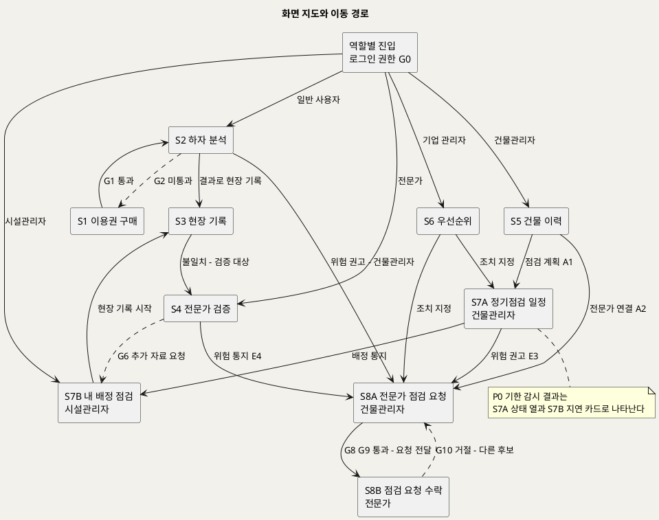

**[「화면 지도와 이동 경로」 PlantUML 뷰어로 열기](https://plantuml.sumzip.com/plantuml/svg/eNp1VN9P2lAUfr9_xYl71lhAZXtYhAXZy7IlvvpSBR0R2wVq9lqhLmS6iBmEygqBzB8xwayTyjDRf6j39n_YuW2BXufe4Hzf-fF959yuljW5pO3vFUl5t6B8kkvyHmzKW7s7JXVfyb1Ri2oJXqzF16RMOsIof5Rz6ueCsgPbcrGcJ1pBK-bBO2vQawfYlU5PDHamA-s49OQM3NtH2rcIKeW3NFnZQeYca914zR4dGsg2WPdwQ0GG-2fMOmNwR8de04Ls4hzIZXj7_l0mmrku8bKsfY00cO8G9Orc561LAisGXtNk3TrQkcGMTkCJCZQ4eCb2vgB3bNN-SIkLlASwnkEHY9fWUYXOLkNWQmAtgfvboYMHX2_vIqAsCZRlYG2bGT1Ws5hlBIxlgbGSwl5NHIX16tgKaz3g_w0lKO06Or0coJ4gdSUl5qaBVhygNiY3ISiwobAjixnnTzPTQmYyFVE46dxusNub_3ROip2TaTELWM2knUdsPqkapqUJ4ZuE-fnXuAd4xfVR2wRWGeAusXwERjmIi9NH4ARHJ-Uj8SWMP5k5gi5zFN1tHcIMxkkWFhCUEMzGgP4ae1_u3OEDwch00qwEk2gsiMZ5rVsbQ3i14hURPv2UJEC-pO4pQWSqg45qfNH3JsyHBwb0WGfVA4KwP5pvRhbvZ9Twd9St05_HodvTgXCN6IlleC2TPx932OP1nniBFf8hozB8rpBJELQvMN9Hg526Q8Nrf4OUNEWD3NnFtGz0AVIxgv5G0vs2l4SV8R6nUPIZCOmzlYf3G8w0w54Rl4kTHg5g36AkZF-Ga0Lpk2PEQY8GhFN8L_1KWWkRrcFONSTSo3N6MQbvh0GHDiGKquVhU9U0dQ_Ubf-dAXxY5AvknyTXruMOJ6v_2kDQf7fVA69qoRkO7861cHktG9i9Q79b_EZoxfSqOq1Y2JDklRzwTmQVf-Gn9y_huIiZ)** — 클릭 시 브라우저로 연결됩니다.

**역할별 진입 메뉴** — 진입 홈은 화면이 아니라 G0 통과 후 역할 메뉴다. 메뉴 항목은 역할이 수행하는 UC 화면만 둔다(UC_00 §4 Actor 카탈로그).

| 역할 | 메뉴 |
|---|---|
| 일반 사용자 | S2 하자 분석 · S1 이용권 |
| 시설관리자 | S7B 내 배정 점검 · S3 현장 기록 · S2 하자 분석(상속) |
| 전문가 | S4 전문가 검증 · S8B 점검 요청 |
| 건물관리자 | S5 건물 이력 · S7A 정기점검 일정 · S8A 전문가 점검 요청 |
| 기업 관리자 | S6 유지관리 우선순위 |

### 2-3 진행 레일

모든 화면 맨 위에 고정한다. 사용자는 "지금 어디이고 어디가 막혔는지"를 항상 본다. 레일은 화면이 다루는 대상에 따라 세 변형을 갖는다.

| 변형 | 사용 화면 | 형식 | 단계 |
|---|---|---|---|
| 하자 건 레일 | S1 · S2 · S3 · S4 · S8A · S8B | `건 번호 \| 진행: 1 분석 > 2 현장 기록 > 3 전문가 검증 > 4 조치` | P2 → P3 → P4 → P8 (SD_01 L0 본류) |
| 건물 레일 | S5 · S6 · S7A | `건물명 \| 이력 N건 \| 정기점검 지연 N건 \| 전문가 연결 대기 N건` | P5 · P0 · P8 산출 건수 |
| 작업자 레일 | S7B | `내 배정 점검 N건 \| 지연 N건 \| 추가 자료 요청 N건` | P7 7.3 · P0 0.3 · P4 G6 |

단계 상태는 **완료 · 현재 · 차단(게이트 ID) · 해당 없음** 넷이다. 일반 사용자의 하자 건에는 현장 기록·전문가 검증이 없으므로 그 단계는 회색 비움이 아니라 **"해당 없음"이라는 글자**로 표시한다. 하자 건의 상태 흐름은 다음과 같다.

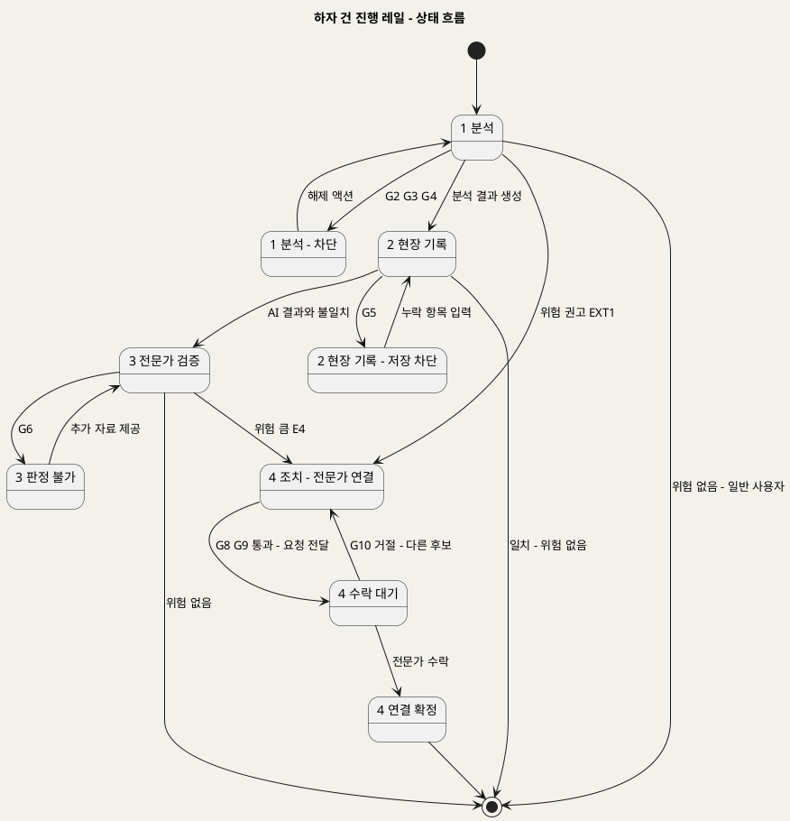

**[「하자 건 진행 레일 - 상태 흐름」 PlantUML 뷰어로 열기](https://plantuml.sumzip.com/plantuml/svg/eNp1U01vElEU3b9fcVN3JiRS0KgLU75K3BIDJsbFKFhJKRigcUvttMEwCxYdmVaGDFFqa2gyBUowwT80777_4J03D5gYXZF3z7nn3HvusNNoavXm4UGFNfbL1Q9aXTuAN9rb_b167bBaTNUqtTrc243tRjPJEKPxXivWPpare_BOqzRKrFluVkogTAsHXfBuZ4A_dPHlM3CnjfYSIoDHR-K4D8Lu8kudMTJtlmArCnyuo25vgdaAxN9Vv8294p2rAE6u8G0Qlo6DEXgLlw-D5tx_QF_DafnvkFRuLRUjVOfjhee2wJu08DJQy29wYXTRMWmiNnECcN0dBxy6-MuSJisZ7LnexJXMVIjYtrj9G7jRorkkWAiBsgXEuUlWEkwz9ur-a4hEnlEsieA3CU8huw3ZGGTjjF6ySDVhztDpA5pDPLEUOUd1FSIpe9MlHcBG_VbBKYKxr4ueBd7c8KYOZF6-iLJc0CuNHrJcciPV1v3phXnDf14DDk64M1LsPMGJ58oFz1t-UnRySoXlA4KUe8TyyTUf52cyqUGXfzMour43vVPs0GTiaAmZOEvJesEXeQzZJyBO7_x9KPKLM5zcyOQ7Y1ZYt2ejD-gTdNFpE4l3vvPRAsRXnU9nipT2PTb3kpdRwfihrwfA3inahu9kL7lL709jvLimqdXqiiyX9VnhLrXOP_RYeoWwnVK1SP-8P_ukhW8=)** — 클릭 시 브라우저로 연결됩니다.

---

## 3. 공통 컴포넌트

### 3-1 컴포넌트 목록

| ID | 컴포넌트 | 용도 | 대응 UC 단계 | 근거 원칙 |
|:--:|---|---|---|---|
| C1 | 진행 레일 | 화면 상단 고정 — 현재 단계·차단 단계·건수 | UC1 기본흐름 1~6 · UC3 1~6 · UC4 1~5 · UC7 1~5 (하자 건) · UC5 1 · UC6 1 · UC8 1 (건물) | U1 |
| C2 | 게이트 차단 블록 | 사유 · 해제 주체 · 다음 행동 버튼 | UC1 E1·E2·E4 · UC2 E1·E3 · UC3 E1·E3 · UC4 E1·E3 · UC5 E2·E3 · UC6 E2 · UC7 E1·E2·E3·E4 | U1 · U4 · U8 |
| C3 | 이유 붙은 비활성 버튼 | 게이트가 막는 버튼 + 같은 문구의 이유 | C2 와 같은 단계 | U1 |
| C4 | 1차 참고용 고지 | 결과·우선순위 안에 고정된 고지. 변형으로 확정 전 고지(수수료·공유 범위) | UC1 기본흐름 5 (INC2) · UC8 기본흐름 4 · UC7 기본흐름 3 | U2 · U6 |
| C5 | 위험 권고 | 위험도 문구 + [전문가 점검 요청] | UC1 기본흐름 6 (EXT1) · UC1 E3 · UC4 E4 · UC6 E3 | U3 |
| C6 | 하자 건 요약 | 사진 · 설명 · AI 원인·대응방안 · 현장 기록 · 판정을 한 묶음으로 | UC3 기본흐름 2 · UC4 기본흐름 2 · UC5 기본흐름 4 · UC7 기본흐름 1 | U3 |
| C7 | 데이터 출처 표시줄 | 외부 연동 미반영 · 제외 건물 수 · 신뢰도 낮음 | UC5 E1 · UC8 E1·E2·E3 | U5 |
| C8 | 권한 범위 건물 선택기 | 권한 있는 건물만 목록에 노출 | UC3 기본흐름 1 · UC5 기본흐름 1 · UC6 기본흐름 1 · UC8 기본흐름 2 | U8 |

### 3-2 C1 진행 레일

| 구분 | 내용 |
|---|---|
| 상태 | 단계마다 완료 · 현재(굵게, Primary 밑줄) · 차단(Error 테두리 + 게이트 ID) · 해당 없음(글자 표기) |
| 변형 | 하자 건 레일 · 건물 레일 · 작업자 레일 (§2-3) |
| 동작 | 완료 단계를 누르면 해당 화면의 읽기 상태로 이동한다. 차단 단계를 누르면 그 화면의 C2 블록으로 스크롤한다. 해당 없음 단계는 누를 수 없다 |

### 3-3 C2 게이트 차단 블록 · C3 이유 붙은 비활성 버튼

| 구분 | 내용 |
|---|---|
| 상태 | 표시(게이트 미통과) · 해제 진행 중(요청 보낸 뒤 "요청 보냄 - 2026-10-02 14:10") · 사라짐(게이트 통과) |
| 변형 | **본인 해제** — 다음 행동은 직접 조치 버튼(예: [사진 다시 올리기]). **타인 해제** — 다음 행동은 항상 «요청 보내기»(예: [추가 자료 요청 보내기]). 직접 해제 버튼은 두지 않는다 |
| 동작 | 블록은 닫기 버튼이 없다. 게이트 조건이 충족되면 서버 판정으로만 사라진다. C3 비활성 버튼의 hover·포커스 문구는 C2 사유 첫 줄과 글자까지 같다 |
| 시각 | 블록 왼쪽 4px 막대는 Error. 사유 1줄은 title-sm 700, 나머지 body-sm 300. 비활성 버튼은 `--primary-disabled` 바탕, 이유 문구는 `--muted` |

### 3-4 C4 1차 참고용 고지 · C5 위험 권고

| 구분 | C4 1차 참고용 고지 | C5 위험 권고 |
|---|---|---|
| 상태 | 항상 표시 (결과가 있으면 고지도 있다) | 정상(권고 없음, Success 문구만) · 주의(Warning — 신뢰도 낮음 UC1 E3) · 위험(Error — 위험 가능성 EXT1, 전문가 위험 판정 UC4 E4, 점검 결과 위험 UC6 E3) |
| 변형 | 분석 결과 고지(S2) · 우선순위 고지(S6) · 확정 전 고지(S8A — 수수료·공유 범위) | 버튼 있음(건물관리자: [전문가 점검 요청] → S8A) · 버튼 없음(일반 사용자 — UC7 A2 미확정, §14) |
| 동작 | 닫기·접기 없음. 인쇄·공유 시에도 결과와 함께 나간다 | 버튼을 누르면 S8A 로 이동하며 하자 건과 권고 출처가 자동 선택된다(UC7 A1) |
| 문구 | 스타일가이드 Notice Card — "이미지 기반 1차 참고용 정보이며 법적·구조적 안전 판정을 대체하지 않습니다. 위험 가능성이 판정된 경우 반드시 자격 있는 전문가의 점검을 받으세요." | 스타일가이드 Alerts — "구조적 손상 가능성이 감지되었습니다. 전문가 점검을 요청하세요." |

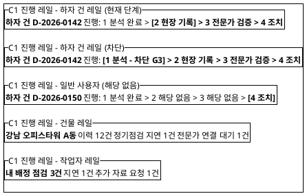

**[「C1 진행 레일 변형」 PlantUML 뷰어로 열기](https://plantuml.sumzip.com/plantuml/svg/eNqlk9FKAkEUhu_3KQ5dGSG4q3URIUZBDxEGRt1ZF2lXJiy2ReVCBm6uxi4raRlsMJmIgk-0c_YdOqO7Zl4sRTcD55855__mHyZTKObOiucneamQyxel0ppUOljZkQFfNf_xFrhzg9YE4uAbJto18D4GoRbzTQ1tF3i1531qqysSQAm2DtMLJ3fjSkLZiCfklAIXwchNkIEPNdQswKbGn3VIi659BabzuuCNGG9bWZKTgI7G3ZHHVPD6Kr5YJKYA2wzHJpSl8u9ZkfWI8w-QAmkOGodZP-wlBdcS6j9IaeXMBKy42HoTQDHfGPDqGLBxjZYezbueiAyVKBdnTSmXFXHLEDMbwUm-3J0E9RzKYwav9ADNjl-f4F3Hv1TxSYdtft8UZNaAO12QFQFNpWNQXOjUKB-ar2KDgRxuhdmR6PUZcF2ls7PtiPDsB2xciViWuHiFHp6RlwGBXzIw-mk7rE897ZoIDFt17L9_e5alzPHpEX2ML6fjlGo=)** — 클릭 시 브라우저로 연결됩니다.

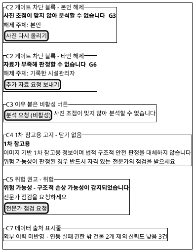

**[「C2 C3 C4 C5 C7 컴포넌트」 PlantUML 뷰어로 열기](https://plantuml.sumzip.com/plantuml/svg/eNqdlF9r01AYxu_zKV52pYgXrv4BERl44YcYEyZ6N71w9WoO0u4wShIxYmPTmZR062yHUU-zrESoXyjnzXfwOU1a2g4RvGp7zvvn9zznoVv79d039bev9oz93b26cXDLOHi28WST8sThMC2sjFiOlD0ilbVVP6TbpC4zDjMqvJSjYMMgevT8MTdjHgritMWRiz5Swx4PTWLPYk-QmggWYeFFxC2fuHPM1pWyW8oeED2tYUQ5jPhsykn6sFqB8-1qMCrZxr0fq69xnskd4_CfnMWReZ2z56ozJ5cmkEzuj3FJheNy5P0F7v51OKzHgsLDiR2wGOSpCShMnvFO2np6uYf4pM3Jd8hJVTNdwq4RmDmIQNHlEDC_RNHFrDGpRBTWVNNul6bNZ9xY1NzcoXf034ZXBHfpDvyCZ1l-GfHJBekP9ON57W8gnfWETmXbai3OsFH9zHSDdkP669NgKETrqgsJTR5HDcqvYu5L_Y09UIvKeA6B65iwtvD8uYQFLVYFouj4BFeVdQ75WmzZqdwAz_-bT7BC-upTMItIz80TAPRaymqDQ6g4Qy-HsCHClTnbJ79wMGWRwdzKkHuLRRMHImBE-XsenDUK3C_pOXb5qLGKmEsXYpTrc6e1ImdOtIRTPrGWXxLpHK2VVTXzAD0g9V7q3Au81CTgxKfio9bPA6GJuZsh4LNnis4JTwWD2G9oVR2pPnQR3UHhjBAkyNVRVvIz5eNUxVPazCVsjALM0EGzI3WKFpjW_IFEUA1loDg0tl6-foH_jT98FHyp)** — 클릭 시 브라우저로 연결됩니다.

### 3-5 C6 하자 건 요약 · C7 데이터 출처 표시줄 · C8 권한 범위 건물 선택기

| 구분 | C6 하자 건 요약 | C7 데이터 출처 표시줄 | C8 권한 범위 건물 선택기 |
|---|---|---|---|
| 상태 | 분석만 · 기록 연결 · 판정 포함 · 연결 확정 포함 (진행 단계만큼 칸이 찬다) | 숨김(모두 정상) · 표시(하나 이상 해당) | 목록 · 선택됨 · 건물 0개(권한 없음 — G0 블록으로 전환) |
| 변형 | 펼침(S4 비교) · 접힘(S8A·S8B 상단) · 행(S5 이력 상세) | 항목: 외부 미반영(UC5 E1·UC8 E2) · 제외 건물 수(UC8 E3) · 신뢰도 낮음(UC8 E1) | 드롭다운(데스크톱) · 전체 화면 목록(모바일) |
| 동작 | 각 칸 옆에 출처 단계 표기(분석 · 현장 · 전문가). 비어 있는 칸은 "아직 없음"이 아니라 "해당 단계 미진행"으로 쓴다 | 항목을 누르면 상세 사유 펼침(예: 제외된 건물이 몇 개인지). 데이터를 막지 않는다 — 막는 것은 C2 의 몫 | 권한 밖 건물은 목록에 없다. URL 직접 접근은 G0 블록 |

---

## 4. S1 분석 이용권 구매

### 4-1 와이어프레임 — G1 차단 상태

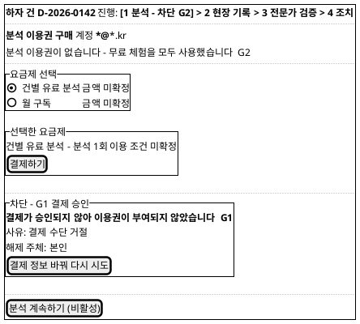

**[「S1 분석 이용권 구매」 PlantUML 뷰어로 열기](https://plantuml.sumzip.com/plantuml/svg/eNptksFq20AQhu96iiGn2EUmUkMPpgQfCnmFgkkhpT017SFxT27AtNugWi5xwYoVVwoySWu3CCrbipGh0PfZmX2HzkpK4pYcBLujf-ebmX8aR639w9bb1wfG0f5By2g_MNrw-PmO8ny66IOcpfDEtLfsR-aWtW3DO6CJUGef6lrTtACXgkQIJlAyRXcKu_Ye7IANyhd08Q1kluA45MhDoEhgnMmkA3Leoe86uA00Tmjlw7FRqxXYMh-FKY1-yGUP5HWMkyvmyoWgyINqtdrgr_bqkF-14X89H4CGJ9S9RtdB94orwzjFyx7QPFVDn0IB-HOKX_pA72N-o86cOzGXX9bybINGA5k5FAVAIlIfwg0DYPNpRU8EFwIoiHTWks_lsdYbA_7K1LnHhWo1VIC-DvIWTj_epznOQXl65THoBqlZ93LMm4OlRj1tRt63HqM2ah3elPOEM7GN7MGecdtVYZMJuxYUCqDuisJMI3n-RUy7VISx79OEL16XPPHvmHHZoWG8LvDXJ2lxQj3iIKrfkhxfw-WMbw7_Vl6ahy9_szl1wEXGxLvaeWU8XDAoGcg_A-C05HLQDfBUlB01y3Ho5Tj5XDQLm7gS6jwgMatoWePlmxe83n8BwXuS6A==)** — 클릭 시 브라우저로 연결됩니다.

### 4-2 영역별 설계

| 영역 | 내용 | 데이터 바인딩 | UX 의도 |
|---|---|---|---|
| 진행 레일 | 하자 건 레일, 1 분석이 G2 로 차단 | P2 2.1 접수 사진 · G2 판정 | 왜 여기 왔는지 보인다 — 분석 중이었고 이용권에서 막혔다 (U1) |
| 진입 사유 | G2 문구 (S2 와 동일) | P1 1.2 체험 상태 | 같은 게이트는 같은 문구 (사상 규칙 ④) |
| 요금제 선택 | 건별 유료 분석 · 월 구독 라디오 | P1 1.2 요금제 목록 | 두 가지만 — 원천 `[수익] 1단계` 그대로 |
| 선택한 요금제 | 금액 · 이용 조건 · [결제하기] | P1 1.3 결제 대상 | 금액이 결제 버튼보다 먼저 보인다 (U6) |
| 결제 결과 | G1 차단 블록 | P1 1.4 승인 또는 거절 | 거절 사유와 다음 행동을 같은 자리에 (U1) |
| 하단 액션 | [분석 계속하기] — G1 통과 전 비활성 | P1 1.5 분석 이용권 | 이용권 없이는 S2 로 돌아가도 다시 막힌다 |

### 4-3 상호작용

| 조작 | 동작 | 근거 |
|---|---|---|
| 요금제 라디오 선택 | 선택한 요금제 영역의 금액·조건 갱신 | UC2 기본흐름 3 |
| [결제하기] | 결제 수단 화면 호출 → 결과 수신까지 버튼 "처리 중" 고정 | UC2 기본흐름 4 · SD_01 P1 설계 주의(승인 전 이용권 미부여) |
| [결제 정보 바꿔 다시 시도] | 결제 수단 화면 재호출 | UC2 E1 · G1 |
| [분석 계속하기] | S2 로 복귀, 업로드했던 사진 유지 | UC2 기본흐름 6 |
| 미로그인 상태로 진입 | G0 전면 블록 → [로그인] → 로그인 후 S1 복귀 | UC2 E3 · G0 |

### 4-4 상태 전이

| 상태 | 진입 조건 | 다음 상태 |
|---|---|---|
| 로그인 필요 | 미로그인 (G0) | 로그인 완료 → 요금제 선택 |
| 요금제 선택 | 진입 | [결제하기] → 결제 처리 중 |
| 결제 처리 중 | 결제 요청 | 승인 → 이용권 부여됨 · 거절 → 결제 거절(G1) |
| 결제 거절 | G1 미통과 | [다시 시도] → 결제 처리 중 |
| 이용권 부여됨 | G1 통과 | [분석 계속하기] → S2 |

---

## 5. S2 하자 사진 AI 분석

한 화면이 입력 상태와 결과 상태를 가진다. 입력 상태 와이어프레임은 G3 차단을, 결과 상태 와이어프레임은 위험 권고를 그린다.

### 5-1 와이어프레임 — 입력 상태 (G3 차단)

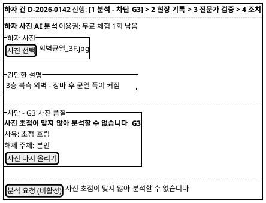

**[「S2 하자 사진 AI 분석 - 입력 상태」 PlantUML 뷰어로 열기](https://plantuml.sumzip.com/plantuml/svg/eNqdktFqE0EYhe_3KQ65UiShSYoXQUoFUXyGkEpFKUgVsfEqFmIdy9oEGoprtjEbNjTNRtnCNm7rFusL7Zx5B_9tN9DeevvPnO_858ysbjXX3zXfv960ttY3m1brntXCg-crxnE56iE9jfGoWFmq3C8ulZcr-AAGynz7Usvu1MvQ54rKQxGMZrozw5NqAyuowLiKo2OkSaTHnkyqoK90mKRRG-m8zWk2XAbHES9cbFul0i1b7oTig4dPFwbi68Uc_EjPuzXoMNZHXXAem76Lshl0oXdm9LoCaq0VbjEKFlDPcVS--eQ1Mthhoud_098--_Gz6uPSq7cb1pU2jZTEMM5QLk_0z8-ZvFBlciaLfGQyzpVZ4NGxDmyY7wrXHJj9E1kS_DNh0IPorOtca4W8nKLUs4hmDmwGdoaX1Iv9Ypt-L2PoYMSgDTp7dFTegXF80HbB_i73znTH1p0JhCiITD_0azkAxuvp6aXMjRPTlyhHl9KV9PYroZfcKEQI7Mi5G-ppKG_VyDdGPa-dg6-cn-COvlDmcEh1eveqvf9ed1sMVl--eSHf7R89UU5p)** — 클릭 시 브라우저로 연결됩니다.

### 5-1b 와이어프레임 — 결과 상태 (위험 권고)

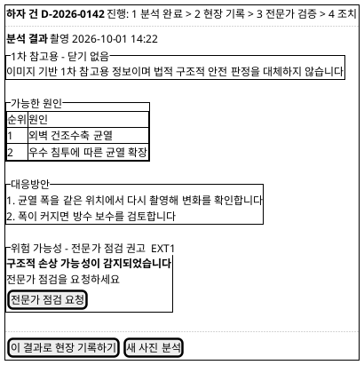

**[「S2 하자 사진 AI 분석 - 결과 상태」 PlantUML 뷰어로 열기](https://plantuml.sumzip.com/plantuml/svg/eNplU8Fu00AQvfsrRuWIEsUm4lChqgf4Aw5IUZCK4FY40HAKlRK6ikwSCSPFxAl25YiE1iIVW8cNrig_tDv7D8w4FgF6W4_evPfmzXj_qHXwuvXm5aF1dHDYstp3rTY8eLZn_ABPPVCXGTysODXnfqVm1x14C3gmzKf3u2CDXgsUEeBE6C9D2AMHTCDwdAEql3oWUeUeYCz0MleyAyrt4Fcu1gFnEq8DOLaq1Y1YyaRSqVY3rJEtMehCIWvXSBns-q7jUEf76Y6N8hxQ5moV4zSBCujBN1IEHPcwGu5YABhl-nuOZ53CiQzgvxaMfb3KGJVI0KmPcRfU1ZJt0Qt9l1yDGXqEw0iAHnYwzTgQYkS_j_0rPXD1YG4Vfmg43V8YPwT87GGUs4P2HUA3xFDwMEWVijZ_THKd_uJYWc0NcO2D-hHjOCNAEe-Uy4DX58Zd4tgDPZJ6kZcgMBOfEibs8UacvUUftUzINQvb1T_IDxdsXskJRmQ7FBQ58aEIKbA5DsIyZeNnoFcdMxnpxU3BH-XGT8oJyVR1Q5UB_pxTAjohPOmRSQ7RDbiNlmt68bat8EaaZhzAJh8Ul7Sq7Tlg7FETqPWQlgLw6Mljm_3TMfy1iZ6HJ90tAZtQ0mMTHs3ibhcBt5h5dpyOML3gxYmc3oRq3DKwwTSt8hgbhUZxh3oW_nvQRESPJi2pgScu4Lsl_QvlX9AsFrL_4tVz-pN-A0J02wA=)** — 클릭 시 브라우저로 연결됩니다.

### 5-2 영역별 설계

| 영역 | 내용 | 데이터 바인딩 | UX 의도 |
|---|---|---|---|
| 진행 레일 | 하자 건 레일 — 1 분석 | P2 2.1~2.5 단계 상태 · G2·G3·G4 | 차단 시 레일에도 게이트 ID (U1) |
| 이용권 표시 | 남은 무료 체험 또는 구독 상태 | P1 1.5 분석 이용권 · P2 2.1 | 막히기 전에 남은 횟수를 본다 (U6) |
| 하자 사진 | 사진 선택 · 미리보기 | P2 2.1 접수 사진 | 모바일은 카메라 바로 열기 (UC1 A1) |
| 간단한 설명 | 한 줄 입력 | P2 2.2 분석 요청 | 필수 여부 미정(UC1 A2) — 빈칸 허용, 비어 있으면 "설명 없음"으로 전송 |
| 차단 블록 | G2 · G3 · G4 중 해당 | P2 2.1 · 2.3 · 2.4 게이트 판정 | 사유·해제 주체·다음 행동 (U1) |
| [분석 요청] | 주요 CTA | P2 2.3 → 2.4 | 게이트 미통과 시 이유 붙은 비활성 (C3) |
| 1차 참고용 고지 | C4 | P2 2.5 분석 결과 - 고지 | 결과 카드 맨 위, 닫기 없음 (U2) |
| 가능한 원인 | 순위 표 | P2 2.5 분석 결과 - 원인 | 하나의 정답처럼 보이지 않게 "가능한" 복수 표기 (U2) |
| 대응방안 | 번호 목록 | P2 2.5 분석 결과 - 대응방안 | |
| 위험 권고 | C5 (정상·주의·위험) | P2 2.6 전문가 점검 권고 · UC1 E3 | 권고와 행동 버튼이 한 블록 (U3) |
| 결과 액션 | [이 결과로 현장 기록하기](시설관리자만) · [새 사진 분석] | P2 → P3 인계(분석 결과) | 결과가 이력의 재료가 된다 (SD_01 §12) |

### 5-3 상호작용

| 조작 | 동작 | 근거 |
|---|---|---|
| [사진 선택] | 파일 선택 또는 모바일 카메라. 업로드 즉시 이용권 확인 | UC1 기본흐름 1 · A1 · G2 |
| 이용권 없음 | G2 블록 + [이용권 구매] → S1. 업로드한 사진은 유지 | UC1 E4 · G2 |
| [분석 요청] | 품질 확인 → AI 분석. 진행 중에는 "분석 중" 상태 고정, 버튼 중복 클릭 차단 | UC1 기본흐름 3~4 · INC1 |
| [사진 다시 올리기] | 사진 영역 초기화, 설명 유지 | UC1 E1 · G3 |
| AI 실패 | G4 블록 + [다시 분석 요청]. 사진·설명 유지 | UC1 E2 · G4 |
| [전문가 점검 요청] | 건물관리자: S8A 로 이동(하자 건 자동 선택). 일반 사용자: 버튼 없음 | UC1 EXT1 · UC7 A1 · A2 |
| [이 결과로 현장 기록하기] | S3 로 이동, 분석 결과 연결됨 | UC3 기본흐름 2 |

### 5-4 상태 전이

| 상태 | 진입 조건 | 다음 상태 |
|---|---|---|
| 사진 대기 | 진입 | 업로드 → 이용권 확인 |
| 이용권 없음 (G2) | 이용권 없음 | [이용권 구매] → S1 → 복귀 시 설명 입력 |
| 설명 입력 | G2 통과 | [분석 요청] → 품질 확인 |
| 품질 부적합 (G3) | G3 미통과 | [사진 다시 올리기] → 사진 대기 |
| 분석 중 | G3 통과 | 응답 → 결과 · 실패 → 분석 실패 |
| 분석 실패 (G4) | G4 미통과 | [다시 분석 요청] → 분석 중 |
| 결과 - 정상 | 권고 없음 | [새 사진 분석] → 사진 대기 |
| 결과 - 주의·위험 | EXT1 · E3 | [전문가 점검 요청] → S8A |

---

## 6. S3 현장 점검·보수 기록

### 6-1 와이어프레임 — G5 차단 상태 (모바일)

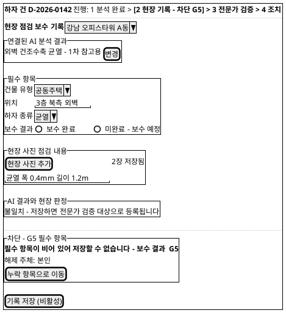

**[「S3 현장 점검 보수 기록」 PlantUML 뷰어로 열기](https://plantuml.sumzip.com/plantuml/svg/eNplk19v0mAUxu_7KU642mJKoEMvFrNsiYnxMxBIZvRueOHwCkw6qKYOkjVxHUVbUhxTMCwWKNgl5Qv1nH4Hz9s_07irpud9e57fec7Tw9Pm8dvmu8aJdHp80pRaj6QWPH15EJsWjQyIFj48k5WS8kQulSsKtIF-aPHVp30oA2400hygoYbXfTgQX1UViC2NRjcQBR6OHZCBvCn2pvD8cY2v7AG5Gs6DyFMhWqr03eFiBWjs0Z0F76ViMVNPm5Br8C3AlU-6lbdsQz3yTOxMgaxJfBnS-STuqvS1D0d4Maxzl1a9QAMvWnpo2HD0IgflQrQKCxIwcoDLrRhOKOsWbUyIfrs08Bm4zMRMHUQrl77MWK6KKzVabmtS0jk2NQETm7f4cyaacRech0C2G1tmQrdaMwhdh3HXqQs1WxPTtaGwR8Gaac4oGOcMAKJH5jZ9-4A3VtIjoRFf58Mn8Hy0A7t5LXM-q_0Ksnf5_tzSyTUz7MzRzpwXeG9sx-cRBUD1v_PNJa-oxq2VdA8qP9CY8s1CZlR8cQulYqXR4L0E5PhQLiqNZJxEj21PkWmo5pmI-wbzCDnc6OSEwhU5a84O4Mx_GA_sq9Q9IzvEsQ34ecEJQGOGPR17EykNDG87zZjMKYMH-0nC_E9NsOKdRlesNtKTR0bgQuLa4COdr1OFv15m_rNCsi6fXBt4xbT09_kKGxAIF1HX0NnmQik063EcRHqqWYJTPdhhinhok7bYFaeHr9-84t_wDzfk7TE=)** — 클릭 시 브라우저로 연결됩니다.

### 6-2 영역별 설계

| 영역 | 내용 | 데이터 바인딩 | UX 의도 |
|---|---|---|---|
| 진행 레일 | 하자 건 레일 — 2 현장 기록 | P3 3.1~3.6 · G5 | (U1) |
| 건물 선택 | C8 | P3 3.1 건물 이력 요약 | 권한 건물만 (U8) |
| 연결된 분석 결과 | C6 접힘 + [변경] · 신규 하자는 "연결 없음 - 신규 하자" | P2 분석 결과 · P3 3.2 | 다시 입력하지 않는다 (U7) |
| 필수 항목 | 건물 유형 · 위치 · 하자 종류 · 보수 결과 | P3 3.3 · 3.5 → 이력 레코드 | 화면 맨 위, 4개가 한눈에 (U7, BR-DEF-06) |
| 보수 결과 | 보수 완료 · 미완료 - 보수 예정 | P3 3.5 보수 결과 | 미완료도 명시값 — 빈칸과 다르다 (U7, UC3 A1) |
| 현장 사진·점검 내용 | 사진 추가 · 텍스트 | P3 3.4 사진 참조 | 사진 저장 실패 시 "임시 저장됨 - 사진 다시 올리기" 줄 (UC3 E4) |
| AI 결과와 현장 판정 | 일치 · 불일치 안내 | P3 3.5 일치 여부 | 불일치가 저장 후 어디로 가는지 미리 말한다 (UC3 E2) |
| 차단 블록 | G5 | P3 3.6 필수 검증 | 무엇이 비었는지 항목명까지 (U1) |
| [기록 저장] | 주요 CTA, 화면 하단 고정 | P3 3.6 → 이력 레코드 · 검증 대상 | 한 손 엄지 위치 48px (U7) |

### 6-3 상호작용

| 조작 | 동작 | 근거 |
|---|---|---|
| 건물 선택 | 권한 확인 → 기존 이력 요약 펼침 | UC3 기본흐름 1 · G0 |
| 분석 결과 [변경] | 이 건물의 분석 결과 목록에서 선택. "연결 없음 - 신규 하자" 선택 가능 | UC3 기본흐름 2 · A2 |
| [현장 사진 추가] | 카메라 · 앨범. 저장 실패 시 텍스트 임시 저장 + [사진 다시 올리기] | UC3 기본흐름 4 · E4 |
| 필수 항목이 빈 채 [기록 저장] 포커스 | 버튼은 비활성, 이유 문구 표시. [누락 항목으로 이동] 은 첫 누락 항목에 포커스 | UC3 E1 · G5 |
| [기록 저장] | 저장 → 하자 유형별 분류. 불일치면 "전문가 검증 대상으로 등록됨" 결과 표시 | UC3 기본흐름 6 · E2 |
| 배정 점검에서 진입(S7B) | 건물·점검 항목 미리 채움. 저장 시 일정에 연결 | UC6 기본흐름 5 |

### 6-4 상태 전이

| 상태 | 진입 조건 | 다음 상태 |
|---|---|---|
| 접근 거부 (G0) | 기록 권한 없음 | [권한 요청 보내기] |
| 작성 중 | G0 통과 | 필수 누락 → 저장 차단 · 모두 입력 → 저장 가능 |
| 사진 임시 저장 | 사진 저장 실패 | [사진 다시 올리기] 성공 → 작성 중 |
| 저장 차단 (G5) | 필수 4항목 중 누락 | 누락 입력 → 저장 가능 |
| 저장 가능 | G5 통과 · 사진 저장 완료 | [기록 저장] → 저장 완료 |
| 저장 완료 - 일치 | 일치 | 종료 |
| 저장 완료 - 검증 대상 등록 | 불일치 | 레일 3 전문가 검증으로 이동 |

---

## 7. S4 전문가 검증

### 7-1 와이어프레임 — G6 차단 상태

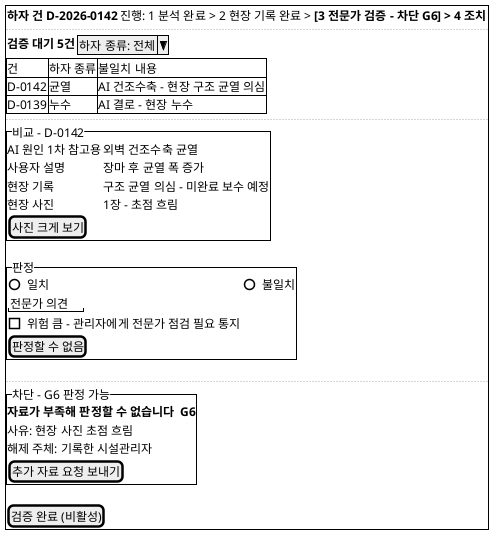

**[「S4 전문가 검증」 PlantUML 뷰어로 열기](https://plantuml.sumzip.com/plantuml/svg/eNptU8FuElEU3c9X3NRNG0NTaG0iMU1NTIzfQCCp0V11YXEFJti8NlhInEWRacuQwRaoZhphOiBN8Ifm3fcPnjfzgFJdzrvnnnvOuXd2D4p7H4of3-1bB3v7Rav02CrRs9c7quFw26ZoGNKLVGYjs53aSG9lqEzcF-rblyylSY4FC5f4TMjLOu1QhpQjuN2laDKQnXsF0OU2iT0h_Uk0qFAUVLjnUop4cC1r1_RyOw_UFnFnwHcOfbLW1xMRBijrFVDSEy2mTAUjjb8fya6T1bwchAW0lR4RJZglCL7luMruVJPLw5DPf1gwZfxEvz1u6p7nr3Sz1lB1eNyAvJmdkY_XGZBdh2t-QrD5VHNXBToMQQDnrUVrUrMSR4UVeSeikY1yMn3FIt3EFza7E0ojDSQyiW49KNRJn01k8GdZVCICfXzoAxWbFFfy55HGt7uyXyV1IWZa1dcbQoDIHB3Lyyn_1xakyV8Tszh5G2pj7FTZaywI9OS-AEFaf2GJIeo2KdeWvSlgOQNQn_0oiFkwMo8MEICq2-DSvldpjcxKyvHHfEUorixuBbqiwCe8aWrKE7eEajpgn2J2FFZkz0cK3LT1sHt9Hh4qOATB56ekjkfc1yHkEgWq4VHsrXnMbj0_X5A5yBROkhIkgUyedPV0HCQmIRnNL8cV7gxVI6R_GU9GslaVtSsCjVlVy8s-yO9hbKBir0V8OcU1Z82aVAMvtRZWPHcaJzw-jT3GaggGObjRQeO4TdY58-uYVa7i8tQZeIZrurr79v0b_PF_AbAJIWA=)** — 클릭 시 브라우저로 연결됩니다.

### 7-2 영역별 설계

| 영역 | 내용 | 데이터 바인딩 | UX 의도 |
|---|---|---|---|
| 진행 레일 | 하자 건 레일 — 3 전문가 검증 | P4 4.1~4.5 · G6 | (U1) |
| 검증 대기 목록 | 건 · 하자 종류 · 불일치 내용 · 필터 | P3 3.6 검증 대상 · P4 4.1 | 불일치 내용이 목록에서 보인다 — 무엇을 볼지 먼저 안다 |
| 비교 | C6 펼침 — AI 원인 · 사용자 설명 · 현장 기록 · 현장 사진 | P2 분석 결과 · P3 이력 레코드 · P4 4.2 | 나란히 놓아 차이를 본다 (UC4 기본흐름 2) |
| 판정 | 일치 · 불일치 라디오 + 의견 | P4 4.3 · 4.4 | 판정 불가는 라디오가 아니라 별도 버튼 — 다른 축이다 (U4) |
| 위험 큼 | 체크박스 | P4 4.5 위험 통지 | 체크하면 저장 시 관리자에게 통지 (U3, UC4 E4) |
| 차단 블록 | G6 — 타인 해제 | P4 4.3 판정 가능 여부 | 해제 주체가 타인 → «요청 보내기» (사상 규칙 ③) |
| [검증 완료] | 주요 CTA | P4 4.5 전문가 판정 | 판정 불가 상태에서는 비활성 |

### 7-3 상호작용

| 조작 | 동작 | 근거 |
|---|---|---|
| 하자 종류 필터 | 목록 재조회 | UC4 A2 |
| 목록 행 선택 | 비교·판정 영역 갱신 | UC4 기본흐름 2 |
| 일치 선택 후 의견 없이 [검증 완료] | 허용 — 의견 생략 | UC4 A1 |
| [판정할 수 없음] | G6 블록 표시, [검증 완료] 비활성 | UC4 E1 · G6 |
| [추가 자료 요청 보내기] | 기록한 시설관리자의 S7B 에 요청 카드 생성, 블록은 "요청 보냄 - 날짜"로 바뀜 | UC4 E1 · SD_01 §13 G6 해제 주체 |
| [검증 완료] | 판정 저장 → 판정 데이터 축적. 불일치면 차이 기록, 위험 큼이면 통지 | UC4 기본흐름 5 · E2 · E4 |

### 7-4 상태 전이

| 상태 | 진입 조건 | 다음 상태 |
|---|---|---|
| 접근 거부 (G0) | 전문가 권한 없음 | [권한 요청 보내기] |
| 목록 | G0 통과 | 행 선택 → 검토 중 |
| 검토 중 | 건 선택 | 판정 입력 → 완료 가능 · [판정할 수 없음] → 판정 불가 |
| 판정 불가 (G6) | 자료 부족 | [추가 자료 요청 보내기] → 자료 요청됨 |
| 자료 요청됨 | 요청 보냄 | 시설관리자 자료 제공 → 검토 중 (목록 상단 복귀) |
| 완료 가능 | 일치·불일치 선택 | [검증 완료] → 검증 완료 |
| 검증 완료 | 저장 | 목록에서 제거 · 위험 큼이면 레일 4 조치 |

---

## 8. S5 건물 이력

### 8-1 와이어프레임 — G7 차단 + 외부 미반영 상태

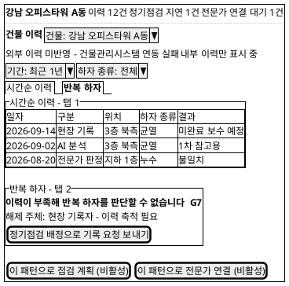

**[「S5 건물 이력」 PlantUML 뷰어로 열기](https://plantuml.sumzip.com/plantuml/svg/eNp9U01v00AQvedXjMoFhFJig_iIEGpPiN-AGqkIboUDDaekktNukNUYkUq14gS3cmhCgpSKTeKkjuRftDP-D8zGCa0B9WKNZ997M_Nmd2u_vPux_On9Xm5_d6-cq9zPVeD5mxdKung4BPJ6yWlMx73kyKJvDmzj1zZUgc5CDPpgmGoc6t_AVZGkoKkmFtDAopYEY30kcBQpyfmWVBMJ6FiMTY8Pcpubq3LjEEfxWrcKpTRRhFv6KDG_AtSOcG6tmfgrQumRV4M8pBIqtPDHiBq-Jtd93YaegRq9xBlyJTwMr_k4cCA58RkN1DtZ6pe4WyVFEWjmq6sYDKyLku4wcT06bwJ9r2PfK-pBaRIue3rA6j5zyPavJ-IhuTOczmBFZGBp4x9gHpKjSzA2cgCVO5yMNbQKajbCudB--oIWHgeZ8hoxkWoaM80smI_zhWd545FGeYLO-8AzYPeM_x9SNAOc1yjqas5VQC29JbaN2gIvHMBpSLbHftu81BtqBZNh26-YK0jcomSQ5G3JSE0D6vz8I_A0bxYytyFxmlxApwYWj8I8luNGbKHLczC39fALjyUOckuvsvalRpnaKLY2dY-_TLSoO05cjm7isR_rmtgYJm4AyxFbn-l4hg0bGz2Al09YiFkU8CouYl5lMWteWnO1JZq7FNQYL6hzysTXmReAkiOX_Bi7_tp6xtHkUtvLF45zO3om5nHHfA8TEa7gKwk1FUnnC9zFhUjaPonxvR025X_wv55XhqGN23r34S2_7t-uUirZ)** — 클릭 시 브라우저로 연결됩니다.

### 8-2 영역별 설계

| 영역 | 내용 | 데이터 바인딩 | UX 의도 |
|---|---|---|---|
| 진행 레일 | 건물 레일 | P5 5.2 통합 이력 건수 · P0 0.3 지연 건수 · P8 연결 대기 건수 | 건물 단위의 막힌 곳을 한 줄로 (U1) |
| 건물 선택 | C8 | P5 5.1 건물 목록 | (U8) |
| 데이터 출처 표시줄 | C7 — 외부 미반영 | P5 5.2 외부 이력 반영 여부 | 막지 않고 빠진 것만 알린다 (U5, UC5 E1) |
| 필터 | 기간 · 하자 종류 | P5 5.3 | |
| 시간순 이력 | 일자 · 구분(AI 분석·현장 기록·전문가 판정·전문가 연결) · 위치 · 하자 종류 · 결과 | P5 5.2 통합 이력 · 5.4 이력 상세 | 구분 열로 출처가 보인다 — AI 결과와 전문가 판정이 섞여 읽히지 않게 (U2) |
| 반복 하자 | 재발 패턴 또는 G7 블록 | P5 5.5 반복 하자 패턴 | 데이터 부족이면 그리지 않는다 (U4) |
| 후속 조치 | [이 패턴으로 점검 계획] · [이 패턴으로 전문가 연결] | P5 5.6 → P7 · P8 | G7 미통과 시 비활성 |

### 8-3 상호작용

| 조작 | 동작 | 근거 |
|---|---|---|
| 건물 선택 | 권한 확인 → 내부·외부 이력 통합 표시 | UC5 기본흐름 2 · G0 |
| 연동 실패 | C7 표시줄 + 내부 이력 표시. 표시줄 누르면 "다시 불러오기" | UC5 E1 |
| 필터 변경 | 이력 재표시 | UC5 기본흐름 3 |
| 이력 행 선택 | C6 행 펼침 — 사진 · AI 결과 · 판정 · 보수 결과 | UC5 기본흐름 4 |
| [반복 하자] 탭 | 패턴 표시 또는 G7 블록 | UC5 기본흐름 5 · E3 · G7 |
| [정기점검 배정으로 기록 요청 보내기] | S7A 로 이동, 점검 항목에 해당 위치 미리 채움 | UC5 A1 · G7 해제 주체(시설관리자) |
| [이 패턴으로 점검 계획] · [전문가 연결] | S7A · S8A 로 이동 | UC5 A1 · A2 |

### 8-4 상태 전이

| 상태 | 진입 조건 | 다음 상태 |
|---|---|---|
| 접근 거부 (G0) | 권한 밖 건물 | [권한 요청 보내기] |
| 통합 이력 | G0 통과 · 연동 성공 | 연동 실패 → 내부 이력만 |
| 내부 이력만 | 연동 실패 | [다시 불러오기] 성공 → 통합 이력 |
| 반복 하자 - 데이터 부족 (G7) | 충분성 미달 | 이력 축적 후 재진입 → 반복 하자 |
| 반복 하자 | G7 통과 | 후속 조치 → S7A · S8A |

---

## 9. S6 유지관리 우선순위

S6 의 게이트는 G0 뿐이다(SD_01 P6 설계 주의). 와이어프레임은 데이터가 일부만 반영된 저하 상태(UC8 E1·E2·E3)와 진입 거부를 함께 그린다.

### 9-1 와이어프레임 — 저하 상태

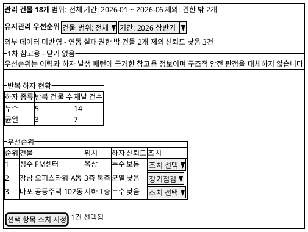

**[「S6 유지관리 우선순위」 PlantUML 뷰어로 열기](https://plantuml.sumzip.com/plantuml/svg/eNpdU81OE2EU3fcpbnBpIJ2iaIgxuHHnExibYHSHLgRXFTOlI2naGrqgMuCUfGBrqVb9oD-UpE_03Tvv4LmdqS0uJpk5995zzv2Zje2dzXc7799sZbY3t3YyhbuZAj16-dgNfP7eI3c54N6EvIfORvSB-OpQomCdxARyNQDgxtZZALlsbm0569HH9G0NMTGRHI_XyY1qcSMitl8opzS7mZWVREQiIx0_lZITK4GRcgQFVOdT6duS-WlkQZSkVGQbAsqDuEBQ5JFP_NlKcxAHlvjPGHEJi7RMcmT54Jik2oprF-p-7ixVmxpMjGsHVcPnKAmI935Ls0arSFOZ_JIn9oLEjl3fyEkX3Fz9CROQ2EfiUoZu9cOVQ4IfNm3Xn1DcCOW0DtlISk2ClTgYyFGd3PXEXVp1NCcW0-D-QGu7ltywJ2dWTJGkUcZAUFtHgjRhsOZjPMrc8RGtSGXI1TJXW5mpXYyA-8OZchwG8XFXTRbuzDA5_8TtUHecpKYDkbJictqDW8XwjTIuB0ngPh7vHhB3beRIL2IVzwMAu4nw4hRSwX8rTiVAHwVyo3Spl8XJ4x0t36iqpx_BpSo_fSbBRNcLJGzjBtT4zBQGFu8P9VKSUhSZuNTMgyKnsrbBe1he2IoPJ1JpxSVfvtboiZ4G_Mt4SDwqyvhMc2dtpQegnKaBRYupuytfKbVh7pTjA_wt_SFI5NsEauRlcwkjNoK-yFPiRZdzxv9dTmdHzxMAQ_nFP7o0y-r4cPBC567HmORw_WJatPH67Sv8yn8BRHgX6g==)** — 클릭 시 브라우저로 연결됩니다.

### 9-2 영역별 설계

| 영역 | 내용 | 데이터 바인딩 | UX 의도 |
|---|---|---|---|
| 진행 레일 | 범위 레일 — 관리 건물 수 · 범위 · 기간 · 제외 수 | P6 6.1 관리 건물 요약 · 6.2 | 무엇을 기준으로 본 순위인지 상단에 (U5) |
| 범위·기간 | 드롭다운 | P6 6.2 입력 | |
| 데이터 출처 표시줄 | C7 — 외부 미반영 · 제외 수 · 신뢰도 낮음 | P6 6.2 · 6.4 | 부분 데이터임을 숨기지 않는다 (U5) |
| 1차 참고용 고지 | C4 우선순위 변형 | P6 6.4 우선순위 목록 - 고지 | 순위 표 위, 닫기 없음 (U2, BR-DEF-01·11) |
| 반복 하자 현황 | 하자 종류별 반복 건물 수·재발 건수 | P6 6.3 반복 하자 현황 | 표로 — 차트 장식 없이 수치 |
| 우선순위 | 순위 · 건물 · 위치 · 하자 · 신뢰도 · 조치 | P6 6.4 우선순위 목록 | 신뢰도 열이 순위 옆에 (U4·U5) |
| 조치 지정 | 행별 조치 선택 + [선택 항목 조치 지정] | P6 6.5 조치 지정 | 조치 없이 닫아도 된다 (UC8 A1) |

### 9-3 상호작용

| 조작 | 동작 | 근거 |
|---|---|---|
| 범위·기간 변경 | 재집계. 권한 밖 건물은 자동 제외하고 제외 수 갱신 | UC8 기본흐름 2 · E3 |
| C7 "권한 밖 건물 2개 제외" 누름 | 제외 사유 펼침(건물명은 표시하지 않음 — 권한 밖) | UC8 E3 · U8 |
| 신뢰도 "낮음" 행 | 행 아래 "이력 부족 - 참고 한계" 문구 | UC8 E1 |
| 조치 선택 → [선택 항목 조치 지정] | 정기점검 → S7A(건물·항목 미리 채움) · 전문가 연결 → S8A(하자 건 자동 선택) | UC8 기본흐름 5 |
| 기업 권한 없음 | G0 전면 블록 + [권한 요청 보내기] | INC3 · G0 |

### 9-4 상태 전이

| 상태 | 진입 조건 | 다음 상태 |
|---|---|---|
| 접근 거부 (G0) | 기업 권한 없음 | [권한 요청 보내기] |
| 집계 중 | 범위·기간 선택 | 완료 → 우선순위 · 연동 실패 → 우선순위 - 외부 미반영 |
| 우선순위 | 집계 완료 | 조치 지정 → S7A · S8A · 닫기 → 종료 |
| 우선순위 - 외부 미반영 | UC8 E2 | 재집계 성공 → 우선순위 |

---

## 10. S7 정기점검 (역할별 뷰)

### 10-1a 와이어프레임 — S7A 정기점검 일정 (건물관리자)

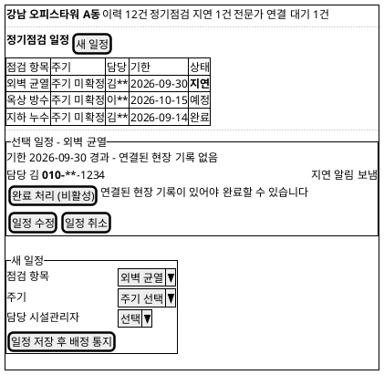

**[「S7A 정기점검 일정 - 건물관리자」 PlantUML 뷰어로 열기](https://plantuml.sumzip.com/plantuml/svg/eNp1U8Fq20AQvesrhvTSuihITlsolJJ8R7Egpb2lPTTuyQ6olTAiEsSHqpaIbVRip0lJqaIoxAblh3Zm_yGzkmzHIdVFmpk3b-e9HW3vt3e_tL9-2tP2d_faWue51oE379-KNMTvZ0DRRP4o6HAiHZuOA9jBoxi6QKMckymYTXGZqzAJxSylpC8yG-i3TYMUzEXJxYuZSDk_SEWWAgY2Y6vygba5WR23zjAqOObmd-R4ddRicOcJQA2R4V_8c674TwpF1wX0c_Tn_MGhDIeq5HyTzlADimeY3YK4SWiQr1rw30zGYXWQmNuNBr-bRvOVbrzWtwwO1FilFqaIpswGmJ6TFz1OwZasKExDN1-qZORxVVOeyDAC9Nz_9j8cwXyhcLGLJ4FW-WRtkJtIZ7TwR19XtqHBQvs9GSK7FVeFwpb2Y38IMnJpPFVY_MVkgx6NAu6tDazmMFhBgx_dbG6Vg1SXSmGApwXgVY6Oyz0dvqJyRKAswtMLeIpzV8ZDci-ftVTb44eyV0Bjj37mFBa1SBkmoMxR-cNr9D30J3zn1RmVYC6Xm9BdZW7OqBeo3Tgo_VmuizLj4apYa3ZZCrFYHqv-qgy2Vm6Qz1omIrdZHI37JXSJWU6R2EqbPHZ5Q1KVkb1rdqylqbm2P37-wL_XHWo80DU=)** — 클릭 시 브라우저로 연결됩니다.

### 10-1b 와이어프레임 — S7B 내 배정 점검 (시설관리자, 모바일)

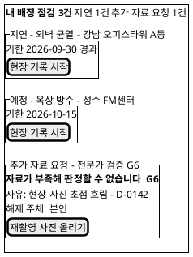

**[「S7B 내 배정 점검 - 시설관리자」 PlantUML 뷰어로 열기](https://plantuml.sumzip.com/plantuml/svg/eNqFUV1LwlAYvt-vePE2JpuWkEQYRF31C6LAqDvrIu3KhKkjRIUWOJy1jYlfBQvmXLaL-YfOec9_6JyULiLo7jy8z_t8vKdQrhRvK3fXJalcLFWk6pZUhb2LfdqIgAYBeiagZ5BQgyyZR3APONOwH4C6QcseCTRA16CjLuBzD8P39awmpdNS9Ty14cuAg5iGKyCfHvYjjklg0sYroDVmvQTbY9bU8KULB_RxkJIASBww04aMksnJyq6cVYCEK7JI-OiUWTq6E0GhQwewY6P7dCbVvu2slsjM7awJNuu8wxu2LIH1uXgcnaCeMD34baEqsrrzn_ZfZbmyp1M_FhN-Jpw6cJwT6vyIa6aY0KWGwzkzI2BdgwdkpgciDvYfsP1BOy3aGQNf5HvY8NH28rAJIuBMB4x4LwOYY9Bpwk0PZUXdznA610TPBhwlGEZ5oIsYnVgUQdfHyEer_iNh-XTq82KiTk0qXN1c8m__AuAvDgg=)** — 클릭 시 브라우저로 연결됩니다.

### 10-2 영역별 설계

| 영역 | 내용 | 데이터 바인딩 | UX 의도 |
|---|---|---|---|
| S7A 진행 레일 | 건물 레일 — 지연 건수 | P0 0.3 지연 상태 · P7 7.1 | P0 의 결과가 보이는 자리 (U1) |
| S7A 일정 표 | 점검 항목 · 주기 · 담당 · 기한 · 상태(예정·도래·지연·완료·취소) | P7 7.1 일정·상태 · P0 0.2·0.3 | 지연은 굵게 + Warning 막대 — 색만으로 구분하지 않는다 (§13) |
| S7A 선택 일정 | 기한 경과 사유 · 담당 연락처(마스킹) · 알림 발송 여부 | P0 0.3 지연 알림 · P7 7.3 배정 | 지연이 상태값에 그치지 않고 알림까지 나갔는지 (SD_01 P0 설계 주의) |
| S7A [완료 처리] | 현장 기록 연결 전 비활성 | P7 7.4 완료 일정 · P3 이력 레코드 | 완료는 기록 연결로만 (SD_01 §12) — 게이트가 아닌 선행 조건이므로 C3 만 |
| S7A 새 일정 | 점검 항목 · 주기 · 담당 | P7 7.2 · 7.3 | 주기 옵션 미정(§14) |
| S7A 위험 권고 | 완료 일정의 점검 결과가 위험이면 C5 | P7 7.5 전문가 연결 권고 | (U3, UC6 E3) |
| S7B 작업자 레일 | 배정 · 지연 · 추가 자료 요청 건수 | P7 7.3 · P0 0.3 · P4 G6 | 오늘 할 일의 순서 |
| S7B 배정 카드 | 지연 → 도래 → 예정 순 | P7 7.3 점검 일정 · P0 0.2·0.3 | 지연이 맨 위 (U1) |
| S7B 추가 자료 요청 카드 | G6 문구(S4 와 동일) + [재촬영 사진 올리기] | P4 4.3 판정 불가 | 시설관리자에게는 본인 해제 (사상 규칙 ③) |

### 10-3 상호작용

| 조작 | 동작 | 근거 |
|---|---|---|
| S7A [새 일정] → [일정 저장 후 배정 통지] | 일정 생성 → 담당자 배정 통지 → S7B 에 카드 생성 | UC6 기본흐름 2~3 |
| S7A [일정 수정] · [일정 취소] | 수정 저장 · 취소 확인 후 감시 대상에서 즉시 제외 | UC6 A1 · SD_01 P7 설계 주의 |
| S7A [완료 처리] | 연결된 현장 기록 확인 후 완료 | UC6 기본흐름 5 |
| S7A 위험 권고 [전문가 점검 요청] | S8A 로 이동 | UC6 E3 |
| S7B [현장 기록 시작] | S3 로 이동, 건물·점검 항목 미리 채움. 저장 시 일정에 연결 | UC6 기본흐름 5 · UC3 |
| S7B [재촬영 사진 올리기] | 해당 이력 레코드에 사진 추가 → S4 대기 목록 상단 복귀 | UC4 E1 · G6 |

### 10-4 상태 전이

| 일정 상태 | 진입 조건 | 다음 상태 |
|---|---|---|
| 예정 | 일정 저장 | 기한 도래(P0 0.2) → 도래 · 취소 → 취소 |
| 도래 | 도래 판정 | 현장 기록 연결 → 완료 · 기한 경과 → 지연 |
| 지연 | 기한 경과 · 결과 없음 (P0 0.3) | 현장 기록 연결 → 완료 |
| 완료 | 이력 레코드 연결 | 위험이면 C5 권고 |
| 취소 | [일정 취소] | 종료 (감시 제외) |

---

## 11. S8 전문가 점검 연결 (역할별 뷰)

### 11-1a 와이어프레임 — S8A 전문가 점검 요청 (건물관리자, G9 차단)

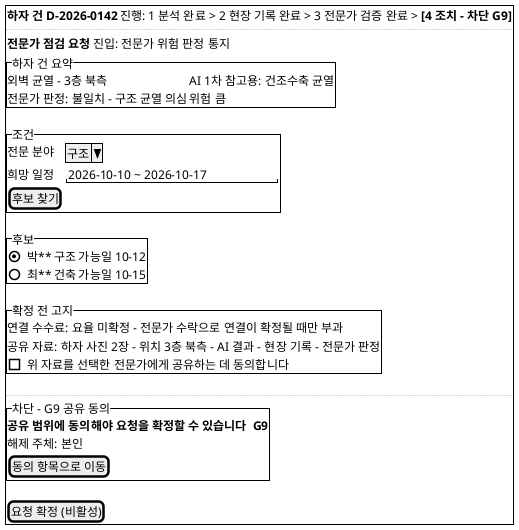

**[「S8A 전문가 점검 요청 - 건물관리자」 PlantUML 뷰어로 열기](https://plantuml.sumzip.com/plantuml/svg/eNplVFFv0mAUfe-vuOFpzHQBNjUSs8zExPgPTAhLtujb9MHhE2iYVoOAkQcqZbakZCJgWOyAYpcUf1C_-_0H7-1XGGYJD9B777nnnnPKwWnp6HXpzcsT7fTopKSV72hleHi8L00Ley2IrubwWM9lcvf0THYvBxXAoSG_fc5DFsTCQMMB7Briogn7kANpGdgbQBR4or9R2AV0DTEJIq8K0bSKPzdqtKqwB9j38NoCHdAbicYInjwowlttZ0dxuZlGt0UAgOdtnF4qMtj7mN_AR9uQHQtks4WuCfKTj8MqQZUPUxsX8by5TGlAPAIxXUL0x8XOnPbvYuDTYWcY9An-0VPIEiNiFUQzF8_HeR5nsjULF2YyxjDr_WpxnjBq6ITqqMif0MxqCToWNiZMPqF6FmoxQeoh9NQaLhbYDKnzUCEcUkk6EzEk_Qib7qtAKvYmm6EPvIP1j_sAwEgF-d0QM1rq_SVXimqResblrWdpEJ65vb3iWAE6QtQHhA-Mk-MmSAP6NjfR8QvzVtPdBLZrMiciD6zWsBqf0vGiqQcsWM0iy_Ox-PYIxO8gGdA37aMmZ4l2KPp2MovOHFSnaLkgzKYYNkmaajQLCT-a-Wi7QM7G4InJ-H5C0YAcp1FnodmITW919pbACYS-_59b_ZadLCQUGSdZJAYhoOHKD4407Zt27FA8mwknoiLqbRBfPBBfu-S6NMeiURONH5qKNjmu0q5T3leHqFZWjoK_ejZt8wmd1hpozrlQbwE6RiKPNF3WjyjWsO6rVUDQnBqacInoRYjTOYVzFqAT8FUKkOqX4td4Jbszp8eclULyoiVGbYlrQ3ZtNK7SXD148eo5_W_8A-PPTY0=)** — 클릭 시 브라우저로 연결됩니다.

### 11-1b 와이어프레임 — S8B 점검 요청 수락 (전문가, G10 대기)

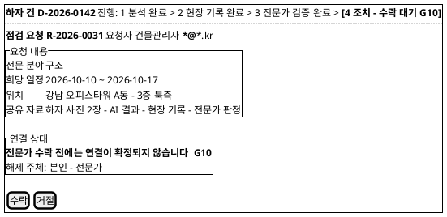

**[「S8B 점검 요청 수락 - 전문가」 PlantUML 뷰어로 열기](https://plantuml.sumzip.com/plantuml/svg/eNpVksFq20AQhu96ip8cXWQkOTQQQnCgUHrt1aSQ0pyS9JC4JydFsXVwHUN0sBo5sYJM3LgFFRRbLiqoL7Q7-w6dtVXqwAp2d-af-eZf1c-aB6fNTyfHxtnBcdNovTBa2Hm_q4KQ7n2IpwyvTMdyXpqWvengHDT11Ncv27Ahf3nkRaChJx_62IUDFXp0_w0iT-V4LVADxZ5McpG6EDOXHtdi3KqxCRqn9DuECeqGMvoD2Xe5CF7b1j4ujGp1xUSxz3LQ7YBmP_G2xLJqtsZaXpbIMilE5srHRJ8rlUqdv-rRKZdqvdso5bKd0e2PDQMl3HKcoOBSYpEwDwdUlMgps0YFxQEHlv1sixc-_z9s6RIjT_OzNg1k-zsonKhBQb2J6rh018eevB7ydDXKF9znkvIxi8R8QaMYzKitOEdpObUT9hiOdtLE3hu2LBXzgvfP7TXXXFV9nxGN1Xw3KStAnUvVGen5ls79yywN5gu68WVvgFU6RRnUMOAi0g9pynlBj3oLedWVVxPoh9B-BBnFI9BDQbNsG3KeU5Svc2gANFYt9nmihnhKKe7qN7ww6ocfP_Bv9hcToj8W)** — 클릭 시 브라우저로 연결됩니다.

### 11-2 영역별 설계

| 영역 | 내용 | 데이터 바인딩 | UX 의도 |
|---|---|---|---|
| 진행 레일 | 하자 건 레일 — 4 조치 (G8·G9·G10) | P8 8.1~8.5 | (U1) |
| S8A 진입 출처 | 분석 권고 · 전문가 위험 판정 · 점검 결과 · 이력 · 우선순위 | SD_01 §12 위험 통지 · P5 5.6 · P6 6.5 | 왜 요청하는지 보인다 (UC7 A1) |
| S8A 하자 건 요약 | C6 접힘 | P8 8.1 하자 건 요약 | AI 결과에는 "1차 참고용"이 따라붙는다 (U2) |
| S8A 조건 | 전문 분야 · 희망 일정 | P8 8.2 입력 | |
| S8A 후보 | 전문가(이름 마스킹) · 분야 · 가능일 | P8 8.2 후보 목록 | 후보 없음이면 G8 블록 |
| S8A 확정 전 고지 | C4 확정 전 고지 변형 — 수수료 · 공유 자료 · 동의 체크 | P8 8.3 고지 내용 | 확정 버튼 바로 위 (U6) |
| S8A [요청 확정] | 주요 CTA | P8 8.4 연결 요청 | G8·G9 미통과 시 비활성 |
| S8A 요청 후 상태 | 수락 대기 · 거절 · 연결 확정 | P8 8.5 | G10 문구는 S8B 와 동일 (사상 규칙 ④) |
| S8B 요청 내용 | 분야 · 일정 · 위치 · 공유 자료 | P8 8.4 연결 요청 | 동의된 범위만 보인다 (`[핵심 장벽] 3단계`) |
| S8B 연결 상태 | G10 문구 | P8 8.5 | 수락이 곧 확정·수수료 발생임을 안다 |
| S8B [수락] · [거절] | 판단 버튼 | P8 8.5 | |

### 11-3 상호작용

| 조작 | 동작 | 근거 |
|---|---|---|
| S8A 진입 | 권한 확인 → 하자 건 자동 선택(권고·통지에서 왔을 때) | UC7 기본흐름 1 · A1 · G0 |
| [후보 찾기] | 후보 표시 또는 G8 블록 + [조건 바꾸기] | UC7 기본흐름 2 · E1 · G8 |
| 후보 선택 | 확정 전 고지에 수수료·공유 자료 갱신 | UC7 기본흐름 3 |
| 동의 체크 | G9 통과 → [요청 확정] 활성 (조건·후보 선택 완료 시) | UC7 E3 · G9 |
| [요청 확정] | 요청·자료 전달 → 상태 "수락 대기" | UC7 기본흐름 4 |
| 전문가 거절·무응답 | S8A 상태 "연결 미확정" + [다른 후보에게 요청 보내기] | UC7 E2 · G10 |
| S8B [수락] | 연결 확정 → 수수료·연결 이력 기록 → S8A·S5 에 반영 | UC7 기본흐름 5 · BR-DEF-09 |
| S8B [거절] | 거절 사유 선택(선택 사항) → S8A 에 거절 반영 | UC7 E2 |

### 11-4 상태 전이

| 상태 | 진입 조건 | 다음 상태 |
|---|---|---|
| 접근 거부 (G0) | 건물 권한 없음 | [권한 요청 보내기] |
| 조건 입력 | 진입 | [후보 찾기] → 후보 선택 · 후보 없음 |
| 후보 없음 (G8) | 조건 불일치 | [조건 바꾸기] → 조건 입력 |
| 후보 선택 | 후보 있음 | 선택 → 동의 대기 |
| 동의 대기 (G9) | 미동의 | 동의 체크 → 확정 가능 |
| 확정 가능 | G8·G9 통과 | [요청 확정] → 수락 대기 |
| 수락 대기 (G10) | 요청 전달 | 수락 → 연결 확정 · 거절·무응답 → 연결 미확정 |
| 연결 미확정 | G10 미통과 | [다른 후보에게 요청 보내기] → 후보 선택 |
| 연결 확정 | 전문가 수락 | 종료 (레일 4 완료) |

---

## 12. 게이트 맵 → 화면 표현 사상

SD_01 §13 게이트 전건(G0~G10)이다. 이 표가 SD_01 과 SD_02 의 정합성 검사 지점이다.

| 게이트 | 화면 | UI 표현 | 비활성화 대상 | 해제 액션 |
|:--:|---|---|---|---|
| G0 | S1 · S3 · S4 · S5 · S6 · S7A · S7B · S8A · S8B | 전면 C2 블록 "이 화면을 볼 권한이 없습니다" + C1 레일 차단. 목록에서는 권한 밖 대상 비노출(C8) | 화면의 모든 작업 버튼 | 미로그인: [로그인] (본인). 권한 없음: [권한 요청 보내기] (권한 부여자 — §14) |
| G1 | S1 | 결제 결과 영역 C2 | [분석 계속하기] | [결제 정보 바꿔 다시 시도] (본인) |
| G2 | S2 · S1 | S2 상단 C2 + 레일 "1 분석 - 차단 G2", S1 진입 사유 줄 | [분석 요청] | [이용권 구매] → S1 (본인) |
| G3 | S2 | 사진 영역 아래 C2 | [분석 요청] | [사진 다시 올리기] (본인) |
| G4 | S2 | 결과 영역 자리에 C2 "분석에 실패했습니다" | [이 결과로 현장 기록하기] · [전문가 점검 요청] (결과 없음) | [다시 분석 요청] (본인). 반복 실패 시 운영자 연락 경로 — §14 |
| G5 | S3 | 저장 버튼 위 C2 + 누락 항목 Error 테두리 | [기록 저장] | [누락 항목으로 이동] (본인) |
| G6 | S4 · S7B | S4 판정 영역 아래 C2, S7B 추가 자료 요청 카드 | S4 [검증 완료] | S4: [추가 자료 요청 보내기] (타인 해제 → 요청). S7B: [재촬영 사진 올리기] (시설관리자 본인) |
| G7 | S5 | 반복 하자 탭 C2 | [이 패턴으로 점검 계획] · [이 패턴으로 전문가 연결] | [정기점검 배정으로 기록 요청 보내기] (타인 해제 → 요청) |
| G8 | S8A | 후보 영역 C2 "조건에 맞는 전문가가 없습니다" | [요청 확정] | [조건 바꾸기] (본인) |
| G9 | S8A | 확정 전 고지 아래 C2 | [요청 확정] | [동의 항목으로 이동] (본인) |
| G10 | S8A · S8B | S8A 요청 상태 영역 · S8B 연결 상태 영역 — 같은 문구 | S8A 연결 확정 표시와 수수료 기록 (수락 전 미노출) | S8A: [다른 후보에게 요청 보내기] (거절 시, 타인 해제 → 요청). S8B: [수락] (전문가 본인) |

**사상 규칙**

1. **모든 게이트는 하나 이상의 버튼을 비활성화한다.** 위 표의 "비활성화 대상"이 비어 있는 행은 없다. 배너만 띄우고 진행할 수 있으면 게이트가 아니다.
2. **비활성 버튼에는 이유가 붙는다.** 버튼 옆 이유 문구와 hover·키보드 포커스 시 툴팁 문구는 C2 사유 첫 줄과 글자까지 같다.
3. **해제 주체가 현재 사용자가 아니면 액션은 «요청 보내기»다.** G0(권한 없음) · G6(S4) · G7 · G10(S8A) 이 해당한다. 직접 해제 버튼(예: 전문가 화면의 "판정 불가 무시", 건물관리자 화면의 "권한 부여")은 두지 않는다.
4. **두 화면에 걸치는 게이트는 문구를 동일하게 유지한다.**
   - G0: "이 화면을 볼 권한이 없습니다"
   - G2 (S1·S2): "분석 이용권이 없습니다 - 무료 체험을 모두 사용했습니다"
   - G6 (S4·S7B): "자료가 부족해 판정할 수 없습니다"
   - G10 (S8A·S8B): "전문가 수락 전에는 연결이 확정되지 않습니다"
5. **차단 블록은 토스트·모달로 바꾸지 않는다.** 게이트가 통과될 때까지 그 자리에 남는다.

---

## 13. 상태 표현·접근성·오류 규약

### 13-1 상태 표현

이모지·장식 아이콘을 쓰지 않는다. 상태는 **글자 + 색 + 형태** 세 가지로 동시에 표현한다 — 색만으로 구분하면 색각 이상 사용자와 흑백 인쇄에서 읽히지 않는다.

| 상태 | 글자 | 색 토큰 | 형태 | 쓰는 곳 |
|---|---|---|---|---|
| 정상 · 완료 | "정상" · "완료" | `--success` | 왼쪽 4px 막대 | C5 정상 · 일정 완료 · 레일 완료 |
| 주의 · 지연 · 신뢰도 낮음 | "주의" · "지연" · "신뢰도 낮음" | `--warning` | 왼쪽 4px 막대 + 굵게 | C5 주의 · 일정 지연 · C7 |
| 위험 · 차단 | "위험 가능성" · "차단 Gn" | `--error` | 왼쪽 4px 막대 + 게이트 ID | C5 위험 · C2 · 레일 차단 |
| 1차 참고용 | "1차 참고용" | `--ink` 글자 · `--surface-soft` 바탕 | 상단 고정 카드 | C4 |
| 해당 없음 | "해당 없음" | `--muted` | 글자만 | 레일 · C6 빈 칸 |

스타일가이드 규칙을 따른다 — 0px 직각, 그림자 없음, Primary 블루는 행동 버튼에만, Semantic 색은 위험도 상태에만 쓴다. Warning(#f59e0b)은 흰 바탕 글자 대비가 낮으므로 **막대와 테두리에만** 쓰고 글자는 `--ink` 로 쓴다.

### 13-2 접근성

| 항목 | 규약 | 근거 |
|---|---|---|
| 터치 타깃 | 버튼·라디오·체크박스 48×48px 이상 | 스타일가이드 반응형 · U7 |
| 키보드 | 모든 버튼·탭·행 선택은 Tab 으로 도달. 포커스 표시는 스타일가이드 `.input:focus` 와 같은 `--ink` 테두리 | |
| 비활성 버튼 | HTML `disabled` 대신 `aria-disabled="true"` — 포커스를 받아 이유 문구를 읽을 수 있게. 이유는 `aria-describedby` 로 연결 | 사상 규칙 2 |
| 차단 블록 | `role="alert"` 는 처음 나타날 때 한 번만. 이후 `role="region"` + 제목(게이트 ID) | U1 |
| 진행 레일 | `nav` + `aria-current="step"`, 차단 단계는 "차단 G3" 을 글자로 포함 | U1 |
| 명암 | 본문 `--body` · 이유 문구 `--muted`(#6b6b6b, 흰 바탕 4.5:1 이상). `--muted-soft` 는 장식 외 글자에 쓰지 않는다 | 스타일가이드 컬러 |
| 사진 | 하자 사진 `alt` = "하자 종류 - 위치 - 촬영일" | C6 |
| 개인정보 | 이메일·전화·전문가 이름은 화면에서도 마스킹 표시를 기본으로 한다(연결 확정 후 공개 범위는 §14) | BR-DEF-08 · `[핵심 장벽] 3단계` |

### 13-3 오류 규약 — 전역 실패 규칙

| 상황 | 표현 | 금지 |
|---|---|---|
| 게이트 미통과 | C2 블록 (§12) | 토스트 · 모달 |
| 서버 오류·네트워크 끊김 | 실패한 영역 자리에 오류 블록 "저장하지 못했습니다 - 입력한 내용은 이 기기에 남아 있습니다" + [다시 시도]. 입력값 유지 | 입력 초기화 · 전체 오류 페이지 |
| 외부 연동 실패 (건물관리시스템) | C7 표시줄 — 내부 데이터로 계속 | 화면 전체 차단 |
| 외부 AI 실패 | G4 블록 | "잠시 후 다시" 토스트 |
| 세션 만료 | G0 블록 + [로그인] → 로그인 후 같은 화면·입력값 복귀 | 입력 손실 |
| 처리 중 | 버튼을 "처리 중" 고정 + 중복 클릭 차단 | 버튼 숨김 |

---

## 14. 미해결·확인 필요

| # | 항목 | 화면 영향 | 관련 |
|:--:|---|---|---|
| 1 | 권한 부여 주체와 [권한 요청 보내기]의 수신자 | G0 해제 액션 | SD_01 §15-3 · BR-DEF-08 |
| 2 | 1단계 로그인 필요 여부 | S2 에 G0 를 둘지 · S1 로그인 시점 | UC1 사전조건 4 |
| 3 | 요금·무료 체험 횟수·결제 수단(PG) 화면 형태 | S1 금액 표시 · [결제하기] 동작 | SD_01 §15-6 |
| 4 | 설명 입력 필수 여부 | S2 간단한 설명 — 현재 빈칸 허용 | UC1 A2 |
| 5 | 사진 품질 판정 기준과 사유 문구 목록 | G3 사유 | BR-DEF-04 |
| 6 | AI 반복 실패 시 운영자 연락 경로 | G4 해제 액션 | SD_01 §15-5 |
| 7 | AI 결과와 현장 판정의 일치 판단 방식(시스템 자동 · 시설관리자 선택) | S3 "AI 결과와 현장 판정" 영역 | UC3 기본흐름 5 · E2 |
| 8 | G6 추가 자료 요청의 수신자 — 현재 `[추론]` 기록한 시설관리자 | S4 · S7B | SD_01 §15-7 |
| 9 | 반복 하자 데이터 충분성 기준 | G7 판정 · S5 문구 | SD_01 §15-8 |
| 10 | 정기점검 주기 옵션 · 알림 수단 | S7A 주기 드롭다운 · S7B 알림 | SD_01 §15-12 |
| 11 | 일반 사용자의 전문가 연결 허용 여부 | S2 C5 버튼 유무 | UC7 A2 |
| 12 | 수수료 요율 · 전문가 무응답 시한 · 연결 확정 후 연락처 공개 범위 | S8A 고지 · G10 판정 · 마스킹 해제 | SD_01 §15-13·14 |
| 13 | 기업 라이선스 만료 시 S6 표현 | S6 진입 | SD_01 §15-10 |
| 14 | 이력 보고서 출력 형식 | S5 내려받기 버튼(현재 두지 않음) | UC5 A3 |
| 15 | 응답시간 목표 | S2 "분석 중" 상태 표시 방식(진행률 · 시간 안내) | SD_01 §15-1 |

---

*Buildcare AI · SD_02 UI/UX 설계서 · 입력 SD_01 · UC_00~UC_08 · 원천 `Intent-Specify.md` · 시각 규약 `스타일가이드.html`*
