# SD_03 데이터베이스 설계서 — Buildcare AI
**Buildcare AI · SD_03 · 화면 표출 항목 전수 · 유도 속성 · 게이트의 데이터 표현 · 표준 SQL DDL**

---

> **문서 식별**: `Design/SD_03_데이터베이스설계서_Buildcare AI.md`
> **DDL**: `Design/buildcare_ddl.sql` (전문) · **검증 스크립트**: `Design/buildcare_ddl_verify.sql`
> **작성일**: 2026-10-02
> **입력**: `Design/SD_02_UIUX설계서_Buildcare AI.md` (영역별 설계·데이터 바인딩·컴포넌트) · `Design/SD_01_프로세스설계서_Buildcare AI.md` (IPO Output·게이트 맵·인계 계약) · `Design/usecases/UC_01`~`UC_08` (사후조건·BR-DEF-01~12)
> **원천(SoT)**: `Intent-Specify.md` — `[핵심 장벽] 3단계`(개인정보·건물정보 보안·권한관리) · `[핵심 데이터]`
> **작성 프롬프트**: `Design/분석설계 프롬프트 - 데이터베이스.md`
> **실행 검증**: MariaDB 12.0.2 (격리된 임시 인스턴스) — ① 무오류 실행 ② 재실행(멱등) ③ 검증 29건 전부 기대대로 거부·통과 (§18)
> **다이어그램**: 모든 PlantUML 소스는 사내 Kroki `plantuml.sumzip.com` 에서 렌더 검증했다(HTTP 200 · image/svg+xml · Syntax Error 없음 · 링크 복호 소스 = 코드블록).

---

## 목차

1. 설계 원칙
2. 표출 항목과 유도 속성
3. 영역 구분과 개념 모델
4. 전체 ERD
5. A 계정·조직·권한
6. B 이용권·결제
7. C 하자 건·AI 분석
8. D 현장 이력
9. E 전문가·검증
10. F 유지관리 계획·외부 이력·우선순위
11. G 위험 통지·전문가 연결
12. H 게이트·공통
13. 근거 역추적 구현
14. 게이트의 데이터 표현
15. IPO·UI 대 테이블 사상
16. 무결성 제약과 인덱스
17. 보존·마스킹·감사
18. DDL 전문과 실행 검증
19. 미해결·확인 필요

---

## 1. 설계 원칙

| # | 원칙 | 근거 | 구조로의 귀결 |
|:--:|---|---|---|
| D1 | **화면·IPO·사후조건에 없는 컬럼은 만들지 않는다.** | 프롬프트 근거 규율 1 | §2-1 전수표의 "저장 위치" 열이 모든 컬럼의 출처다. 주소·연락 채널·알림 수단처럼 화면에 없는 값은 두지 않았다 |
| D2 | **계산할 수 있는 값은 저장하지 않고, 한 곳에서만 계산한다.** | 프롬프트 절차 2 | 이용권 잔여·일정 지연·레일 상태·반복 하자·요청 상태는 뷰 16개에서만 유도한다(§2-3) |
| D3 | **그 시점에 고정해야 하는 값만 유도인데 저장한다.** | BR-DEF-01·09·11 · UC4 특별 요구사항 1 | 결제 금액·수수료·위험도·동의 범위·우선순위 스냅숏은 저장하고 재계산하지 않는다 |
| D4 | **게이트는 데이터로 막는다.** | SD_01 §13 · SD_02 §12 | G0~G10 각각에 판정 근거 데이터와 차단 구현(CHECK·FK·트리거·뷰)이 있다(§14). 게이트 발생·해제는 `gate_event` 에 남는다 |
| D5 | **고지는 결과의 일부다.** | BR-DEF-01 · SD_01 P2 설계 주의 · SD_02 U2 | `analysis_result.notice_id` NOT NULL + 종류까지 맞추는 복합 FK. 고지 없는 결과 행은 존재할 수 없다 |
| D6 | **판정 불가는 판정이 아니다.** | SD_01 P4 설계 주의 · SD_02 U4 | `expert_verdict.verdict` 는 일치·불일치뿐. 판정 불가는 `data_request` 로 분리해 신뢰도 지표 분모에서 빠진다 |
| D7 | **기록은 덮어쓰지 않는다.** | UC4 특별 요구사항 1 · `[핵심 장벽] 3단계` 진단 책임 | 판정은 판본(`version_no`)으로 쌓고, 저장된 이력 레코드는 임시 상태로 되돌릴 수 없다 |
| D8 | **원천에 없는 상수는 키만 두고 값은 비운다.** | 프롬프트 근거 규율 4 | `service_constant` 7개 키가 NULL. 값이 없으면 관련 판정은 보수적으로 동작한다(G7 미통과, 도래 상태 미표시) |

### 1-1 명명·타입 규약

| 항목 | 규약 |
|---|---|
| 테이블·컬럼 | 영문 소문자 snake_case, 단수형(`inspection_record`). 예약어 회피(`plan` → `service_plan`, `status` → `req_status` 등 접두) |
| 기본키 | `<테이블 약어>_id BIGINT`. 자연키가 있는 코드 테이블은 코드가 PK |
| 상태값 | 영문 코드 + CHECK 목록. 화면 표기(예: "미완료 - 보수 예정")는 애플리케이션 문구 |
| 시각 | `TIMESTAMP` (발생 시각) · `DATE` (기한·가능일·외부 발생일) |
| 금액 | `DECIMAL(12,0)` — 원 단위, 소수 없음 |
| 불리언 | `BOOLEAN` |
| 제약 이름 | `pk_` `uq_` `fk_` `chk_` `ix_` 접두 + 테이블 약어 + 의미 |
| 뷰 | `v_` 접두. 유도 속성과 게이트 판정의 단일 지점 |
| 트리거 | `trg_<테이블>_<bi·bu·ai·au>` (before/after insert/update) |

---

## 2. 표출 항목과 유도 속성

### 2-1 화면 표출 항목 전수

SD_02 의 모든 화면·컴포넌트에 뜨는 항목이다. 성격은 **저장**(사람이 결정하거나 외부에서 온 값) · **유도**(다른 저장 값으로 계산) · **유도·저장**(계산하되 시점 고정을 위해 저장) · **상수**(코드·문구·설정) 넷이다.

| 화면 | 영역 | 표시 항목 | 성격 | 저장 위치 / 유도 위치 | 근거 |
|---|---|---|---|---|---|
| C1 | 하자 건 레일 | 건 번호 | 유도·저장 | `defect_case.case_no` | SD_02 §2-3 · P2 2.1 |
| C1 | 하자 건 레일 | 단계 상태(완료·현재·차단 Gn·해당 없음) | 유도 | `v_case_progress.stage1~4` | SD_02 §2-3 |
| C1 | 건물 레일 | 건물명 | 저장 | `building.building_name` | UC5 기본흐름 2 |
| C1 | 건물 레일 | 이력 N건 · 정기점검 지연 N건 · 전문가 연결 대기 N건 | 유도 | `v_building_rail` | P5 5.2 · P0 0.3 · P8 8.5 |
| C1 | 작업자 레일 | 내 배정 점검 N건 · 지연 N건 | 유도 | `v_schedule_status` (assignee_id 집계) | P7 7.3 · P0 0.3 |
| C1 | 작업자 레일 | 추가 자료 요청 N건 | 유도 | `v_data_request_inbox` (recipient_id 집계) | P4 4.3 |
| C2 | 차단 블록 | 사유 첫 줄(게이트 문구) | 상수 | `gate_def.block_message` | SD_02 §12 규칙 ④ |
| C2 | 차단 블록 | 상세 사유 | 저장 | 게이트별 사유 컬럼(`payment.decline_reason` · `analysis_request.quality_reject_reason` · `data_request.reason` · `bms_sync_run.error_message`) 또는 `gate_event.reason_text` | §14 |
| C2 | 차단 블록 | 해제 주체 | 상수 | `gate_def.release_party` | SD_01 §13 |
| C2 | 차단 블록 | 요청 보냄 - 날짜 | 저장 | `data_request.sent_at` · `permission_request.requested_at` | SD_02 §3-3 |
| C3 | 비활성 버튼 | 이유 문구 | 상수 | `gate_def.block_message` | SD_02 §12 규칙 ② |
| C4 | 1차 참고용 고지 | 고지 본문 | 저장(참조) | `notice_text.body` ← `analysis_result.notice_id` · `priority_run.notice_id` · `share_consent.notice_id` | BR-DEF-01 · 11 |
| C5 | 위험 권고 | 위험도(정상·주의·위험) | 유도·저장 | `analysis_result.risk_level` · `expert_verdict.risk_high` · `risk_notice.source_kind` | UC1 EXT1·E3 · UC4 E4 · UC6 E3 |
| C5 | 위험 권고 | 권고 문구 | 상수 | 애플리케이션 문구(스타일가이드 Alerts) | SD_02 §3-4 |
| C7 | 데이터 출처 표시줄 | 외부 이력 미반영 | 유도 | `v_building_sync_state.last_sync_status` (S5) · `priority_run.external_included` (S6) | UC5 E1 · UC8 E2 |
| C7 | 데이터 출처 표시줄 | 권한 밖 건물 N개 제외 | 유도·저장 | `priority_run.excluded_building_count` | UC8 E3 |
| C7 | 데이터 출처 표시줄 | 신뢰도 낮음 N건 | 유도 | `priority_item.confidence_level = 'low'` 집계 | UC8 E1 |
| C8 | 건물 선택기 | 권한 범위 건물 목록 | 유도 | `v_access_check` ⋈ `building` | UC5 기본흐름 1 · BR-DEF-08 |
| 진입 | 역할 메뉴 | 역할 | 저장 | `user_role.role_code` | SD_02 §2-2 |
| S1 | 상단 | 계정 이메일(마스킹) | 유도 | `v_user_masked.email_masked` | SD_02 §13-2 |
| S1 | 진입 사유 | G2 문구 | 상수 | `gate_def` G2 | SD_02 §12 |
| S1 | 요금제 선택 | 요금제 이름 | 상수 | `service_plan.plan_name` | P1 1.2 |
| S1 | 요금제 선택 | 금액 | 상수 | `service_plan.price_amount` (NULL — 미정) | P1 1.3 |
| S1 | 선택한 요금제 | 이용 조건(분석 1회 · 1개월) | 상수 | `service_plan.analysis_quota` · `period_months` | P1 1.3 |
| S1 | 결제 결과 | 승인·거절 · 거절 사유 | 저장 | `payment.pay_status` · `decline_reason` · `decided_at` | P1 1.4 · G1 |
| S1 | 결제 결과 | 결제 금액 | 유도·저장 | `payment.amount` | P1 1.4 |
| S1 | 하단 | 이용권 부여됨 | 저장 | `entitlement` 행 | P1 1.5 |
| S2 | 이용권 표시 | 무료 체험 N회 남음 · 구독 만료일 | 유도 | `v_entitlement_balance.remaining` · `entitlement.valid_until` | P2 2.1 |
| S2 | 하자 사진 | 사진 파일 | 저장 | `analysis_photo.storage_key` | P2 2.1 |
| S2 | 결과 상단 | 촬영 시각 | 저장 | `analysis_photo.taken_at` | SD_02 S2 결과 |
| S2 | 간단한 설명 | 설명 | 저장 | `analysis_request.description` | P2 2.2 |
| S2 | 차단 블록 | G2·G3·G4 상태 · 사유 | 저장 | `analysis_request.req_status` · `quality_reject_reason` · `gate_event` | P2 2.1·2.3·2.4 |
| S2 | 분석 중 | 진행 상태 | 저장 | `analysis_request.req_status = 'analyzing'` | P2 2.4 |
| S2 | 결과 | 가능한 원인 · 순위 | 저장 | `analysis_cause.cause_rank` · `cause_text` | P2 2.5 |
| S2 | 결과 | 대응방안 | 저장 | `analysis_action.action_seq` · `action_text` | P2 2.5 |
| S2 | 결과 | AI 신뢰도(판정 근거, 화면 비노출 가능) | 저장 | `analysis_result.ai_confidence` | P2 2.4 AI 응답 · UC1 E3 |
| S3 | 건물 선택 | 건물 | 저장 | `inspection_record.building_id` | P3 3.1 |
| S3 | 연결된 분석 결과 | AI 1순위 원인 · 1차 참고용 | 저장(참조) | `inspection_record.result_id` → `analysis_cause` · `notice_text` | P3 3.2 |
| S3 | 필수 항목 | 건물 유형 | 저장 | `building.building_type_code` (→ §19 상류 피드백) | BR-DEF-06 |
| S3 | 필수 항목 | 위치 | 저장 | `inspection_record.location_text` | P3 3.3 |
| S3 | 필수 항목 | 하자 종류 | 저장 | `inspection_record.defect_type_code` | P3 3.3 |
| S3 | 필수 항목 | 보수 결과(완료·미완료 - 보수 예정) | 저장 | `inspection_record.repair_status` | P3 3.5 |
| S3 | 보수 결과 | 보수 방법 | 저장 | `inspection_record.repair_method` | P3 3.5 Input |
| S3 | 현장 사진 | 사진 · N장 저장됨 | 저장 · 유도 | `record_photo` · 행 수 | P3 3.4 |
| S3 | 점검 내용 | 점검 내용 | 저장 | `inspection_record.inspection_note` | P3 3.4 |
| S3 | AI 결과와 현장 판정 | 일치·불일치 | 저장 | `inspection_record.ai_match` (판단 주체 미정 §19) | P3 3.5 |
| S3 | 상태 | 임시 저장됨 | 저장 | `inspection_record.record_status = 'draft'` | UC3 E4 |
| S3 | 차단 블록 | 누락 항목명 | 유도 | 애플리케이션 — `chk_rec_required_on_save` 와 같은 4개 컬럼의 NULL 여부 | P3 3.6 · G5 |
| S4 | 대기 목록 | 검증 대기 N건 | 유도 | `v_verification_queue` 행 수 | P4 4.1 |
| S4 | 대기 목록 | 건 번호 · 하자 종류 | 저장 | `defect_case.case_no` · `inspection_record.defect_type_code` | P4 4.1 |
| S4 | 대기 목록 | 불일치 내용 | 유도 | `v_verification_queue.ai_top_cause` + `field_note` | P3 3.6 검증 대상 |
| S4 | 비교 | AI 원인 · 사용자 설명 · 현장 기록 · 현장 사진 | 저장(참조) | `analysis_cause` · `analysis_request.description` · `inspection_record` · `record_photo` | P4 4.2 |
| S4 | 판정 | 일치·불일치 · 의견 · 위험 큼 | 저장 | `expert_verdict.verdict` · `opinion` · `risk_high` | P4 4.3~4.5 |
| S4 | 판정 | 차이 내용 | 저장 | `expert_verdict.diff_note` | P4 4.5 · UC4 E2 |
| S4 | 판정 불가 | 사유 · 요청 보냄 | 저장 | `data_request.reason` · `sent_at` | P4 4.3 · G6 |
| S5 | 상단 | 연동 미반영 | 유도 | `v_building_sync_state` | P5 5.2 · UC5 E1 |
| S5 | 필터 | 기간 · 하자 종류 선택지 | 상수 | 기간: 애플리케이션 · 하자 종류: `defect_type_code` | P5 5.3 |
| S5 | 시간순 이력 | 일자 · 구분 · 위치 · 하자 종류 · 결과 | 유도 | `v_building_history` | P5 5.2·5.4 |
| S5 | 반복 하자 | 위치 · 하자 종류 · 재발 횟수 | 유도 | `v_repeat_defect.occurrence_count` | P5 5.5 |
| S5 | 반복 하자 | G7 통과 여부 | 유도 | `v_pattern_gate.passed` | G7 |
| S6 | 범위 레일 | 관리 건물 N개 | 유도 | `v_access_check` (enterprise) 행 수 | P6 6.1 |
| S6 | 범위 레일 | 범위 · 기간 | 저장 | `priority_run.period_from` · `period_to` | P6 6.2 |
| S6 | 범위 레일 | 제외 N개 | 유도·저장 | `priority_run.excluded_building_count` | UC8 E3 |
| S6 | 고지 | 우선순위 고지 | 저장(참조) | `priority_run.notice_id` | P6 6.4 |
| S6 | 반복 하자 현황 | 하자 종류 · 반복 건물 수 · 재발 건수 | 유도 | 애플리케이션 질의 Q-S6 (§2-3) | P6 6.3 |
| S6 | 우선순위 | 순위 · 건물 · 위치 · 하자 · 신뢰도 | 유도·저장 | `priority_item` | P6 6.4 |
| S6 | 우선순위 | 조치 | 저장 | `priority_item.assigned_action` | P6 6.5 |
| S7A | 일정 표 | 점검 항목 · 주기 · 기한 | 저장 | `inspection_schedule.item_text` · `cycle_code` · `due_date` | P7 7.2 |
| S7A | 일정 표 | 담당(마스킹) | 유도 | `v_user_masked.name_masked` ← `assignee_id` | P7 7.3 |
| S7A | 일정 표 | 상태(예정·도래·지연·완료·취소) | 유도 | `v_schedule_status.display_status` | P0 0.2·0.3 · P7 7.1 |
| S7A | 선택 일정 | 기한 경과 - 연결된 현장 기록 없음 | 유도 | `display_status = 'overdue'` | P0 0.3 |
| S7A | 선택 일정 | 담당 연락처(마스킹) | 유도 | `v_user_masked.phone_masked` | P7 7.3 |
| S7A | 선택 일정 | 지연 알림 보냄 | 유도 | `v_schedule_status.overdue_alert_sent` | P0 0.3 |
| S7A | 완료 처리 | 비활성 이유 | 상수 | 애플리케이션 문구 · 조건 `completed_record_id` | P7 7.4 |
| S7A | 위험 권고 | 점검 결과 위험 | 저장 | `risk_notice` (source 'inspection') | P7 7.5 |
| S7B | 배정 카드 | 상태 · 점검 항목 · 건물명 · 기한 | 유도 · 저장 | `v_schedule_status` · `building.building_name` | P7 7.3 · P0 |
| S7B | 추가 자료 요청 카드 | 건 번호 · 사유 | 유도 | `v_data_request_inbox` | P4 4.3 |
| S8A | 상단 | 진입 출처 | 저장 | `expert_request.origin_kind` · `risk_notice_id` | P8 8.1 · UC7 A1 |
| S8A | 하자 건 요약 | 위치 · AI 결과 · 전문가 판정 · 위험 큼 | 저장(참조) | `inspection_record` · `analysis_cause` · `v_current_verdict` | P8 8.1 |
| S8A | 조건 | 전문 분야 · 희망 일정 | 저장 | `expert_request.specialty_code` · `wish_from` · `wish_to` | P8 8.2 |
| S8A | 후보 | 전문가(마스킹) · 분야 · 가능일 | 저장 · 유도 | `expert_specialty` · `expert_availability` · `v_user_masked` | P8 8.2 |
| S8A | 확정 전 고지 | 수수료 문구 · 요율 | 상수 | `notice_text`(share) · `service_constant.expert_fee_rate` (NULL) | P8 8.3 |
| S8A | 확정 전 고지 | 공유 자료 범위 | 유도·저장 | `share_consent.scope_text` | P8 8.3 · G9 |
| S8A | 동의 | 동의 여부 | 저장 | `share_consent` 행 존재 | P8 8.4 · G9 |
| S8A | 요청 후 상태 | 수락 대기 · 연결 미확정 · 연결 확정 | 유도 | `v_expert_request_status.request_status` | P8 8.5 |
| S8B | 상단 | 요청 번호 R-연도-번호 | 유도 | 애플리케이션 서식(`exp_req_id` · `created_at` 연도) | P8 8.4 |
| S8B | 상단 | 요청자(마스킹) | 유도 | `v_user_masked.email_masked` ← `requester_id` | P8 8.4 |
| S8B | 요청 내용 | 분야 · 희망 일정 · 위치 · 공유 자료 | 저장 | `expert_request` · `building` · `inspection_record.location_text` · `share_consent.scope_text` | P8 8.4 |
| S8B | 연결 상태 | G10 문구 | 상수 | `gate_def` G10 | G10 |
| S8B | 판단 | 수락·거절 · 거절 사유 | 저장 | `expert_request_attempt.response` · `responded_at` · `decline_reason` | P8 8.5 |
| S8A·S8B | 연결 확정 | 수수료 · 확정 시각 | 유도·저장 | `expert_connection.fee_amount` · `confirmed_at` | P8 8.5 · BR-DEF-09 |

### 2-2 저장/유도 판정

§2-1 표 91행의 판정 집계다.

| 판정 | 행 수 | 대표 항목 |
|---|:--:|---|
| 저장 | 41 (이 중 다른 엔티티 참조 5) | 사진 · 설명 · 원인 · 대응방안 · 위치 · 하자 종류 · 보수 결과 · 판정 · 의견 · 일정 · 동의 · 수락 |
| 유도 | 27 | 레일 단계·건수 · 이용권 잔여 · 일정 상태 · 시간순 이력 · 반복 하자 · 요청 상태 · 마스킹 값 |
| 유도·저장 | 8 | 건 번호 · 결제 금액 · 위험도 · 제외 건물 수 · 우선순위 항목 · 공유 범위 · 수수료 |
| 상수 | 12 | 게이트 문구 · 해제 주체 · 요금제 · 고지 문구 판본 · 코드 목록 · 권고 문구 |
| 저장과 유도 혼합 | 3 | 한 행에 저장 값과 그 개수(유도)가 함께 뜨는 항목 — 현장 사진 N장 · S7B 배정 카드 · S8A 후보 |

판정이 갈린 항목:

- **일정 상태(도래·지연)는 저장하지 않는다.** P0 이 "지연으로 바꾼다"(SD_01 0.3)고 썼지만, 지연은 `due_date` 와 완료 연결 여부로 언제든 계산된다. 상태 컬럼으로 저장하면 배치가 한 번 늦게 돌 때 화면과 사실이 어긋난다. P0 이 실제로 남기는 것은 **알림을 보낸 사실**(`schedule_alert`)뿐이다.
- **전문가 요청 상태는 저장하지 않는다.** 시도(`expert_request_attempt`)와 연결(`expert_connection`)의 존재로 결정된다. `closed_at` 만 사람이 정하는 값이다.
- **위험도는 유도인데 저장한다.** 신뢰도 기준(`ai_low_confidence`)이 아직 없고 바뀔 수 있다. 사용자가 그 시점에 본 "위험 가능성" 표시는 기준이 바뀐 뒤에도 같아야 한다(진단 책임, `[핵심 장벽] 3단계`).
- **AI 결과와 현장 판정의 일치 여부는 저장 값이다.** 자동 판정 규칙이 상류에 없다(SD_02 §14-7). 사람이 고르든 시스템이 정하든 저장 시점에 고정되어 검증 대상 생성(BR-DEF-07)의 근거가 된다.

### 2-3 유도 속성 총괄표

| 유도 속성 | 산출식 | 입력 컬럼 | 산출 시점 | 구현 위치 | 저장 여부와 근거 |
|---|---|---|---|---|---|
| 이용권 잔여 · 사용 가능 | `quota_total - COUNT(요청 IN (analyzing, completed))`, 유효기간 안 | `entitlement.*` · `analysis_request.entitlement_id·req_status` | 조회 시 | 뷰 `v_entitlement_balance` | 저장 안 함 |
| G2 분석 가능 여부 | 사용 가능 이용권 존재 | `v_entitlement_balance.is_usable` | 조회 시 · 분석 진입 시 | 뷰 `v_analysis_eligibility` (트리거 `trg_request_bu` 도 이 판정만 사용) | 저장 안 함 |
| 하자 건 레일 단계 | 결과·레코드·검증 대상·연결 존재와 열린 게이트 이벤트 | `analysis_result` · `inspection_record` · `verification_item` · `gate_event` · 요청 상태 | 조회 시 | 뷰 `v_case_progress` | 저장 안 함 |
| 일정 표시 상태 | 완료·취소 / 기한 경과 → overdue / 기한 ≤ 오늘+도래일 → due | `inspection_schedule.*` · `service_constant.due_soon_days` | 조회 시 | 뷰 `v_schedule_status` | 저장 안 함 |
| 지연 알림 보냄 | overdue 알림 행 존재 | `schedule_alert` | 조회 시 | 뷰 `v_schedule_status.overdue_alert_sent` | 저장 안 함 |
| 건물 레일 건수 | 통합 이력 수 · overdue 수 · awaiting 수 | 각 뷰 | 조회 시 | 뷰 `v_building_rail` | 저장 안 함 |
| 시간순 통합 이력 | 5개 출처 UNION ALL | 결과 · 레코드 · 현재 판정 · 연결 · 외부 이력 | 조회 시 | 뷰 `v_building_history` | 저장 안 함 |
| 반복 하자 | 같은 건물·위치·하자 종류 2회 이상 | `inspection_record`(saved) · `external_history` | 조회 시 | 뷰 `v_repeat_defect` | 저장 안 함 |
| G7 통과 | 이력 수 ≥ `pattern_min_records` (NULL 이면 미통과) | 위 + `service_constant` | 조회 시 | 뷰 `v_pattern_gate` | 저장 안 함 |
| 외부 이력 미반영 | 최근 연동 결과 | `bms_sync_run` | 조회 시 | 뷰 `v_building_sync_state` | 저장 안 함 |
| 현재 판정 | 최대 `version_no` | `expert_verdict` | 조회 시 | 뷰 `v_current_verdict` | 저장 안 함 |
| 신뢰도 관리 지표 | 하자 종류별 판정 수 · 불일치 수 | `v_current_verdict` · `inspection_record` | 조회 시 | 뷰 `v_ai_trust_metric` | 저장 안 함 |
| 검증 대기 · 불일치 내용 | 미검증 항목 + AI 1순위 원인 + 현장 메모 | `verification_item` · `analysis_cause` · `inspection_record` | 조회 시 | 뷰 `v_verification_queue` | 저장 안 함 |
| 추가 자료 요청 수신자 | 레코드 작성자 | `data_request` → `verification_item` → `inspection_record.recorder_id` | 조회 시 | 뷰 `v_data_request_inbox` | 저장 안 함 (`[추론]` 수신자 규칙이 바뀌면 뷰만 바꾼다) |
| 전문가 요청 상태 | connected · closed · awaiting · not_confirmed · drafting | `expert_connection` · `expert_request_attempt` · `closed_at` | 조회 시 | 뷰 `v_expert_request_status` | 저장 안 함 |
| G0 권한 | 직접 부여 ∪ 기업 소속 | `building_access` · `user_role` · `building.org_id` | 조회 시 | 뷰 `v_access_check` | 저장 안 함 |
| 마스킹 이메일·이름·전화 | 서식 함수 | `user_account` | 조회 시 | 뷰 `v_user_masked` | 저장 안 함 |
| S6 반복 하자 현황 | 기간 안 반복 하자를 하자 종류별로 건물 수·건수 집계 | `v_repeat_defect` 기반 + `priority_run.period_*` | 우선순위 조회 시 | 애플리케이션 질의 Q-S6 (기간 파라미터 때문에 뷰 불가) | 저장 안 함 |
| G5 누락 항목명 | 4개 필수 컬럼 중 NULL | `inspection_record` | 저장 시도 시 | 애플리케이션 (판정 자체는 CHECK) | 저장 안 함 |
| S8B 요청 번호 | `'R-' + 연도 + exp_req_id` | `expert_request` | 표시 시 | 애플리케이션 서식 | 저장 안 함 — 입력이 불변이라 서식만으로 안정 |
| 건 번호 | `'D-' + 연도 + 연도 내 순번` | 발급 시점 순번 | 하자 건 생성 시 | 애플리케이션 발급 | **저장** — 연도 내 순번은 나중에 재계산할 수 없다 |
| 결제 금액 | 요금제 가격 | `service_plan.price_amount` | 결제 요청 시 | 애플리케이션 | **저장** — 가격이 바뀌어도 결제 금액은 불변 |
| AI 위험도 | AI 응답 + 신뢰도 기준 | AI 응답 · `ai_low_confidence` | 결과 생성 시 | 분석 서비스 | **저장** — 기준 변경에도 사용자가 본 판정 고정 |
| 위험 통지 | 위험도 주의·위험 / 위험 큼 | `analysis_result.risk_level` · `expert_verdict.risk_high` | 결과·판정 생성 시 | 트리거 `trg_result_ai` · `trg_verdict_ai` | **저장** — 인계물(SD_01 §12)이며 닫힘 이력을 가진다 |
| 우선순위 항목·신뢰도 · 제외 수 · 외부 반영 여부 | 분석 서비스 산식(미정) | 장기 이력 · 외부 데이터 | 산출 실행 시 | 분석 서비스 → `priority_run`·`priority_item` | **저장** — 산식이 외부에 있고 외부 데이터를 포함해 재현 불가 |
| 공유 자료 범위 | 하자 건 자료 목록 문구 | 사진 수 · 위치 · 결과 · 기록 · 판정 | 동의 시 | 애플리케이션 → `share_consent.scope_text` | **저장** — 동의한 범위 고정(BR-DEF-11) |
| 연결 수수료 | 요율 × 기준(미정) | `expert_fee_rate` | 연결 확정 시 | 애플리케이션 → `expert_connection.fee_amount` | **저장** — 확정 시점 요율 고정(BR-DEF-09) |

**같은 유도값을 두 곳에서 계산하지 않는다** — 이용권 판정은 `v_entitlement_balance` 하나를 화면(`v_analysis_eligibility`)과 트리거(`trg_request_bu`)가 함께 읽는다. 반복 하자는 `v_repeat_defect` 하나를 S5 와 Q-S6 이 함께 읽는다. 일정 상태는 `v_schedule_status` 하나를 S7A·S7B·건물 레일이 함께 읽는다.

---

## 3. 영역 구분과 개념 모델

영역 경계는 **쓰기 주체와 생애주기**로 갈랐다.

| 영역 | 이름 | 쓰기 주체 | 생애주기 | 엔티티 |
|:--:|---|---|---|:--:|
| A | 계정·조직·권한 | 운영자 · 권한 부여자 | 가입 ~ 탈퇴 | 7 |
| B | 이용권·결제 | 일반 사용자 · 결제 수단 | 결제 ~ 소진·만료 | 3 |
| C | 하자 건·AI 분석 | 일반 사용자 · 분석 서비스 | 업로드 ~ 결과 (불변) | 6 |
| D | 현장 이력 | 시설관리자 | 임시 저장 ~ 저장 (보수 결과만 갱신) | 3 |
| E | 전문가·검증 | 전문가 | 대기 ~ 판정 (판본 누적) | 4 |
| F | 유지관리 계획·외부 이력·우선순위 | 건물관리자 · 기업 관리자 · 연동 배치 · P0 배치 | 일정 생성 ~ 완료·취소 / 산출 스냅숏 (불변) | 7 |
| G | 위험 통지·전문가 연결 | 시스템(트리거) · 건물관리자 · 전문가 | 통지 ~ 연결 확정·종료 | 5 |
| H | 게이트·공통 | 시스템 · 운영자 | 기준 데이터 · 이벤트 누적 | 5 |

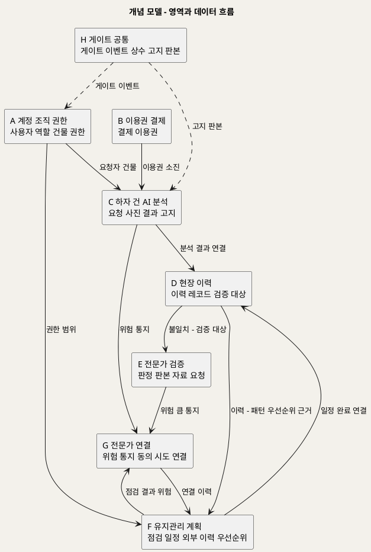

**[「개념 모델 - 영역과 데이터 흐름」 PlantUML 뷰어로 열기](https://plantuml.sumzip.com/plantuml/svg/eNpllM9u2kAQxu_7FKP0TKSqtx6q8M_Qd8jFDZSiEFMBUa-m2UaoNQpSQTjIRI7aQFoRyQFCqURfyDt-h86uF2GU06Kdmd98882ao2bLbLTOz2qseVq1PpoN8wzemSenlUb93Cpl67V6A14Yr4yX-Uwio_nBLNU_Va0KvDdrzTJrVVu1MoSBJ770QPy-F901pADdNg4fwsUGRDfA8TLiAUTjnphwxhrlk5ZpVajqIA3hgqM_ALwNcNqGcOVEA-_Yws8zHP3Cmx4QJRr4ED4uxWyj4wdgNiGd5GSAelAFxSGcB-gTIz53AVWVSVZlIRq4sgnRIf0WxIojH1P3UR_nDyBFTLnkyTnChY9TW0GySUgOIpfjzZ1sJPw7qlYnCL-D__riu0cAGydjEI6NF20FyCUBeUCfi9k6DGydemxFTk-6QodYrIEkih8OxLIUIJ8EGICe1BYubTGZSUejUZd0-D3CkayNMvh6LVa2FkmoALmPHQ89roBGElhIKMJhQAYQzePR0IXo8ok6gbi6xrEL-M0TV1znKE4hySnSPI5c_tc1qXqiWrmV7Y2UMv-pfl20seNqh_XQilZkLAOp1BvIwuvEhvHSocWwrArlKBQvbrupWA7LqXBehTvShb8uPcy9ZWhEQdKT87H8s_v2ZhszdrHY4W1blanbGrFg6XWKJrqP-HLPdAj_bMLHQMNyKlvviatdxzMUdjB1oZksvXNFPQr9iOkT0SFZEn8sIOZ9asiKcHgYl-z5rO_T8v75athR2SrRP8R_QYAhuA==)** — 클릭 시 브라우저로 연결됩니다.

---

## 4. 전체 ERD

40개 엔티티의 PK 와 관계만 보인다. 컬럼 상세는 영역별 ERD 에 있다.

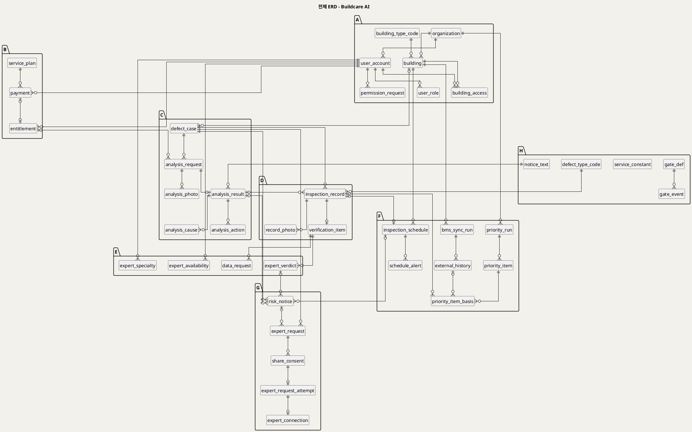

**[「전체 ERD - Buildcare AI」 PlantUML 뷰어로 열기](https://plantuml.sumzip.com/plantuml/svg/eNqNVkuS2yAQ3esUVLKeRSoXmH-SbS5AtVGPTQ0CBZATZTy7HCRnSOVYc4hg2UjNRzNZWTSPxwO6X_vSebB-6FSzky0yIa1QePrGrvcj67DboHWNe5S6Bwsd24B43Foz6PbGKGPZ-_uP9x_urgnC7aA136XesgdQDsmMkhr92CMz1u9M46VXyF5-_3r585fdfb1lF-x6kKoVYJFdfWmaPuwFW2Tvrt6xpwZ1WDCGtVvQ8id4aXSMDQ4tByGCLJ_ErAnnOQc2R-4gix8lcGHaYqZABkp0LoZ7tJ10LuzLLX4b0PnmedF4TTSGrfdSIO8VzBp7GDtc5E0_CqcQYbkhLC0-oPBcgJuVggY1OulmAXm83xlvKmg3qBIsYKhQg5iuloi6JaKkdj1OiMAqjG3jxGmUCtijlQ9STG_FpceOst4RVvwRLtfzI7UE5ccsDnuQCjZSyWIqbNFKMZ-tBQ-117mvH8GJHbbDkiNxzEEF8jkfOsfdqAW3g16292jDlfGddN7YWVZvpbHhg2Ln2HQFtSDfQLh6KvgTEWyle-Ta-JBS2emzNAilZ4-prR3NtATKwftjbWezYY3G4uE_ExFb8MhDSiZj3JONYtYf9_ewxE_KuQ9XlqX2UonPTUMLmx0OFxfmKS3sGmAuXYpMVk8WUNZ-QRA_8oloArUN_gdTcQ1qDzPsbA9VivPc-ZcdTAgfEgupLaPzy-nMNEe9hXzHpXWfOXFFigKTBwqykzfUYYfCrUjaVGRNkGxcwE4G9xbqbHiVayjNruAyK8AiEjkTn1xBHSrOWUTmZ06NcBWXWGM1X3ITfgWUOHJeOjWDrZz0lMVvgGMscmcOXVQttWo6WPRnvl1zlcTE6aAATE-TjKqQs7-vXEIdnCt9DVvJXdo0VrI26StJFtUQ1UcpYRUpWbMi6EiQt7NkOD990t2SUSybtV5XDWeLSAuMvS7uTHpd3rnWreISdRv-Wv8DCMdabA==)** — 클릭 시 브라우저로 연결됩니다.

---

## 5. A 계정·조직·권한

### 5-1 ERD

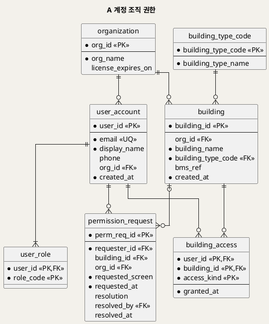

**[「A 계정 조직 권한」 PlantUML 뷰어로 열기](https://plantuml.sumzip.com/plantuml/svg/eNp9VD1vFDEQ7f0rrNBFXIFooyiAuCYNFNTWrD3Zs-K1F4-X5JJLgURJm44CKlokJH5UdPwHxvt1l90L1Y7nzbx5Mx7vGSWIqamcWFmDUtuoHQq6tL6GCJUsQF-WMTTevAkuRPls-XL54u3rvQhagQlX1pfyAhzt5zrrMa1rlCGmVRDJJofylXz4_WX7_V5uf_za_vwsH_58_Xv_TQj0jK_lUYgleHsDyQZ_JIE4uZS3QsrjbClr5MnJu_PTU_YsFqPbQ4V8cFajJ1R4XduIpIIXdyNzQxgVaM3NpJa5gZ64RQ4wYwXWsffD-9Z7LI2l2sF6KFevgs_fUdjyvA_UESGhUZCmAmJw2FWPB6o_HxlynNKB76RXteMpGusMD1zl4bYxLWGRdM84D5i19jik7WdeoKOdks4GNW9_jO0H9YSkPr6oSEW8eHpwYzLfHhJ1suC_45uq3SEdh-ItnV94GcHPqtcYK0vE-8gqPzZI3fbUw_1lPCOHNqhPGBQODT8S1zvnUxySjSIeC_qJk0VKPlJwTX4sw-ETQ8V6xzM626ZEfk6bzWIRbnn_90-F4PeQ7Q0jUeRtmiLZBlHs2TugjhkIg32G3vBf5R_L1Wm6)** — 클릭 시 브라우저로 연결됩니다.

### 5-2 엔티티 명세

| 엔티티 | 용도 | 핵심 컬럼 | 쓰기 주체 | 생애주기 |
|---|---|---|---|---|
| organization | B2B 고객사(관리회사·FM기업) | org_name · license_expires_on | 운영자 | 계약 ~ 해지 |
| user_account | 모든 사용자 | email(UQ) · display_name · phone · org_id | 사용자 · 운영자 | 가입 ~ 탈퇴 |
| user_role | 역할 5종 (UC_00 §4) | role_code ∈ general·facility·building·enterprise·expert | 운영자 | 부여 ~ 회수 |
| building_type_code | 건물 유형 코드 | 원천 등장 값만 적재(공동주택) | 운영자 | 기준 데이터 |
| building | 관리 대상 건물 | building_type_code(NOT NULL) · bms_ref | 운영자 · 기업 관리자 | 등록 ~ 해제 (등록 절차 미정) |
| building_access | 건물 단위 권한 (G0) | access_kind ∈ record(시설관리자)·manage(건물관리자) | 권한 부여자 | 부여 ~ 회수 |
| permission_request | G0 해제 액션 기록 | requested_screen · resolution · resolved_by | 요청자 · 처리자 | 요청 ~ 처리 |

### 5-3 핵심 컬럼 설계 판단

- **건물 유형은 레코드가 아니라 건물에 둔다.** BR-DEF-06 은 이력 레코드가 건물 유형을 "포함"하라고 한다. 같은 건물의 레코드마다 유형을 따로 적게 하면 한 건물이 레코드마다 다른 유형을 갖게 되고, P5·P6 집계가 갈라진다. 레코드는 `building_id` NOT NULL 로 유형을 포함하고, 유형 자체는 `building.building_type_code` NOT NULL 로 강제한다. SD_02 S3 의 건물 유형 드롭다운은 읽기 전용 표시가 되어야 한다(§19 상류 피드백).
- **기업 관리자의 권한은 행으로 저장하지 않는다.** 기업 관리자는 소속 기업의 모든 건물을 본다(UC8 사전조건 3). 건물마다 `building_access` 행을 만들면 건물 추가 때마다 누락 위험이 생긴다. `v_access_check` 가 `user_role = enterprise` 와 `building.org_id` 로 유도한다.
- **권한 요청의 수신자 컬럼은 두지 않는다.** 누가 권한을 부여하는지 상류에 없다(SD_01 §15-3). 처리한 사람(`resolved_by`)만 기록한다.

---

## 6. B 이용권·결제

### 6-1 ERD

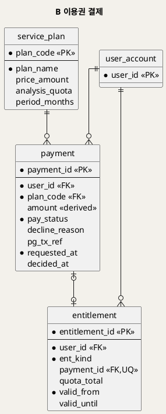

**[「B 이용권 결제」 PlantUML 뷰어로 열기](https://plantuml.sumzip.com/plantuml/svg/eNqNUrtOAzEQ7P0Vq9AhUiDaKIqCuCYNFNTWct4kVnz2xfYFTgl_wBcgkGjpEEJ8VJSPYO_B5ehozp7ZHc2s9yYhoo9FZsRSK4JU-9SQCCttc_SYwR2mq4V3hVWXzjgPJ8lFcn417XWEJSp3r-0C5mhCX2u0pVjmBM7HpRNRR0MwhcPr1-H5ff_9BPvPj8PbixBkuVbCoAjkJaYp28UBYIACYSsATqGuaAWj0fVsPBaPnYT5jU5J5gZtLQl5K6kYmToeqhUBDIfHisWMGOW-UmNWWTJEi6YMOsh14SJWdfLaKZk5G5eh55tjmVGbsnNsuF7OzvKYP2n4v_lasonBWLHrhtRvJ5aS1xSLwFBRWr2r9ITB2SrhQsYHhvO619O6oBBJSYxNN6-1Bsfs9Wmoy09t_h7_zxmqTl63qmL0h09mZ7c3dU_9jjLyx9SKDRqt5Ny7jGEDeGRtOJ7gbe92w6HbQi54jd39yJNg2vF1x9cJWcU_7g--Iuol)** — 클릭 시 브라우저로 연결됩니다.

### 6-2 엔티티 명세

| 엔티티 | 용도 | 핵심 컬럼 | 쓰기 주체 | 생애주기 |
|---|---|---|---|---|
| service_plan | 요금제 2종 (`[수익] 1단계`) | plan_code ∈ per_analysis·monthly · price_amount(NULL) | 운영자 | 기준 데이터 |
| payment | 결제 시도와 결과 (G1) | pay_status · decline_reason · amount(시점 고정) | 사용자 · 결제 수단 | 요청 → 승인·거절 (불변) |
| entitlement | 분석 이용 권한 | ent_kind ∈ free_trial·per_analysis·monthly · quota_total · valid_until | 서비스 | 부여 ~ 소진·만료 |

### 6-3 핵심 컬럼 설계 판단

- **잔여 횟수는 저장하지 않는다.** `remaining` 컬럼을 두고 분석마다 1씩 빼면, 분석 실패(G4) 후 재시도·동시 요청에서 값이 틀어진다. 잔여 = `quota_total` − (이 이용권을 쓴 요청 중 `analyzing`·`completed` 수). 실패한 요청은 소진하지 않는다(SD_01 §12 "분석 1회 완료 시 소진"). 분석 중인 요청을 소진에 넣은 이유는 동시에 두 요청이 마지막 1회를 쓰지 못하게 하기 위해서다.
- **무료 체험도 이용권 행이다.** 무료 체험·건별·구독을 한 테이블에 두어 G2 판정을 한 곳(`v_entitlement_balance`)으로 모았다. 무료 체험만 결제 없이 생긴다(`chk_ent_payment`). 무료 체험 횟수는 미정이므로 `service_constant.free_trial_count` 가 정해지기 전에는 무료 체험 이용권을 발급할 수 없다(`chk_ent_quota`).
- **결제 1건 = 이용권 최대 1건** (`uq_entitlement_payment`). 같은 결제로 이용권을 두 번 받는 것을 막는다.

---

## 7. C 하자 건·AI 분석

### 7-1 ERD

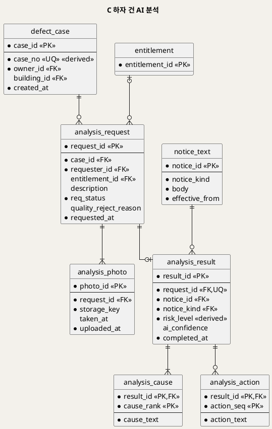

**[「C 하자 건 AI 분석」 PlantUML 뷰어로 열기](https://plantuml.sumzip.com/plantuml/svg/eNqNVMFuEzEQvfsrrHKrmgPqtYoKFZFQL3DgbE3sSWLWa29sb0vU9NYP4ILEBf4BCfFRUP6BsddJdtMEOK3nzdjvzfN4L0MEH9vasIVWyKX20iALlbYNeKj5FGQ196616soZ5_mzyfnk-auXvYqwAOVutZ3zGZjQ32u0xbhqkDsfF45FHQ3yK_770-fHrx_5z2_f-YvX_NePh8eHL4yhpfyKnyicoYxCQsATDoErye8Y56c8IUIrfnHx5no8Jmg02uHWEf7u7XhMH4Ve36DKNafc3Vr03b5Jt2_aaqNI7wCkczxCRCUgsvutGrBgVkEH4XHZYohZEvgiqYBHVQ0JSvWemsxksKbvAFcYpNdN1M5udgu6q9gGCpctGNJHqt4ns0h52JVlkmN9NAsXXddFU7rI0KEeBu1t2wjReZijqHBFcYQKbeJKqbYxDtRfPAyt6Syk5dbDBP4H_Vm63pywLmq5724BafiGputQCYM3aPYmA7SQzs5o6K3E7spc3Rg8bp2EtswkyIPiz3azlEqFB1sdGIyUivjhIAfIdOEdCfyDpKsVAZdPSEpqj6VYlNDMYGNh6Bs6PKjnao6nTq3yAmfpmZKbYuZd3SPpzXMmwcLxZM4z0T1j9MDX69HI3dG7YsjXbrOmZ5YSawqaTeDWyQ5GysueFKVh2lTKbZQOAXaJVtHf7Q8JeJJt)** — 클릭 시 브라우저로 연결됩니다.

### 7-2 엔티티 명세

| 엔티티 | 용도 | 핵심 컬럼 | 쓰기 주체 | 생애주기 |
|---|---|---|---|---|
| defect_case | 하자 건 — P2→P3→P4→P8 레일의 축 | case_no(UQ) · building_id(일반 사용자는 NULL) | 서비스 | 생성 후 불변 |
| analysis_request | 분석 요청과 상태 (G2·G3·G4) | req_status ∈ received·quality_rejected·analyzing·failed·completed · entitlement_id | 사용자 · 분석 서비스 | 접수 ~ 완료 |
| analysis_photo | 하자 사진 | storage_key · taken_at | 사용자 | 불변 |
| analysis_result | 분석 결과 + 고지 + 위험도 | notice_id(NOT NULL) · risk_level · ai_confidence | 분석 서비스 | 생성 후 불변 |
| analysis_cause | 가능한 원인(순위) | cause_rank · cause_text | 분석 서비스 | 불변 |
| analysis_action | 대응방안 | action_seq · action_text | 분석 서비스 | 불변 |

### 7-3 핵심 컬럼 설계 판단

- **고지는 판본 참조 + 복합 FK.** `analysis_result (notice_id, notice_kind)` → `notice_text (notice_id, notice_kind)` 이고 `notice_kind` 는 CHECK 로 `'analysis'` 고정이다. 고지 없는 결과(NOT NULL)도, 우선순위용 고지를 분석 결과에 잘못 붙이는 것(검증 T11)도 거부된다. 문구가 바뀌면 새 판본 행을 추가하고, 과거 결과는 당시 판본을 계속 가리킨다.
- **요청 상태는 저장한다.** 품질 부적합·AI 실패는 외부 판정 결과이므로 계산할 수 없다. 대신 상태 전이를 제약한다 — 이용권 없이 `analyzing` 불가(CHECK + 트리거), 사진 없이 `analyzing` 불가(BR-DEF-03 트리거), `analyzing` 이 아닌 요청에 결과 불가(G3·G4 트리거), 결과가 생기면 `completed` 로 자동 전이.
- **설명은 NULL 허용.** 설명 필수 여부가 미정이다(UC1 A2). 필수로 정해지면 `chk_req_description` 하나를 추가하면 된다.

---

## 8. D 현장 이력

### 8-1 ERD

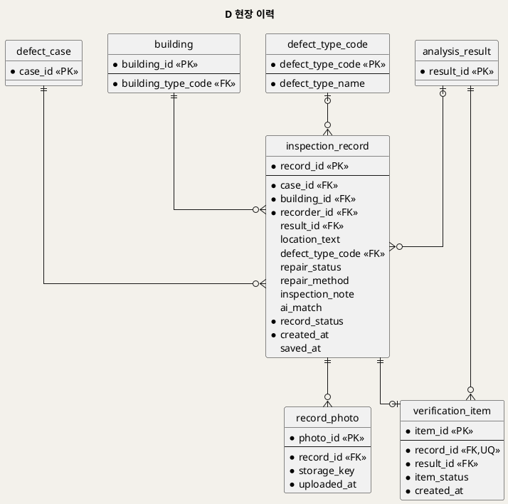

**[「D 현장 이력」 PlantUML 뷰어로 열기](https://plantuml.sumzip.com/plantuml/svg/eNqFVLGOEzEQ7f0Vo6NDpEC00ekEXBoaKKhXE3uSteK1V_ZsILpcx0fQgGjuD_grjn9gdu3bbHIr0c08z5uZ9-zdm8QYuWucqq0h0DZqRyrtrG8xYgNr1LttDJ0374ILEV6s3qxe376dVKQaTfhi_RY26NKU66wnPrQEIXIdFFt2BO_h7_dvjz8f4PHH7z-_HpQiLwcHuDK0Ic2VxkRXgAmMhjsF8BJ6pLIGlsuPH66v1f3IWHfWGRk8lK9L9RM4YQAsFudn_VaVDiJ4uVydN0WP7pBsqiKlzvHQW8LSPYOz21ifWhFggxeqDtFk6kjsobmlTvJWGb_UMMK5B8UzeLpRgVzQOOzB9JUlL84-E92TW7SxkjfAXTrlDcl9GcknmnxgEgRt1SDreipqpIuYSMhkKuznJtzn8GRSYbR14JD9aYtBAzTnz9S50YrEIeKWqh0dhrxrXUBzOW1P0W5sMcMyNcPIvS0je-T_E199_jT6_8zq0mTegfvLtz3eQH7gXPaYuZ_zhaYFHhuSzko-j-NxsQh3ENX6FPZP9RhKIhPGOI417VN8FCsyIZ9IdkPeyM_gH96OU3c=)** — 클릭 시 브라우저로 연결됩니다.

### 8-2 엔티티 명세

| 엔티티 | 용도 | 핵심 컬럼 | 쓰기 주체 | 생애주기 |
|---|---|---|---|---|
| inspection_record | 현장 점검·보수 이력 (BR-DEF-06) | location_text · defect_type_code · repair_status · ai_match · record_status ∈ draft·saved | 시설관리자 | draft → saved (되돌림 불가). saved 후 보수 결과 갱신 허용(UC3 A1) |
| record_photo | 현장 사진 | storage_key | 시설관리자 | 추가만 |
| verification_item | 검증 대상 (BR-DEF-07) | record_id(UQ) · item_status ∈ waiting·data_requested·verified | 트리거 · 전문가 | 불일치 저장 시 생성 ~ 판정 |

### 8-3 핵심 컬럼 설계 판단

- **필수 4항목은 "저장 상태일 때만" 필수다.** `chk_rec_required_on_save` — `record_status = 'draft'` 이거나 위치·하자 종류·보수 결과·일치 여부·저장 시각이 모두 있다. 임시 저장(UC3 E4)을 허용하면서 G5 를 DB 에서 막는다(검증 T13).
- **보수 결과 "미완료"는 명시값 `pending` 이다.** NULL 과 다르다(SD_02 U7). NULL 은 "아직 고르지 않음"이고 저장을 막는다.
- **레코드는 draft 로만 생성된다.** 사진은 레코드 id 가 있어야 붙으므로, 처음부터 saved 로 넣으면 사진 필수 조건(UC3 사후조건 2)을 검사할 수 없다(`trg_record_bi`, 검증 T12). saved 전환 시 사진 1장 이상(`trg_record_bu`, 검증 T14).
- **검증 대상은 트리거가 만든다.** 불일치로 저장되는 순간 생성되어야 하고(BR-DEF-07), 애플리케이션이 잊으면 신뢰도 데이터가 빠진다. `trg_record_au` 가 생성한다(검증 T15).
- **일치 여부와 결과 연결은 짝이 맞아야 한다.** 연결된 분석 결과가 없으면 `ai_match = 'none'`, 있으면 match·mismatch 만 가능(`chk_rec_match_link`).

---

## 9. E 전문가·검증

### 9-1 ERD

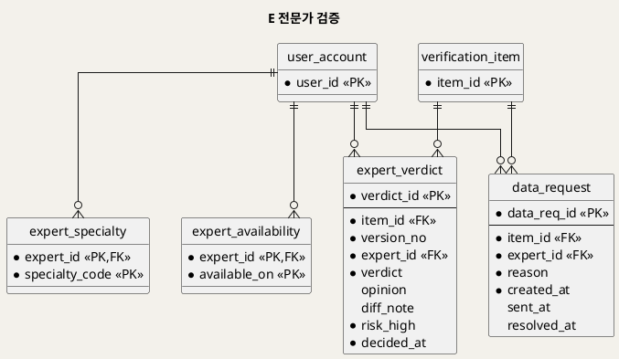

**[「E 전문가 검증」 PlantUML 뷰어로 열기](https://plantuml.sumzip.com/plantuml/svg/eNqNU7FOIzEQ7f0VI-jQpUC0CKFDpKHhD1aDPcmO4th7tnchIkgp-A0kKioKRMU3cXwEsxsnsg446GbmzXvzZmQfx4QhtXOrajYEmoO2pOKMXYMB53CBejYNvnXmxFsfYHd8MN4__V10xBqNv2Q3hQnaWHItO0qLhsCHVHuVOFmCU3i7v_37-PL6tILX59Xbw51S5ARbwE4bKVSotYxLO4ARWoRrBbAHA8IGDg_Pz46O1M2WQlcNhVTFhjSjTYuBRjHTMpqJv8Y9t69v2yvtZeuvVLFDtnjBljfC-I1wZliqvPso21HgCWtM7F3FieaDaMdZtK_8b0mhG9bry3SZk2sFDWA0-kdua0-6Yz_b-Q9blD29osS-YSfdEhmeTISUaOgIHGdVzdN6yIyc0pCpMBWODSasAv1pKa79mpANb5AfOv7UYiCMg6890BKn9XSAKOPXUaDobbdxpeQdLZejkb-Wp1EmqOT4OekKoCvqJhSAJMfkjPyXd-wFDdg=)** — 클릭 시 브라우저로 연결됩니다.

### 9-2 엔티티 명세

| 엔티티 | 용도 | 핵심 컬럼 | 쓰기 주체 | 생애주기 |
|---|---|---|---|---|
| expert_specialty | 전문 분야 (건축·구조·방수) | specialty_code | 운영자 (위촉 절차 미정) | 등록 ~ 해제 |
| expert_availability | 가능일 (S8A 후보) | available_on | 전문가 | 날짜별 |
| expert_verdict | 판정 판본 | version_no · verdict ∈ match·mismatch · diff_note · risk_high | 전문가 | 추가만 (판본 누적) |
| data_request | 판정 불가·추가 자료 요청 (G6) | reason · sent_at · resolved_at | 전문가 · 트리거 | 생성 → 보냄 → 해소 |

### 9-3 핵심 컬럼 설계 판단

- **판정은 덮어쓰지 않고 판본을 쌓는다.** `uq_verdict_version (item_id, version_no)` 이고 `version_no` 는 트리거가 부여한다. 현재 판정은 `v_current_verdict` 가 고른다. "누가 언제 무엇을 판정했는가"가 남는다(UC4 특별 요구사항 1).
- **판정 불가는 `expert_verdict` 에 들어갈 수 없다.** CHECK 가 match·mismatch 만 허용한다. 판정 불가는 `data_request` 행이고, 열린 요청이 있는 동안 판정 저장이 거부된다(G6, 검증 T17). 신뢰도 지표(`v_ai_trust_metric`)의 분모에 판정 불가가 섞이지 않는다.
- **G6 해제는 자동이다.** 보낸 요청이 있는 레코드에 현장 사진이 추가되면 `trg_rphoto_ai` 가 요청을 해소하고 항목을 대기로 되돌린다(검증 T18).
- **수신자 컬럼이 없다.** 수신자는 레코드 작성자로 유도한다(`v_data_request_inbox`). 이 규칙은 `[추론]` 이므로 바뀌면 뷰만 고친다.

---

## 10. F 유지관리 계획·외부 이력·우선순위

### 10-1 ERD

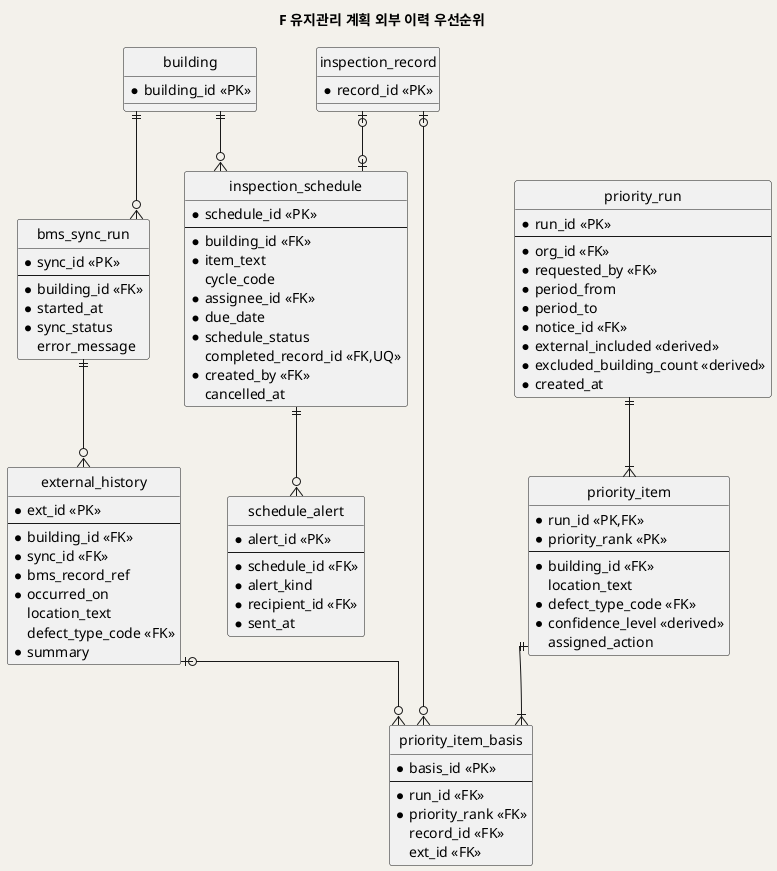

**[「F 유지관리 계획 외부 이력 우선순위」 PlantUML 뷰어로 열기](https://plantuml.sumzip.com/plantuml/svg/eNqVVb1uFDEQ7vcprNCdcgWijaIIxDVpoKC2vPbcnRWvvYy94VY5pCuuoOEBiA7pGqChQCKKeKZkeQe83l1nb3OB0M188-P5Zsb2iXUMXZGpZC4FEC6RK0jsmdQ5Q5aRlPGzGZpCixdGGSRPJs8mT18-73nYORPmndQzMmXK9mOV1ODKHIhBNzeJk04BmZBqs62-rW6uVrdfv5Obn-vflx9J9enX7fWKVJ-vbrdfSHX5o1pvqw-barNOEtA-siQHaSGV8OccEGZJSi4SQkakA6kU5Ojo1enxcfI-Rkhtc-BOGk0RuEERQrENbaB_BVo-B1EoCKG2De3AXjAh4_GeiiaNbUSkg4w6WDiv8dI3mXIjIJiYtXKmAQYRogAqmIPdE_28XGHrJCbLFTgQtE9kcnr45nWbgCOw2p6Wd2k50xyU8ihzPcIxPVOAruHKWrIB2sd0twux7sbfb4Ho2ixz6Q8auNka2ikizSy1peYUC92U0I0qoI_vddjphmKMjn0DRIM0A2vZDHqn-9EAaqboXFpnsAwVLNoCvPF_zo_lRqjm1s4JYRogw3mB6Ms02uvKcBYWrt0RAVO_gbS-P2FTdvIXWcaw7BWfozTopdi6PG55ofdVbnBYNMLbAuxwX0YkB59b0CmarK87EzRtnOTDDYitlJqrQkBtFD7sHET0aAw0dpD7N8bd8-tWeGdPItn6TjVs5X22h3cMYnOYPnvcDIfTGP11HtzoqX89_c2iCs5BDWi099uzCE_KQ0xoyqy0DZ_4vNXQvvlFog-ybA27j0OA4jJPmlcvSclyOR6bC2ITJEvjxaUXbURZzwMTfytbZZHkjby88CNI_BQ6Je0SBXnRk09AC__d_AHKvhwD)** — 클릭 시 브라우저로 연결됩니다.

### 10-2 엔티티 명세

| 엔티티 | 용도 | 핵심 컬럼 | 쓰기 주체 | 생애주기 |
|---|---|---|---|---|
| inspection_schedule | 정기점검 일정 (P7) | item_text · cycle_code(NULL) · assignee_id · due_date · schedule_status ∈ scheduled·completed·cancelled · completed_record_id | 건물관리자 | 예정 → 완료·취소 |
| schedule_alert | 배정·도래·지연 알림 발송 사실 (P0) | alert_kind ∈ assigned·due·overdue · recipient_id | 서비스 · P0 배치 | 추가만 |
| bms_sync_run | 건물관리시스템 연동 시도 | sync_status ∈ ok·failed · error_message | 연동 배치 | 추가만 |
| external_history | 외부 이력 (연동으로 적재) | bms_record_ref(건물 내 UQ) · occurred_on · location_text · summary | 연동 배치 | 적재 후 불변 |
| priority_run | 우선순위 산출 실행 스냅숏 (P6) | period · notice_id · external_included · excluded_building_count | 분석 서비스 | 불변 |
| priority_item | 순위 항목 | priority_rank · building_id · confidence_level · assigned_action | 분석 서비스 · 기업 관리자(조치) | 조치만 갱신 |
| priority_item_basis | 순위 항목의 근거 이력 (BR-DEF-12) | record_id 또는 ext_id 중 하나 | 분석 서비스 | 불변 |

### 10-3 핵심 컬럼 설계 판단

- **도래·지연은 컬럼이 아니다** (§2-2). 저장 상태는 예정·완료·취소 셋뿐이고, 완료는 같은 건물의 저장된 레코드를 연결해야만 가능하다(`chk_sched_completed` + `trg_schedule_bu`, 검증 T19·T20).
- **레코드 → 일정 FK 를 두지 않았다.** 일정 → 레코드(`completed_record_id`) 한 방향만 둔다. 양방향이면 순환 FK 가 되어 생성 순서가 꼬이고, 같은 사실이 두 곳에 기록된다(SD_01 P7 설계 주의 "같은 사실이 두 곳에 쌓인다").
- **외부 이력은 적재한다.** UC5 Sequence 는 조회 때마다 외부 이력을 요청하지만, 그러면 반복 하자·우선순위 뷰가 외부 데이터를 볼 수 없다. 연동 결과를 `external_history` 에 적재하고 시도마다 `bms_sync_run` 을 남겨, "외부 이력 미반영"(C7)을 최근 시도 결과로 유도한다. 연동 방식·주기는 미정이다(§19).
- **우선순위는 스냅숏이다.** 산식이 분석 서비스에 있고(미정) 외부 데이터를 포함하므로 DB 에서 다시 계산할 수 없다. 대신 항목마다 근거 이력(`priority_item_basis`)을 남겨 "왜 1순위인가"를 역추적할 수 있게 했다(§13 경로 1).

---

## 11. G 위험 통지·전문가 연결

### 11-1 ERD

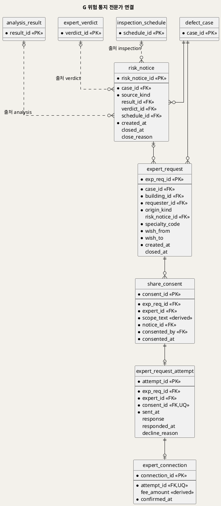

**[「G 위험 통지 전문가 연결」 PlantUML 뷰어로 열기](https://plantuml.sumzip.com/plantuml/svg/eNqlVD1vFDEQ7f0rRqFDXCREh6IoAnEUaaCgXvnsuTvrvPZiey855ZAoIv5CUqSgo6E4RSLiN4XLf2D27P26LAiJzn4zz573PJ4TH7gLZa7ZXEkEoZzQyPxCmYI7nsOEi8XM2dLI11ZbB0_GL8bP37zqZPg5l_ZMmRlMufZdrlYGw6pAsC7MLQsqaIS3sL25fLi6hocvP7bfPsP26-Wv7z_vN7S62tzfbhhDQ5krOJA4RREywT0eAPcgBVwwgKdQIZmScHT07vT4mH1qGNxwvfLKZw59qcOORctEi-AgEc8LdCFbopNKRN4ysRI2SFPGF1SisibzYo6y1LHS-sYaHCQ75ReZsUGJSHKmrrMNdIgAo9Ge-nHE6R5bOkom4yXtuzpTSk9EwvrFNWcJhzygzHigrdDW99bkLPfWPLbO4ccSfbQOXVJCsSrwjyompdKS-mgPTiej28OtUzNlGtH7prXm0BMprsMqE1biDjpTfp5Nnc3bXbB_U9_KpW53SCcZT0h87KYtIziktmdEU1mybq9cYQvMAp4HQiU6tUSZQoPy0q1U52Q1jPfq7z8XxQLmRRQSko6E_aeOnhvj02cf3tcCK3TnLzVqUWU1S1k7L1FUw-OP3UaHm_jxYsN1niDhQ9X3hLUlTREzntOIe-w4nTdVLq9NZDSC1uvRyF7Qb2XVZFnbw8PdDl7C9u5me3sN9RBiy6Fo-olskNrOk85N6BjlrG29od-VIl4wn9LWEFiolyjYCRpJQ_03juzwOQ==)** — 클릭 시 브라우저로 연결됩니다.

### 11-2 엔티티 명세

| 엔티티 | 용도 | 핵심 컬럼 | 쓰기 주체 | 생애주기 |
|---|---|---|---|---|
| risk_notice | 위험 통지 인계물 (SD_01 §12) | source_kind + 출처 FK 정확히 하나 · closed_at · close_reason | 트리거(분석·판정) · 서비스(점검) | 생성 → 연결 확정·종료 |
| expert_request | 전문가 점검 요청 (S8A) | origin_kind · risk_notice_id · specialty_code · wish_from·to | 건물관리자 | 작성 ~ 연결·종료 |
| share_consent | 공유 동의 (G9) | expert_id · scope_text(고정) · notice_id(share) | 건물관리자 | 불변 |
| expert_request_attempt | 전문가 1명에게 보낸 요청 (G10) | consent_id(NOT NULL, UQ) · response · responded_at | 서비스 · 전문가 | 보냄 → 수락·거절·무응답 |
| expert_connection | 연결 확정과 수수료 (BR-DEF-09) | attempt_id(UQ) · fee_amount | 서비스 | 불변 |

### 11-3 핵심 컬럼 설계 판단

- **위험 통지의 출처는 다형 참조 대신 배타 FK 세 개다.** `result_id` · `verdict_id` · `schedule_id` 중 `source_kind` 에 맞는 하나만 값을 가진다(`chk_risk_source`, 검증 T24). FK 를 걸 수 있으므로 고아 행 점검 쿼리가 필요 없다.
- **동의 없이는 시도가 생기지 않는다.** `expert_request_attempt.consent_id` NOT NULL + `(consent_id, exp_req_id, expert_id)` 복합 FK. 다른 전문가에게 준 동의로 요청을 보낼 수 없다(G9, 검증 T21). 동의 1건 = 시도 1건(UQ).
- **연결은 수락된 시도에만 생기고, 수수료는 연결에만 있다.** `trg_connection_bi` 가 수락 여부를 확인한다(G10, 검증 T22). 거절·무응답 시도에는 수수료 컬럼 자체가 없다.
- **연결이 확정되면 위험 통지가 닫힌다** (`trg_connection_ai`, 검증 T23). 통지가 계속 열려 있으면 C5 권고가 이미 연결된 건에 계속 뜬다.
- **점검 결과 위험(UC6 E3)의 판단 근거 컬럼이 없다.** 이력 레코드에 위험도 컬럼이 없고, 무엇이 "점검 결과 위험"인지 상류에 없다. 서비스가 `source_kind = 'inspection'` 통지를 만들 수 있는 구조만 두고, 판단 기준은 §19 로 넘겼다.

---

## 12. H 게이트·공통

### 12-1 ERD

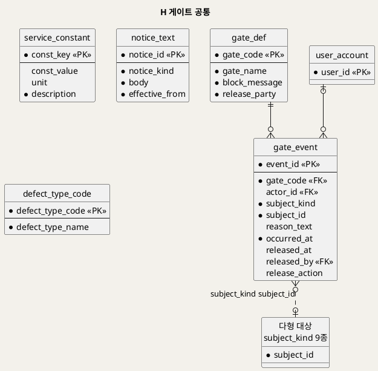

**[「H 게이트 공통」 PlantUML 뷰어로 열기](https://plantuml.sumzip.com/plantuml/svg/eNptU8Fq3DAQvesrRHoLbCD0lBJCaMlS6KUfEDCyNPaqtjWLJG9isgstpT20uRZ66aX0C9oG-k3J7j90LGlr7zbHeU-a9-ZpdO68sL5tajbTCrjUVtbAXKXNXFjR8FzIqrTYGvUCa7T8yfTp9Pji-eiEmwmFV9qUvBC1G9-ttQHfzYGj9TNkXvsa-Et-__N2_e335tMffv_rbvPxjjEwxHX8oBQeMgXFAReOl4rfMM4PeUAlkrvT09evzs4InEwGxogGQpXXKKusAedEGRELNQgHGdnxHVvt6sCCyqgESSlAmVaPCyUL08gI6dHGswk55K7N34D0GSWgdgDdl5a8oMk8XPtAopSttaAy4QMbvO5XeTcIbMchaY1mNI8Du9Cyd2joOdNUVRoqgFkF3d5UEV-Iuu3Dao2OrhQ4afV8T8Gg7wV676G58al7Ih7JLDH_sshRdTHloqBM9AKywmIzEqGX78PqVyaEHZTUVmmf_U9wfCAsxdC5pYQoNkl7HP23InUNzOB-uPLw-cfm6xf-cPt2_f7dpRk_LT9Zf_8Q2vRoajR66hVjtLzL5WSCN7RcjMSWuC1o2VZ4dITLePnZztKMu5yDUfQv_wIIejem)** — 클릭 시 브라우저로 연결됩니다.

### 12-2 엔티티 명세

| 엔티티 | 용도 | 핵심 컬럼 | 쓰기 주체 | 생애주기 |
|---|---|---|---|---|
| gate_def | 게이트 11개 정의 | block_message(화면 공통 문구) · release_party | 운영자 | 기준 데이터 |
| gate_event | 게이트 발생·해제 이력 (1급 엔티티) | subject_kind·subject_id · reason_text · released_at · release_action | 서비스 | 발생 → 해제 |
| service_constant | 미정 임계값·기준 7개 | const_value(전부 NULL) | 운영자 | 결정 시 값 입력 |
| notice_text | 고지 문구 판본 | notice_kind ∈ analysis·priority·share · body | 운영자 | 판본 추가만 |
| defect_type_code | 하자 종류 코드 | 균열·누수·결로 (원천 등장 값) | 운영자 | 기준 데이터 |

### 12-3 핵심 컬럼 설계 판단

- **게이트 문구는 한 곳에만 있다.** SD_02 §12 규칙 ④ "두 화면에 걸치는 게이트는 문구를 동일하게"를 화면 코드가 아니라 `gate_def.block_message` 한 행으로 보장한다.
- **`gate_event.subject` 는 다형 참조다.** 게이트는 사용자·건물·결제·요청·레코드·검증 대상·전문가 요청·시도 등 9종 대상에 걸리므로 FK 를 걸 수 없다. CHECK 로 종류를 9개로 제한하고, 고아 행은 §16-3 주기 점검 쿼리로 찾는다.
- **게이트 이벤트는 판정이 아니라 기록이다.** 판정은 각 게이트의 단일 지점(§14)에서 하고, 서비스는 판정 결과가 차단일 때 이벤트를 남긴다. 이벤트를 판정 근거로 다시 쓰는 곳은 레일(`v_case_progress`)의 차단 표시 하나뿐이다.

---

## 13. 근거 역추적 구현

"화면의 이 값이 어디서 왔는가"를 네 경로로 설계했다. 각 SQL 은 검증 DB 에서 실행해 결과 행을 확인했다(§18 T28 등). §16-3 점검 쿼리 3개도 같은 DB 에서 0행을 반환했다.

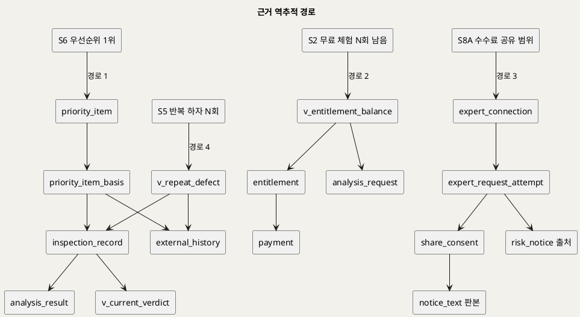

**[「근거 역추적 경로」 PlantUML 뷰어로 열기](https://plantuml.sumzip.com/plantuml/svg/eNp1lL9vGjEUx3f_FVY6Z4A0EepQJZCL1AURQBHbydw5xOLwXW2TlrFVhgwMGVIFRaSi6tKhlSgkaYf2H-LM_9B3NoSz1Ein8_vx8VfPz0_el4oI1e9FSHYZT4ggPdwmQbcj4j4PK3EUC_ziaOeo4JVzhDwjYfyO8Q4-JZGkSDEVUbz49Wfxc4r1zQ_9eK0nH_Bi9jf9MkZI0EAR3gFkq7GH9e1UX0z05ViPL3ABfluYSNzYc7AiTr_fp1-HWM_ulzcjXF3eDnH68Zu-G1q86OClA6wvR_BlWxbzBz2e4HR2_SRecuhdnE5H6fwBLz-N9OcrI265XafYRLBYMDXwmaI9A9TePJv320QyaalynmJcJuCxmPsQjUVomHoeIZxEA9gNgOxHygAHDnHuB30hKFf-ORUhCyxzkkfoe0UFCPlnTKpYDAzRckVAILuqXibUJhHhATWY51Sco2zWOTQZPCVqzxzibZ9KSxy7FSZUKD-IObcNseqV_zArDZ8oaG1itZp5DkZQ0ExKrotpODo8ViygvoKu4OXwKp3_NlDVERFMdn1LYv041rORvZuq2zVBE0qUH9JTump8_RAhGOXt7dcwEvjVatJxAYFngmVUKxurvjZaqG5WuFdrnCCY8szwyhuFIvIs7iHPKq0Dx6hRspnKBt9B4GXBJmqaFZrQsJHqOgSngYk31uFm50sEni1wZbTQPuUhPAX_AInXfNE=)** — 클릭 시 브라우저로 연결됩니다.

**경로 1 — S6 우선순위 항목 → 근거 이력 → AI 결과·전문가 판정** (BR-DEF-12)

```sql
SELECT pi.run_id, pi.priority_rank, b.building_name, pi.defect_type_code, pi.confidence_level,
       pib.record_id, r.location_text, r.saved_at, r.repair_status,
       ar.result_id, ar.risk_level, cv.verdict, cv.diff_note,
       x.ext_id, x.occurred_on, x.summary
FROM priority_item pi
JOIN building b               ON b.building_id = pi.building_id
JOIN priority_item_basis pib  ON pib.run_id = pi.run_id AND pib.priority_rank = pi.priority_rank
LEFT JOIN inspection_record r ON r.record_id = pib.record_id
LEFT JOIN analysis_result ar  ON ar.result_id = r.result_id
LEFT JOIN verification_item i ON i.record_id = r.record_id
LEFT JOIN v_current_verdict cv ON cv.item_id = i.item_id
LEFT JOIN external_history x  ON x.ext_id = pib.ext_id
WHERE pi.run_id = 1 AND pi.priority_rank = 1;
```

**경로 2 — S2 "무료 체험 N회 남음" → 이용권 → 결제 → 소진한 요청** (BR-DEF-05)

```sql
SELECT b.entitlement_id, b.ent_kind, b.quota_total, b.used_count, b.remaining,
       p.payment_id, p.pay_status, p.amount, p.decided_at,
       q.request_id, q.req_status, q.requested_at
FROM v_entitlement_balance b
JOIN entitlement e           ON e.entitlement_id = b.entitlement_id
LEFT JOIN payment p          ON p.payment_id = e.payment_id
LEFT JOIN analysis_request q ON q.entitlement_id = e.entitlement_id
                            AND q.req_status IN ('analyzing','completed')
WHERE b.user_id = 2;
```

**경로 3 — S8A 연결 수수료·공유 범위 → 시도 → 동의 → 고지 판본 → 위험 통지 출처** (BR-DEF-09 · BR-DEF-11)

```sql
SELECT ec.connection_id, ec.fee_amount, ec.confirmed_at,
       t.expert_id, t.responded_at,
       sc.scope_text, sc.consented_at, nt.body AS notice_at_consent,
       er.origin_kind, rn.source_kind, rn.result_id, rn.verdict_id, rn.schedule_id, rn.close_reason
FROM expert_connection ec
JOIN expert_request_attempt t ON t.attempt_id = ec.attempt_id
JOIN share_consent sc         ON sc.consent_id = t.consent_id
JOIN notice_text nt           ON nt.notice_id = sc.notice_id
JOIN expert_request er        ON er.exp_req_id = t.exp_req_id
LEFT JOIN risk_notice rn      ON rn.risk_notice_id = er.risk_notice_id
WHERE ec.connection_id = 1;
```

**경로 4 — S5 반복 하자 재발 횟수 → 원본 행** (BR-DEF-12)

```sql
SELECT 'field_record' AS source, r.record_id AS source_id, r.saved_at AS occurred_at, r.recorder_id
FROM inspection_record r
WHERE r.building_id = 1 AND r.location_text = '3층 북측 외벽'
  AND r.defect_type_code = 'crack' AND r.record_status = 'saved'
UNION ALL
SELECT 'external', x.ext_id, x.occurred_on, NULL
FROM external_history x
WHERE x.building_id = 1 AND x.location_text = '3층 북측 외벽' AND x.defect_type_code = 'crack';
```

---

## 14. 게이트의 데이터 표현

SD_01 게이트 전건이다. **판정은 단일 지점**에서만 하고, 차단은 DB 가 거부하는 형태로 구현했다. 해제는 상태 변화로 기록되며, 서비스는 차단·해제 시 `gate_event` 를 남긴다.

| 게이트 | 판정 근거 데이터 | 판정 단일 지점 | 차단 구현 | 해제 기록 | 검증 |
|:--:|---|---|---|---|:--:|
| G0 | `user_role` · `building_access` · `building.org_id` | 뷰 `v_access_check` | 애플리케이션 — 모든 API 가 이 뷰로 판정 후 403 (MariaDB 에 행 수준 보안 없음) | `permission_request.resolution` · `building_access` 행 추가 · `gate_event.released_at` | V6 |
| G1 | `payment.pay_status` · `decline_reason` | 트리거 `trg_entitlement_bi` | 승인되지 않은 결제로 이용권 INSERT 거부 · 거절 사유 CHECK | 새 `payment` 승인 행 | T02 · T03 |
| G2 | `entitlement` · `analysis_request` 소진 수 | 뷰 `v_entitlement_balance` (`v_analysis_eligibility`·트리거 공용) | `chk_req_entitlement` + `trg_request_bu` 가 analyzing 전이 거부 | 새 `entitlement` 행 | T06 · T08 |
| G3 | `analysis_request.req_status = 'quality_rejected'` · `quality_reject_reason` | 분석 서비스 품질 판정(기준 미정) → 상태 기록 | 사유 CHECK + `trg_result_bi` 가 결과 INSERT 거부 | 재업로드 후 `req_status` 재전이 | T09 · T10 |
| G4 | `analysis_request.req_status = 'failed'` | AI 응답 수신부 → 상태 기록 | `trg_result_bi` (analyzing 아닌 요청에 결과 불가) | failed → analyzing 재전이(G2 재판정) | T10 |
| G5 | `inspection_record` 필수 4컬럼 | CHECK `chk_rec_required_on_save` | DB CHECK — 저장 전이 거부 | `record_status = 'saved'` | T13 |
| G6 | `data_request.resolved_at IS NULL` | `data_request` 열린 행 존재 | `trg_verdict_bi` 가 판정 INSERT 거부 | `data_request.resolved_at` (사진 추가 시 `trg_rphoto_ai` 자동) | T17 · T18 |
| G7 | 이력 수 · `pattern_min_records` | 뷰 `v_pattern_gate` | 뷰가 `passed = 0` — 애플리케이션이 패턴·후속 버튼 비노출 (조회 차단이므로 DB 거부 대상 없음) | 이력 축적 (상태 변화로 자동) | V3 |
| G8 | `expert_specialty` · `expert_availability` 조건 일치 수 | 애플리케이션 후보 질의 | 후보 0건이면 시도 생성 불가 (시도는 특정 `expert_id` 와 동의를 요구) | 조건 변경 후 재검색 · `gate_event.released_at` | — (동의·FK 로 간접) |
| G9 | `share_consent` 행 | FK `fk_attempt_consent` | `consent_id` NOT NULL + 복합 FK 로 시도 INSERT 거부 | `share_consent` 행 추가 | T21 · T27 |
| G10 | `expert_request_attempt.response` | 트리거 `trg_connection_bi` | 수락 아닌 시도의 연결 INSERT 거부 | `response = 'accepted'` → `expert_connection` | T22 · T23 |

**G7·G8 은 DB 거부가 아니다.** G7 은 출력을 막는 게이트이고(SD_01 §13), 막을 쓰기 연산이 없다. 판정은 뷰 하나로 고정해 화면이 다른 기준을 쓰지 못하게 했다. G8 은 후보가 없을 때 동의·시도를 만들 대상 자체가 없으므로 G9 의 구조로 간접 보장된다. 둘 다 `gate_event` 로 발생을 기록한다.

---

## 15. IPO·UI 대 테이블 사상

### 15-1 IPO 단계 → 테이블

| IPO | 산출(Output) | 쓰기 테이블 | 읽기 |
|:--:|---|---|---|
| 0.1~0.3 | 감시 목록 · 도래·지연 알림 | `schedule_alert` | `v_schedule_status` |
| 1.1 | 식별된 사용자 | `gate_event`(G0) | `v_access_check` |
| 1.2~1.3 | 요금제 · 결제 대상 | — | `service_plan` · `v_entitlement_balance` |
| 1.4 | 승인·거절 | `payment` | |
| 1.5 | 분석 이용권 | `entitlement` | `payment` |
| 2.1 | 접수 사진 | `defect_case` · `analysis_request` · `analysis_photo` | `v_analysis_eligibility` |
| 2.2 | 분석 요청 | `analysis_request.description` | |
| 2.3 | 품질 판정 | `analysis_request.req_status` · `quality_reject_reason` | |
| 2.4 | AI 응답 | `analysis_request.req_status` · `analysis_result.ai_confidence` | `v_entitlement_balance` |
| 2.5 | 분석 결과 | `analysis_result` · `analysis_cause` · `analysis_action` | `notice_text` |
| 2.6 | 전문가 점검 권고 | `analysis_result.risk_level` · `risk_notice` | |
| 3.1 | 건물 이력 요약 | — | `v_access_check` · `v_building_history` |
| 3.2~3.5 | 기록 초안 · 사진 참조 · 일치 여부 | `inspection_record`(draft) · `record_photo` | `analysis_result` |
| 3.6 | 이력 레코드 · 검증 대상 | `inspection_record`(saved) · `verification_item` | |
| 4.1~4.2 | 검증 대기 목록 · 검토 화면 | — | `v_verification_queue` |
| 4.3 | 판정 · 판정 불가 | `data_request` | |
| 4.4~4.5 | 전문가 판정 · 신뢰도 · 위험 통지 | `expert_verdict` · `verification_item` · `risk_notice` | `v_ai_trust_metric` |
| 5.1~5.4 | 통합 이력 · 상세 | `bms_sync_run` · `external_history` (연동 배치) | `v_building_history` · `v_building_sync_state` |
| 5.5 | 반복 하자 패턴 | — | `v_repeat_defect` · `v_pattern_gate` |
| 5.6 | 조치 진입 | — (S7A·S8A 로 이동) | |
| 6.1~6.3 | 관리 건물 요약 · 집계 · 반복 하자 현황 | — | `v_access_check` · Q-S6 |
| 6.4 | 우선순위 목록 | `priority_run` · `priority_item` · `priority_item_basis` | |
| 6.5 | 조치 지정 | `priority_item.assigned_action` | |
| 7.1~7.3 | 일정 · 배정 통지 | `inspection_schedule` · `schedule_alert`(assigned) | `v_schedule_status` |
| 7.4 | 완료 일정 | `inspection_schedule.completed_record_id` · `schedule_status` | `inspection_record` |
| 7.5 | 전문가 연결 권고 | `risk_notice`(inspection) | |
| 8.1~8.2 | 하자 건 요약 · 후보 | `expert_request` | `expert_specialty` · `expert_availability` |
| 8.3~8.4 | 고지 · 연결 요청 | `share_consent` · `expert_request_attempt` | `notice_text` |
| 8.5 | 전문가 연결 | `expert_request_attempt.response` · `expert_connection` · `risk_notice.closed_at` | |

### 15-2 UI 컴포넌트 → 테이블

| 컴포넌트 | 읽기 | 쓰기 |
|---|---|---|
| C1 진행 레일 | `v_case_progress` · `v_building_rail` · `v_schedule_status` · `v_data_request_inbox` | — |
| C2 게이트 차단 블록 | `gate_def` · 게이트별 사유 컬럼 · `gate_event` | `gate_event` · `permission_request` · `data_request.sent_at` |
| C3 비활성 버튼 | `gate_def.block_message` | — |
| C4 1차 참고용 고지 | `notice_text` (결과·스냅숏·동의가 가리키는 판본) | — |
| C5 위험 권고 | `analysis_result.risk_level` · `risk_notice` | `expert_request.risk_notice_id` |
| C6 하자 건 요약 | `defect_case` · `analysis_cause` · `inspection_record` · `record_photo` · `v_current_verdict` | — |
| C7 데이터 출처 표시줄 | `v_building_sync_state` · `priority_run.external_included` · `excluded_building_count` · `priority_item.confidence_level` | — |
| C8 건물 선택기 | `v_access_check` · `building` | — |

### 15-3 UC 사후조건 → 컬럼 변화

| UC | 사후조건 | 테이블·컬럼 변화 |
|:--:|---|---|
| UC1 | (1) 원인·대응방안 표시 | `analysis_result` 행 + `analysis_cause` · `analysis_action` 행 |
| UC1 | (2) 1차 참고용 표시 | `analysis_result.notice_id` (NOT NULL) |
| UC1 | (3) 위험 시 권고 | `analysis_result.risk_level` ∈ caution·danger → `risk_notice` 행 (트리거) |
| UC1 | (4) 사진·설명·결과 저장 | `analysis_photo` · `analysis_request.description` · `analysis_result` |
| UC2 | (1) 결제 승인 | `payment.pay_status = 'approved'` · `decided_at` |
| UC2 | (2) 이용 권한 부여 | `entitlement` 행 (승인 결제 FK) |
| UC2 | (3) UC1 수행 가능 | `v_analysis_eligibility.eligible = 1` (유도) |
| UC3 | (1) 필수 항목 포함 레코드 저장 | `inspection_record.record_status = 'saved'` + 필수 컬럼 · `building.building_type_code` |
| UC3 | (2) 현장 사진 저장 | `record_photo` 행 (저장 전이 조건) |
| UC3 | (3) 하자 유형별 분류 | `inspection_record.defect_type_code` (+ 인덱스 `ix_rec_building_type`) |
| UC3 | (4) 불일치 시 검증 대상 | `verification_item` 행 (트리거) |
| UC4 | (1) 판정·의견 기록 | `expert_verdict` 행 (`verdict` · `opinion` · `diff_note`) |
| UC4 | (2) 판정 데이터 축적 | `expert_verdict` 판본 누적 · `verification_item.item_status = 'verified'` |
| UC4 | (3) 신뢰도 지표 반영 | `v_ai_trust_metric` (유도) |
| UC5 | (1) 시간순 이력 표시 | `v_building_history` (유도) |
| UC5 | (2) 반복 하자 표시 | `v_repeat_defect` (유도) |
| UC5 | (3) 데이터 비변경 | 쓰기 없음 — 조회는 뷰만 사용 (`bms_sync_run`·`external_history` 는 연동 배치가 쓴다) |
| UC6 | (1) 일정 저장 | `inspection_schedule` 행 |
| UC6 | (2) 배정 통지 | `schedule_alert` (alert_kind = 'assigned') |
| UC6 | (3) 완료 처리 | `inspection_schedule.schedule_status = 'completed'` · `completed_record_id` |
| UC7 | (1) 연결 확정 | `expert_request_attempt.response = 'accepted'` → `expert_connection` 행 |
| UC7 | (2) 자료 공유 | `share_consent` 행 · `expert_request_attempt.sent_at` |
| UC7 | (3) 수수료 기록 | `expert_connection.fee_amount` |
| UC7 | (4) 연결 이력이 건물 이력에 | `v_building_history` 의 `expert_connection` 행 (유도) · `risk_notice.closed_at` |
| UC8 | (1) 반복 하자·우선순위 표시 | `priority_run` · `priority_item` 행 |
| UC8 | (2) 참고용·진단 책임 고지 | `priority_run.notice_id` (NOT NULL, kind = priority) |
| UC8 | (3) UC6·UC7 로 넘김 | `priority_item.assigned_action` → 새 `inspection_schedule` 또는 `expert_request` (origin_kind = 'priority') |

---

## 16. 무결성 제약과 인덱스

### 16-1 업무규칙 → 제약

| BR | 규칙 | 대응 제약 | 강제 위치 | 검증 |
|---|---|---|---|:--:|
| BR-DEF-01 | 결과·우선순위는 1차 참고용 표시 | `analysis_result.notice_id` NOT NULL + `fk_result_notice`(복합) + `chk_result_notice_kind` · `priority_run` 동일 | DB | T11 |
| BR-DEF-02 | 위험 시 전문가 점검 권고 | `trg_result_ai` · `trg_verdict_ai` 가 `risk_notice` 생성 · 점검 결과(UC6 E3)는 애플리케이션 | DB + 앱 | T07 · T18 |
| BR-DEF-03 | 분석 입력은 사진 + 설명 | `trg_request_bu` 사진 1장 이상. 설명은 필수 여부 미정 → 강제 안 함 | DB (사진) · 미정 (설명) | T05 |
| BR-DEF-04 | 부적합 사진은 분석 전 재업로드 | `chk_req_reject_reason` · `trg_result_bi`. 품질 판정 기준은 분석 서비스(미정) | DB + 서비스 | T09 · T10 |
| BR-DEF-05 | 무료 체험 후 유료·구독 | `chk_ent_payment` · `chk_ent_quota` · `chk_ent_period` · `chk_req_entitlement` · `trg_entitlement_bi` · `trg_request_bu` | DB | T01 · T03 · T06 · T08 |
| BR-DEF-06 | 이력 필수 4항목 | `chk_rec_required_on_save` · `building.building_type_code` NOT NULL | DB | T13 |
| BR-DEF-07 | 불일치는 검증 대상·신뢰도 데이터 | `trg_record_au` · `chk_verdict_diff` · `uq_item_record` | DB | T15 · T16 |
| BR-DEF-08 | 권한관리로 접근 제한 | `v_access_check` 단일 판정 · 마스킹 뷰. 행 수준 강제는 애플리케이션 | 앱 (판정 기준은 DB 뷰) | V6 |
| BR-DEF-09 | 연결 확정 시 수수료 | `fee_amount` 는 `expert_connection` 에만 · `trg_connection_bi` · `uq_connection_attempt` | DB | T22 · T23 |
| BR-DEF-10 | 기업 요금은 건물 수·사용자 수 기준 | **미구현** — 과금 단계가 상류에 없다(SD_01 §14-2). 산정 기준이 되는 건물·사용자 수는 `building.org_id` · `user_account.org_id` 로 집계 가능 | — (§19) | — |
| BR-DEF-11 | 진단 책임·공유 범위 고지 | `share_consent.notice_id` NOT NULL + 복합 FK · `scope_text` NOT NULL · `consent_id` NOT NULL | DB | T21 · T27 |
| BR-DEF-12 | 반복 하자·우선순위는 장기 이력 근거 | `v_repeat_defect` · `chk_basis_one`. 항목마다 근거 1건 이상은 **애플리케이션 책임** — 근거 행이 항목보다 나중에 들어가므로 행 단위 CHECK·트리거로 표현할 수 없다. 주기 점검 쿼리 Q-BASIS 로 확인 | DB + 앱 | T28 · T29 |

### 16-2 그 밖의 UNIQUE · CHECK

| 제약 | 의미 |
|---|---|
| `uq_case_no` | 건 번호 중복 불가 (검증 T25) |
| `uq_user_email` | 계정당 이메일 1개 |
| `uq_result_request` | 요청 1건 = 결과 최대 1건 |
| `uq_schedule_record` | 레코드 1건은 일정 하나의 완료 근거 |
| `uq_ext_ref` | 같은 건물의 외부 이력 중복 적재 방지 (연동 재실행 멱등) |
| `uq_attempt_consent` · `uq_connection_attempt` | 동의 1건 = 시도 1건 · 시도 1건 = 연결 최대 1건 |
| `chk_sched_completed` · `chk_sched_cancelled` | 상태와 근거 컬럼의 짝 (검증 T19) |
| `chk_permreq_resolved_pair` · `chk_attempt_responded` · `chk_risk_close` | 처리 결과와 처리 시각의 짝 |
| `trg_record_bu` (되돌림) | 저장된 레코드는 임시 상태로 돌아갈 수 없다 (검증 T26) |
| `trg_schedule_bu` | 완료 근거는 같은 건물의 저장된 레코드 (검증 T20) |

### 16-3 다형 참조 점검 · 주기 점검 쿼리

`gate_event (subject_kind, subject_id)` 는 FK 를 걸 수 없다. 아래 쿼리가 0행이어야 한다.

```sql
-- Q-ORPHAN: 대상이 사라진 게이트 이벤트
SELECT g.event_id, g.subject_kind, g.subject_id
FROM gate_event g
WHERE (g.subject_kind = 'user_account'           AND NOT EXISTS (SELECT 1 FROM user_account x WHERE x.user_id = g.subject_id))
   OR (g.subject_kind = 'building'               AND NOT EXISTS (SELECT 1 FROM building x WHERE x.building_id = g.subject_id))
   OR (g.subject_kind = 'organization'           AND NOT EXISTS (SELECT 1 FROM organization x WHERE x.org_id = g.subject_id))
   OR (g.subject_kind = 'payment'                AND NOT EXISTS (SELECT 1 FROM payment x WHERE x.payment_id = g.subject_id))
   OR (g.subject_kind = 'analysis_request'       AND NOT EXISTS (SELECT 1 FROM analysis_request x WHERE x.request_id = g.subject_id))
   OR (g.subject_kind = 'inspection_record'      AND NOT EXISTS (SELECT 1 FROM inspection_record x WHERE x.record_id = g.subject_id))
   OR (g.subject_kind = 'verification_item'      AND NOT EXISTS (SELECT 1 FROM verification_item x WHERE x.item_id = g.subject_id))
   OR (g.subject_kind = 'expert_request'         AND NOT EXISTS (SELECT 1 FROM expert_request x WHERE x.exp_req_id = g.subject_id))
   OR (g.subject_kind = 'expert_request_attempt' AND NOT EXISTS (SELECT 1 FROM expert_request_attempt x WHERE x.attempt_id = g.subject_id));

-- Q-BASIS: 근거 없는 우선순위 항목 (BR-DEF-12)
SELECT pi.run_id, pi.priority_rank
FROM priority_item pi
WHERE NOT EXISTS (SELECT 1 FROM priority_item_basis b
                   WHERE b.run_id = pi.run_id AND b.priority_rank = pi.priority_rank);

-- Q-MISMATCH: 불일치로 저장됐는데 검증 대상이 없는 레코드 (트리거 우회 탐지)
SELECT r.record_id
FROM inspection_record r
WHERE r.record_status = 'saved' AND r.ai_match = 'mismatch'
  AND NOT EXISTS (SELECT 1 FROM verification_item i WHERE i.record_id = r.record_id);
```

### 16-4 인덱스

| 인덱스 | 조회 경로 |
|---|---|
| `ix_case_building` · `ix_req_case` | 건물별 하자 건 · 레일 |
| `ix_req_ent_status` | 이용권 소진 수 (G2) |
| `ix_rec_building_type` | 건물·하자 종류별 이력 (S5 · 반복 하자 · 우선순위 근거) |
| `ix_rec_result` | 분석 결과 → 현장 기록 |
| `ix_item_status` · `ix_datareq_item_open` | 검증 대기 목록 · G6 판정 |
| `ix_sched_building_due` · `ix_sched_assignee` | S7A 일정 표 · S7B 배정 · P0 감시 |
| `ix_sync_building_time` · `ix_ext_building` | 최근 연동 결과 · 외부 이력 |
| `ix_risk_case_open` | 열린 위험 통지 (C5) |
| `ix_attempt_req` | 요청 상태 (S8A) |
| `ix_gevent_subject` | 열린 게이트 이벤트 (레일 차단 표시) |
| `ix_access_building` | 건물 → 권한자 |

### 16-5 애플리케이션 작성 규약 (실행 중 확인)

- **트리거가 갱신하는 테이블을 같은 문장에서 읽지 않는다.** MariaDB 는 `INSERT INTO data_request ... SELECT ... FROM verification_item` 처럼 트리거 대상 테이블을 읽는 문장을 ERROR 1442 로 거부한다. `item_id` 는 값으로 넘긴다(DDL 주석 [X1]). 같은 이유로 `trg_rphoto_ai` 는 `item_id` 를 변수로 먼저 읽도록 고쳤다(DDL 주석 [X2]).
- **판정은 뷰로만 한다.** G0 · G2 · G7 · 일정 상태 · 요청 상태를 애플리케이션 코드에서 다시 계산하지 않는다.

---

## 17. 보존·마스킹·감사

| 항목 | 저장 형태 | 조회 경로 | 근거 |
|---|---|---|---|
| 이메일 · 이름 · 전화 | 원문 저장 (`user_account`) | 화면은 `v_user_masked` 만 사용 — `***@***.kr` · `김**` · `010-****-1234` | SD_02 §13-2 · BR-DEF-08 |
| 전문가 이름 | 원문 저장 | 후보 목록은 마스킹. 연결 확정 후 공개 범위는 미정 | SD_02 §14-12 |
| 하자 사진 | 객체 저장소 키만 저장 (`storage_key`) | 권한 확인(`v_access_check`) 후 서명 URL 발급 — 애플리케이션 | `[핵심 장벽] 3단계` |
| 건물 위치 | `location_text` 원문 | 권한 범위 건물만 조회 | `[핵심 장벽] 3단계` 건물정보 보안 |

**외부 반출 감사** — 개인정보·건물정보가 외부(전문가)로 나가는 유일한 경로는 전문가 연결이다. 반출 1건은 `share_consent`(누가 · 언제 · 어떤 범위에 · 어떤 고지 판본으로 동의) + `expert_request_attempt`(누구에게 · 언제 보냈나)로 남는다. 별도 감사 테이블을 두지 않은 이유는 이 두 테이블이 이미 반출의 전 항목을 불변으로 기록하기 때문이다. 건물관리시스템 연동은 들어오는 방향이며 `bms_sync_run` 에 남는다.

**판정·기록의 변경 감사** — 판정은 판본 누적(`expert_verdict.version_no`), 저장된 레코드는 임시 상태로 되돌릴 수 없다. 저장 레코드의 보수 결과 갱신(UC3 A1) 이력은 현재 남지 않는다 — 진단 책임 범위에 따라 판본화가 필요한지 §19 에서 확인한다.

**보존** — 보존 기간은 원천에 없다. `service_constant.retention_days` 키만 두고 값은 비웠다. 값이 정해지기 전에는 어떤 데이터도 자동 삭제하지 않는다. 암호화 저장(at-rest) 요구 여부도 미정이다.

---

## 18. DDL 전문과 실행 검증

DDL 전문은 `Design/buildcare_ddl.sql` 이다 — 테이블 40 · 뷰 16 · 트리거 15 · 인덱스 15 · 기준 데이터 6종.

**생성 순서 (FK 위상 정렬)**: H 기준(`gate_def` · `service_constant` · `notice_text` · `defect_type_code` · `building_type_code`) → A → B → C → D → E → F → G → H `gate_event` → 인덱스 → 뷰 → 트리거 → 기준 데이터. `risk_notice` 는 `expert_verdict`(E)·`inspection_schedule`(F) 을 참조하므로 G 영역에서 만든다.

**DBMS 전용 구문** (DDL 머리 주석 [M1]~[M6])

| 표기 | 구문 | 이유 |
|---|---|---|
| M1 | `AUTO_INCREMENT` | MariaDB 는 `GENERATED AS IDENTITY` 미지원 |
| M2 | `CREATE TABLE/INDEX IF NOT EXISTS` | 멱등 실행 |
| M3 | `DELIMITER //` | 트리거 본문 구분 (클라이언트 지시어) |
| M4 | `SIGNAL SQLSTATE '45000'` | SQL/PSM 표준 — 트리거에서 위반 거부 |
| M5 | `DATE_ADD` · `SUBSTRING_INDEX` · `CAST AS SIGNED` | `v_schedule_status` · `v_user_masked` · `v_pattern_gate` |
| M6 | `CREATE OR REPLACE VIEW` | 멱등 실행 |

**실행 검증 3종** — MariaDB 12.0.2, 격리된 임시 인스턴스(로컬 소켓, 네트워크 차단)에서 실행했다.

| 검증 | 방법 | 결과 |
|---|---|---|
| ① 무오류 실행 | 빈 DB 에 `buildcare_ddl.sql` 적용 | 성공 — 테이블 40 · 뷰 16 · 트리거 15 · 게이트 11 · 고지 3 · 상수 7 |
| ② 재실행(멱등) | 같은 DB 에 한 번 더 적용 | 성공 — 오류 없음, 기준 데이터 중복 없음 |
| ③ 위반 거부 | `buildcare_ddl_verify.sql` (`mariadb --force`) | **29/29 통과** — 거부 기대 23건 모두 거부, 정상 기대 6건 모두 성공 |

| # | 시도 | 기대 | 결과 (거부 메시지) |
|:--:|---|:--:|---|
| T01 | 결제 없는 건별 이용권 | 거부 | `chk_ent_payment` |
| T02 | 사유 없는 결제 거절 | 거부 | `chk_pay_declined_reason` |
| T03 | 거절된 결제로 이용권 | 거부 | G1 트리거 |
| T04 | 승인된 결제로 이용권 | 성공 | — |
| T05 | 사진 없이 분석 시작 | 거부 | BR-DEF-03 트리거 |
| T06 | 이용권 없이 분석 시작 | 거부 | G2 트리거 |
| T07 | 무료 체험으로 분석 → 위험 결과 | 성공 | 요청 completed · 위험 통지 1건 자동 생성 |
| T08 | 소진된 무료 체험으로 재분석 | 거부 | G2 트리거 |
| T09 | 사유 없는 품질 부적합 | 거부 | `chk_req_reject_reason` |
| T10 | 품질 부적합 요청에 결과 | 거부 | G3/G4 트리거 |
| T11 | 우선순위 고지로 분석 결과 생성 | 거부 | `fk_result_notice` |
| T12 | 레코드를 saved 로 바로 생성 | 거부 | UC3 트리거 |
| T13 | 보수 결과 없이 저장 | 거부 | `chk_rec_required_on_save` |
| T14 | 현장 사진 없이 저장 | 거부 | UC3 E4 트리거 |
| T15 | 불일치로 저장 | 성공 | 검증 대상 자동 생성 (waiting) |
| T16 | 차이 내용 없는 불일치 판정 | 거부 | `chk_verdict_diff` |
| T17 | 자료 요청이 열린 채 판정 | 거부 | G6 트리거 |
| T18 | 사진 추가 → 판정(위험 큼) | 성공 | 요청 자동 해소 · 판본 1 · 위험 통지 생성 |
| T19 | 레코드 없이 일정 완료 | 거부 | `chk_sched_completed` |
| T20 | 다른 건물 레코드로 일정 완료 | 거부 | P7 트리거 |
| T21 | 다른 전문가의 동의로 요청 | 거부 | `fk_attempt_consent` |
| T22 | 거절된 시도에 연결 | 거부 | G10 트리거 |
| T23 | 수락된 시도에 연결 | 성공 | 연결 생성 · 위험 통지 closed(connected) |
| T24 | 출처 두 개인 위험 통지 | 거부 | `chk_risk_source` |
| T25 | 중복 건 번호 | 거부 | `uq_case_no` |
| T26 | 저장 레코드를 임시로 되돌림 | 거부 | UC3 트리거 |
| T27 | 분석 고지를 공유 동의에 사용 | 거부 | `chk_consent_notice_kind` |
| T28 | 근거 레코드를 가진 우선순위 항목 | 성공 | §13 경로 1 이 레코드 → AI 결과 → 현재 판정까지 1행 반환 |
| T29 | 레코드·외부 이력 어느 것도 없는 근거 행 | 거부 | `chk_basis_one` |

뷰 확인: 하자 건 레일이 4단계 모두 `done` 으로 전이 · 이용권 잔여 0 · G7 기준 미정 시 `passed = 0` · 마스킹 `***@***.kr` / `홍**` / `010-****-1234` · 기업 관리자가 소속 기업 건물 2개에 manage 권한으로 유도 · 요청 상태 `connected`.

**실행 중 이탈** — 처음 작성한 `trg_rphoto_ai` 는 `UPDATE data_request ... WHERE item_id IN (SELECT ... FROM verification_item)` 형태였고, 연쇄 트리거가 `verification_item` 을 갱신하면서 ERROR 1442 로 실패했다(T18). `item_id` 를 변수로 먼저 읽는 형태로 고쳤다. 논리 설계는 바뀌지 않았다.

---

## 19. 미해결·확인 필요

### 19-1 상류로 돌려보내는 항목

| # | 대상 문서 | 내용 |
|:--:|---|---|
| 1 | SD_02 S3 | 건물 유형 드롭다운 → **읽기 전용 표시**로 바꿔야 한다. 건물 유형은 건물의 속성이다(§5-3) |
| 2 | SD_01 P7 7.5 · UC6 E3 | "점검 결과 위험"을 판단할 데이터가 이력 레코드에 없다. 레코드에 위험도 항목을 둘지, 판단 주체가 누구인지 정해야 한다 |
| 3 | SD_01 §14-2 · UC8 | BR-DEF-10 기업 요금에 대응하는 프로세스 단계가 없어 제약으로 옮길 수 없다 |
| 4 | SD_02 §14-7 · UC3 기본흐름 5 | AI 결과와 현장 판정의 일치 판단 주체 — 현재 저장 값으로만 둔다 |

### 19-2 값이 비어 있는 상수 (`service_constant`)

| 키 | 의미 | 비어 있는 동안의 동작 |
|---|---|---|
| `free_trial_count` | 무료 체험 횟수 | 무료 체험 이용권을 발급할 수 없다 |
| `pattern_min_records` | G7 최소 이력 수 | G7 항상 미통과 — 반복 하자 미표시 |
| `due_soon_days` | 도래 판정 기준일 | 일정 상태에 'due' 가 나오지 않는다(예정 → 지연) |
| `expert_response_hours` | G10 무응답 시한 | 무응답(`no_response`) 자동 판정 없음 |
| `ai_low_confidence` | UC1 E3 신뢰도 낮음 기준 | 분석 서비스가 위험도를 정하는 기준 미정 |
| `expert_fee_rate` | 연결 수수료 요율 | `fee_amount` NULL 로 연결 확정 |
| `retention_days` | 보존 기간 | 자동 삭제 없음 |

### 19-3 그 밖의 확인 필요

| # | 항목 | 영향 |
|:--:|---|---|
| 1 | 요금(`service_plan.price_amount`) · 결제 수단(PG) 연동 키 형식 | `payment.amount` · `pg_tx_ref` |
| 2 | 권한 부여 주체 | `permission_request` 수신 · 처리 흐름 |
| 3 | 건물 유형 코드 목록 · 하자 종류 코드 추가분 | `building_type_code` · `defect_type_code` 적재 |
| 4 | 점검 주기 코드 목록 | `inspection_schedule.cycle_code` CHECK |
| 5 | 알림 수단 | `schedule_alert` 에 채널 컬럼 추가 여부 |
| 6 | 건물관리시스템 연동 방식·주기·외부 이력 항목 | `external_history` 컬럼 · `bms_sync_run` 주기 |
| 7 | 위치 표기 표준(자유 입력 vs 층·방향 코드) | `v_repeat_defect` 가 위치 문자열 일치로 묶는다 — 표기가 다르면 재발이 갈라진다 |
| 8 | 우선순위 산식 · 신뢰도 등급 기준 | `priority_item.confidence_level` 산출 |
| 9 | 기업 라이선스 검증 방식 | `organization.license_expires_on` 사용 여부 |
| 10 | 설명 입력 필수 여부 (UC1 A2) | `analysis_request.description` NOT NULL 여부 |
| 11 | 연결 확정 후 연락처 공개 범위 | 마스킹 해제 조건 |
| 12 | 저장 레코드의 보수 결과 갱신 이력 필요 여부 | `inspection_record` 판본화 여부 |
| 13 | 개인정보 암호화 저장 요구 | `user_account` 저장 형태 |
| 14 | 일반 사용자의 전문가 연결 허용 (UC7 A2) | `expert_request.building_id` NOT NULL 유지 여부 |

---

*Buildcare AI · SD_03 데이터베이스 설계서 · 입력 SD_02 · SD_01 · UC_01~UC_08 · 원천 `Intent-Specify.md` · DDL `buildcare_ddl.sql`*
