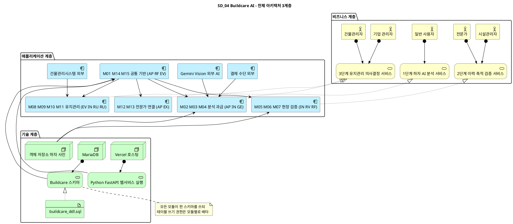
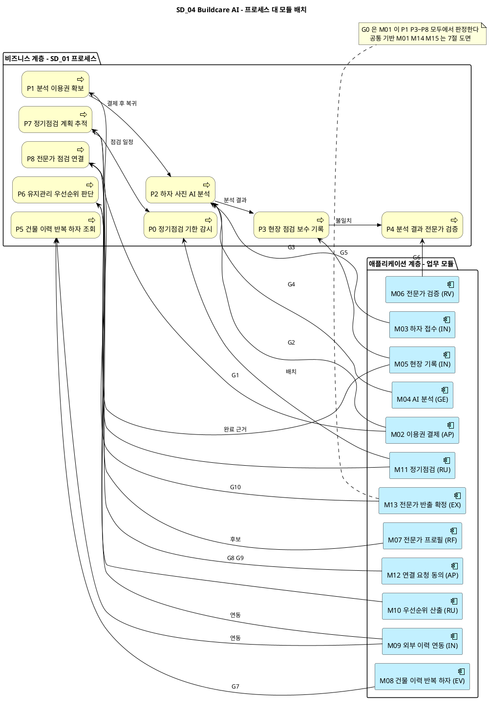
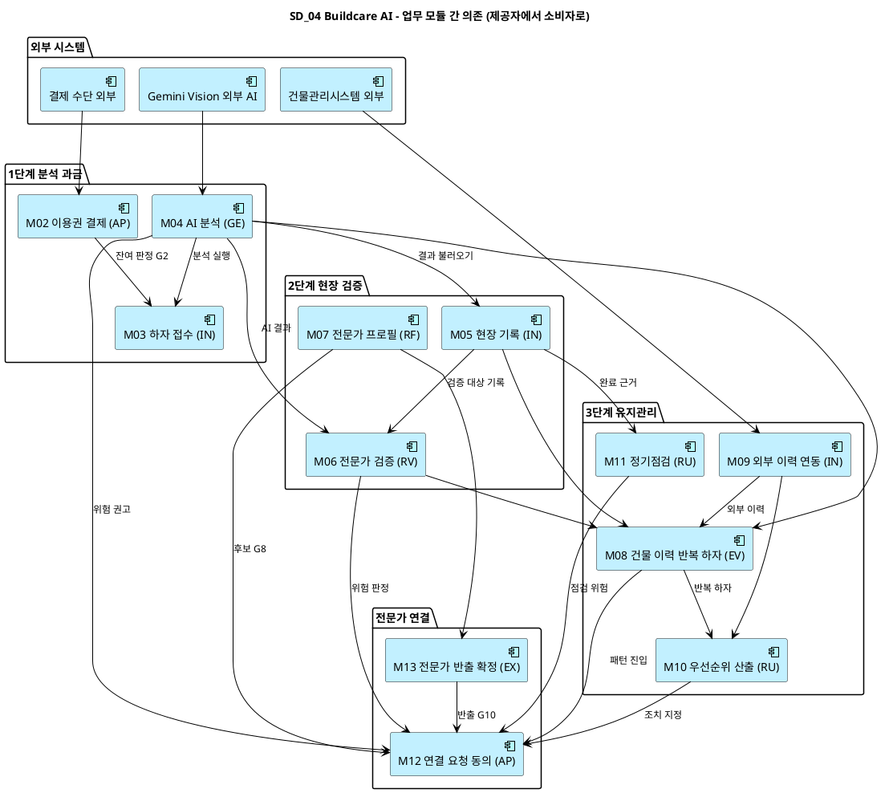
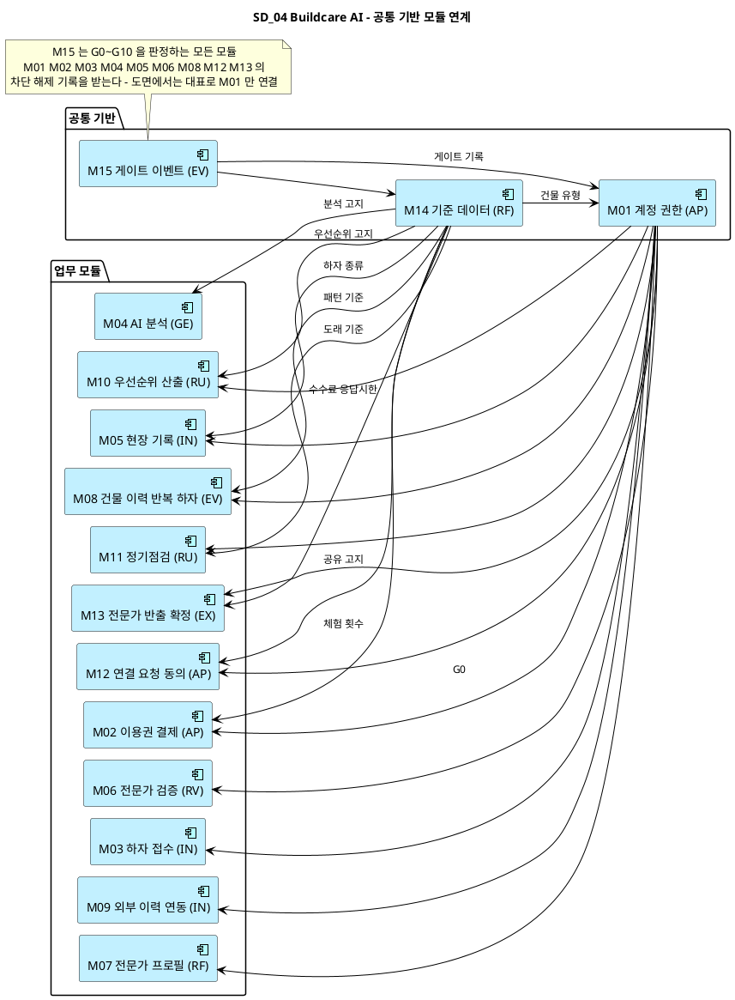

# SD_04 아키텍처 설계서 — Buildcare AI
**Buildcare AI · SD_04 · 모듈 경계 · 아키타입 · ArchiMate 3.2 계층 도면 (PlantUML) · 제공 인터페이스**

---

> **문서 식별**: `Design/SD_04_아키텍처설계서_Buildcare AI.md`
> **작성일**: 2026-10-03
> **입력**: `SD_03_데이터베이스설계서_Buildcare AI.md` (엔티티 40개 · 쓰기 주체 · 트리거 15개) + `SD_01_프로세스설계서_Buildcare AI.md` (P0~P8 · 게이트 G0~G10) + `usecases/UC_00`~`UC_08` (액터 · UC 단위) + `SD_02_UIUX설계서_Buildcare AI.md` (화면 S1~S8B)
> **원천(SoT)**: `Intent-Specify.md` — `[핵심 이네이블러]` (Gemini Vision · Python/FastAPI · Vercel · 이미지·결과 저장 DB · 건물관리시스템 연계)
> **작성 프롬프트**: `Design/분석설계 프롬프트 - 아키텍처.md`
> **다이어그램**: 모든 PlantUML 소스는 사내 Kroki `plantuml.sumzip.com` 에서 렌더 검증했다(HTTP 200 · image/svg+xml · Syntax Error 없음 · 링크 복호 소스 = 코드블록).

---

## 목차

1. 목적과 표기
2. 모듈화 원칙
3. 모듈 목록
4. 전체 아키텍처
5. 프로세스 대 모듈 배치
6. 모듈 간 의존
7. 공통 기반 모듈 연계
8. 제공 인터페이스 — API 도출 근거
9. 미해결·확인 필요

---

## 1. 목적과 표기

### 1-1 이 문서가 답하는 질문

| 앞 문서가 답한 것 | 이 문서가 답하는 것 |
|---|---|
| UC — 무엇을 (UC1~UC8) | 각 UC를 **어느 모듈이 주도**하는가 (§3) |
| SD_01 — 어떤 순서로, 어디서 막히는가 (P0~P8 · G0~G10) | 각 단계와 게이트를 **어느 모듈이 담당**하는가 (§5) |
| SD_02 — 어떻게 조작하는가 (S1~S8B) | 화면이 **어느 모듈의 인터페이스**를 부르는가 (§8) |
| SD_03 — 어디에 담는가 (테이블 40개) | 각 테이블의 **쓰기 권한을 어느 모듈이 독점**하는가 (§3) |

독자는 구현을 배분할 개발 리드와 API 를 설계할 인터페이스 설계자다. §8 의 제공 인터페이스가 SD_05 API 카탈로그의 입력이다.

### 1-2 ArchiMate 3.2 표기

**요소**

| 계층 | 매크로 | 이 문서에서의 의미 |
|---|---|---|
| Business | `Business_Actor` | UC_00 §4 의 Primary 액터 5종 |
| Business | `Business_Process` | SD_01 의 프로세스 P0~P8 |
| Business | `Business_Service` | 원천 `[미션]` 1·2·3단계가 사용자에게 주는 서비스 |
| Application | `Application_Component` | 모듈 M01~M15, 그리고 외부 시스템(Gemini Vision · 결제 수단 · 건물관리시스템) |
| Technology | `Technology_Node` · `Technology_Service` · `Technology_Artifact` | 원천 `[핵심 이네이블러]` 와 SD_03 의 실행 환경 |

**관계**

| 관계 | 매크로 | 이 문서에서의 의미 |
|---|---|---|
| Assignment | `Rel_Assignment(a,b)` | 액터가 서비스를 이용 · 노드가 기술 서비스를 제공 |
| Realization | `Rel_Realization_Up(a,b)` | 모듈 묶음이 비즈니스 서비스를 실현 · DDL 이 스키마를 실현 |
| Serving | `Rel_Serving(a,b)` · `Rel_Serving_Up(a,b)` | **a 가 b 에 기능을 제공한다 = b 가 a 를 호출한다.** 화살표는 제공자 → 소비자 |
| Triggering | `Rel_Triggering(a,b)` | 프로세스 간 순서 유발 |

Serving 화살표 방향은 호출 방향의 **반대**다. "M03 → M02 호출"은 도면에서 `M02 ──▷ M03` 으로 그린다.

---

## 2. 모듈화 원칙

### 2-1 세 가지 기준

| 순위 | 기준 | 내용 | 이 문서의 적용 |
|:--:|---|---|---|
| 1 | **데이터 소유** | 한 테이블 묶음의 쓰기 권한은 한 모듈만 가진다 | SD_03 테이블 40개를 15개 모듈에 배타 배정했다(§3). 트리거가 다른 모듈 테이블에 쓰는 5건은 §9-1 에 예외로 적었다 |
| 2 | **유스케이스 정합** | 한 UC는 한 모듈이 주도한다 | UC1~UC8 마다 주도 모듈 1개, INC3 은 M01 |
| 3 | **게이트 경계** | 게이트를 사이에 둔 두 행위는 다른 모듈이다 | 아래 2-1-1 표 |

#### 2-1-1 게이트 경계 점검

| 게이트 | 앞 행위 (모듈) | 뒤 행위 (모듈) | 판정 |
|:--:|---|---|---|
| G0 | 접근 판정 (M01) | 각 업무 처리 (M02~M13) | 분리 |
| G1 | 결제 승인 (결제 수단 — 외부) | 이용권 부여 (M02) | 외부 대기 게이트 — 반대편이 외부 |
| G2 | 이용권 잔여 판정 (M02) | 분석 접수 진행 (M03) | 분리 |
| G3 | 사진 품질 판정 (M03) | AI 분석 (M04) | 분리 — 그래서 품질 판정을 M04 에 넣지 않았다 |
| G4 | AI 응답 (Gemini Vision — 외부) | 결과 생성 (M04) | 외부 대기 게이트 |
| G5 | 현장 기록 저장 (M05) | 검증 대상 등록 (M06) · 집계 (M08 · M10) | 분리 |
| G6 | 추가 자료 제공 (M05) | 판정 저장 (M06) | 분리 |
| G7 | 이력 축적 (M05 · M06) | 패턴 출력 (M08) | 분리 |
| G8 | 전문가 후보 공급 (M07) | 요청 작성 (M12) | 분리 |
| G9 | 공유 동의 (M12) | 자료 반출 (M13) | 분리 — 그래서 연결 업무를 M12 · M13 둘로 나눴다 |
| G10 | 전문가 수락 (전문가 — 외부 행위자) | 연결 확정 (M13) | 외부 대기 게이트 |

G1 · G4 · G10 은 반대편이 시스템 밖(결제 수단 · 외부 AI · 전문가 응답)이므로 시스템 안에서 모듈을 더 쪼갤 대상이 없다.

### 2-2 아키타입 9종

프롬프트의 기본 9종을 그대로 쓴다. 가감은 없다.

| 코드 | 아키타입 | 하는 일 | 전형적 인터페이스 |
|---|---|---|---|
| IN | 수집 | 외부 입력을 시스템 안으로 들인다 | `POST /{res}` · `POST /{res}/import` |
| VA | 검증 | 누락·형식·규칙을 판정한다 | `POST /{res}/validate` · `GET /{res}/findings` |
| RF | 참조 | 기준 데이터를 조회·판본 고정한다 | `GET /{res}` · `POST /{res}/pin` |
| GE | 생성 | 산출물 초안을 만든다 | `POST /{res}/compose` · `GET /{res}/{id}` |
| RV | 검토 | 두 대상을 비교하고 차이를 남긴다 | `POST /{res}/compare` |
| AP | 승인 | 단계 승인과 게이트를 판정·해제한다 | `POST /{res}/approve` · `POST /gates/{code}/clear` |
| EX | 반출 | 외부로 내보내고 감사 기록을 남긴다 | `POST /{res}/export` · `POST /{res}/dispatch` |
| EV | 근거 | 근거를 부착하고 역추적을 제공한다 | `POST /evidence` · `GET /trace/{type}/{id}` |
| RU | 실행 | 작업을 돌리고 재현 가능하게 기록한다 | `POST /runs` · `GET /runs/{id}` |

### 2-3 아키타입 분포와 해석

| 아키타입 | 수 | 모듈 |
|---|:--:|---|
| IN 수집 | 3 | M03 하자 접수 · M05 현장 기록 · M09 외부 이력 연동 |
| AP 승인 | 3 | M01 계정·권한 · M02 이용권·결제 · M12 연결 요청·동의 |
| RF 참조 | 2 | M07 전문가 프로필 · M14 기준 데이터 |
| EV 근거 | 2 | M08 건물 이력·반복 하자 · M15 게이트 이벤트 |
| RU 실행 | 2 | M10 우선순위 산출 · M11 정기점검 |
| GE 생성 | 1 | M04 AI 분석 |
| RV 검토 | 1 | M06 전문가 검증 |
| EX 반출 | 1 | M13 전문가 반출·확정 |
| VA 검증 | 0 | — |

**해석**

- **IN·AP 가 6개로 가장 많다.** Buildcare AI 는 본질적으로 "현장 사실을 쌓는 시스템"이고(사진 · 현장 기록 · 외부 이력), 그 길목마다 게이트가 11개 있다. 생성(GE)은 AI 분석 하나뿐인데, 그마저 외부 AI 에 위임된다(`[핵심 파트너] 1단계`). 산출물 생성 시스템이 아니라 **기록·판정 시스템**이라는 뜻이다.
- **VA 가 0개인 것은 결함이 아니다.** 입력 품질 게이트 G3 · G5 의 판정은 쓰기 소유 모듈(M03 · M05)의 저장 시점에서 DB CHECK 로 강제된다(SD_03 `chk_rec_required_on_save` · `chk_req_reject_reason`). 검증을 별도 모듈로 떼면 그 모듈도 같은 테이블에 써야 하므로 기준 1 위반이다.
- **EV 가 2개다.** 원천 `[부정적 영향]` (AI 과신)과 `[핵심 장벽] 3단계` (진단 책임)가 "왜 그렇게 판단했는가"를 되짚을 수 있기를 요구한다. 건물 이력의 역추적(M08)과 게이트 차단의 역추적(M15)이 그 답이다.

---

## 3. 모듈 목록

| ID | 모듈 | 아키타입 | 주도 UC | 프로세스 | 쓰기 소유 테이블 | 소유 뷰 |
|:--:|---|:--:|---|---|---|---|
| M01 | 계정·권한 | AP | INC3 | 전 프로세스 G0 | organization · user_account · user_role · building · building_access · permission_request | v_user_masked · v_access_check |
| M02 | 이용권·결제 | AP | UC2 | P1 · P2(G2) | service_plan · payment · entitlement | v_entitlement_balance · v_analysis_eligibility |
| M03 | 하자 접수 | IN | UC1 | P2 2.1~2.3 | defect_case · analysis_request · analysis_photo | v_case_progress |
| M04 | AI 분석 | GE | (UC1 보조 · INC1 · INC2 · EXT1) | P2 2.4~2.6 | analysis_result · analysis_cause · analysis_action | — |
| M05 | 현장 기록 | IN | UC3 | P3 | inspection_record · record_photo | — |
| M06 | 전문가 검증 | RV | UC4 | P4 | verification_item · expert_verdict · data_request | v_current_verdict · v_ai_trust_metric · v_verification_queue · v_data_request_inbox |
| M07 | 전문가 프로필 | RF | (UC7 보조) | P8 8.2 | expert_specialty · expert_availability | — |
| M08 | 건물 이력·반복 하자 | EV | UC5 | P5 | (없음 — 조회 전용, UC5 사후조건 3) | v_building_history · v_repeat_defect · v_pattern_gate · v_building_rail |
| M09 | 외부 이력 연동 | IN | (UC5 · UC8 보조) | P5 5.2 · P6 6.2 | bms_sync_run · external_history | v_building_sync_state |
| M10 | 우선순위 산출 | RU | UC8 | P6 | priority_run · priority_item · priority_item_basis | — |
| M11 | 정기점검 | RU | UC6 | P7 · P0 | inspection_schedule · schedule_alert | v_schedule_status |
| M12 | 연결 요청·동의 | AP | UC7 | P8 8.1~8.4 | risk_notice · expert_request · share_consent | v_expert_request_status |
| M13 | 전문가 반출·확정 | EX | (UC7 보조) | P8 8.4~8.5 | expert_request_attempt · expert_connection | — |
| M14 | 기준 데이터 | RF | — | 전 프로세스 | gate_def · service_constant · notice_text · defect_type_code · building_type_code | — |
| M15 | 게이트 이벤트 | EV | — | 전 프로세스 | gate_event | — |

**배정 점검** — 테이블 40개 = 6 + 3 + 3 + 3 + 2 + 3 + 2 + 0 + 2 + 3 + 2 + 3 + 2 + 5 + 1. **미배정 0건, 이중 배정 0건.** 뷰 16개도 모두 한 모듈에 속한다.

**모듈 분할 근거 (기준 순)**

- **M03 하자 접수 / M04 AI 분석** — 기준 3 (G3 이 둘 사이에 있다). 품질 부적합 사진에는 AI 호출 비용이 생기면 안 된다(SD_01 P2 설계 주의). 분석 요청의 상태 전이(received → analyzing → failed · completed)는 M03 이 소유하고, M04 는 결과만 만든다.
- **M05 현장 기록 / M06 전문가 검증** — 기준 1 (쓰기 주체가 시설관리자 / 전문가) + 기준 3 (G6).
- **M08 / M10** — 기준 2. 주 액터(건물관리자 / 기업 관리자)와 UC(UC5 / UC8)가 다르다(SD_01 §1-3). M08 은 쓰는 테이블이 없지만, 반복 하자 판정(G7)과 역추적의 단일 지점이므로 독립 모듈로 둔다.
- **M09 외부 이력 연동** — 기준 1. `bms_sync_run` · `external_history` 의 쓰기 주체는 연동 배치뿐이다(SD_03 §10-2). M08 · M10 은 둘 다 읽기만 한다.
- **M12 / M13** — 기준 3 (G9). 공유 동의 전에는 자료가 반출되지 않아야 하므로, 반출(시도 생성·전달)을 동의와 다른 모듈에 두어 "동의를 건너뛴 반출"이 구조적으로 불가능하게 했다.
- **M11 에 P0 을 함께 둔다** — SD_01 은 P0(기한 감시)을 P7 에서 분리했지만 이유는 "실행 주체가 시간"이었다. 쓰는 데이터는 `schedule_alert` 하나이고 판단 근거는 `inspection_schedule` 이다. 기준 1 로 보면 같은 데이터 묶음이므로 한 모듈 안의 배치 컴포넌트로 둔다.
- **M14 / M15** — 기준 1. 기준 데이터(운영자 쓰기, 판본)와 게이트 이벤트(서비스 쓰기, 누적)는 쓰기 주체와 생애주기가 다르다(SD_03 §3 영역 H 를 둘로 나눔).

**읽기 전용 기준 데이터의 소비자** — M14 의 `notice_text` 는 M04(분석 고지) · M10(우선순위 고지) · M12(공유 고지)가, `service_constant` 는 M02(free_trial_count) · M04(ai_low_confidence) · M08(pattern_min_records) · M11(due_soon_days) · M13(expert_response_hours · expert_fee_rate)이, `defect_type_code` 는 M05 · M06 · M08 이, `building_type_code` 는 M01 이, `gate_def` 는 모든 모듈의 차단 문구가 읽는다.

---

## 4. 전체 아키텍처

**[「SD_04 Buildcare AI - 전체 아키텍처 3계층」 PlantUML 뷰어로 열기](https://plantuml.sumzip.com/plantuml/svg/eNqNVltvGkcUft9fceq-gNS0ZhcnqVRVIYkd-cGRRRqUN7QsY7zyskt3hyppVYm6S0RtIkVKaGgL0VbCdlr5gfomIvGLmNn_0DPDxWBYWsSI1bl85zLfOcs9j-ouLRct5RPTNqxynsBXumvsmkWdki9S46evFW_PtEu6qxchpxt7Bdcp2_kHjuW48OmG_ExZ2E6eeKQEibtTQle394RQva1Qk1oEnjzMribhftm08obuEkhtwi3ggc_PLoA3_HC_E1Zf8bMmaINzn_cuFaWEkfUCgRX20efHNXZY4wcdGGpX4AcFEM0zbeJ52ZRBHTeW07Nlj7ifwQpv91m3CXz_lP_-F3__eiW-0HqnKGwPW9zvDC4q7Pg02pQ8F6aBz057g24lwign8Ab_XLDT_n_iSdNel7-rQoTtE-J-ZxoklvMSaJtghx-wdggbTbQU7WNXPvfbwP2WaNBBJ8pbRW915M3bFyw4An7V4MFPMDir8OP_gaAhgjZGaAX8pDJMGeGa2OPBWZcHjRmYH6eujzeC8G1dVNivYHxebc5cYqpUskxDp6ZjZx84xZJjE5vG9IIoemtVha1VDU9yXO7gvD_o1SCW2obNx_BoPS6TjgJRJcgaAtzGcwfCps_fH40LjyFCOgPpjeUgmgS5iwBfwlZiFU9itg2x9YxIJv0Uv8uhkgIqgUUlNJiwCfi7LvZQ1rT-bDnAmswlgQBJPGvYjsvw5SUgkwThBUJ6A9Yzy0DIc9HaR6Ro2iZkTA-1wH_rsasKsmqpn-imvOwW8FoTCTHyW-qk3ZwJnLcDHPbWtfM0W8RM1IIZhnxDjF0bl0_hRfYx7poYtUUBGeIaxMIb7Qm4elUmMWU6pi-V47P9gu5inRu6R1Pbm8D_-DihK_DDTvjrLzf9R6Ekg3TX1B_ej44gjK5Xm8hnv8NOajcdUi41d3SDxqgucsqNPbL5vPW5960VkYLsYLctN2VQQf7yl_XxHhAr7sQf9jBNrGzK88yCXRStn6xDXCDxBUqx_XA7LFKJbRehykkvbaHXWCV1aaJb5vdDPjwtDQd6ksmcUp0KOKfUpkLOKZPTQeWV2IUhxzFk_IZUXSjVhFSblcpRm7MdSdWF0sUIyfjczUgC0wW3IulGI_ogSTNRjqJIhSeLXVugUCMUtjZf3JQCYyi2QwnkHEqdIjg7IjCSk_39gb0Jhj81XOZIw9Y139lRH_ibLnvdRNOwWhdvm95bIcKphsFVHa15uzJyZ-c--7MFrNsNf64oxM6DCKncwyf8h_IvS2SCYw==)** — 클릭 시 브라우저로 연결됩니다.

**읽는 법** — 위에서 아래로 "누가 → 무엇으로 → 어디서"다. 비즈니스 계층의 다섯 액터는 원천의 3단계 서비스 중 하나를 쓴다(일반 사용자는 1단계, 시설관리자·전문가는 2단계, 건물관리자·기업 관리자는 3단계). 애플리케이션 계층은 15개 모듈을 서비스 단위로 묶은 다섯 덩어리이고, 세부 모듈은 §5~§7 에서 펼친다. 외부 시스템 셋은 각각 한 덩어리에만 붙는다 — Gemini Vision 과 결제 수단은 1단계 분석·과금에만, 건물관리시스템은 3단계 유지관리에만 들어온다. 공통 기반(M01·M14·M15)은 모든 덩어리에 화살표를 내보내지만 받는 화살표가 없다. 이것이 §6-1 의 "공통 기반은 말단" 규칙이다. 기술 계층은 원천 `[핵심 이네이블러]` 의 Vercel · Python/FastAPI 와 SD_03 의 검증 DBMS(MariaDB) · 사진 객체 저장소(SD_03 §17)만 그렸다.

---

## 5. 프로세스 대 모듈 배치

**[「SD_04 Buildcare AI - 프로세스 대 모듈 배치」 PlantUML 뷰어로 열기](https://plantuml.sumzip.com/plantuml/svg/eNqFlm1v2lYUx9_zKc6yN0TaNMxzpGlq1rWoLzJF6TrtHXLBpVbARsbZm2mTV7kTaphKNVBIBpWjtWk7MckND6USn8j3-Dvs3ItpSWMDEgL5_H_3nnPv_57rGw1TNsyjWjX2maqVqkdlBb6WjdJDtSabyle7y3_fxBqHqlaXDbkG9-XSYcXQj7TyTb2qG_D5bfFZUWh6WWkodZDyKw8NWTvkD5PZWFV5YIKpg6FWHppQVg2lZKq6FjNVs6rA3e-KiTR8e6RWyyXZUGD3DnwJfsdm5320Z_jkBbCWBezf1-yvJjDXxfe9WKxOSckVBbbYexsvmuy4yYXeyMbZhHA-pnRlkC34JQY0S0PVlEajuG_oJfqN16UvYGtfAja10R4ADsZ49sabtsA_7bLReGs7FEpyKAl-t4fP24CPhvjK5nkvRomAUhxKgd-z8flLQKftXVJZozE2e-DNXHYeBaY5mF6m6F263mhOvM2GM8-16IGFF1FshrMZ8N6O2XDOy2POS1rEHhtNPqR_7vpnrQg-y_ksYN_BV5Y3ttjFEPDMRdvBZh_7NvitNjt-HUHnOJ2jXLtUYFAx7ZF_9ifgtIPO7xFcgnOJT7iZ63f74LltPO5HcHnO5VfWJmDxxKVlI-jXFedg1_E7LSoI5xbf98e9j_7Bk8dsOA5Mt7DObr1eVUsyN27xpl6r65qimfFagnthL5FcsQ5NhU4f4rv72yLPKDIlyNSHfXCecSvE73y_HksLLP3RbxAv3FqPZASSWXpv4bbNM2UFlr3mNYgf_LiezAsyv9Z38VsbBtkRg-wAns7Y1FoOQnvJnp5uTF7iHtqTElfdio9cnNLWHNxbD0sClq46cBOVyImEcyvrtehAftcm-Pb6KYWPpGTgVUq7g5f_AZWKg95GL0nCS1JqZWpabF4q9TEqghb7p-2F_w-UavEH6sQVxVC1imiAop8FrvX_tqkpTbx3Fsk_1ZJOtLErrShERxrRtdi0iYM5NewQDS2WOOfLI0o6p0s6IbyrGD-Tqnivvjhhok0XpGCYa1GefyEZFk0to6mwaHoZTYdFM0G1hUxYNBvUWMiGRekAiN5byIVFd4LowstRiuw6Bfe3UITF-J7m1sT4ui9u0qi6OY2nNvuH2tm7uffWDRPyLeQnnTyzuCuvTZYMFIU8FHbCBKmlQErwvdd0U4H7umnqNdAfAMXJ8wU6xAML9uhGpx4AdFvvp36jNs-787M2nrTR7vN7iPxDNwQ7fkGMN5r4f0xEp3N7At2T0vTNAHvSgRw69Crx1GZvxjFFKwOfNnaD_tGL0f84lLtp)** — 클릭 시 브라우저로 연결됩니다.

**읽는 법** — 왼쪽이 SD_01 프로세스, 오른쪽이 그 프로세스를 실행하는 모듈이다. 화살표 라벨이 그 모듈이 **판정하는 게이트**다. 게이트 라벨이 붙은 화살표를 따라가면 §2-1-1 의 게이트 경계를 도면으로 확인할 수 있다 — 예를 들어 P2 에는 세 모듈이 G2 · G3 · G4 를 하나씩 나눠 맡고, P8 은 G8 · G9(M12)와 G10(M13)이 갈린다. 한 프로세스에 여러 모듈이 붙는 것은 정상이지만, 한 모듈이 두 프로세스에 걸칠 때는 이유가 있다: M02 는 P1 에서 이용권을 만들고 P2 에서 잔여를 판정한다(같은 테이블), M09 는 P5 · P6 에 같은 외부 이력을 공급한다, M05 는 P7 일정의 완료 근거(이력 레코드)를 제공한다, M11 은 P7 과 P0 배치를 함께 맡는다(§3). 프로세스 간 화살표(Triggering)는 SD_01 L0 지도의 본류 일부만 남겼다.

---

## 6. 모듈 간 의존

**[「SD_04 Buildcare AI - 업무 모듈 간 의존 (제공자에서 소비자로)」 PlantUML 뷰어로 열기](https://plantuml.sumzip.com/plantuml/svg/eNqFVV1vElEQfedXjPgCiUaWr0JiTLG2pA8a08bGt2aFTd0UFgLUmBgT1K1BSyLGIlChQuyXBpNtoUiT_qK9s__B2a9K6XblCeaeM3fOzJnLbLHEF0ob2YznhiilMhtpAe7yhdRzMcuXhDsJ-9s9T3FdlPJ8gc_CMz61vlbIbUjpuVwmV4CbC8ZnAiHl0kJRyAMXmwgWeGldDwajnpJYygiw_GA1EIb7G2ImneILAiQW4TZgY5P1h8B-HbEvFVAVGbDTxN4QfNhtq4NT3K1ho4ZyG_B9lZ3J9Jv12n6PJ09V8WsCeLE1ZqMy4FYbP-5pm20vvPIAJPL5jJjiS2JOWp3LZfM5SZBKPuEldwu8SSErSiKsiEU6BYufWPT6XXhB4qknChUFWGmyrSOL50oK6aTjIeufq8MyO-hf1PiP_HpCCUdp1YEMbCSj3AF1cK6OK25ysgG9rIeBIDVtiDs_1VEVrCJ9icd-l9qygbDBDOtTsO7zJefdKSGDEgKt3qQxAHY_UyvAt_jIPyUkaAnRmjSvfSqpjAcddyERI3fkgjJWWK9j576eFjVoUapFZv2xqpSty8C3tOLOnDGYMxNMbVsma2l1mcgL05JCliRsd_GwbI7TXVHcuCBu-4smxLr75HeFfWr9X1jMYMfAtI_NZkqTDU7tAfjm3TVyAT0JFwDcUVDuYqWNbVLwVsERGWTpiTuZM8gcNahO08BujTprsyY786-BpI3c59oVzvAQF5poO2nS69FadbqJND11L8twPBe0LiNp23jyG6in9G7YrqfyloTM6rJQeCFKa-b20q74p6KcHg1PR0N6NO6_nMLYNHMDcHcbG33QqjW93mTQ659Chm2ktVe4tad9_eAMi5jPCq06bWGFfe9jc4-67QzWzU7rauKvQCI2xNoAVi3juzfWJjkn1E3mnMfxJHrtSdw-uWT2KzBCmKa85GPHbAbMsTbDmNiS2Q967P6cq8fO3TKMQn7XGk2gd1EddB31TMLMkU7D9PssmLkDJtpZnA7TqkeaPAQ8pJds80q2wEW2noJnTYKVHS7Vnycr2zeZDYaQjDlDQg5t0oMm2dqtJBcgzKwgpemP_y-uHzz7)** — 클릭 시 브라우저로 연결됩니다.

**읽는 법** — 화살표는 **제공자 → 소비자**다(호출은 반대 방향). 왼쪽 위의 외부 시스템과 M02 · M04 · M07 · M09 는 받는 화살표가 없는 **공급자**이고, 오른쪽 아래 M12 는 받기만 하는 **최종 소비자**다. 화살표는 단계(1 → 2 → 3 → 전문가 연결) 방향으로만 흐르며 거꾸로 가는 화살표가 없다. 같은 단계 안에서도 M04 → M03, M05 → M06, M08 → M10, M13 → M12 처럼 한 방향뿐이다. M10 은 M05 · M06 을 직접 읽지 않고 M08 의 반복 하자 판정을 거친다 — 반복 하자 기준(G7 · `pattern_min_records`)이 두 곳에서 따로 계산되지 않게 하기 위해서다. 공통 기반 모듈(M01 · M14 · M15)로 가는 의존은 이 도면에서 뺐다(§7).

### 6-1 의존 규칙 점검

| 점검 | 결과 | 근거 |
|---|---|---|
| 순환 의존 | **없음** | 위상 순서: M15 · M14 → M01 → M02 · M04 · M07 · M09 → M03 · M05 → M06 · M11 → M08 → M10 → M13 → M12. 모든 화살표가 이 순서의 앞에서 뒤로만 향한다 |
| 말단 모듈 (아무도 호출하지 않음) | **M15 게이트 이벤트 · M14 기준 데이터** | 모든 모듈이 필요로 하는 두 모듈은 남을 부르지 않는다. M01 은 M14 · M15 만 호출한다 |
| 최다 피의존 모듈 | **M01 계정·권한** (업무 모듈 11개) · M14 (기준값·고지 10개, 차단 문구까지 치면 전 모듈) · M15 (게이트 판정 모듈 9개) | M04 를 뺀 모든 업무 모듈이 G0 판정을 M01 에 맡긴다. 업무 모듈 중에서는 M04 AI 분석이 5개 모듈(M03 · M05 · M06 · M08 · M12)에 공급한다 |
| 데이터 소유 중복 | **애플리케이션 쓰기 0건 · DB 트리거 쓰기 5건** | 트리거 5건은 같은 트랜잭션 안의 파생 쓰기이며 §9-1 에 이유를 적었다 |

**순환을 막기 위해 정한 호출 방향 4가지**

1. **M03 이 M04 를 부른다(반대 아님).** 분석 요청 상태(failed 등)는 M03 이 M04 의 응답을 받아 직접 기록한다. M04 가 M03 을 부르면 M03 ↔ M04 순환이 된다.
2. **M12 가 위험 출처(M04 · M06 · M11)를 읽는다.** 출처 모듈이 M12 에 "통지를 만들라"고 호출하지 않는다. M12 가 M04 결과를 하자 건 요약(C6)에 쓰므로, 반대로 부르면 순환이다.
3. **M12 가 M13 을 부른다.** M13 은 반출에 필요한 동의 정보를 M12 의 호출 인자로 받고 M12 를 되부르지 않는다. 연결 확정 결과는 M13 의 조회 인터페이스로 M12 가 가져간다.
4. **화면 조합은 모듈 의존이 아니다.** S7B(작업자 화면)는 M11 배정 목록과 M06 추가 자료 요청 함을 함께 보이지만, 이 조합은 화면 계층이 한다. M11 이 M06 을 부르지 않는다.

---

## 7. 공통 기반 모듈 연계

별도의 공통모듈 설계서는 없다. 이 절은 시스템 안의 공통 기반 세 모듈(M01 · M14 · M15)을 업무 모듈이 어떻게 참조하는지 그린다.

**[「SD_04 Buildcare AI - 공통 기반 모듈 연계」 PlantUML 뷰어로 열기](https://plantuml.sumzip.com/plantuml/svg/eNqFVt9P01AUfu9fccSXkWhsYeNHYgyIQHjQGAjGt6VsBRq2dinFF6NZTDGEzQCRZQU7LAoCBpM6BuHBv2j39n_wnLvNDGHtsoem53znnvud75zTsVVbtey1fE66pxuZ3FpWg8eqlVnW86qtPRrvPD2RVld0o6Baah4W1MzKkmWuGdkJM2dacH9K_Lo8DDOrrWoFUJJdLy3VWKGXSVnKaYs22CZY-tKyDVnd0jK2bhqSrds5DeaepeUkPF3Tc9mMamkwPgMPoXlxGX68hOZ1wAIX2M9T9nkDeDVoXjiSVMCM1CUN-nh1nZ032uY-eCsBjBcKOT2jUvz0hJkvmIZm2Im8PPAA-p7LA8BrDb5_1rwqQ7MecN-DxPjL_r7-COSgQA5CWHH5wTZwf4dvuJCYeRENSwpYkq7Drhzu1CAxPRkNSQlICkLX4QfH4vKHtfiThgRsCDNz2Pl1Myji1Yr8ByJnX0UjhwVyuAsZ7jrs0AsrDoKnosEjAjwCzd8Ndv6HiGX-MWC52MVlh6zEZEwGoyLIKPC9a3ZV7ATBQrOtvdibKzKhFRn4fsAdn2943HOAfwj4FdZ1dj4arAiwgpevINPc30bW4lFCR8qA0GI9wJN3ef0XYLa85sZqSRFaUga7CEe-KNtwr4J5IF-vKcC7Lo3f6IRojYsbyQo2j0PBUORhJV7gilCqkqQj-BFm9CnAMoROECsBRQhWSaHeygTZvBYFrB_RU7v0eJVZLZee06w3urGUni-08mw15LSMHnebiamexlSUcSjKOBxlHIkyjkYYhRB7GpUo40CUsU3CLSuVrMUgrzfCqgvh_lccSnfEaXlShdtDqHnh85NiT09itjPovq2z494xiaywfBo6jbZwenkKcm50aHQOgi-25bADNy4yMYD9wT0_LiYxiQzhn30vo0p3WOmSl3DQeTchndtRDp3B5vmhW_mvDC3xt_3-qb81sW9FJE_RZRTEMG0NFkzbNvNgLqIhhQ1GTcQ2d2Fafj9N86zmQFjexibGWtB7seH89qIjf-xy2ma0l2jJ0NagFUDzmKaTmDE1Fz15cMpKpziPG7TsWglSeBZ8wcCsdITLlsg-a_DqNnc8cVq5GO54uAfEOeyk3J52kmZkgfKXxvAJPyL-ArwGQ7A=)** — 클릭 시 브라우저로 연결됩니다.

**읽는 법** — 위쪽 공통 기반 셋은 아래쪽 업무 모듈에 기능을 **주기만** 한다. M01 은 M04 를 뺀 모든 업무 모듈에 G0 판정을 준다 — M04 는 M03 이 부르는 내부 모듈이라 사용자 요청을 직접 받지 않는다. M14 는 라벨에 적힌 기준값·고지 판본만 준다. M15 는 모든 게이트 판정 모듈이 차단·해제를 기록하는 곳이지만, 선이 너무 많아져 대표로 M01 만 이었다. M15 → M14 화살표는 게이트 이벤트가 `gate_def` 를 참조한다는 뜻이며, 실제 호출은 없고 FK 참조뿐이다.

**참조 규칙**

| 규칙 | 내용 | 근거 |
|---|---|---|
| R1 | 모든 업무 API 는 처리 전에 M01 `v_access_check` 로 G0 를 판정한다. 모듈이 권한 규칙을 따로 구현하지 않는다 | SD_03 §14 G0 · BR-DEF-08 |
| R2 | 게이트가 차단·해제되면 판정 모듈이 M15 에 기록한다. M15 는 기록만 하고 판정하지 않는다 | SD_03 §12-3 "게이트 이벤트는 판정이 아니라 기록이다" |
| R3 | 차단 문구는 M14 `gate_def.block_message` 만 쓴다. 화면·모듈이 문구를 하드코딩하지 않는다 | SD_02 §12 사상 규칙 4 |
| R4 | 고지가 필요한 산출물(분석 결과 · 우선순위 · 공유 동의)은 생성 시점의 M14 고지 판본 ID 를 함께 저장한다 | BR-DEF-01 · BR-DEF-11 · SD_03 D5 |
| R5 | 미정 기준값(`service_constant` 7개)은 M14 에서만 읽는다. 값이 NULL 이면 각 모듈은 SD_03 §19-2 의 보수적 동작을 따른다 | SD_03 D8 |
| R6 | M01 · M14 · M15 는 업무 모듈을 호출하지 않는다 | §6-1 말단 규칙 |

---

## 8. 제공 인터페이스 — API 도출 근거

아키타입이 같으면 인터페이스 모양도 같다. 아래는 리소스 수준의 모양이며, 세부 엔드포인트·요청/응답 스키마·게이트웨이 배치는 SD_05 API 카탈로그에서 정한다. 게이트 열은 그 인터페이스가 실패로 돌려줄 수 있는 게이트다.

| 모듈 | 아키타입 | 제공 인터페이스 | 게이트 | 주 소비자 |
|:--:|:--:|---|:--:|---|
| M01 | AP | `GET /access-check` · `GET /buildings` (권한 범위) · `POST /permission-requests` · `POST /permission-requests/{id}/approve` | G0 | 모든 모듈 · 모든 화면 |
| M02 | AP | `GET /plans` · `POST /payments` · `POST /payments/{id}/approve` (결제 수단 결과 수신) · `GET /entitlements/eligibility` | G1 · G2 | S1 · M03 |
| M03 | IN | `POST /analysis-requests` · `POST /analysis-requests/{id}/photos` · `POST /analysis-requests/{id}/submit` · `GET /cases/{id}/progress` | G2 · G3 | S2 · 진행 레일 C1 |
| M04 | GE | `POST /analyses/compose` (M03 전용) · `GET /analysis-results/{id}` | G4 | M03 · M05 · M06 · M08 · M12 · S2 |
| M05 | IN | `POST /inspection-records` · `POST /inspection-records/{id}/photos` · `POST /inspection-records/{id}/save` · `PATCH /inspection-records/{id}/repair` | G5 | S3 · M06 · M08 · M11 · M12 |
| M06 | RV | `GET /verification-items` · `POST /verification-items/{id}/compare` (판정 판본) · `POST /verification-items/{id}/data-requests` · `GET /data-requests/inbox` · `GET /trust-metric` | G6 | S4 · S7B · M08 · M12 |
| M07 | RF | `GET /experts?specialty&date` · `PUT /experts/{id}/availability` | — | M12 · M13 · S8B |
| M08 | EV | `GET /buildings/{id}/history` · `GET /buildings/{id}/repeat-defects` · `GET /trace/record/{id}` | G7 | S5 · M10 · M12 |
| M09 | IN | `POST /bms/import` (연동 배치) · `GET /buildings/{id}/sync-state` | — | M08 · M10 · 진행 레일 C7 |
| M10 | RU | `POST /priority-runs` · `GET /priority-runs/{id}` · `GET /trace/priority-item/{id}` · `PATCH /priority-items/{id}/action` | — | S6 · M12 |
| M11 | RU | `POST /schedules` · `PATCH /schedules/{id}` · `POST /schedules/{id}/complete` · `POST /runs/schedule-watch` (P0) · `GET /runs/{id}` · `GET /my-assignments` | — | S7A · S7B · M12 |
| M12 | AP | `GET /risk-notices` · `POST /expert-requests` · `GET /expert-requests/{id}/candidates` · `POST /expert-requests/{id}/consents` · `POST /gates/G9/clear` | G8 · G9 | S8A |
| M13 | EX | `POST /expert-requests/{id}/dispatch` (M12 전용) · `POST /attempts/{id}/accept` · `POST /attempts/{id}/decline` · `GET /connections/{id}` | G10 | M12 · S8B |
| M14 | RF | `GET /constants` · `GET /notices/{kind}/current` · `POST /notices/{kind}/pin` (판본 추가) · `GET /codes/{type}` · `GET /gates` | — | 모든 모듈 |
| M15 | EV | `POST /gate-events` · `POST /gate-events/{id}/release` · `GET /trace/gate/{subject_kind}/{id}` | — | 게이트 판정 모듈 9개 · 운영 감사 |

**아키타입별 모양 일관성**

- **AP (M01 · M02 · M12)** — 모두 "판정 조회 + 승인·해제 행동" 쌍이다: `access-check` / `approve`, `eligibility` / `payments/{id}/approve`, `candidates` / `gates/G9/clear`.
- **IN (M03 · M05 · M09)** — 모두 "생성 → 첨부 → 확정" 순서다. M09 는 사람이 아니라 배치가 부르므로 `import` 하나로 묶인다.
- **RU (M10 · M11)** — 실행 결과를 다시 볼 수 있다(`priority-runs/{id}` · `runs/{id}`). 우선순위는 산출 스냅숏을, 감시는 알림 발송 기록을 재현 근거로 남긴다.
- **EV (M08 · M15)** — 모두 `trace` 를 가진다. 근거 역추적이 이 두 모듈의 존재 이유다.
- **내부 전용 인터페이스 2개** — `analyses/compose` 는 M03 만, `dispatch` 는 M12 만 부를 수 있다. 각각 G3 과 G9 를 건너뛰는 호출을 구조적으로 막는다.

---

## 9. 미해결·확인 필요

### 9-1 기준 1 의 예외 — DB 트리거의 교차 쓰기

SD_03 은 무결성을 DB 에서 강제하려고 트리거 15개를 두었다. 그중 5개가 다른 모듈 소유 테이블에 쓴다. 모두 **원래 쓰기와 같은 트랜잭션에서 생기는 파생 쓰기**이고, 애플리케이션 코드는 이 테이블에 직접 쓰지 않는다. 그래서 "두 모듈이 같은 사실을 쓴다"는 충돌이 생기지 않는다.

| 트리거 | 발화 모듈 · 테이블 | 쓰는 테이블 (소유 모듈) | 충돌하지 않는 이유 | 대안 |
|---|---|---|---|---|
| `trg_result_ai` | M04 `analysis_result` | `analysis_request` 상태 completed (M03) · `risk_notice` (M12) | completed 는 결과 생성의 정의상 결과다. 위험 통지는 `source_kind = analysis` 행만 만든다 | M03 이 compose 응답을 받아 completed 를 쓰고, M12 가 결과를 읽어 통지 생성 |
| `trg_record_au` | M05 `inspection_record` | `verification_item` (M06) | 불일치 저장 시 1회만, 레코드당 1행(`uq_item_record`) | M06 이 저장 이벤트를 받아 생성 |
| `trg_rphoto_ai` | M05 `record_photo` | `data_request` 해소 (M06) | 해소 시각만 채운다. 판정은 건드리지 않는다 | M06 이 사진 추가 이벤트를 받아 해소 |
| `trg_verdict_ai` | M06 `expert_verdict` | `risk_notice` (M12) | `source_kind = verdict` 행만 만든다 | M12 가 판정을 읽어 통지 생성 |
| `trg_connection_ai` | M13 `expert_connection` | `risk_notice` 종료 (M12) | `closed_at` · `close_reason` 만 채운다 | M12 가 연결 확정을 조회해 종료 |

**권고** — 대안 열처럼 이벤트로 바꾸면 기준 1 은 완전히 지켜지지만, 이벤트 유실 시 "검증 대상이 빠진 불일치 기록"(BR-DEF-07 위반)이 생길 수 있다. SD_03 이 트리거를 고른 이유가 바로 그것이므로 **현 구조를 유지**하고, 의존 방향(§6-1)은 논리 소유자 기준으로 그렸다. 개발 리드의 확정이 필요하다.

### 9-2 그 밖의 확인 필요

| # | 항목 | 영향 모듈 | 관련 |
|:--:|---|---|---|
| 1 | **비회원 무료 체험** (명세 FR-120 · 2026-10-03 확정)이 SD_03 에 없다. 분석 요청·이용권이 기기 단위 비회원을 표현할 수 없고, 가입 후 결과 연결 인터페이스도 없다 | M02 · M03 · M01 | `specs/001-buildcare-ai-platform/spec.md` FR-120 · 120a · 120b |
| 2 | "점검 결과 위험"(UC6 E3)을 판단할 데이터가 없다. M11 → M12 의 "점검 위험" 공급이 현재 비어 있다 | M11 · M12 | SD_03 §19-1-2 |
| 3 | 기업 요금(BR-DEF-10) 과금을 맡을 모듈이 없다. 프로세스 단계가 없어 모듈을 만들지 않았다 | (없음) — 생기면 M02 확장 후보 | SD_01 §14-2 · SD_03 §19-1-3 |
| 4 | 기업 라이선스 유효성 검증을 G0(M01)에 포함할지 | M01 · M10 | SD_01 §15-10 · 명세 가정 |
| 5 | 건물관리시스템 연동 방식·주기 — M09 가 배치인지, 조회 시 호출인지 | M09 | SD_03 §19-3-6 |
| 6 | 알림 수단(서비스 내 · 이메일 · 푸시)이 정해지면 발송을 별도 반출(EX) 모듈로 뺄지 | M11 | SD_02 §14-10 |
| 7 | 결제 수단(PG) 결과 수신 방식 — `payments/{id}/approve` 를 PG 콜백으로 받을지 | M02 | SD_03 §19-3-1 |
| 8 | Vercel 위에서 상시 배치(P0 · M09)를 돌릴 실행 수단이 원천에 없다 | M09 · M11 · 기술 계층 | 원천 `[핵심 이네이블러]` |
| 9 | 운영 DBMS — SD_03 은 MariaDB 12.0 으로 검증했지만 원천은 "이미지·결과 저장 DB"만 적었다 | 기술 계층 | SD_03 §18 |
| 10 | M08 은 쓰기 소유 테이블이 없다. 이력 보고서 출력(UC5 A3)이 확정되면 출력 기록 테이블을 가질 수 있다 | M08 | UC5 A3 |

---

## 관련 문서

- /Users/pioneer3/project261002/Intent-Specify.md
- /Users/pioneer3/project261002/Design/usecases/UC_00_개요_Buildcare AI.md
- /Users/pioneer3/project261002/Design/SD_01_프로세스설계서_Buildcare AI.md
- /Users/pioneer3/project261002/Design/SD_02_UIUX설계서_Buildcare AI.md
- /Users/pioneer3/project261002/Design/SD_03_데이터베이스설계서_Buildcare AI.md
- /Users/pioneer3/project261002/Design/buildcare_ddl.sql
- /Users/pioneer3/project261002/Design/분석설계 프롬프트 - 아키텍처.md
- /Users/pioneer3/project261002/specs/001-buildcare-ai-platform/spec.md

---

*Buildcare AI · SD_04 아키텍처 설계서 · 입력 SD_03 · SD_01 · UC_00~UC_08 · 원천 `Intent-Specify.md`*
