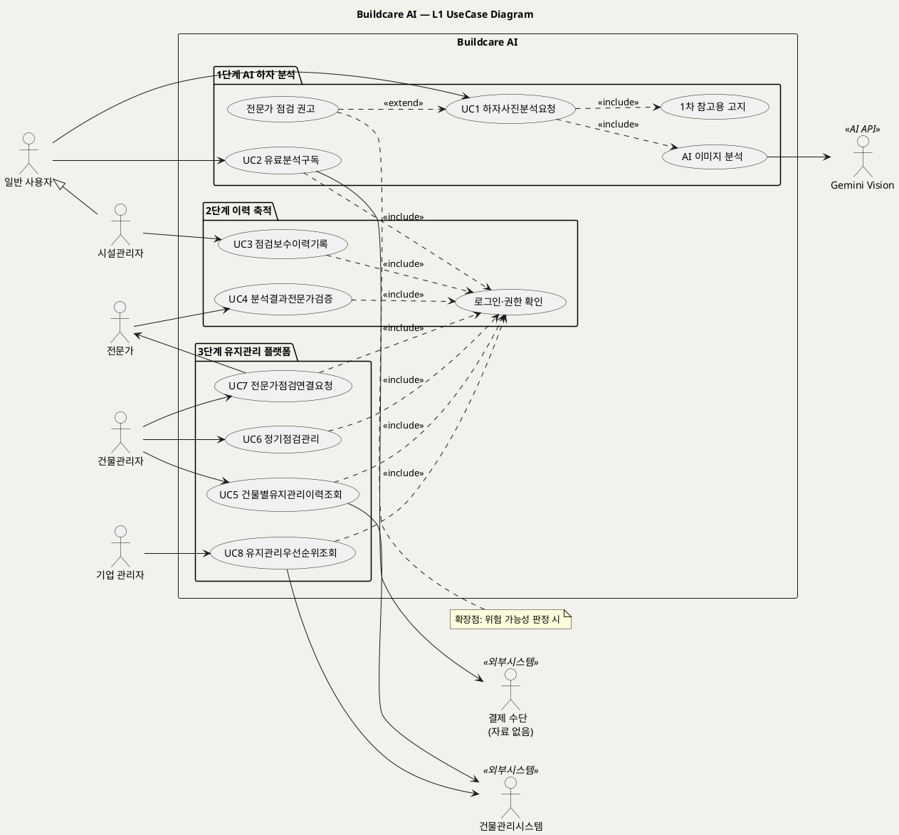

# UseCase 개요 — Buildcare AI (건축물 하자 사진 AI 분석 서비스)
**Buildcare AI · UC 개요 · UML 2.5.1 표준 (UseCase Diagram + 유스케이스 목록)**

---

> **문서 식별**: `Design/usecases/UC_00_개요_Buildcare AI.md`
> **작성일**: 2026-10-02 · **표준**: UML 2.5.1 (OMG)
> **원천(SoT)**: `Intent-Specify.md` — Buildcare AI 의도명세(캔버스형 13블록: 개요·미션·핵심 활동·핵심 파트너·핵심 장벽·가치제안·부정적 영향·핵심 이네이블러·핵심 데이터·혜택·비용·수익)
> **작성 프롬프트**: `Design/분석설계 프롬프트 - 유스케이스.md`
> **다이어그램**: PlantUML 소스는 사내 Kroki `plantuml.sumzip.com` 에서 렌더 검증했다(HTTP 200 · image/svg+xml · Syntax Error 없음). 로그인 없이 열린다.

---

## 목차

1. 시스템 목적·개요
2. 주요 기능
3. 유스케이스 목록
4. Actor 카탈로그
5. L1 UseCase Diagram
6. 시스템 경계 (하지 않는 것)
7. 생성 결과
8. 결론

---

## 1. 시스템 목적·개요

Buildcare AI는 건축물 하자 사진 업로드 기능을 추가한 AI 웹서비스다. 사용자가 균열·누수·결로 등 하자 사진과 간단한 설명을 입력하면 AI가 이미지를 분석해 가능한 원인과 대응방안을 제공한다. (근거: `[개요]`)

서비스는 3단계로 확장된다. 1단계는 사진 기반 AI 분석, 2단계는 현장 점검·보수 이력 축적을 통한 분석 신뢰도 향상, 3단계는 건물관리자의 의사결정을 지원하는 AI 유지관리 플랫폼이다. (근거: `[미션]`)

**원천 구조 선판정** — 원천은 하나의 시스템이지만 **시기(1·2·3단계)와 주체(일반 사용자 → 시설관리자 → 기업)가 다른 업무**를 함께 담고 있다. 따라서 하나로 뭉개지 않고 다이어그램을 `package` 단계별로 분리하고, 유스케이스 목록에 **단계 열**을 둔다. 원천에는 Sub-agent·처리 단계 분해가 없으므로 `[핵심 활동]` 블록의 단계별 활동을 UC 후보로 승계했다.

| 항목 | 값 |
|---|---|
| 대상 시스템 | Buildcare AI (웹서비스) |
| 원천 | `Intent-Specify.md` (13블록) |
| 핵심 UseCase | 8개 (1단계 2 · 2단계 2 · 3단계 4) |
| 주요 액터 | 일반 사용자, 시설관리자, 건물관리자, 전문가, 기업 관리자 / Gemini Vision, 건물관리시스템 |
| 기술 기반 | Gemini Vision, Python/FastAPI, Vercel (1단계) · 이미지·결과 저장 DB, 사용자 계정, 모바일 최적화 (2단계) · 건물관리시스템 연계, 분석 자동화, 기업용 관리자 대시보드 (3단계) — `[핵심 이네이블러]` |

## 2. 주요 기능

| 단계 | 기능 | 원천 근거 |
|:--:|---|---|
| 1 | 하자 사진 업로드 · 간단한 설명 입력 | `[핵심 활동] 1단계`, `[핵심 데이터] 1단계` |
| 1 | AI 이미지 분석 · 원인·대응방안 출력 | `[핵심 활동] 1단계`, `[가치제안] 1단계` |
| 1 | 결과의 '1차 참고용' 표시 · 위험 시 전문가 점검 권고 | `[부정적 영향]` |
| 1 | 무료 체험 후 개인 유료 분석 또는 월 구독 | `[수익] 1단계` |
| 2 | 점검·보수 기록 관리 (건물 유형·위치·하자 종류·보수 결과) | `[가치제안] 2단계`, `[핵심 데이터] 2단계` |
| 2 | 분석 결과 검증 · 전문가 판정 데이터 축적 | `[핵심 활동] 2단계`, `[핵심 데이터] 2단계`, `[부정적 영향]` |
| 2 | 사용자 계정 · 모바일 최적화 · 이미지·결과 저장 DB | `[핵심 이네이블러] 2단계` |
| 3 | 건물별 유지관리 이력 | `[핵심 활동] 3단계`, `[핵심 데이터] 3단계` |
| 3 | 정기점검 | `[핵심 활동] 3단계` |
| 3 | 전문가 연결 (수수료) | `[핵심 활동] 3단계`, `[수익] 3단계` |
| 3 | 반복 하자 조기 발견 · 유지관리 우선순위 제시 · 기업용 관리자 대시보드 | `[가치제안] 3단계`, `[핵심 이네이블러] 3단계`, `[핵심 데이터] 3단계` |
| 3 | 건물관리시스템 연계 · 권한관리 | `[핵심 이네이블러] 3단계`, `[핵심 장벽] 3단계` |

## 3. 유스케이스 목록

| UC ID | 단계 | 유스케이스명 | 주액터 | 우선순위 | 원천 근거 | 문서 | 상태 |
|:--:|:--:|---|---|:--:|---|---|:--:|
| UC1 | 1 | 하자사진분석요청 | 일반 사용자 | High | `[개요]`, `[핵심 활동] 1단계`, `[가치제안] 1단계`, `[부정적 영향]` | `UC_01_하자사진분석요청.md` | 완료 |
| UC2 | 1 | 유료분석구독 | 일반 사용자 | Medium | `[수익] 1단계` | `UC_02_유료분석구독.md` | 완료 |
| UC3 | 2 | 점검보수이력기록 | 시설관리자 | High | `[핵심 활동] 2단계`, `[가치제안] 2단계`, `[핵심 데이터] 2단계` | `UC_03_점검보수이력기록.md` | 완료 |
| UC4 | 2 | 분석결과전문가검증 | 전문가 | High | `[핵심 활동] 2단계`, `[핵심 장벽] 2단계`, `[부정적 영향]` | `UC_04_분석결과전문가검증.md` | 완료 |
| UC5 | 3 | 건물별유지관리이력조회 | 건물관리자 | Medium | `[핵심 활동] 3단계`, `[핵심 데이터] 3단계` | `UC_05_건물별유지관리이력조회.md` | 완료 |
| UC6 | 3 | 정기점검관리 | 건물관리자 | Medium | `[핵심 활동] 3단계`, `[혜택] 3단계` | `UC_06_정기점검관리.md` | 완료 |
| UC7 | 3 | 전문가점검연결요청 | 건물관리자 | Medium | `[핵심 활동] 3단계`, `[수익] 3단계`, `[부정적 영향]` | `UC_07_전문가점검연결요청.md` | 완료 |
| UC8 | 3 | 유지관리우선순위조회 | 기업 관리자 | Medium | `[가치제안] 3단계`, `[핵심 이네이블러] 3단계`, `[핵심 데이터] 3단계` | `UC_08_유지관리우선순위조회.md` | 완료 |

**우선순위 판정 근거** — UC1은 1단계 미션·가치제안 그 자체이므로 High. UC3·UC4는 2단계 미션("분석 신뢰도를 높임")과 `[부정적 영향]` 의 대응책(전문가 검증 데이터)에 직결되므로 High. UC2는 수익 블록에만 근거하므로 Medium. 3단계 UC는 확장 단계이므로 Medium. `[추론]` 단계 순서를 우선순위에 반영했다.

**공통 포함(«include») 유스케이스**

| ID | 명칭 | 포함하는 UC | 근거 |
|:--:|---|---|---|
| INC1 | AI 이미지 분석 | UC1 | `[핵심 활동] 1단계`, `[핵심 이네이블러] 1단계` (Gemini Vision) |
| INC2 | 1차 참고용 고지 | UC1 | `[부정적 영향]` |
| INC3 | 로그인·권한 확인 | UC2~UC8 | `[핵심 이네이블러] 2단계` (사용자 계정), `[핵심 장벽] 3단계` (권한관리) |

**확장(«extend») 유스케이스**

| ID | 명칭 | 확장 대상 | 확장점 조건 | 근거 |
|:--:|---|---|---|---|
| EXT1 | 전문가 점검 권고 | UC1 | 분석 결과에 위험 가능성이 있을 때 | `[부정적 영향]` |

## 4. Actor 카탈로그

| 구분 | Actor | 설명 | 관련 UC | 원천 근거 |
|:--:|---|---|---|---|
| Primary | 일반 사용자 | 하자 사진·설명을 올리고 원인·대응방안을 확인하는 개인 | UC1, UC2 | `[개요]`, `[혜택] 1단계` |
| Primary | 시설관리자 | 현장 점검·보수 기록을 남기는 시설관리업체 담당자 | UC1, UC3 | `[핵심 파트너] 2단계`, `[혜택] 2단계`, `[수익] 2단계` |
| Primary | 건물관리자 | 건물별 이력·정기점검·전문가 연결로 의사결정을 하는 관리자 | UC5, UC6, UC7 | `[미션] 3단계`, `[수익] 2단계` |
| Primary | 전문가 | AI 분석 결과를 검증·판정하는 건축·구조·방수 전문가 | UC4 (UC7 보조) | `[핵심 파트너] 2·3단계` |
| Primary | 기업 관리자 | 기업용 관리자 대시보드로 유지관리 우선순위를 보는 B2B 고객 담당자 | UC8 | `[핵심 이네이블러] 3단계`, `[핵심 파트너] 3단계`, `[수익] 3단계` |
| Secondary | Gemini Vision | 하자 이미지 분석을 수행하는 외부 AI API | UC1 (INC1) | `[핵심 파트너] 1단계`, `[핵심 이네이블러] 1단계` |
| Secondary | 건물관리시스템 | 3단계에 연계되는 고객사 건물관리 시스템 | UC5, UC8 | `[핵심 이네이블러] 3단계`, `[핵심 장벽] 3단계` |
| Secondary | 결제 수단 | 유료 분석·구독 결제 처리 | UC2 | 자료 없음 — 확인 필요 (원천에 결제 수단·PG사 명시 없음) |

`[추론]` 시설관리자·건물관리자·기업 관리자는 모두 "관리자" 계열이므로 Generalization(◁)으로 "관리 사용자" 추상 액터 아래에 둘 수 있다. 시설관리자는 UC1도 수행할 수 있으므로 일반 사용자를 상속한다.

## 5. L1 UseCase Diagram

**[「Buildcare AI L1 UseCase Diagram」 PlantUML 뷰어로 열기](https://plantuml.sumzip.com/plantuml/svg/eNp1VU1P20AQve-vGKWX9gAiCZAIoQiSkgqprZBaqh4qIZOYYBEcZDsqVYuUVqZCEAkORAmRg4zKV9VUNYSGHDj1p_Ror_9DZ_0RHJecspv3Znbmzdv1jKxwklJeL0I5t7RcFor5HCfxS2NjRF4TxA1O4tZhmcutFaRSWcxnSsWSBI-y8Wx0Lh1gyKtcvvReEAuwwhVlnhT5FQWUEkhCYVWBvCDxOUUoiUQRlCIPaf8YmJ2Hv5VDeB6FRZnPcDIPTwWugBkJ4XIKHhWhrTvLaAD90qbN7_T4IAKczMhSn7CnUfXUvKlY520fz77wUfPqxmrfDaLpe7Rn0Po2DMJzfZjqqtXumUbF_X9zg5cUH3vGrwuiAG8EGftycO-f6WlsanZhPpV6sAasdvfU3ta8Sl4hnx71rG6ljwQCrw2qa0B3Gtbe5TvxMVZofasCrX-lreoTJ8MC9-HBDIRJBNOfRkaYGITpz4kF1D4SFD8CHwnABo6XKyAUxWPMjsqmYtcaeBpYXZWqLZcGUJb5HJtRZDET9RhsLheqS6PNQ3r90x1QJhqOiAHVdCzf5Zq_29b-tseNDXLxeNq6sX716EWlXwES51-Gs0apcQnU6JkdHd0B7Oei4nNDWfvDBKofmNcVMLtVDHBH-_Y1y7wVFCPmicFK0c-AdmtU__yAEnEvn9W5wUG5bPSVddLyuouHI8a9pnC8ZueuXxfmoOd-0PhgkHWimbc92ur9ucWy7ZoG9lENt36v8XD1cb96jUnieg_sw6p1_MPev3ugjQlwbWp11GCM2w89Mexm1SttIhw6iQrU2FVydHDjPO5kmJuAfr8undYNZvOgdRLhoORAG7RpUFWnOxrV1IHCko4IW573R0ZSjg0DmxjJvvCWceJeZ287TtI-MnG_nLxfJsicv0wS1gZbey8CYddhdDTlGBSm8D4KYq5YzvN4DwNQLAQx0znYohfFbyq8mHeCYn5Q_L988eHQ-HBoYjg0ORxKDIeSwyDiqMDkcR9Epxu2xafKKYSt8eFzcvhrIpYU3vtalFb8-8g8fnyGPplCA6h2vQFoG2v3jKpXYFcP0HWAbx5B0YDFkxlc4ZfsH0Ybw8I=)** — 클릭 시 브라우저로 연결됩니다.

#### 다이어그램 쉽게 읽기 (유저 관점)

- **누가 쓰나** — 왼쪽 사람 모양이 서비스를 쓰는 사람(일반 사용자·시설관리자·건물관리자·기업 관리자·전문가)이고, 오른쪽은 서비스가 도움을 받는 바깥 시스템(Gemini Vision AI, 건물관리시스템, 결제 수단)이다.
- **무슨 순서로** — 1단계에서 누구나 사진을 올려 AI 분석을 받고(UC1), 2단계에서 시설관리자가 점검·보수 기록을 남기고 전문가가 AI 결과를 검증하며(UC3·UC4), 3단계에서 건물관리자와 기업이 쌓인 이력으로 점검·전문가 연결·우선순위 판단을 한다(UC5~UC8).
- **«include» = 항상 함께** — 사진 분석을 요청하면 AI 이미지 분석과 '1차 참고용' 안내가 **반드시** 같이 일어난다. 2단계 이후 기능은 모두 로그인·권한 확인을 거친다.
- **«extend» = 특정 상황에서만** — 분석 결과에 위험 가능성이 보일 때**만** 전문가 점검 권고가 덧붙는다.
- **Generalization(◁)** — 시설관리자는 일반 사용자의 한 종류라서 사진 분석 요청(UC1)도 그대로 할 수 있다.

| 기호 | 의미 |
|---|---|
| 사람 모양(actor) | 시스템 밖에서 시스템을 쓰는 주체 또는 외부 시스템 |
| 타원(usecase) | 액터가 달성하려는 목표 |
| 사각형(rectangle) | 시스템 경계 — 안쪽이 Buildcare AI 책임 |
| package | 원천의 단계(1·2·3단계) 구분 |
| 실선 → | 액터와 유스케이스의 연관 |
| 점선 `<<include>>` | 기본 UC가 항상 포함하는 하위 행위 |
| 점선 `<<extend>>` | 조건부로 기본 UC를 확장하는 행위 |
| 삼각 화살표(◁) | 일반화(상속) |

## 6. 시스템 경계 (하지 않는 것)

원천에 명시된 "제외 범위" 블록은 없다. 아래는 원천의 `[부정적 영향]`·`[핵심 장벽]` 에서 도출한 경계 제안이며 확인이 필요하다.

| 경계 항목 | 내용 | 근거 |
|---|---|---|
| 최종 진단 아님 | `[추론]` AI 결과는 1차 참고용이며 시스템이 하자의 최종 진단·보수 책임을 지지 않는다 | `[부정적 영향]`, `[핵심 장벽] 3단계` (진단 책임) |
| 보수 시공 미수행 | `[추론]` 시스템은 대응방안 제시·전문가 연결까지만 하고 보수 시공 자체는 범위 밖 | `[핵심 활동]` 에 시공 활동 없음 |
| AI 모델 자체 개발 | `[추론]` 이미지 분석은 외부 AI API(Gemini 등)에 위임 | `[핵심 파트너] 1단계` |
| 건물관리시스템 기능 대체 | `[추론]` 3단계는 연계만 하고 고객사 시스템을 대체하지 않는다 | `[핵심 이네이블러] 3단계` |
| 보험·건설사 업무 | 제휴 대상으로만 언급, 해당 업무 기능은 자료 없음 — 확인 필요 | `[핵심 파트너] 3단계` |

## 7. 생성 결과

2026-10-02 실측(`validate_usecase.py` 전 문서 PASS · 오류 0건, 모든 다이어그램 HTTP 200 · image/svg+xml · Syntax Error 없음 · 링크 복호 소스 = 코드블록).

| UC ID | 유스케이스명 | 문서 | 분량 | 14속성 | 예외흐름 | 다이어그램 |
|:--:|---|---|:--:|:--:|:--:|:--:|
| UC1 | 하자사진분석요청 | `UC_01_하자사진분석요청.md` | 9,595자 | 14/14 | E1~E4 (4) | 2 (렌더 200) |
| UC2 | 유료분석구독 | `UC_02_유료분석구독.md` | 7,506자 | 14/14 | E1~E3 (3) | 2 (렌더 200) |
| UC3 | 점검보수이력기록 | `UC_03_점검보수이력기록.md` | 8,446자 | 14/14 | E1~E4 (4) | 2 (렌더 200) |
| UC4 | 분석결과전문가검증 | `UC_04_분석결과전문가검증.md` | 7,836자 | 14/14 | E1~E4 (4) | 2 (렌더 200) |
| UC5 | 건물별유지관리이력조회 | `UC_05_건물별유지관리이력조회.md` | 7,896자 | 14/14 | E1~E3 (3) | 2 (렌더 200) |
| UC6 | 정기점검관리 | `UC_06_정기점검관리.md` | 7,282자 | 14/14 | E1~E3 (3) | 2 (렌더 200) |
| UC7 | 전문가점검연결요청 | `UC_07_전문가점검연결요청.md` | 8,207자 | 14/14 | E1~E4 (4) | 2 (렌더 200) |
| UC8 | 유지관리우선순위조회 | `UC_08_유지관리우선순위조회.md` | 8,558자 | 14/14 | E1~E4 (4) | 2 (렌더 200) |

별도 산출물: `Design/유스케이스다이어그램_Buildcare AI.md` · `.puml` — §5 L1 UseCase Diagram 단독본.

## 8. 결론

### 8.1 도출 결과

- **UC 8개** (1단계 2 · 2단계 2 · 3단계 4) + 공통 include 3개(INC1~INC3) + extend 1개(EXT1)
- **액터 8개** — Primary 5(일반 사용자·시설관리자·건물관리자·전문가·기업 관리자), Secondary 3(Gemini Vision·건물관리시스템·결제 수단)
- **업무규칙 12개** (BR-DEF-01~12), **예외흐름 29개**, **다이어그램 17개**(개요 1 + UC당 2)

| BR ID | 규칙 | 적용 UC | 근거 |
|---|---|---|---|
| BR-DEF-01 | AI 분석 결과(우선순위 포함)는 '1차 참고용'임을 명확히 표시한다 | UC1, UC8 | `[부정적 영향]` |
| BR-DEF-02 | 위험 가능성이 있는 경우 전문가 점검을 권고한다 | UC1, UC4, UC6, UC7 | `[부정적 영향]` |
| BR-DEF-03 | 분석 입력은 하자 사진과 사용자의 간단한 설명이다 | UC1 | `[개요]`, `[핵심 데이터] 1단계` |
| BR-DEF-04 | `[추론]` 분석에 부적합한 품질의 사진은 분석 전에 재업로드를 요청한다 | UC1 | `[핵심 장벽] 1단계` |
| BR-DEF-05 | 무료 체험 이후에는 개인 유료 분석 또는 월 구독으로 이용한다 | UC1, UC2 | `[수익] 1단계` |
| BR-DEF-06 | 이력 레코드는 건물 유형·위치·하자 종류·보수 결과를 필수로 포함한다 | UC3, UC5 | `[핵심 데이터] 2단계` |
| BR-DEF-07 | AI 결과와 현장·전문가 판정이 다르면 검증 대상으로 등록해 신뢰도 관리 데이터로 축적한다 | UC3, UC4 | `[부정적 영향]`, `[핵심 장벽] 2단계` |
| BR-DEF-08 | 개인정보·건물정보 접근은 권한관리로 제한한다 | UC2~UC8 | `[핵심 장벽] 3단계` |
| BR-DEF-09 | 전문가 점검 연결이 확정되면 연결 수수료를 부과한다 | UC7 | `[수익] 3단계` |
| BR-DEF-10 | 기업 요금은 건물 수·사용자 수를 기준으로 한다 | UC8 | `[수익] 3단계` |
| BR-DEF-11 | 결과 제공 시 진단 책임 범위(및 정보 공유 범위)를 고지한다 | UC1, UC7, UC8 | `[핵심 장벽] 3단계` |
| BR-DEF-12 | 반복 하자·우선순위 판단은 건물별 장기 이력과 하자 발생 패턴에 근거한다 | UC5, UC8 | `[핵심 데이터] 3단계`, `[가치제안] 3단계` |

### 8.2 원천 커버리지

§2 주요 기능 12항목 중 **12항목(100%)** 이 UC·include·특별 요구사항으로 전환되었다. 사용자 계정·모바일 최적화·저장 DB(이네이블러)는 독립 UC가 아니라 INC3 및 각 UC의 특별 요구사항으로 반영했다.

원천에 있으나 **UC로 전환하지 않은 항목**:

| 항목 | 원천 | 사유 |
|---|---|---|
| 보험·건설사 B2B 제휴 | `[핵심 파트너] 3단계` | 제휴 대상만 언급, 시스템 기능 내용 없음 |
| API 제공 수익 | `[수익] 3단계` | 외부 개발자 액터·API 범위 자료 없음 |
| 기업 라이선스 계약·과금 관리 | `[수익] 3단계` | 계약·청구 절차 자료 없음 (UC8 사전조건·BR-DEF-10으로만 반영) |
| 고객지원·영업 | `[비용] 3단계` | 비용 항목이며 시스템 기능 근거 없음 |
| 데이터 품질관리 | `[비용] 3단계` | 운영 활동으로 판단, 기능 정의 없음 (UC4가 일부 담당) |
| 회원가입·건물 등록 | `[핵심 이네이블러] 2단계` (계정) | 원천에 절차 없음 — INC3 전제로만 둠 |

### 8.3 미해결 사항 (자료 없음 — 확인 필요)

1. 1단계 로그인 필요 여부 — 계정은 2단계 이네이블러 (UC1, UC2)
2. 무료 체험 횟수·요금 금액·결제 수단(PG)·해지·환불 정책 (UC2, BR-DEF-05)
3. 전 UC의 사용빈도
4. "즉시 확인"의 응답시간 목표 (UC1)
5. 설명 입력 필수 여부 (UC1 A2), 사진 품질 판정 기준 (BR-DEF-04)
6. 건물 등록 절차 (UC3, UC5)
7. 현장 점검시간 절감 목표 수치 (UC3)
8. 전문가 자격·위촉·보상 체계 (UC4, UC7)
9. 연계 대상 건물관리시스템 명칭·연계 방식 (UC5, UC8)
10. 이력 보고서 출력 형식 (UC5 A3)
11. 정기점검 주기·항목 기준·알림 수단·분석 자동화 범위 (UC6)
12. 전문가 연결 수수료 요율·정산, 출동 효율화 지표 (UC7, BR-DEF-09)
13. 일반 사용자의 전문가 연결 허용 여부 (UC7 A2)
14. 기업 라이선스 검증 방식·요금 요율·집계 주기·우선순위 산식·예측 모델 (UC8, BR-DEF-10)
15. 보험·건설사 제휴 업무 범위 (§6)
16. 시스템 경계(§6) 전 항목 — 원천에 제외 범위 블록이 없어 `[추론]` 으로 제안됨

### 8.4 다음 단계 권고

- **1단계 착수 전 확정**: 미해결 1·2·4·5 (UC1·UC2 구현에 직접 필요)
- **2단계 착수 전 확정**: 6·7·8 — 특히 전문가 판정 데이터 스키마(BR-DEF-07)는 DB 설계 프롬프트(`Design/분석설계 프롬프트 - 데이터베이스.md`)로 이어서 정의
- **3단계 착수 전 확정**: 9·11·12·14 — 건물관리시스템 연계는 아키텍처 설계에서 인터페이스부터 정의
- 시스템 경계(§6)를 현업과 합의해 `[추론]` 표기를 제거할 것

---

*Buildcare AI · UC 개요 · UML 2.5.1 · 원천 `Intent-Specify.md`*
