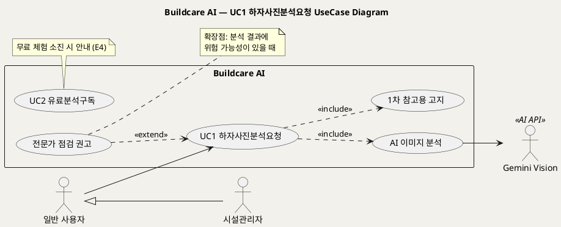
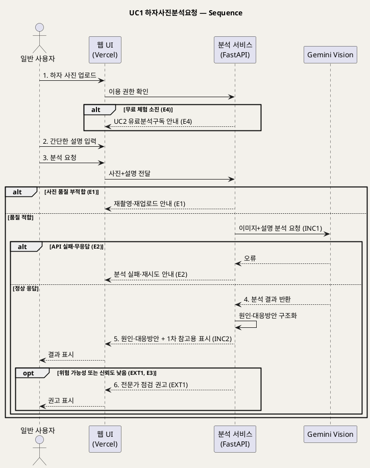

# UseCase 명세 — #1 하자사진분석요청 (Buildcare AI 1단계)
**Buildcare AI · UC1 · UML 2.5.1 표준 (UseCase Diagram + UseCase 기술 + Sequence Diagram)**

---

> **문서 식별**: `Design/usecases/UC_01_하자사진분석요청.md`
> **작성일**: 2026-10-02 · **표준**: UML 2.5.1 (OMG)
> **원천(SoT)**: `Intent-Specify.md` — Buildcare AI 의도명세 (`[개요]`, `[핵심 활동] 1단계`, `[가치제안] 1단계`, `[부정적 영향]`, `[핵심 장벽] 1단계`)
> **다이어그램**: 모든 PlantUML 소스는 렌더 검증 완료(HTTP 200 · image/svg+xml). 아래 링크로 브라우저에서 열 수 있다.

---

## 목차

1. 범위·개요
2. UseCase Diagram
3. Actor 카탈로그
4. UseCase 목록 (원천 매핑)
5. UseCase 기술 + Sequence Diagram
6. 업무규칙(Business Rules) 종합
7. UML 표준 준수 노트

---

## 1. 범위·개요

사용자가 균열·누수·결로 등 건축물 하자 사진과 간단한 설명을 올리면, 시스템이 AI(Gemini Vision)로 이미지를 분석해 가능한 원인과 대응방안을 돌려주는 유스케이스다. 서비스의 1단계 미션("건축물 하자 사진을 AI로 분석해 원인과 대응방안을 제공")과 가치제안("사진 한 장으로 하자의 원인과 대응방안을 즉시 확인")을 그대로 구현한다.

원천의 `[부정적 영향]` 은 AI 결과 과신으로 잘못된 보수·점검 지연이 생길 수 있다고 경고한다. 따라서 이 UC는 결과를 **'1차 참고용'으로 항상 표시**하고, 위험 가능성이 있을 때 **전문가 점검을 권고**하는 행위를 반드시 포함·확장한다.

| 항목 | 값 |
|---|---|
| 대상 시스템 | Buildcare AI (Vercel 기반 웹서비스 + Python/FastAPI) |
| 상위 프로세스 | 1단계 AI 하자 분석 |
| 원천 근거 | `[개요]`, `[미션] 1단계`, `[핵심 활동] 1단계`, `[가치제안] 1단계`, `[부정적 영향]`, `[핵심 장벽] 1단계`, `[핵심 데이터] 1단계` |
| 핵심 UseCase | 1개 (UC1) + include 2 (AI 이미지 분석, 1차 참고용 고지) + extend 1 (전문가 점검 권고) |
| 주요 액터 | 일반 사용자(주), 시설관리자(주, 상속), Gemini Vision(보조) |

## 2. UseCase Diagram

**[「UC1 하자사진분석요청 UseCase Diagram」 PlantUML 뷰어로 열기](https://plantuml.sumzip.com/plantuml/svg/eNp9U0FvEkEYvc-v-IIXPdB00VNDSFsEw0HjQYy3Ztgd6KTLrtmdjSZqsmlW01QSOZQUGyAktaIJRqTYcOiv8bjz8R-cWRalHjztZN_73vfe29ltX1BPBE0bAnOvFnDbMqnH9jYN4h9w5zn1aBNq1DxoeG7gWEXXdj24Vb5bNkq7awx_n1ruC-40oE5tnxGb1QUIFzze2BdgcY-ZgrsOEVzYDHZXa2CnAr_CE6gWDVh0ujho4-EYR5G8ijDq49kJTr9B1WdF6jO4z2lD7SKEmkKZyGD_Wk66oCfOvqrRDFBfk70_hPc9jD7Fs1B-Hq_w8sMV-oA1ucPhKfeVsQRL3-TzytXO40qhQIiWg_zrbFYPEp2COg2VILMeIQOvCEDgM1PbzPwvzNJj0Vjnq23Yn8nvcxyFsCQntMqjmzwDJ18AJ_P4cqgCg36MwhUzt87EYSTH83gSAg7b8TSE-Kql6Am39OyJcdNtDrA3lOet5er451h-eJv6zJE3aQfZbCHxrcNtbBQSc7CluuKOaQcWU2WtQbl_IL00warpFHspmGMpJNHR4svyCXFcwdJr49ZXbhcfOzi4UGG20oIgnk7iy2s8bSsUe9HitAsqrzy-wOiHahNwcIT9CGSnRdQi0KpL6ZorhNvU2tWkNDmeqeyA05nWwHct9cVA3RzAzpE8nMHt0r07fyW21Un9K78Bs-hS1g==)** — 클릭 시 브라우저로 연결됩니다.

#### 다이어그램 쉽게 읽기 (유저 관점)

- **누가 쓰나** — 하자 사진을 가진 일반 사용자가 주인공이다. 시설관리자도 일반 사용자의 한 종류라 똑같이 쓸 수 있다. 오른쪽의 Gemini Vision은 사진을 실제로 들여다보는 외부 AI다.
- **무슨 순서로** — 사진과 설명을 올리고 → 분석을 요청하면 → AI가 사진을 분석하고 → 원인과 대응방안이 화면에 나온다.
- **«include» = 항상 함께** — 분석을 요청하면 AI 이미지 분석과 "이 결과는 1차 참고용입니다" 안내가 **언제나** 함께 붙는다.
- **«extend» = 특정 상황에서만** — 결과에 위험 가능성이 보일 때**만** "전문가 점검을 받으세요" 권고가 추가된다.
- **Generalization(◁)** — 시설관리자 → 일반 사용자 화살표는 "시설관리자도 일반 사용자가 할 수 있는 일을 다 할 수 있다"는 뜻이다.

| 기호 | 의미 |
|---|---|
| 사람 모양(actor) | 시스템 밖의 사용자 또는 외부 시스템 |
| 타원(usecase) | 액터가 달성하려는 목표 |
| 사각형(rectangle) | 시스템 경계 |
| 점선 `<<include>>` | 항상 포함되는 하위 행위 |
| 점선 `<<extend>>` | 조건부 확장 행위 |
| 삼각 화살표(◁) | 일반화(상속) |

## 3. Actor 카탈로그

| 구분 | Actor | 이 UC에서의 역할 | 원천 근거 |
|:--:|---|---|---|
| Primary | 일반 사용자 | 하자 사진·설명을 입력하고 결과를 확인 | `[개요]`, `[혜택] 1단계` |
| Primary | 시설관리자 | 일반 사용자를 상속, 현장에서 동일하게 분석 요청 | `[핵심 파트너] 2단계`, `[혜택] 2단계` |
| Secondary | Gemini Vision | 하자 이미지를 분석해 원인 후보를 반환하는 외부 AI API | `[핵심 파트너] 1단계`, `[핵심 이네이블러] 1단계` |

## 4. UseCase 목록 (원천 매핑)

| ID | 명칭 | 유형 | 원천 근거 |
|:--:|---|:--:|---|
| UC1 | 하자사진분석요청 | 기본 UC | `[핵심 활동] 1단계` (사진 업로드, AI 이미지 분석, 원인·대응방안 출력) |
| INC1 | AI 이미지 분석 | «include» | `[핵심 활동] 1단계`, `[핵심 이네이블러] 1단계` |
| INC2 | 1차 참고용 고지 | «include» | `[부정적 영향]` |
| EXT1 | 전문가 점검 권고 | «extend» | `[부정적 영향]` |

## 5. UseCase 기술 + Sequence Diagram

### 5.1 UC1 하자사진분석요청

> **쉽게 말하면** — 집이나 건물에 생긴 금, 물 샘, 이슬 맺힘 사진을 찍어 올리고 한두 줄 설명을 붙이면, AI가 "이런 원인일 수 있고 이렇게 대응하라"고 알려준다. 다만 이 답은 어디까지나 1차 참고용이며, 위험해 보이면 전문가 점검을 받으라고 함께 안내한다.

#### 유스케이스 기술

| 속성 | 내용 |
|---|---|
| **ID** | UC1 (원천: `[핵심 활동] 1단계`) |
| **유스케이스명** | 하자 사진을 올려 원인과 대응방안을 분석받는다 |
| **액터** | 주: 일반 사용자(시설관리자 포함) / 보조: Gemini Vision |
| **사전조건** | (1) 사용자가 Buildcare AI 웹서비스에 접속해 있다. (2) 사용자가 하자 사진을 보유하고 있다. (3) 분석 이용 권한이 있다 — 무료 체험 잔여 또는 유료 분석·구독 상태(BR-DEF-05). (4) 1단계에서 로그인 필요 여부: 자료 없음 — 확인 필요 (원천은 사용자 계정을 2단계 이네이블러로 둔다). |
| **사후조건** | (1) 사용자 화면에 가능한 원인과 대응방안이 표시되었다. (2) 결과에 '1차 참고용' 표시가 붙어 있다(BR-DEF-01). (3) 위험 가능성이 있으면 전문가 점검 권고가 함께 표시되었다(BR-DEF-02). (4) `[추론]` 2단계 이후에는 사진·설명·결과가 이미지·결과 저장 DB에 기록된다(`[핵심 이네이블러] 2단계`). |
| **기본흐름** | ↓ 별도 기본흐름표 |
| **대체흐름** | A1. `[추론]` 모바일에서 촬영 직후 바로 업로드한다 — 이후 기본흐름 2단계로 합류(`[핵심 이네이블러] 2단계` 모바일 최적화). A2. 설명을 비워 둔 채 분석을 요청한다 — 설명 필수 여부 자료 없음 — 확인 필요. |
| **예외흐름** | E1. 사진 품질(초점·해상도·조도 등)이 분석에 부적합하다 → 재촬영·재업로드를 안내하고 분석을 진행하지 않는다(`[핵심 장벽] 1단계` 사진 품질, BR-DEF-04). E2. AI API 호출이 실패하거나 응답이 없다 → 분석 실패를 알리고 재시도를 안내한다(`[추론]` `[핵심 파트너] 1단계` 외부 AI 의존). E3. AI 결과의 신뢰도가 낮거나 판정이 불확실하다 → 결과를 '1차 참고용'으로 표시하고 전문가 점검을 권고한다(`[핵심 장벽] 1단계` AI 오판 가능성, `[부정적 영향]`). E4. 무료 체험이 소진되었다 → UC2 유료분석구독으로 안내한다(`[수익] 1단계`). |
| **포함/확장** | «include» INC1 AI 이미지 분석 · «include» INC2 1차 참고용 고지 · «extend» EXT1 전문가 점검 권고(확장점: 위험 가능성 판정 시) |
| **우선순위** | High — 1단계 미션·가치제안 그 자체이며 이후 모든 단계의 데이터 원천 |
| **사용빈도** | 자료 없음 — 확인 필요 (원천에 이용량 수치 없음) |
| **업무규칙** | BR-DEF-01, BR-DEF-02, BR-DEF-03, BR-DEF-04, BR-DEF-05, BR-DEF-11 |
| **특별 요구사항** | (1) 결과는 "즉시" 확인 가능해야 한다(`[가치제안] 1단계`) — 응답시간 목표 수치는 자료 없음 — 확인 필요. (2) 모바일 화면 최적화(`[핵심 이네이블러] 2단계`). (3) 사진·건물정보 보안(`[핵심 장벽] 3단계`). (4) AI API 비용 관리 대상(`[비용] 1단계`). |
| **비고** | 원천 추적성: `[개요]` 입력(사진+설명)·출력(원인·대응방안) / `[핵심 활동] 1단계` / `[핵심 데이터] 1단계` / `[부정적 영향]` → INC2·EXT1·E3 / `[핵심 장벽] 1단계` → E1·E3 / `[수익] 1단계` → E4 / `[핵심 이네이블러] 1단계` Gemini Vision·FastAPI·Vercel → 시퀀스 lifeline |

#### 기본흐름 (Basic Flow)

| 단계 | 액터 행위 | 시스템 행위 |
|:--:|---|---|
| 1 | 사용자가 하자 사진을 선택해 업로드한다 | 사진을 수신하고 분석 이용 권한(무료 체험·유료)을 확인한다 |
| 2 | 사용자가 하자에 대한 간단한 설명(예: 균열·누수·결로 위치·증상)을 입력한다 | 설명을 사진과 묶어 분석 요청 단위로 구성한다 |
| 3 | 사용자가 [분석 요청]을 누른다 | 사진 품질을 확인한 뒤 이미지와 설명을 Gemini Vision에 전송한다(INC1) |
| 4 | 사용자가 분석 진행 상태를 확인하며 대기한다 | AI 응답을 수신해 가능한 원인과 대응방안으로 구조화한다 |
| 5 | 사용자가 분석 결과를 확인한다 | 원인·대응방안을 '1차 참고용' 표시와 함께 출력한다(INC2) |
| 6 | 사용자가 권고 내용을 확인한다 | 위험 가능성이 있으면 전문가 점검 권고를 덧붙인다(EXT1) |

#### Sequence Diagram

**[「UC1 하자사진분석요청 Sequence」 PlantUML 뷰어로 열기](https://plantuml.sumzip.com/plantuml/svg/eNptlFFP02AUhu_7K070BoIsFtALLgi4gNmNMcERL0xI2So2lA7aLt4OLIawJQzdwoCODB0BzNQ6BoyEK36Kl_1O_4Pn67cCBS_aNOt73vc55zvduGUrpp1f1MFSl2fn8pqezSimOvtUlqwFzVhSTGUR5pTMwryZyxvZZE7PmfB4anhKnnxxR2F9ULK5j5oxD-8V3VIlW7N1FdJJGYJqDffLuNrCI4edO-jUcbeC7Z_wt1CBaXU5rxoZVZKUjE3Gj7B-xbwacPnuCdU9AsWCtKWaEuXYWkZbUgybZHuXkE69M_pmVDOj6v1CloqLRBqg47JLBzeaJJ9SLHvidUrop2eS8YKX6qJmaDCjWVrOCCUTKUni6TA4RvYwCnKi1xCIjgC319iBy766Er0nFZmSDOsd4gf_vBRUXQh2qljvSopuA2t12PcSYLsTbFObn0vco29ypF-CsHQwCkonhwDdBolFG_5Zi22uAVbX2WpHVKhGNg43lADfc1jxmIei02Q_qGB_jTUO47rhBESzCY8ijh72NRCVN8ivFaL3Gg6-rOPROhkUsLESVE-IRX5Aj_st7LSwtnJ9wR-jGd3iU4lKexK5CavIZYzmLobIfnfxqBDBxKChL_UqGSZzODpUwGIzKB1fX9CMsb7FimeUM8QFwP0GbzusNdlhLfw9Bh3Z92w4eNFlm84tdegWcmOjip9WQOQ8jBi5mbDf9vzTK6ClDnbuZN6w7JVpNYi5VOBe3gllAZ01HnjBTuUh47PE_0sGQEbvGNDr-qcNvnrBlkv04ZB6M0gLwHATRiMuIQvf55bojF2H76XvFdjGITp_gNXKbKNCM2mwbx6fBVv9hfUSzeLtG_kJTA4L73uUzxPh4rS6ZERPZb9d4N8CoYnCqOgeklDcQeIbLu78Gqcb_VH9A6V1F7U=)** — 클릭 시 브라우저로 연결됩니다.

기본흐름 단계 1~6은 메시지 `1.`~`6.` 에 1:1로 대응한다.

## 6. 업무규칙(Business Rules) 종합

| BR ID | 규칙 | 적용 UC | 근거 |
|---|---|---|---|
| BR-DEF-01 | AI 분석 결과는 '1차 참고용'임을 명확히 표시한다 | UC1, UC8 | `[부정적 영향]` |
| BR-DEF-02 | 위험 가능성이 있는 경우 전문가 점검을 권고한다 | UC1, UC4, UC6, UC7 | `[부정적 영향]` |
| BR-DEF-03 | 분석 입력은 하자 사진과 사용자의 간단한 설명이다 | UC1 | `[개요]`, `[핵심 데이터] 1단계` |
| BR-DEF-04 | `[추론]` 분석에 부적합한 품질의 사진은 분석 전에 재업로드를 요청한다 (품질 판정 기준은 자료 없음 — 확인 필요) | UC1 | `[핵심 장벽] 1단계` 사진 품질 |
| BR-DEF-05 | 무료 체험 이후에는 개인 유료 분석 또는 월 구독으로 이용한다 (무료 횟수 자료 없음 — 확인 필요) | UC1, UC2 | `[수익] 1단계` |
| BR-DEF-11 | 결과 제공 시 진단 책임 범위를 고지한다 | UC1, UC7, UC8 | `[핵심 장벽] 3단계` 진단 책임·고지 |

## 7. UML 표준 준수 노트

- UseCase는 액터 목표 단위(하자 원인·대응방안 확인)로 정의했고, 업로드·입력·요청 같은 화면 행위는 기본흐름 단계로 내렸다.
- «include»(INC1·INC2)는 base → included 방향, «extend»(EXT1)는 extension → base 방향으로 그리고 확장점 조건을 note로 명시했다(UML 2.5.1 §18.1).
- 외부 AI(Gemini Vision)는 시스템 경계 밖 Secondary actor, 시퀀스에서는 별도 lifeline으로 분리했다.
- 예외흐름 E1~E4는 시퀀스의 `alt`/`opt` 결합 프래그먼트에 ID를 병기했다.

---

*Buildcare AI · UC1 하자사진분석요청 · UML 2.5.1 · 원천 `Intent-Specify.md`*
