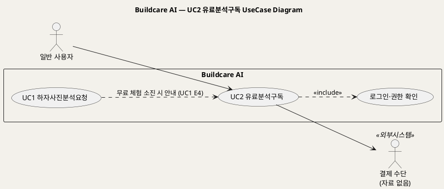
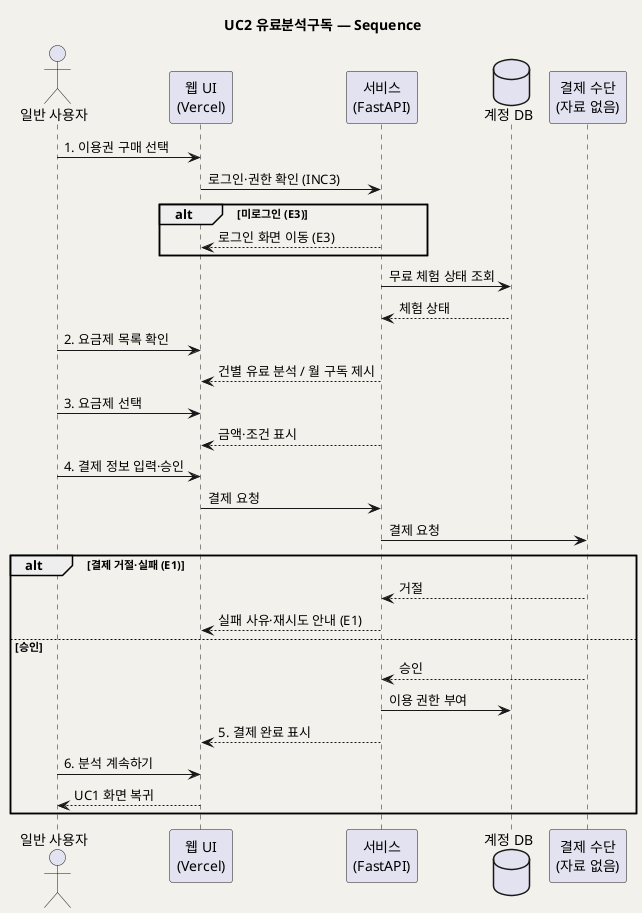

# UseCase 명세 — #2 유료분석구독 (Buildcare AI 1단계)
**Buildcare AI · UC2 · UML 2.5.1 표준 (UseCase Diagram + UseCase 기술 + Sequence Diagram)**

---

> **문서 식별**: `Design/usecases/UC_02_유료분석구독.md`
> **작성일**: 2026-10-02 · **표준**: UML 2.5.1 (OMG)
> **원천(SoT)**: `Intent-Specify.md` — Buildcare AI 의도명세 (`[수익] 1단계`, `[비용] 1단계`)
> **다이어그램**: 모든 PlantUML 소스는 렌더 검증 완료(HTTP 200 · image/svg+xml). 아래 링크로 브라우저에서 열 수 있다.

---

## 목차

1. 범위·개요
2. UseCase Diagram
3. Actor 카탈로그
4. UseCase 목록 (원천 매핑)
5. UseCase 기술 + Sequence Diagram
6. 업무규칙(Business Rules) 종합
7. UML 표준 준수 노트

---

## 1. 범위·개요

원천의 1단계 수익모델은 "무료 체험 후 개인 유료 분석 또는 월 구독"이다. 이 UC는 무료 체험을 다 쓴 사용자(또는 미리 결제하려는 사용자)가 **건별 유료 분석** 또는 **월 구독** 중 하나를 골라 결제하고, 분석 이용 권한을 얻는 과정을 다룬다.

원천에는 요금 금액, 무료 체험 횟수, 결제 수단(PG사), 해지·환불 정책이 **없다**. 이 항목들은 모두 `자료 없음 — 확인 필요` 로 남기고 개요 문서 결론의 미해결 사항으로 모은다.

| 항목 | 값 |
|---|---|
| 대상 시스템 | Buildcare AI |
| 상위 프로세스 | 1단계 AI 하자 분석 — 수익화 |
| 원천 근거 | `[수익] 1단계`, `[비용] 1단계`, `[핵심 이네이블러] 2단계` (사용자 계정) |
| 핵심 UseCase | 1개 (UC2) + include 1 (로그인·권한 확인) |
| 주요 액터 | 일반 사용자(주), 결제 수단(보조, 자료 없음) |

## 2. UseCase Diagram

**[「UC2 유료분석구독 UseCase Diagram」 PlantUML 뷰어로 열기](https://plantuml.sumzip.com/plantuml/svg/eNptkjFLw0AYhvf7FR9x0aFiq5OUUhsVXMTFTZBrck0PYyLJBRERRKqILehgsUoqioIKFaTU2sHJn-LY-_IfvIsKFRyTPLzv836kGAoaiGjThchaL0fctS0asPWpHAk3uLdFA7oJZWptOIEfebbpu34AY4vTi9mF0ggRVqntb3PPgQp1Q0ZcVhEgfAi4UxVg84BZgvseEVy4DEq_NTC3BJ_757Bq5gDjG3nXkP0a1trD1448PYTVkJk0ZDDPqaNaCKGWUPUGtt_lSwvwoINXT3h9ZgANNRz8AsPuC97EgMctWX9c88YVo7IBL46w3ZhI8RW6A_k8Xg5kfx_rMZ7cJ4dxoUCIVqWeozSNUU8DdglAFDJLGxn_G3-LmLlRUt7Gw7cBtgcfb8N-I2nGkFw21WPKLi2b039js5A0W8pXj3uofYfj1Tl2n3_Cs2SPED0WMplCWqZdJicLaRjMqlXcs9zIZmqN_qQxtZbobI3pd7MgO730JN1ecqFOedRQbaAOAdg8lgc9GNf4wswEKTLPVr_HF_Dg6hs=)** — 클릭 시 브라우저로 연결됩니다.

#### 다이어그램 쉽게 읽기 (유저 관점)

- **누가 쓰나** — 무료 체험을 다 쓴 일반 사용자가 주인공이다. 오른쪽의 결제 수단은 실제 돈을 처리하는 바깥 시스템인데, 어떤 결제사인지는 아직 정해지지 않았다.
- **무슨 순서로** — 사진 분석을 하려다 무료 횟수가 끝났다는 안내를 받고 → 건별 결제나 월 구독을 고르고 → 결제하면 → 다시 분석을 할 수 있게 된다.
- **«include» = 항상 함께** — 결제하려면 **언제나** 내 계정 확인(로그인)이 먼저 일어난다. 누가 돈을 냈는지 알아야 하기 때문이다.
- **«extend» = 특정 상황에서만** — 이 UC에는 조건부 확장이 없다. 점선 화살표는 UC1에서 무료 체험이 끝났을 때 이 UC로 넘어온다는 안내 흐름이다.
- **Generalization(◁)** — 이 UC에는 상속 관계가 없다.

| 기호 | 의미 |
|---|---|
| 사람 모양(actor) | 시스템 밖의 사용자 또는 외부 시스템 |
| 타원(usecase) | 액터가 달성하려는 목표 |
| 사각형(rectangle) | 시스템 경계 |
| 점선 `<<include>>` | 항상 포함되는 하위 행위 |
| 점선(라벨) | UC 간 안내 흐름(의존) |

## 3. Actor 카탈로그

| 구분 | Actor | 이 UC에서의 역할 | 원천 근거 |
|:--:|---|---|---|
| Primary | 일반 사용자 | 요금제를 선택하고 결제한다 | `[수익] 1단계` (개인 유료 분석·월 구독) |
| Secondary | 결제 수단 | 결제 승인·거절을 처리한다 | 자료 없음 — 확인 필요 (원천에 결제 수단 명시 없음) |

## 4. UseCase 목록 (원천 매핑)

| ID | 명칭 | 유형 | 원천 근거 |
|:--:|---|:--:|---|
| UC2 | 유료분석구독 | 기본 UC | `[수익] 1단계` |
| INC3 | 로그인·권한 확인 | «include» | `[핵심 이네이블러] 2단계` 사용자 계정, `[핵심 장벽] 3단계` 권한관리 |

## 5. UseCase 기술 + Sequence Diagram

### 5.2 UC2 유료분석구독

> **쉽게 말하면** — 무료로 몇 번 써 본 뒤에도 계속 쓰고 싶으면, 한 건씩 돈을 내고 분석하거나 매달 구독료를 내고 쓸 수 있다. 결제가 끝나면 바로 다시 사진 분석을 할 수 있다.

#### 유스케이스 기술

| 속성 | 내용 |
|---|---|
| **ID** | UC2 (원천: `[수익] 1단계`) |
| **유스케이스명** | 유료 분석 또는 월 구독을 결제해 분석 이용 권한을 얻는다 |
| **액터** | 주: 일반 사용자 / 보조: 결제 수단(자료 없음 — 확인 필요) |
| **사전조건** | (1) 사용자가 웹서비스에 접속해 있다. (2) `[추론]` 결제 주체를 식별하기 위해 사용자가 로그인되어 있다(INC3) — 1단계에 계정이 존재하는지는 자료 없음 — 확인 필요. (3) 무료 체험이 소진되었거나 사용자가 유료 이용을 원한다. |
| **사후조건** | (1) 결제가 승인되었다. (2) 사용자 계정에 선택한 이용 권한(건별 분석 또는 월 구독)이 부여되었다. (3) 사용자는 UC1 하자사진분석요청을 이어서 수행할 수 있다. |
| **기본흐름** | ↓ 별도 기본흐름표 |
| **대체흐름** | A1. 무료 체험이 남아 있는 상태에서 사용자가 자발적으로 요금제 화면에 진입한다 — 기본흐름 2단계부터 동일. A2. 구독 해지·변경 — 자료 없음 — 확인 필요. |
| **예외흐름** | E1. 결제가 거절되거나 실패한다 → 이용 권한을 부여하지 않고 실패 사유와 재시도를 안내한다(`[추론]` 결제 처리 일반 실패모드). E2. 월 구독 기간이 만료된다 → 분석 이용을 제한하고 갱신을 안내한다(`[추론]` `[수익] 1단계` 월 구독). E3. 로그인되어 있지 않다 → 로그인 화면으로 보낸 뒤 복귀한다(INC3). |
| **포함/확장** | «include» INC3 로그인·권한 확인 |
| **우선순위** | Medium — 수익 블록에만 근거, 서비스 핵심 가치(UC1)의 지속 이용 조건 |
| **사용빈도** | 자료 없음 — 확인 필요 |
| **업무규칙** | BR-DEF-05, BR-DEF-08 |
| **특별 요구사항** | (1) 결제·개인정보 보호(`[핵심 장벽] 3단계` 개인정보 보안). (2) 요금 금액·무료 체험 횟수·결제 수단·환불 정책 — 자료 없음 — 확인 필요. |
| **비고** | 원천 추적성: `[수익] 1단계` "무료 체험 후 개인 유료 분석 또는 월 구독" / `[비용] 1단계` AI API 비용(유료화 필요성) / `[핵심 이네이블러] 2단계` 사용자 계정 → INC3. 예외흐름 판단 근거: 원천의 `[핵심 장벽]`·`[부정적 영향]` 에 결제 관련 리스크가 없으므로 E1·E2는 결제 도메인의 일반 실패모드를 `[추론]` 으로 도출했다. |

#### 기본흐름 (Basic Flow)

| 단계 | 액터 행위 | 시스템 행위 |
|:--:|---|---|
| 1 | 사용자가 무료 체험 소진 안내에서 [이용권 구매]를 누른다 | 로그인·권한을 확인하고 현재 무료 체험 상태를 표시한다(INC3) |
| 2 | 사용자가 요금제 목록을 확인한다 | 개인 유료 분석(건별)과 월 구독 두 가지 요금제를 제시한다 |
| 3 | 사용자가 요금제 하나를 선택한다 | 선택한 요금제의 금액·이용 조건을 표시한다(금액 자료 없음 — 확인 필요) |
| 4 | 사용자가 결제 정보를 입력하고 결제를 승인한다 | 결제 수단에 결제를 요청한다 |
| 5 | 사용자가 결제 결과를 확인한다 | 결제 승인을 받아 계정에 이용 권한을 부여하고 완료를 표시한다 |
| 6 | 사용자가 [분석 계속하기]를 누른다 | UC1 하자사진분석요청 화면으로 복귀시킨다 |

#### Sequence Diagram

**[「UC2 유료분석구독 Sequence」 PlantUML 뷰어로 열기](https://plantuml.sumzip.com/plantuml/svg/eNplVE1LG1EU3b9fcbEbXWib2HbhQtSokE0RREEoyHPyaoPjRGcmdGvNKMGk2EIGTczIhKZUS0qjiUmErvwpXc578x96X2by6SYh75537rnn3JcFw6S6md5XwWCH2zvppJpQqM62X0WJsZfUDqhO92GHKnu7eiqtJWIpNaXDi9XZ1cjK0hDC-EgTqU9JbRc-UNVgxEyaKoONWBRE2eXf87xlCcvxHmr8_AT-HRVgnR2mmaYwQqhiIuWEcP7y-iWI45oo3YrrrxNADdgwmE6wg5lUkgdUMxF29Qgb8ffa5CbTFaZOBbD4GMgq80dLnFURt0oNc3EtHgDXN2MkQU26Qw0GE17DEq4Ny0vd2vLSKIl3XxduGUT2kudukAg14SAgLk6Fkw_o1ha3CJEaYXoeRcAcRGZAOE2cwGvlQY77swrCcv2MQ7COKFSAMF4pe-2OcDpPbQT6dhn8oo0_YTL-LjY7RahqAv_T6cNgcgVPoXt7utdrUPWLBX7blJ35eTHAMi1Buuh5HEyCa82u-vumf4EuZz77GZytUvdLeYKA6b60EcTocFEcrlTwOlnpC_91yytOqJuMCPPumrxhhclDED28BHFVgHADkEDkxthnh9lDz0ZpsWRXntqoGjuA_-05x-sZ6MXm2ryBllyfcPcH3jl7lDKHM-gBSwVx_7vnFSb6rCTDCE-8O_zKIl2u6udv0OmITEVeGhgYYMbDCm_I9S67SHBdQ_H8HF2ys_y4GVAxfDoQSh2n7R8PpxrsGoQ7xFtH4qI23vnNwJOiJQMJjQMYse7tTC8p-SxOv_j2pdepS1Q84JLgOXzSkd668caD1z7qbtoCfuB_yH-k6fBu)** — 클릭 시 브라우저로 연결됩니다.

기본흐름 단계 1~6은 메시지 `1.`~`6.` 에 1:1로 대응한다. 월 구독 만료(E2)는 UC1 진입 시 권한 확인에서 처리되므로 이 시퀀스 밖에 있다.

## 6. 업무규칙(Business Rules) 종합

| BR ID | 규칙 | 적용 UC | 근거 |
|---|---|---|---|
| BR-DEF-05 | 무료 체험 이후에는 개인 유료 분석 또는 월 구독으로 이용한다 (무료 횟수·금액 자료 없음 — 확인 필요) | UC1, UC2 | `[수익] 1단계` |
| BR-DEF-08 | 개인정보·건물정보 접근은 권한관리로 제한한다 | UC2~UC8 | `[핵심 장벽] 3단계` |

## 7. UML 표준 준수 노트

- 결제 수단은 원천에 명시가 없어 actor 이름에 `(자료 없음)` 을 붙여 경계 밖 Secondary actor로만 표현했다.
- UC1 → UC2 점선은 «include»/«extend» 가 아닌 안내 흐름(의존)으로, 표준 스테레오타입을 붙이지 않았다.
- 예외흐름 E1·E3은 시퀀스 `alt` 에 ID를 병기했다.

---

*Buildcare AI · UC2 유료분석구독 · UML 2.5.1 · 원천 `Intent-Specify.md`*
