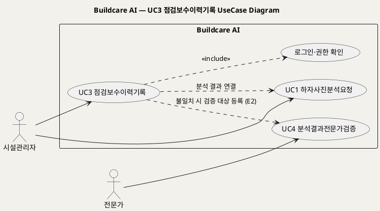
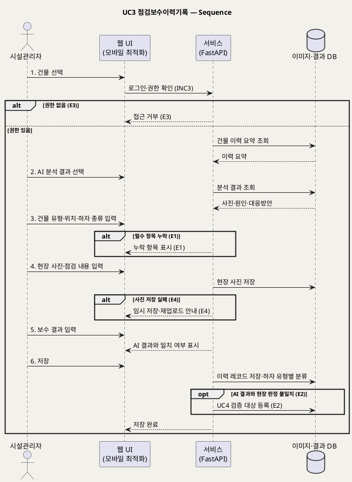

# UseCase 명세 — #3 점검보수이력기록 (Buildcare AI 2단계)
**Buildcare AI · UC3 · UML 2.5.1 표준 (UseCase Diagram + UseCase 기술 + Sequence Diagram)**

---

> **문서 식별**: `Design/usecases/UC_03_점검보수이력기록.md`
> **작성일**: 2026-10-02 · **표준**: UML 2.5.1 (OMG)
> **원천(SoT)**: `Intent-Specify.md` — Buildcare AI 의도명세 (`[미션] 2단계`, `[핵심 활동] 2단계`, `[가치제안] 2단계`, `[핵심 데이터] 2단계`, `[혜택] 2단계`)
> **다이어그램**: 모든 PlantUML 소스는 렌더 검증 완료(HTTP 200 · image/svg+xml). 아래 링크로 브라우저에서 열 수 있다.

---

## 목차

1. 범위·개요
2. UseCase Diagram
3. Actor 카탈로그
4. UseCase 목록 (원천 매핑)
5. UseCase 기술 + Sequence Diagram
6. 업무규칙(Business Rules) 종합
7. UML 표준 준수 노트

---

## 1. 범위·개요

2단계 미션은 "현장 점검·보수 이력을 축적해 분석 신뢰도를 높임"이다. 이 UC는 시설관리자가 현장 점검과 보수 결과를 **한곳에 표준 형식으로 기록**하는 행위를 다룬다. 기록 항목은 원천 `[핵심 데이터] 2단계` 의 건물 유형·위치·하자 종류·보수 결과이며, 이 데이터가 하자 유형별로 쌓여 이후 UC4(전문가 검증)·UC5(건물별 이력)·UC8(우선순위)의 재료가 된다.

`[혜택] 2단계` 는 "시설관리자의 현장 점검시간 절감과 기록 표준화"를 약속하므로, 필수 항목 검증과 모바일 입력을 이 UC의 품질 조건으로 둔다.

| 항목 | 값 |
|---|---|
| 대상 시스템 | Buildcare AI (이미지·결과 저장 DB, 사용자 계정, 모바일 최적화) |
| 상위 프로세스 | 2단계 이력 축적 |
| 원천 근거 | `[미션] 2단계`, `[핵심 활동] 2단계`, `[가치제안] 2단계`, `[핵심 데이터] 2단계`, `[혜택] 2단계`, `[핵심 이네이블러] 2단계` |
| 핵심 UseCase | 1개 (UC3) + include 1 (로그인·권한 확인) |
| 주요 액터 | 시설관리자(주) |

## 2. UseCase Diagram

**[「UC3 점검보수이력기록 UseCase Diagram」 PlantUML 뷰어로 열기](https://plantuml.sumzip.com/plantuml/svg/eNp9kjFLw0AUx_f7FI-46KBY20mkqLUFB906y5mc6WFMJLmgIELUDIIOgharNFJB61Kh1qIVnPwojrnX7-AlraUubu_ufrz_793doieoK_wdC3x9Y9PnlqFTl23MZom3ze1d6tId2KT6tuk6vm0UHMtxYaKULWWKy2OEV6GGs8dtE7ao5TFisS0BwgGXmxUBBneZLrhjE8GFxWD5NwaWVuE7uIJyIQvYuIg7gXzt4mkNo65sPMa9tryPoOyxAvUYrHBqqixCqC6UhIZndQwf4m4gmy28u9CAelBaG502Qtnqxe0g3S_u7zJXEJJ4UNtUDtq4hAYHBMD3mJ4Eaf_ppO0UMM7L-3r83sOo9_Uev533q3Xo31TVMmVX1__C5UIG-tWaMsbjFj6F8i3EMMLbK-w8D5tn_vI5GDBxpx2_fo4GU3rY_PXJkUNCSmswPZ1P7UZlhiTTzMzkUxGYh4UFbuuWb7B8fnSUOM0PU2AQA3jdVtUYkkuRU4w-8aMG6vZhYADyPMCTI5CXL8lzTRbnpsjgvocKObLIbEN9sR8eoQpY)** — 클릭 시 브라우저로 연결됩니다.

#### 다이어그램 쉽게 읽기 (유저 관점)

- **누가 쓰나** — 현장을 도는 시설관리자가 주인공이다. 전문가는 기록 중 AI 판단과 현장 판단이 다를 때 넘겨받아 검증한다.
- **무슨 순서로** — 로그인하고 → 건물을 고르고 → 앞서 받은 AI 분석 결과를 불러온 뒤 → 현장에서 본 하자 종류·위치·보수 결과를 적어 저장한다.
- **«include» = 항상 함께** — 기록하려면 **언제나** 로그인과 "이 건물을 기록할 권한이 있는지" 확인이 먼저 일어난다.
- **«extend» = 특정 상황에서만** — 이 UC에는 표준 «extend» 가 없다. 대신 AI 판단과 현장 판단이 다를 때만 전문가 검증(UC4)으로 넘기는 연결이 있다.
- **Generalization(◁)** — 이 UC에는 상속 관계가 없다(시설관리자가 일반 사용자를 상속하는 관계는 개요 문서 참조).

| 기호 | 의미 |
|---|---|
| 사람 모양(actor) | 시스템 밖의 사용자 |
| 타원(usecase) | 액터가 달성하려는 목표 |
| 사각형(rectangle) | 시스템 경계 |
| 점선 `<<include>>` | 항상 포함되는 하위 행위 |
| 점선(라벨) | UC 간 데이터 연결·조건부 인계(의존) |

## 3. Actor 카탈로그

| 구분 | Actor | 이 UC에서의 역할 | 원천 근거 |
|:--:|---|---|---|
| Primary | 시설관리자 | 현장 점검·보수 결과를 기록한다 | `[핵심 파트너] 2단계` 시설관리업체, `[혜택] 2단계` |
| Secondary | 전문가 | 불일치 건을 UC4에서 검증(이 UC에서는 인계 대상) | `[핵심 파트너] 2단계` 건축·구조·방수 전문가 |

## 4. UseCase 목록 (원천 매핑)

| ID | 명칭 | 유형 | 원천 근거 |
|:--:|---|:--:|---|
| UC3 | 점검보수이력기록 | 기본 UC | `[핵심 활동] 2단계` 하자 유형별 데이터 축적, `[가치제안] 2단계` |
| INC3 | 로그인·권한 확인 | «include» | `[핵심 이네이블러] 2단계` 사용자 계정 |

## 5. UseCase 기술 + Sequence Diagram

### 5.3 UC3 점검보수이력기록

> **쉽게 말하면** — 시설관리자가 현장에서 하자를 점검하고 고친 내용을 정해진 양식대로 한곳에 적어 두는 기능이다. 이렇게 쌓인 기록이 있어야 나중에 AI가 더 정확해지고, 건물마다 어떤 하자가 반복되는지 볼 수 있다.

#### 유스케이스 기술

| 속성 | 내용 |
|---|---|
| **ID** | UC3 (원천: `[핵심 활동] 2단계`, `[핵심 데이터] 2단계`) |
| **유스케이스명** | 현장 점검·보수 결과를 표준 형식으로 기록한다 |
| **액터** | 주: 시설관리자 |
| **사전조건** | (1) 시설관리자가 로그인되어 있다(INC3). (2) 대상 건물에 대한 기록 권한이 있다(BR-DEF-08). (3) `[추론]` 대상 건물이 시스템에 등록되어 있다 — 건물 등록 절차는 자료 없음 — 확인 필요. |
| **사후조건** | (1) 건물 유형·위치·하자 종류·보수 결과를 포함한 이력 레코드가 저장 DB에 저장되었다(BR-DEF-06). (2) 현장 사진이 이미지 저장소에 저장되었다. (3) 레코드가 하자 유형별로 분류되어 축적되었다. (4) AI 결과와 현장 판정이 다르면 UC4 검증 대상으로 등록되었다. |
| **기본흐름** | ↓ 별도 기본흐름표 |
| **대체흐름** | A1. `[추론]` 점검만 먼저 기록하고 보수 결과는 보수 완료 후 같은 레코드에 추가한다 — 5단계를 나중에 수행. A2. 연결할 AI 분석 결과가 없는 신규 하자를 기록한다 — 2단계에서 분석 결과 연결을 건너뛴다. A3. 모바일에서 현장 입력한다(`[핵심 이네이블러] 2단계` 모바일 최적화). |
| **예외흐름** | E1. 필수 항목(건물 유형·위치·하자 종류·보수 결과)이 누락되었다 → 저장을 막고 누락 항목을 표시한다(`[혜택] 2단계` 기록 표준화, BR-DEF-06). E2. 현장 판정이 연결된 AI 분석 결과와 다르다 → 레코드를 저장하고 UC4 검증 대상으로 등록한다(`[핵심 장벽] 2단계` 전문가 진단과 AI 결과의 차이). E3. 권한이 없는 건물에 접근한다 → 접근을 거부한다(`[핵심 장벽] 3단계` 권한관리). E4. `[추론]` 현장 사진 저장이 실패한다 → 텍스트 기록은 임시 저장하고 사진 재업로드를 안내한다. |
| **포함/확장** | «include» INC3 로그인·권한 확인 |
| **우선순위** | High — 2단계 미션(이력 축적)과 `[부정적 영향]` 의 신뢰도 관리 대응의 데이터 원천 |
| **사용빈도** | 자료 없음 — 확인 필요 |
| **업무규칙** | BR-DEF-06, BR-DEF-07, BR-DEF-08 |
| **특별 요구사항** | (1) 현장 모바일 입력 지원(`[핵심 이네이블러] 2단계`). (2) 이미지·결과 저장 DB(`[핵심 이네이블러] 2단계`, `[비용] 2단계`). (3) 건물정보 보안(`[핵심 장벽] 3단계`). (4) 입력 표준화로 현장 점검시간 절감(`[혜택] 2단계`) — 목표 수치 자료 없음 — 확인 필요. |
| **비고** | 원천 추적성: `[미션] 2단계` / `[핵심 활동] 2단계` "하자 유형별 데이터 축적" → 6단계 / `[가치제안] 2단계` "점검·보수 기록을 한곳에서 관리" / `[핵심 데이터] 2단계` 건물 유형·위치·하자 종류·보수 결과 → 3·5단계, BR-DEF-06 / `[혜택] 2단계` → E1 / `[핵심 장벽] 2단계` → E2 / `[핵심 장벽] 3단계` → E3 |

#### 기본흐름 (Basic Flow)

| 단계 | 액터 행위 | 시스템 행위 |
|:--:|---|---|
| 1 | 시설관리자가 로그인 후 점검할 건물을 선택한다 | 권한을 확인하고 해당 건물의 기존 이력 요약을 표시한다(INC3) |
| 2 | 시설관리자가 연결할 AI 분석 결과(UC1 결과)를 선택한다 | 선택한 분석 결과(사진·원인·대응방안)를 불러와 기록 양식에 채운다 |
| 3 | 시설관리자가 건물 유형·위치·하자 종류를 입력·확인한다 | 필수 항목 형식을 검증한다 |
| 4 | 시설관리자가 현장 사진과 점검 내용을 입력한다 | 현장 사진을 이미지 저장소에 저장한다 |
| 5 | 시설관리자가 보수 결과(보수 방법·완료 여부)를 입력한다 | 보수 결과를 기록하고 AI 결과와의 일치 여부를 표시한다 |
| 6 | 시설관리자가 기록을 저장한다 | 이력 레코드를 저장하고 하자 유형별로 분류·축적한다 |

#### Sequence Diagram

**[「UC3 점검보수이력기록 Sequence」 PlantUML 뷰어로 열기](https://plantuml.sumzip.com/plantuml/svg/eNptVE1PGlEU3c-vuLEbXEiq2C66MCpKwsKmiaGrJuYJU0tEUGZIt6OODaksIDIRdIaMrd-hKSoVTHDjT-ly3p3_0DsfCEPdQObdc94599w7MyvJLC8XNjIgiVsrq4V0JpVkeXHldUSQ1tPZTZZnG7DKkutr-Vwhm4rmMrk8vIpFYpOL80MI6QtL5b6ms2vwmWUkUZDTckaERDQCaJatW4XftbFYQ6PNzTOr2-InBvxVqrAsbhXEbFIUBJaU6eIx3NdRPbXaCj9vYqM8BkyC2JJAInI6md5kWZkwxw-QiH_Khvj1JW9V0egB_tHR3Lbr1XGXkYiPMFSdP6j4_ZRIMSbJcx_iHnD5Y1RIMZmtMkkkGNn73cUL5alj3basux4szLuwhXlBiC3BxAzdDO9gMgzWTZs3SVc17V1DoFOq0WVU5Ce61emi0aVL7ku2poNd1-gRQvH30ci4wDIy-AU8_IZGCUKLdAwufaIvgWbF6vRIpsXvFQ8hUq7PzEaRmH3SDBkkTt-TGzLgURW1R8CTln3kIAky8WwygKHiUHNTYZiLA79XUTXAj8FvMyg3AnlZZ6eJF-pTB4_LbiK8pKBR4a0r1IpB2cggU920axpxdBUfak8dW6vRJgD-2ONnNep8j5wT18nR1lTaKvr7xa-vgBdVbjxSWJNOnCOB-kUfald02rQ-VMymgmamw2DXVGycDRpwtxj4ThuPrgYmhvMIMGiACj35PgNngPundumSxKdf8IkN1XHmQUm30cTDPdopfkCHWpEM9In_uX4TBu81e55JwGYfRtP16lhXaBF6FDJtYtPZMy-W4K1vw4Nehtv1V4ibRXysuu58y_15uWPkd6qzKDQ5ouc25aC6H5ldKqOpEa7o2wktTg1F4wsmotNEVfDcAGeNdreBH9w4HxIf7eUx8hZ5gddV_rMkOIBZ-qGP3T_jKUhv)** — 클릭 시 브라우저로 연결됩니다.

기본흐름 단계 1~6은 메시지 `1.`~`6.` 에 1:1로 대응한다.

## 6. 업무규칙(Business Rules) 종합

| BR ID | 규칙 | 적용 UC | 근거 |
|---|---|---|---|
| BR-DEF-06 | 점검·보수 이력 레코드는 건물 유형·위치·하자 종류·보수 결과를 필수로 포함한다 | UC3, UC5 | `[핵심 데이터] 2단계`, `[혜택] 2단계` 기록 표준화 |
| BR-DEF-07 | AI 분석 결과와 현장·전문가 판정이 다르면 검증 대상으로 등록해 신뢰도 관리 데이터로 축적한다 | UC3, UC4 | `[부정적 영향]`, `[핵심 장벽] 2단계`, `[핵심 데이터] 2단계` 전문가 판정 데이터 |
| BR-DEF-08 | 개인정보·건물정보 접근은 권한관리로 제한한다 | UC2~UC8 | `[핵심 장벽] 3단계` |

## 7. UML 표준 준수 노트

- UC는 "점검·보수 결과를 기록한다"는 액터 목표 단위로 정의했고, 항목 입력은 기본흐름 단계로 내렸다.
- UC3 → UC1, UC3 → UC4 의 점선은 데이터 연결·조건부 인계(의존)이며 «include»/«extend» 로 표기하지 않았다 — 각각 독립된 액터 목표이기 때문이다.
- 이미지·결과 DB는 원천 `[핵심 이네이블러] 2단계` 의 구성요소로 시스템 내부이므로 시퀀스에서 `database` lifeline으로 표현했다.

---

*Buildcare AI · UC3 점검보수이력기록 · UML 2.5.1 · 원천 `Intent-Specify.md`*
