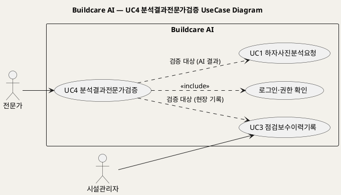
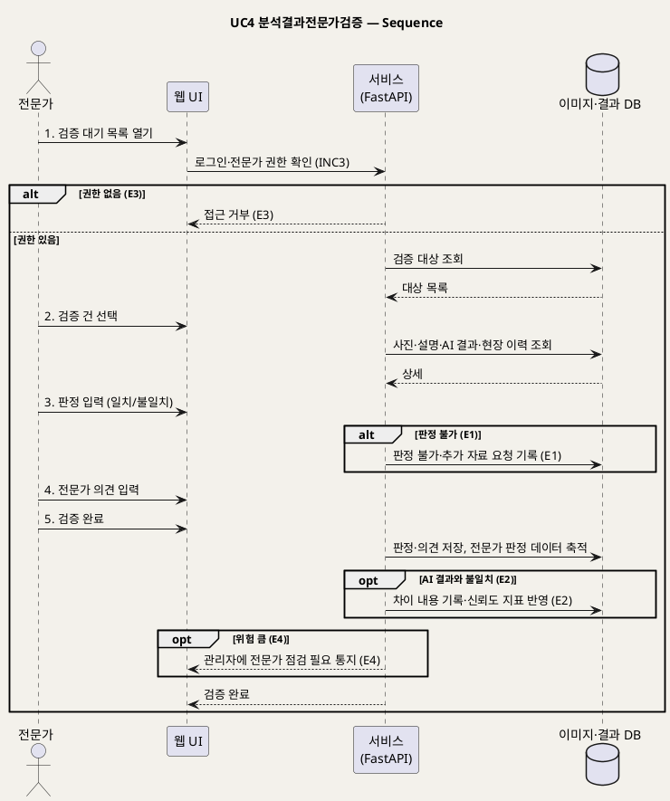

# UseCase 명세 — #4 분석결과전문가검증 (Buildcare AI 2단계)
**Buildcare AI · UC4 · UML 2.5.1 표준 (UseCase Diagram + UseCase 기술 + Sequence Diagram)**

---

> **문서 식별**: `Design/usecases/UC_04_분석결과전문가검증.md`
> **작성일**: 2026-10-02 · **표준**: UML 2.5.1 (OMG)
> **원천(SoT)**: `Intent-Specify.md` — Buildcare AI 의도명세 (`[핵심 활동] 2단계`, `[핵심 파트너] 2단계`, `[핵심 장벽] 2단계`, `[핵심 데이터] 2단계`, `[부정적 영향]`)
> **다이어그램**: 모든 PlantUML 소스는 렌더 검증 완료(HTTP 200 · image/svg+xml). 아래 링크로 브라우저에서 열 수 있다.

---

## 목차

1. 범위·개요
2. UseCase Diagram
3. Actor 카탈로그
4. UseCase 목록 (원천 매핑)
5. UseCase 기술 + Sequence Diagram
6. 업무규칙(Business Rules) 종합
7. UML 표준 준수 노트

---

## 1. 범위·개요

원천의 `[부정적 영향]` 은 AI 결과 과신의 위험에 대해 "향후 전문가 검증 데이터를 통해 신뢰도를 관리"한다고 대응책을 명시한다. 이 UC는 건축·구조·방수 전문가가 AI 분석 결과(UC1)와 현장 기록(UC3)을 검토해 **판정(일치·불일치)과 전문가 의견**을 남기고, 그 판정이 **전문가 판정 데이터**로 축적되는 과정을 다룬다.

`[핵심 장벽] 2단계` 의 "전문가 진단과 AI 결과의 차이, 데이터 부족 문제"가 이 UC의 핵심 예외 원천이다.

| 항목 | 값 |
|---|---|
| 대상 시스템 | Buildcare AI |
| 상위 프로세스 | 2단계 이력 축적 — 신뢰도 관리 |
| 원천 근거 | `[핵심 활동] 2단계` 분석 결과 검증, `[핵심 파트너] 2단계`, `[핵심 장벽] 2단계`, `[핵심 데이터] 2단계` 전문가 판정 데이터, `[부정적 영향]` |
| 핵심 UseCase | 1개 (UC4) + include 1 (로그인·권한 확인) |
| 주요 액터 | 전문가(주), 시설관리자(검증 대상 제공, 간접) |

## 2. UseCase Diagram

**[「UC4 분석결과전문가검증 UseCase Diagram」 PlantUML 뷰어로 열기](https://plantuml.sumzip.com/plantuml/svg/eNqFkj9PwkAYh_f7FG_qIoNEUidjCIKQMODGTM72KBdKS9prNDEmVTuY6OAgCRogkAgumBAgwODkR3Fsj-_gUf4E4uB2l_e59_fce5ewGbaYU9HBUQoXDtVVBVukcHiE7DI1qtjCFbjASlmzTMdQU6ZuWrCXkTOxdHKLsEtYNS-poUER6zZBOikyYCZYVCsxUKlFFEZNAzHKdALJdQycZuHHfYF86giCice9pj8c-KMv3vaC_swfuP7Q5b0m5G2SwjaBM4o1EYcQVpjwkDacBNiG9FWVWGxTe2xw790fu0Gvz1vPIZHJIbRQwYYmNKRtDwmuEYBjE2URJP1jFHYTzPaRoNPwpzPenH1P_cnTvNaA-WtNbEM2e56Sd_vHYF6rCzF-1-cf3jKLv73w4eeqeWyXl4G3n0V6MBrzhzpvjoN2158Ngs5aRkY3CC1nAAcH8VAvk1stZbS4UTQaD03gGE5OqKHojkri8U1pIXUMq5kHTy6_v4V98UTLEUS2OPkvN697vNWFpVIEJYihil_1C-QaBZ0=)** — 클릭 시 브라우저로 연결됩니다.

#### 다이어그램 쉽게 읽기 (유저 관점)

- **누가 쓰나** — 건축·구조·방수 전문가가 주인공이다. 시설관리자는 현장 기록(UC3)을 남겨 검증 재료를 제공한다.
- **무슨 순서로** — 전문가가 검증 대기 목록을 열고 → 한 건을 골라 AI 결과와 현장 기록을 비교하고 → "맞다/다르다" 판정과 자기 의견을 남긴다.
- **«include» = 항상 함께** — 검증하려면 **언제나** 로그인과 전문가 권한 확인이 먼저 일어난다.
- **«extend» = 특정 상황에서만** — 이 UC에는 조건부 확장이 없다. 점선은 검증 대상(AI 결과·현장 기록)이 어디서 오는지를 보여준다.
- **Generalization(◁)** — 이 UC에는 상속 관계가 없다.

| 기호 | 의미 |
|---|---|
| 사람 모양(actor) | 시스템 밖의 사용자 |
| 타원(usecase) | 액터가 달성하려는 목표 |
| 사각형(rectangle) | 시스템 경계 |
| 점선 `<<include>>` | 항상 포함되는 하위 행위 |
| 점선(라벨) | 검증 대상 데이터의 출처(의존) |

## 3. Actor 카탈로그

| 구분 | Actor | 이 UC에서의 역할 | 원천 근거 |
|:--:|---|---|---|
| Primary | 전문가 | AI 결과를 검증하고 판정·의견을 남긴다 | `[핵심 파트너] 2단계` 건축·구조·방수 전문가 |
| Secondary | 시설관리자 | 검증 대상 현장 기록의 작성자(간접 참여) | `[핵심 파트너] 2단계` 시설관리업체 |

## 4. UseCase 목록 (원천 매핑)

| ID | 명칭 | 유형 | 원천 근거 |
|:--:|---|:--:|---|
| UC4 | 분석결과전문가검증 | 기본 UC | `[핵심 활동] 2단계` 분석 결과 검증 |
| INC3 | 로그인·권한 확인 | «include» | `[핵심 이네이블러] 2단계` 사용자 계정, `[핵심 장벽] 3단계` 권한관리 |

## 5. UseCase 기술 + Sequence Diagram

### 5.4 UC4 분석결과전문가검증

> **쉽게 말하면** — AI가 내놓은 하자 원인과 대응방안이 맞는지 전문가가 직접 확인해 "맞다/다르다"를 기록하는 기능이다. 이 기록이 쌓일수록 AI가 어디서 자주 틀리는지 알 수 있어 서비스의 신뢰도를 관리할 수 있다.

#### 유스케이스 기술

| 속성 | 내용 |
|---|---|
| **ID** | UC4 (원천: `[핵심 활동] 2단계`) |
| **유스케이스명** | AI 분석 결과를 전문가로서 검증하고 판정을 남긴다 |
| **액터** | 주: 전문가 / 보조: 시설관리자(간접) |
| **사전조건** | (1) 전문가가 로그인되어 있고 전문가 권한을 가진다(INC3). (2) 검증 대상(UC1 분석 결과, UC3 이력 레코드)이 저장 DB에 있다. (3) 전문가 자격 확인·위촉 절차: 자료 없음 — 확인 필요. |
| **사후조건** | (1) 대상 분석 결과에 전문가 판정(일치·불일치)과 의견이 기록되었다. (2) 판정이 전문가 판정 데이터로 축적되었다(`[핵심 데이터] 2단계`). (3) AI 결과와 판정의 차이가 신뢰도 관리 지표에 반영되었다(BR-DEF-07). |
| **기본흐름** | ↓ 별도 기본흐름표 |
| **대체흐름** | A1. 전문가가 AI 결과를 수정 없이 승인한다 — 4단계 의견 입력을 생략하고 "일치"로 저장. A2. `[추론]` 전문가가 검증 대상 목록을 하자 종류(균열·누수·결로 등)로 필터링한다. |
| **예외흐름** | E1. 사진 품질·자료 부족으로 판정할 수 없다 → "판정 불가"로 표시하고 추가 자료(재촬영)를 요청한다(`[핵심 장벽] 1단계` 사진 품질, `[핵심 장벽] 2단계` 데이터 부족). E2. 전문가 판정이 AI 결과와 다르다 → 불일치 판정과 차이 내용을 별도 기록해 신뢰도 관리 데이터로 축적한다(`[핵심 장벽] 2단계` 전문가 진단과 AI 결과의 차이). E3. 전문가 권한이 없다 → 접근을 거부한다(`[핵심 장벽] 3단계` 권한관리). E4. 전문가가 위험이 크다고 판정한다 → 해당 건을 기록한 관리자에게 전문가 점검 필요를 알린다(`[부정적 영향]` 위험 시 전문가 점검 권고). |
| **포함/확장** | «include» INC3 로그인·권한 확인 |
| **우선순위** | High — `[부정적 영향]` 의 핵심 대응책(전문가 검증 데이터로 신뢰도 관리) |
| **사용빈도** | 자료 없음 — 확인 필요 |
| **업무규칙** | BR-DEF-02, BR-DEF-07, BR-DEF-08 |
| **특별 요구사항** | (1) 판정 이력의 변경 추적(`[추론]` 진단 책임 근거, `[핵심 장벽] 3단계`). (2) 건물·개인정보 접근 최소화(`[핵심 장벽] 3단계`). (3) 전문가 보상 체계: 자료 없음 — 확인 필요. |
| **비고** | 원천 추적성: `[핵심 활동] 2단계` "분석 결과 검증" / `[핵심 파트너] 2단계` 건축·구조·방수 전문가 → 주액터 / `[핵심 데이터] 2단계` 전문가 판정 데이터 → 사후조건 / `[부정적 영향]` → BR-DEF-07·E4 / `[핵심 장벽] 1·2단계` → E1·E2 / `[핵심 장벽] 3단계` → E3 |

#### 기본흐름 (Basic Flow)

| 단계 | 액터 행위 | 시스템 행위 |
|:--:|---|---|
| 1 | 전문가가 로그인 후 검증 대기 목록을 연다 | 전문가 권한을 확인하고 검증 대상 목록을 표시한다(INC3) |
| 2 | 전문가가 검증할 건을 선택한다 | 사진·사용자 설명·AI 원인·대응방안·현장 이력을 나란히 표시한다 |
| 3 | 전문가가 AI 결과를 검토하고 판정(일치·불일치)을 입력한다 | 판정을 기록한다 |
| 4 | 전문가가 원인·대응방안에 대한 전문가 의견을 입력한다 | 의견을 판정과 함께 저장한다 |
| 5 | 전문가가 검증을 완료한다 | 전문가 판정 데이터로 축적하고 AI와의 차이를 신뢰도 지표에 반영한다 |

#### Sequence Diagram

**[「UC4 분석결과전문가검증 Sequence」 PlantUML 뷰어로 열기](https://plantuml.sumzip.com/plantuml/svg/eNp1VE9P2mAYv_dTPHEXTIabyi47GBUx4bIsMe60xLxC54hYkJZsx6Kvxmwsw0QCOmrq5p9pWFYZA0w48VF27Pv0O-wppRVkuzRtn9_z-_c2nVc1ltPyW2lQ5e219XwqnUywnLz2NCKpmykly3JsC9ZZYnMjl8kryWgmncnBo-XZ5enY4hBCfcuSmXcpZQPesLQqS1pKS8uwGo2AaHHkht2w7F9dNLmod2xLtxs6XhrwRz-CFXk7LysJWZJYQiPuiQA0AUyF2PusnNMkUtFSiVSWKRohvtzBarw_Xo0_GPGauOP44fy1ElpmqrbwMj7ZB668ikpJprF1psoEM5riZwev9F7bcwZLi33Y0qIkeZIQniN2eA7TUzCwK4q63bFA3FyLMwOw0qQniTCEJHqCirOa3e6g0em1gxRgt4pOuQbOcZkGEIq_iM5OSiyt-QOs7KNRhFCMXkOfKOxLo3lot7tg31qipXsImdoNNk8PaNNfmiPztHPvFXcLgGeWc-JCaBa-9-kNvSA0fJB4Jkhs3zYBuensGg9UcKeOV5xi8nNxs9drL8TBK7LXdqocTy_Ardi8-I8BUkfeGVeenQKnWEKzTNn23PUQGl28qz4RrQPvzu3ILW8Ao_dux6HYtDsY9TgCIautIxeKpyXxrQh4coSNH0An6J7lYF9WkuOeIlNwf5hoVO1GfeBuHPssaA6POclI_3JEVgYspk5NPR6i9y1_sqg-h1uArTKaBaLJZDUISsZjHYJGyPzMeHi0vhMFiJ0mnlwPYpLwR1N8tcRnDvTtO4c1EFYVqwWfwsvvSmGNO5UqOIUuzSJD9H5Su6mLyzqViZXScD9miQoAp8ypYHD2f5OOz-Cxj7KMlOUC5ulCf6O_A_AdUA==)** — 클릭 시 브라우저로 연결됩니다.

기본흐름 단계 1~5는 메시지 `1.`~`5.` 에 1:1로 대응한다.

## 6. 업무규칙(Business Rules) 종합

| BR ID | 규칙 | 적용 UC | 근거 |
|---|---|---|---|
| BR-DEF-02 | 위험 가능성이 있는 경우 전문가 점검을 권고한다 | UC1, UC4, UC6, UC7 | `[부정적 영향]` |
| BR-DEF-07 | AI 분석 결과와 현장·전문가 판정이 다르면 검증 대상으로 등록해 신뢰도 관리 데이터로 축적한다 | UC3, UC4 | `[부정적 영향]`, `[핵심 장벽] 2단계`, `[핵심 데이터] 2단계` |
| BR-DEF-08 | 개인정보·건물정보 접근은 권한관리로 제한한다 | UC2~UC8 | `[핵심 장벽] 3단계` |

## 7. UML 표준 준수 노트

- 전문가는 시스템을 직접 조작해 목표(검증)를 달성하므로 Primary actor로 두었다.
- UC4 → UC1·UC3 점선은 검증 대상 데이터 의존이며 «include» 가 아니다 — UC1·UC3을 실행하지 않고 결과만 읽는다.
- 예외흐름 E1~E4는 시퀀스 `alt`/`opt` 에 ID를 병기했다.

---

*Buildcare AI · UC4 분석결과전문가검증 · UML 2.5.1 · 원천 `Intent-Specify.md`*
