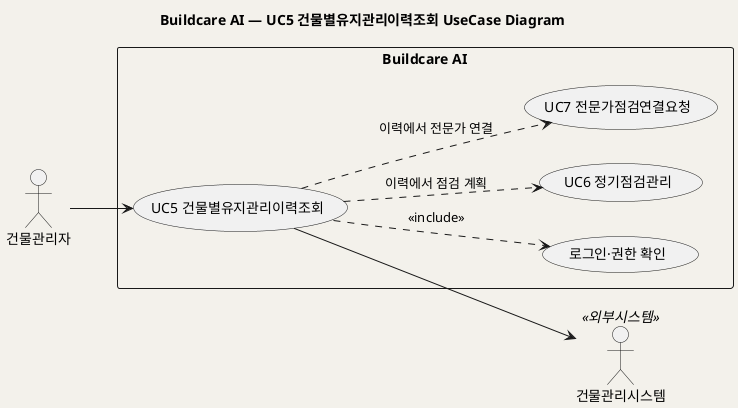
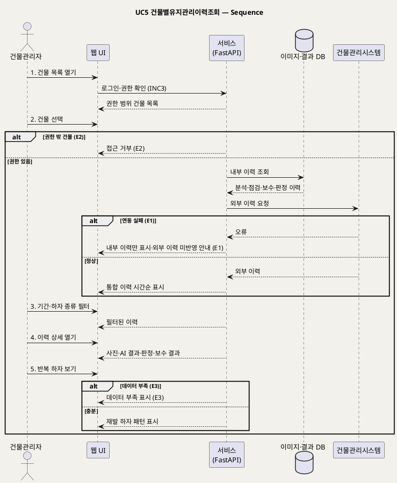

# UseCase 명세 — #5 건물별유지관리이력조회 (Buildcare AI 3단계)
**Buildcare AI · UC5 · UML 2.5.1 표준 (UseCase Diagram + UseCase 기술 + Sequence Diagram)**

---

> **문서 식별**: `Design/usecases/UC_05_건물별유지관리이력조회.md`
> **작성일**: 2026-10-02 · **표준**: UML 2.5.1 (OMG)
> **원천(SoT)**: `Intent-Specify.md` — Buildcare AI 의도명세 (`[핵심 활동] 3단계`, `[핵심 데이터] 3단계`, `[가치제안] 3단계`, `[핵심 이네이블러] 3단계`, `[핵심 장벽] 3단계`)
> **다이어그램**: 모든 PlantUML 소스는 렌더 검증 완료(HTTP 200 · image/svg+xml). 아래 링크로 브라우저에서 열 수 있다.

---

## 목차

1. 범위·개요
2. UseCase Diagram
3. Actor 카탈로그
4. UseCase 목록 (원천 매핑)
5. UseCase 기술 + Sequence Diagram
6. 업무규칙(Business Rules) 종합
7. UML 표준 준수 노트

---

## 1. 범위·개요

3단계 핵심 활동은 "건물별 유지관리 이력, 정기점검, 전문가 연결 기능을 운영"하는 것이다. 이 UC는 건물관리자가 **한 건물의 장기 유지관리 이력**(AI 분석·점검·보수·전문가 판정)을 시간순으로 보고, 같은 건물에서 **반복되는 하자**를 확인하는 행위를 다룬다.

이력은 UC1·UC3·UC4에서 쌓인 데이터와, 3단계에 연계되는 **건물관리시스템**의 데이터로 구성된다. `[핵심 장벽] 3단계` 는 기업 시스템 연동 문제와 건물정보 보안을 장벽으로 꼽으므로, 연동 실패와 권한 위반을 예외로 둔다.

| 항목 | 값 |
|---|---|
| 대상 시스템 | Buildcare AI |
| 상위 프로세스 | 3단계 유지관리 플랫폼 |
| 원천 근거 | `[핵심 활동] 3단계`, `[핵심 데이터] 3단계`, `[가치제안] 3단계`, `[핵심 이네이블러] 3단계`, `[핵심 장벽] 3단계` |
| 핵심 UseCase | 1개 (UC5) + include 1 (로그인·권한 확인) |
| 주요 액터 | 건물관리자(주), 건물관리시스템(보조) |

## 2. UseCase Diagram

**[「UC5 건물별유지관리이력조회 UseCase Diagram」 PlantUML 뷰어로 열기](https://plantuml.sumzip.com/plantuml/svg/eNqNkj1Lw0AYx_f7FA9xrihFC0WKtio41EWc5Zpc06MxkeSCgwgZ6uILdLAUS5QWfFkqxLbUDE5-FMfL5Tt4aWNp0cHxeH7_-__u4TYdhm3mHhvgqkcVlxqaim1ytLKGnDo1T7CNj6GC1bpuW66plSzDsmFpN7u7ulOcI5wa1qxTaupQxYZDkEGqDJgFNtVrDDRqE5VRy0SMMoNA8acGtvbgy7uFw9Ia8LdR1P-Ihg3hd8WLx0de9NwX96Oo-yR6Qdy5hkOHlLBDYJtiXZYihFUmbZRpMg08NBXADhTLf06vfHH5GF_4KXMAGxviLozG3mxSKCCU2GJTl6bKvKoCZwjAdYiaWCj_kp4USXI-GPV8_h6K-_DznY-v45YP8V1LHifs3n4pu9iyDqLb4mEguk0-SCvSa9cXyZwkG1E_5IE3hUU74INAdG7F4DWN5NA5QsUyZDKFiVfyiuXlwqQX8nIf1FQNVyNyD8koweSeZliik4f0he2maPgwrQI-bMSdmzkw9xtM5WDqhTaJqcmf9w1ZgCPj)** — 클릭 시 브라우저로 연결됩니다.

#### 다이어그램 쉽게 읽기 (유저 관점)

- **누가 쓰나** — 건물을 맡은 건물관리자가 주인공이다. 오른쪽 건물관리시스템은 회사가 이미 쓰고 있는 관리 시스템으로, 여기서 기존 기록을 받아온다.
- **무슨 순서로** — 건물을 고르면 → 그 건물의 분석·점검·보수 기록이 시간순으로 나오고 → 기간·하자 종류로 좁혀 보고 → 자주 반복되는 하자를 확인한다.
- **«include» = 항상 함께** — 이력을 보려면 **언제나** 로그인과 "내가 관리하는 건물인지" 확인이 먼저 일어난다.
- **«extend» = 특정 상황에서만** — 이 UC에는 조건부 확장이 없다. 점선은 이력을 보다가 정기점검(UC6)이나 전문가 연결(UC7)로 넘어갈 수 있다는 뜻이다.
- **Generalization(◁)** — 이 UC에는 상속 관계가 없다.

| 기호 | 의미 |
|---|---|
| 사람 모양(actor) | 시스템 밖의 사용자 또는 외부 시스템 |
| 타원(usecase) | 액터가 달성하려는 목표 |
| 사각형(rectangle) | 시스템 경계 |
| 점선 `<<include>>` | 항상 포함되는 하위 행위 |
| 점선(라벨) | 다른 UC로 이어지는 화면 흐름(의존) |

## 3. Actor 카탈로그

| 구분 | Actor | 이 UC에서의 역할 | 원천 근거 |
|:--:|---|---|---|
| Primary | 건물관리자 | 건물별 이력과 반복 하자를 확인한다 | `[미션] 3단계` 건물관리자의 의사결정 지원 |
| Secondary | 건물관리시스템 | 기존 건물 유지관리 데이터를 제공한다 | `[핵심 이네이블러] 3단계` 건물관리시스템 연계 |

## 4. UseCase 목록 (원천 매핑)

| ID | 명칭 | 유형 | 원천 근거 |
|:--:|---|:--:|---|
| UC5 | 건물별유지관리이력조회 | 기본 UC | `[핵심 활동] 3단계` 건물별 유지관리 이력 |
| INC3 | 로그인·권한 확인 | «include» | `[핵심 장벽] 3단계` 권한관리 |

## 5. UseCase 기술 + Sequence Diagram

### 5.5 UC5 건물별유지관리이력조회

> **쉽게 말하면** — 건물 하나를 고르면 그동안 그 건물에서 있었던 하자 분석, 점검, 보수, 전문가 판정 기록을 한 줄로 쭉 볼 수 있다. 같은 자리에서 같은 하자가 되풀이되는지도 바로 보인다.

#### 유스케이스 기술

| 속성 | 내용 |
|---|---|
| **ID** | UC5 (원천: `[핵심 활동] 3단계`, `[핵심 데이터] 3단계`) |
| **유스케이스명** | 건물별 장기 유지관리 이력과 반복 하자를 조회한다 |
| **액터** | 주: 건물관리자 / 보조: 건물관리시스템 |
| **사전조건** | (1) 건물관리자가 로그인되어 있다(INC3). (2) 조회할 건물에 대한 권한이 있다(BR-DEF-08). (3) 건물이 시스템에 등록되어 있다 — 건물 등록 절차는 자료 없음 — 확인 필요. (4) 건물관리시스템 연계가 설정되어 있다(연계 대상 시스템명·방식은 자료 없음 — 확인 필요). |
| **사후조건** | (1) 선택한 건물의 이력이 시간순으로 표시되었다. (2) 반복 하자(같은 위치·종류의 재발) 정보가 표시되었다. (3) 조회 행위는 데이터를 변경하지 않는다. |
| **기본흐름** | ↓ 별도 기본흐름표 |
| **대체흐름** | A1. 이력 화면에서 UC6 정기점검관리로 이동해 점검을 계획한다. A2. 이력 화면에서 UC7 전문가점검연결요청으로 이동한다. A3. `[추론]` 이력을 보고서 형태로 내려받는다 — 출력 형식은 자료 없음 — 확인 필요. |
| **예외흐름** | E1. 건물관리시스템 연동이 실패한다 → Buildcare AI 내부 이력만 표시하고 "외부 이력 미반영"을 알린다(`[핵심 장벽] 3단계` 기업 시스템 연동 문제). E2. 권한 밖 건물을 조회한다 → 접근을 거부한다(`[핵심 장벽] 3단계` 권한관리·건물정보 보안). E3. 이력이 없거나 적어 패턴을 판단할 수 없다 → "데이터 부족"을 표시한다(`[핵심 장벽] 2단계` 데이터 부족). |
| **포함/확장** | «include» INC3 로그인·권한 확인 |
| **우선순위** | Medium — 3단계 확장 기능, `[핵심 활동] 3단계` 명시 |
| **사용빈도** | 자료 없음 — 확인 필요 |
| **업무규칙** | BR-DEF-06, BR-DEF-08, BR-DEF-12 |
| **특별 요구사항** | (1) 건물정보 보안·권한관리(`[핵심 장벽] 3단계`). (2) 건물관리시스템 연계(`[핵심 이네이블러] 3단계`) — 연계 프로토콜 자료 없음 — 확인 필요. (3) 기업 시스템 연동 비용(`[비용] 3단계`). |
| **비고** | 원천 추적성: `[핵심 활동] 3단계` "건물별 유지관리 이력" / `[핵심 데이터] 3단계` "건물별 장기 유지관리 이력과 하자 발생 패턴" → 2·5단계 / `[가치제안] 3단계` "반복 하자를 조기에 발견" → 5단계 / `[핵심 이네이블러] 3단계` 건물관리시스템 연계 → 보조 액터 / `[핵심 장벽] 3단계` → E1·E2 / `[핵심 장벽] 2단계` → E3 |

#### 기본흐름 (Basic Flow)

| 단계 | 액터 행위 | 시스템 행위 |
|:--:|---|---|
| 1 | 건물관리자가 로그인 후 건물 목록을 연다 | 권한 범위 안의 건물 목록을 표시한다(INC3) |
| 2 | 건물관리자가 건물 하나를 선택한다 | 내부 이력과 건물관리시스템 이력을 모아 시간순으로 표시한다 |
| 3 | 건물관리자가 기간·하자 종류로 필터링한다 | 조건에 맞는 이력만 다시 표시한다 |
| 4 | 건물관리자가 특정 이력 항목을 연다 | 사진·AI 결과·전문가 판정·보수 결과 상세를 표시한다 |
| 5 | 건물관리자가 반복 하자 보기를 선택한다 | 같은 위치·종류로 재발한 하자 패턴을 표시한다 |

#### Sequence Diagram

**[「UC5 건물별유지관리이력조회 Sequence」 PlantUML 뷰어로 열기](https://plantuml.sumzip.com/plantuml/svg/eNptVMFP2nAUvveveHEXOWimzMsORkFNOLgsMe60xPyEzhGxKC3ZFbUuZGKGiZ3VFQOLzrmwrEKFmnjyT9mxv9f_Ya-0BYoeIKHve9_3vfe9MicrrKAUt3Igiztr68VsLpNmBXHt5Ywgb2albVZgW7DO0psbhXxRyiTzuXwBXizFl6YWE0MI-SPL5D9lpQ34wHKyKChZJSfCanIGnFuLNx94W0Wjjtclxyrxn02sWbx-hQ3TPa_Av9IJrIg7RVFKi4LA0gopjPltAfqiOgZMhsSyQGpKNp3dZpICY_j9HlZTvdJqaqSkGvxexS-X76XxJSYr829TsR5w5V1SyDCFrTNZJBj5-GuTrceu0zKd9gMsJHqwhUSUL2Ln0CBi98AITK0IQmIZJmbJBLyGqclgZOC_b3ijBnhqObYpUJEgJE8Y3jCcro01m2Q7FVczwD3T6CeMp94k4zHBQ02EhAGCt07QUKPcw7rTfV1U6-5-TWA5pd9rfguL44vTMQEgooD1Y6f7QAiTd0o-QqQQw268KGOtEjbN0m68EfYsD-wHCX6SBKHaxGDMjopq7bGL9arTohXztoVl_bHrVqpY14LeAS9t0jNzZg8Tn59g6w9hvGnw1ORfzwAPL93KL_I55U0Cvb6BKOqX_ErvFSJDRgzz6wq4xwYlSe4ignQO3NRR3wXUytQTyvQWQq5xf_c50WGOp9ru5ztXu-nPdGg4poplI7DgsUsZwePspxmnNG2TYLQtTacXAPDHAc0Frqa6qjmaoP-UV42BhSGyV5N96f1dVO3wJEfPYK-J1yQ4nwL_ZQiTCpMLHkfJZybpvHTevoPAKGF9ci8yfmSSNHmjYyhh45bWGY89E84ozN9MiPaX37mhg3raixdNbhqhOl2Gq1rRzXqfOfqif7n_tbpJYQ==)** — 클릭 시 브라우저로 연결됩니다.

기본흐름 단계 1~5는 메시지 `1.`~`5.` 에 1:1로 대응한다.

## 6. 업무규칙(Business Rules) 종합

| BR ID | 규칙 | 적용 UC | 근거 |
|---|---|---|---|
| BR-DEF-06 | 점검·보수 이력 레코드는 건물 유형·위치·하자 종류·보수 결과를 필수로 포함한다 | UC3, UC5 | `[핵심 데이터] 2단계` |
| BR-DEF-08 | 개인정보·건물정보 접근은 권한관리로 제한한다 | UC2~UC8 | `[핵심 장벽] 3단계` |
| BR-DEF-12 | 반복 하자·우선순위 판단은 건물별 장기 유지관리 이력과 하자 발생 패턴에 근거한다 | UC5, UC8 | `[핵심 데이터] 3단계`, `[가치제안] 3단계` |

## 7. UML 표준 준수 노트

- 건물관리시스템은 경계 밖 Secondary actor, 시퀀스에서 별도 lifeline으로 분리했다.
- UC5 → UC6·UC7 점선은 화면 이동 의존이며 «extend» 로 보지 않았다 — UC6·UC7은 독립 목표로 단독 실행 가능하다.
- 조회 UC이므로 사후조건에 "데이터 비변경"을 명시했다.

---

*Buildcare AI · UC5 건물별유지관리이력조회 · UML 2.5.1 · 원천 `Intent-Specify.md`*
