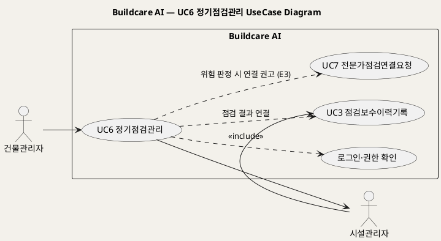
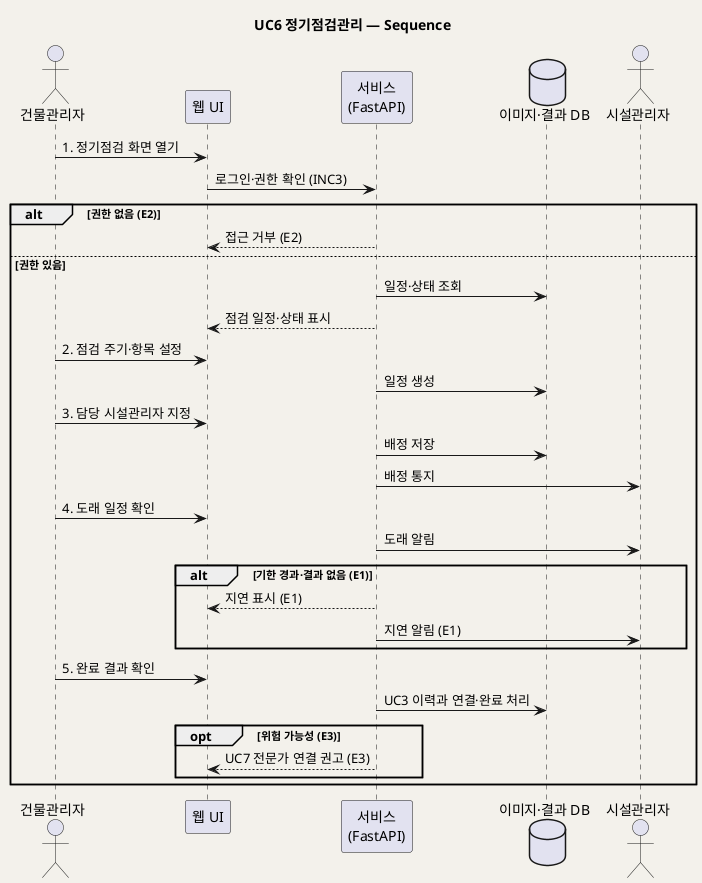

# UseCase 명세 — #6 정기점검관리 (Buildcare AI 3단계)
**Buildcare AI · UC6 · UML 2.5.1 표준 (UseCase Diagram + UseCase 기술 + Sequence Diagram)**

---

> **문서 식별**: `Design/usecases/UC_06_정기점검관리.md`
> **작성일**: 2026-10-02 · **표준**: UML 2.5.1 (OMG)
> **원천(SoT)**: `Intent-Specify.md` — Buildcare AI 의도명세 (`[핵심 활동] 3단계`, `[혜택] 3단계`, `[부정적 영향]`)
> **다이어그램**: 모든 PlantUML 소스는 렌더 검증 완료(HTTP 200 · image/svg+xml). 아래 링크로 브라우저에서 열 수 있다.

---

## 목차

1. 범위·개요
2. UseCase Diagram
3. Actor 카탈로그
4. UseCase 목록 (원천 매핑)
5. UseCase 기술 + Sequence Diagram
6. 업무규칙(Business Rules) 종합
7. UML 표준 준수 노트

---

## 1. 범위·개요

원천은 3단계 핵심 활동으로 "정기점검"을, 3단계 혜택으로 "예방정비 확대"를 든다. 이 UC는 건물관리자가 건물별 **정기점검 일정을 세우고, 담당자를 배정하고, 점검 완료 여부를 추적**하는 행위를 다룬다. 실제 현장 기록은 UC3 점검보수이력기록에서 이루어지며, 이 UC는 그 기록을 일정에 연결해 완료를 관리한다.

원천에는 점검 주기·점검 항목·알림 수단이 **없다**. 해당 값은 `자료 없음 — 확인 필요` 로 둔다. `[부정적 영향]` 이 "점검 지연"을 위험으로 명시하므로 기한 경과를 핵심 예외로 둔다.

| 항목 | 값 |
|---|---|
| 대상 시스템 | Buildcare AI |
| 상위 프로세스 | 3단계 유지관리 플랫폼 |
| 원천 근거 | `[핵심 활동] 3단계` 정기점검, `[혜택] 3단계` 예방정비 확대, `[부정적 영향]` 점검 지연 |
| 핵심 UseCase | 1개 (UC6) + include 1 (로그인·권한 확인) |
| 주요 액터 | 건물관리자(주), 시설관리자(보조, 점검 수행) |

## 2. UseCase Diagram

**[「UC6 정기점검관리 UseCase Diagram」 PlantUML 뷰어로 열기](https://plantuml.sumzip.com/plantuml/svg/eNptkj9Lw0AYh_f7FC9x0aGiBCyIBE014FC3znJNzngYE0kuOIjQoYNghw4W_9BKCupUobZFMzj5URwv1-_gJWklFbfkfs-9zy8v2Q4Y9ll46kBoHtZD6lgm9snh2gYKTqh7hn18CnVsnti-F7pWxXM8H5YM1Vjf0wtEcIwt75y6NhxhJyDIIUcMmAc-tY8ZWNQnJqOeixhlDgF9roGdffhu3ECtsgEi6vB4KKI2HzX4pJG8DKAWkAoOCOxSbEsLQthkUq_wt0ky-Mwh8dhWAAegV-epuO6K5tNialQRSjtg15Z-pVhAgQsEEAbETFXK_1WyITIqkkm_yz9i0Yu_Pvh7a9rpwvS-I18zdv-goi6OVSEfmIwn4upO9CZJ9CwtSb83G_6HL0u-mQxiPmzkF8XtkI-G4uFGjF5nV8roEiG9CqWSlrVLy6fP8nON-amana6ualkn2IStLeqaTmgRTfuNalmSe0Ba-PgTcl8BKadItzm9vYNpqy2XBHLVMwzkCvg4guU9dQVtE9eSf9QPTdcA5w==)** — 클릭 시 브라우저로 연결됩니다.

#### 다이어그램 쉽게 읽기 (유저 관점)

- **누가 쓰나** — 건물관리자가 점검 일정을 세우고, 시설관리자가 배정을 받아 실제 점검을 한다.
- **무슨 순서로** — 건물을 고르고 → 점검 주기와 항목을 정하고 → 담당 시설관리자를 지정하면 → 날짜가 다가올 때 알려주고 → 시설관리자가 점검 기록(UC3)을 올리면 완료로 바뀐다.
- **«include» = 항상 함께** — 일정을 다루려면 **언제나** 로그인과 건물 권한 확인이 먼저 일어난다.
- **«extend» = 특정 상황에서만** — 이 UC에는 표준 «extend» 가 없다. 점검 결과가 위험하면 전문가 연결(UC7)을 권하는 연결선이 있다.
- **Generalization(◁)** — 이 UC에는 상속 관계가 없다.

| 기호 | 의미 |
|---|---|
| 사람 모양(actor) | 시스템 밖의 사용자 |
| 타원(usecase) | 액터가 달성하려는 목표 |
| 사각형(rectangle) | 시스템 경계 |
| 점선 `<<include>>` | 항상 포함되는 하위 행위 |
| 점선(라벨) | 다른 UC와의 데이터 연결·조건부 인계(의존) |

## 3. Actor 카탈로그

| 구분 | Actor | 이 UC에서의 역할 | 원천 근거 |
|:--:|---|---|---|
| Primary | 건물관리자 | 정기점검 일정을 계획·배정·추적한다 | `[미션] 3단계`, `[핵심 활동] 3단계` |
| Secondary | 시설관리자 | 배정받은 점검을 수행하고 UC3으로 기록한다 | `[핵심 파트너] 2단계` 시설관리업체, `[혜택] 2단계` |

## 4. UseCase 목록 (원천 매핑)

| ID | 명칭 | 유형 | 원천 근거 |
|:--:|---|:--:|---|
| UC6 | 정기점검관리 | 기본 UC | `[핵심 활동] 3단계` 정기점검 |
| INC3 | 로그인·권한 확인 | «include» | `[핵심 장벽] 3단계` 권한관리 |

## 5. UseCase 기술 + Sequence Diagram

### 5.6 UC6 정기점검관리

> **쉽게 말하면** — 건물마다 "언제, 무엇을 점검할지" 일정을 잡아 두고 담당자를 정해 두면, 시스템이 때가 되면 알려주고 점검이 끝났는지 챙겨 준다. 점검이 밀리면 바로 눈에 띄게 표시한다.

#### 유스케이스 기술

| 속성 | 내용 |
|---|---|
| **ID** | UC6 (원천: `[핵심 활동] 3단계`) |
| **유스케이스명** | 건물별 정기점검 일정을 계획하고 완료를 추적한다 |
| **액터** | 주: 건물관리자 / 보조: 시설관리자 |
| **사전조건** | (1) 건물관리자가 로그인되어 있다(INC3). (2) 대상 건물에 대한 관리 권한이 있다(BR-DEF-08). (3) 배정 가능한 시설관리자 계정이 있다. |
| **사후조건** | (1) 건물의 정기점검 일정(주기·항목·담당자)이 저장되었다. (2) 담당 시설관리자에게 배정이 통지되었다. (3) 완료된 점검은 UC3 이력 레코드와 연결되어 완료 상태로 바뀌었다. |
| **기본흐름** | ↓ 별도 기본흐름표 |
| **대체흐름** | A1. 기존 일정을 수정·취소한다 — 2단계에서 기존 일정을 불러와 변경. A2. `[추론]` UC5 이력 화면의 반복 하자를 근거로 점검 항목을 추가한다. |
| **예외흐름** | E1. 점검 기한이 지났는데 결과가 없다 → "지연"으로 표시하고 건물관리자·담당자에게 알린다(`[부정적 영향]` 점검 지연). E2. 권한 밖 건물의 일정에 접근한다 → 거부한다(`[핵심 장벽] 3단계` 권한관리). E3. 점검 결과에 위험 가능성이 있다 → UC7 전문가점검연결요청을 권고한다(`[부정적 영향]` 위험 시 전문가 점검 권고). |
| **포함/확장** | «include» INC3 로그인·권한 확인 |
| **우선순위** | Medium — 3단계 확장 기능, `[혜택] 3단계` 예방정비 확대의 수단 |
| **사용빈도** | 자료 없음 — 확인 필요 (점검 주기 미정) |
| **업무규칙** | BR-DEF-02, BR-DEF-08 |
| **특별 요구사항** | (1) 점검 주기·항목 기준: 자료 없음 — 확인 필요. (2) 알림 수단(메일·앱 푸시 등): 자료 없음 — 확인 필요. (3) 분석 자동화와의 연계(`[핵심 이네이블러] 3단계`) — 범위 자료 없음 — 확인 필요. |
| **비고** | 원천 추적성: `[핵심 활동] 3단계` "정기점검" / `[혜택] 3단계` "예방정비 확대" / `[부정적 영향]` "점검 지연" → E1, "전문가 점검 권고" → E3 / `[핵심 장벽] 3단계` → E2 / UC3 → 5단계 결과 연결 |

#### 기본흐름 (Basic Flow)

| 단계 | 액터 행위 | 시스템 행위 |
|:--:|---|---|
| 1 | 건물관리자가 로그인 후 건물의 정기점검 화면을 연다 | 권한을 확인하고 현재 점검 일정·상태를 표시한다(INC3) |
| 2 | 건물관리자가 점검 주기와 점검 항목을 설정한다 | 일정을 생성한다(주기·항목 기준 자료 없음 — 확인 필요) |
| 3 | 건물관리자가 담당 시설관리자를 지정한다 | 담당자를 배정하고 배정 사실을 통지한다 |
| 4 | 건물관리자가 다가오는 점검 일정을 확인한다 | 도래 일정을 표시하고 담당자에게 알린다 |
| 5 | 건물관리자가 완료된 점검 결과를 확인한다 | UC3에서 기록된 결과를 일정에 연결하고 완료로 처리한다 |

#### Sequence Diagram

**[「UC6 정기점검관리 Sequence」 PlantUML 뷰어로 열기](https://plantuml.sumzip.com/plantuml/svg/eNptlM9qGlEUxvfzFAe70UWkxjaFLkKqieDCUgh2VQhXnaYSMxpnpNspDqFEIQlENO0ohsSUFEtHY-MI042P0uXcO-_QM_9MnGThgHN-53zf_c5lNkSJVKXafglE_mAnVyuWCnlS5Xeer3HiXlGokCrZhxzJ7-1WyzWhkCyXylV4loqnYluJB4T4iRTKn4vCLnwkJZHnpKJU4iGbXAPWb5m6xvon5lg2JzK9HsI_-Qy2-YMaL-R5jiN5CUeGzNGEDg2XYL2TEBAREhkOx0vFfLFCBAlC7PsMsmmnlE0HSopKZwo7uvoghFNElN68S0cccPt9kisQieSIyCPWndDfOvshz6fmWDNvDdhMONhmwjfCGipTrpaNpDIcl8jAyjrqwmuIRZeOBdb5Gb2ZAGtP8B2HCIKoiyS9UM2pzro66t01rZaKbAv_Qjj9NhmPcKQkgVdg7UPWbUJ4azXCgdO-4uux_qk5NcAcafROdgkeU1509r5ip9-0jmexe7oGepxPWf2LVUfmQrO-NR8PdvwHWOtUxRCQfXDk1egCvjTwlPOp1fpFf94AZoW9T4oDq3eZMloeFI8CbUxoYwaBoAG38ngS1TRnUl9mvcF9LZW5r1mHf7B1WeUFqhwrtNfxrbixBwd4SKtJrw2sOdvQNTtTc_wXb8filiyWE7OXE0wRjbc1L7YA4yl5iKvkI7xQWHb9EkM-V-hlEzzZoGsnkmwyDvY97g9cZxrCuDu3kY07GCd2lCsSMFWx2h0wNZkeDXATKBx_wn82-QoDVuhQR9IbaN8t87bvd9hW7d8GPvBj8R8gsOJL)** — 클릭 시 브라우저로 연결됩니다.

기본흐름 단계 1~5는 메시지 `1.`~`5.` 에 1:1로 대응한다.

## 6. 업무규칙(Business Rules) 종합

| BR ID | 규칙 | 적용 UC | 근거 |
|---|---|---|---|
| BR-DEF-02 | 위험 가능성이 있는 경우 전문가 점검을 권고한다 | UC1, UC4, UC6, UC7 | `[부정적 영향]` |
| BR-DEF-08 | 개인정보·건물정보 접근은 권한관리로 제한한다 | UC2~UC8 | `[핵심 장벽] 3단계` |

## 7. UML 표준 준수 노트

- 시설관리자는 이 UC에서 통지를 받는 보조 액터이므로 시퀀스에서 actor lifeline으로 두었다.
- UC6 → UC3 은 결과 데이터 의존, UC6 → UC7 은 조건부 권고 의존으로 표기했다 — 두 UC 모두 다른 액터의 독립 목표이므로 «include» 가 아니다.
- 점검 주기·알림 수단은 원천에 없어 수치를 만들지 않았다.

---

*Buildcare AI · UC6 정기점검관리 · UML 2.5.1 · 원천 `Intent-Specify.md`*
