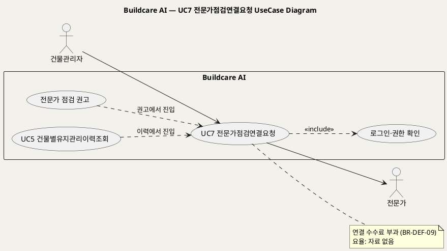
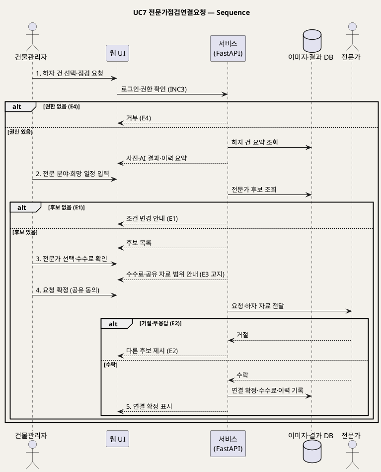

# UseCase 명세 — #7 전문가점검연결요청 (Buildcare AI 3단계)
**Buildcare AI · UC7 · UML 2.5.1 표준 (UseCase Diagram + UseCase 기술 + Sequence Diagram)**

---

> **문서 식별**: `Design/usecases/UC_07_전문가점검연결요청.md`
> **작성일**: 2026-10-02 · **표준**: UML 2.5.1 (OMG)
> **원천(SoT)**: `Intent-Specify.md` — Buildcare AI 의도명세 (`[핵심 활동] 3단계`, `[핵심 파트너] 3단계`, `[수익] 3단계`, `[혜택] 3단계`, `[비용] 3단계`, `[부정적 영향]`)
> **다이어그램**: 모든 PlantUML 소스는 렌더 검증 완료(HTTP 200 · image/svg+xml). 아래 링크로 브라우저에서 열 수 있다.

---

## 목차

1. 범위·개요
2. UseCase Diagram
3. Actor 카탈로그
4. UseCase 목록 (원천 매핑)
5. UseCase 기술 + Sequence Diagram
6. 업무규칙(Business Rules) 종합
7. UML 표준 준수 노트

---

## 1. 범위·개요

원천의 3단계는 "전문가 연결 기능"(핵심 활동), "전문가 점검 연계"(핵심 파트너), "전문가 점검 연결 수수료"(수익), "전문가 출동 효율화"(혜택)를 명시한다. 이 UC는 건물관리자가 하자 건에 대해 **건축·구조·방수 전문가의 현장 점검을 요청하고 연결을 확정**하는 행위를 다룬다.

`[부정적 영향]` 이 위험 가능성 시 전문가 점검을 권고하라고 하므로, UC1(EXT1)·UC4(E4)·UC6(E3)의 권고가 이 UC로 이어진다. 연결 수수료의 요율·정산 방식, 전문가 선정 기준은 원천에 **없다**.

| 항목 | 값 |
|---|---|
| 대상 시스템 | Buildcare AI |
| 상위 프로세스 | 3단계 유지관리 플랫폼 — 전문가 연계 |
| 원천 근거 | `[핵심 활동] 3단계`, `[핵심 파트너] 3단계`, `[수익] 3단계`, `[혜택] 3단계`, `[비용] 3단계`, `[부정적 영향]` |
| 핵심 UseCase | 1개 (UC7) + include 1 (로그인·권한 확인) |
| 주요 액터 | 건물관리자(주), 전문가(보조) |

## 2. UseCase Diagram

**[「UC7 전문가점검연결요청 UseCase Diagram」 PlantUML 뷰어로 열기](https://plantuml.sumzip.com/plantuml/svg/eNqFkk9LG0EYxu_zKV7WS3uIKCJSkWA3JuDBHkqF3mTcnayD667szlKhFPYQpYccclBiZRNWitpDhJgEzcGTH6XH2TffoTOb1caTMIf588zz_N53Zj0UNBDRgQuRtbMbcde2aMB2FlZIuM-9QxrQA9il1r4T-JFnV3zXD2CutlRbrJozinCP2v437jlQp27IiMvqAoQPAXf2BNg8YJbgvkcEFy4D8zkGPm7C3_gUtisrgGkj641lP8a0JQcxtvty0MeLUxzcwnbIKjRksMGpo-IIoZZQHIa8G2W9RzmKs-sedlsG0BDMrefTF8d8v3p0yAJBiEahnqMwjFkOA74TgChklg4y3iDKHZVm9kp2mciHMXbGTw_yvjk5S2Dy60wtc-3mp8rSrPjFG6bmoK7IYTol_fpl8TXLMkwrzYYNTFK8iYuSO6MsvcLL_uSiWRAtkx-EmFtQKpVzPl2HnhfV6-X8fDnHgVVYW-Oe5UY2K5eJTs3PtGa14MF2CxsJ4E0Du8dEg_xXFOmvFMTzBSte3a8XHZo2DvDnuRrZ7yZk97EcPsI783Npo1orLXx4r1WqsckfZdttaQ22T7DTJMyzQXuSdTVTv_QfZkQtjQ==)** — 클릭 시 브라우저로 연결됩니다.

#### 다이어그램 쉽게 읽기 (유저 관점)

- **누가 쓰나** — 건물관리자가 전문가 점검을 요청하고, 오른쪽의 전문가가 요청을 받아 수락한다.
- **무슨 순서로** — 하자 건을 고르고 → 필요한 분야(건축·구조·방수)와 희망 일정을 적고 → 후보 전문가 중 한 명을 골라 수수료를 확인하고 → 요청하면 → 전문가가 수락해 연결이 확정된다.
- **«include» = 항상 함께** — 요청하려면 **언제나** 로그인과 건물 권한 확인이 먼저 일어난다.
- **«extend» = 특정 상황에서만** — 이 UC에는 표준 «extend» 가 없다. "전문가 점검 권고"를 받았거나 건물 이력을 보다가 이 UC로 들어올 수 있다는 진입 경로를 점선으로 표시했다.
- **Generalization(◁)** — 이 UC에는 상속 관계가 없다.

| 기호 | 의미 |
|---|---|
| 사람 모양(actor) | 시스템 밖의 사용자 |
| 타원(usecase) | 액터가 달성하려는 목표 |
| 사각형(rectangle) | 시스템 경계 |
| 점선 `<<include>>` | 항상 포함되는 하위 행위 |
| 점선(라벨) | 이 UC로 들어오는 진입 경로(의존) |
| note | 관련 업무규칙 |

## 3. Actor 카탈로그

| 구분 | Actor | 이 UC에서의 역할 | 원천 근거 |
|:--:|---|---|---|
| Primary | 건물관리자 | 전문가 점검을 요청하고 연결을 확정한다 | `[미션] 3단계`, `[핵심 활동] 3단계` |
| Secondary | 전문가 | 요청을 받아 수락·거절한다 | `[핵심 파트너] 2·3단계` 건축·구조·방수 전문가, 전문가 점검 연계 |

## 4. UseCase 목록 (원천 매핑)

| ID | 명칭 | 유형 | 원천 근거 |
|:--:|---|:--:|---|
| UC7 | 전문가점검연결요청 | 기본 UC | `[핵심 활동] 3단계` 전문가 연결 |
| INC3 | 로그인·권한 확인 | «include» | `[핵심 장벽] 3단계` 권한관리 |

## 5. UseCase 기술 + Sequence Diagram

### 5.7 UC7 전문가점검연결요청

> **쉽게 말하면** — AI 분석이나 점검 결과가 걱정스러울 때, 앱 안에서 바로 건축·구조·방수 전문가에게 현장 점검을 부탁할 수 있다. 전문가가 수락하면 연결이 확정되고, 이때 연결 수수료가 붙는다.

#### 유스케이스 기술

| 속성 | 내용 |
|---|---|
| **ID** | UC7 (원천: `[핵심 활동] 3단계`, `[수익] 3단계`) |
| **유스케이스명** | 하자 건에 대해 전문가 현장 점검을 요청하고 연결을 확정한다 |
| **액터** | 주: 건물관리자 / 보조: 전문가 |
| **사전조건** | (1) 건물관리자가 로그인되어 있다(INC3). (2) 대상 건물·하자 건에 대한 권한이 있다(BR-DEF-08). (3) 요청 대상 하자 건(UC1 분석 결과 또는 UC5 이력 항목)이 존재한다. (4) 연결 가능한 전문가가 등록되어 있다 — 전문가 등록·자격 절차는 자료 없음 — 확인 필요. |
| **사후조건** | (1) 전문가가 요청을 수락해 연결이 확정되었다. (2) 하자 자료가 전문가에게 공유되었다. (3) 연결 수수료가 기록되었다(BR-DEF-09). (4) 연결 이력이 건물 유지관리 이력(UC5)에 남았다. |
| **기본흐름** | ↓ 별도 기본흐름표 |
| **대체흐름** | A1. UC1 결과의 "전문가 점검 권고"(EXT1)에서 바로 진입한다 — 1단계의 하자 건이 자동 선택된다. A2. `[추론]` 일반 사용자의 연결 요청 허용 여부 — 원천은 3단계 B2B 맥락만 언급, 자료 없음 — 확인 필요. |
| **예외흐름** | E1. 조건(분야·일정)에 맞는 전문가가 없다 → 조건 변경을 안내한다(`[추론]` `[비용] 3단계` 전문가 네트워크 운영 규모). E2. 전문가가 거절하거나 응답하지 않는다 → 다른 후보를 제시한다(`[추론]` 연결 서비스 일반 실패모드). E3. 하자 자료 공유에 개인정보·건물정보가 포함된다 → 공유 범위를 고지하고 동의를 받은 뒤 전달한다(`[핵심 장벽] 3단계` 개인정보·건물정보 보안, 고지). E4. 권한이 없는 건물의 건을 요청한다 → 거부한다(`[핵심 장벽] 3단계` 권한관리). |
| **포함/확장** | «include» INC3 로그인·권한 확인 |
| **우선순위** | Medium — 3단계 확장 기능이나 `[부정적 영향]` 대응과 수수료 수익의 접점 |
| **사용빈도** | 자료 없음 — 확인 필요 |
| **업무규칙** | BR-DEF-02, BR-DEF-08, BR-DEF-09, BR-DEF-11 |
| **특별 요구사항** | (1) 공유 자료의 접근 통제(`[핵심 장벽] 3단계`). (2) 수수료 요율·정산 주기: 자료 없음 — 확인 필요. (3) 전문가 출동 효율화(`[혜택] 3단계`) — 목표 지표 자료 없음 — 확인 필요. |
| **비고** | 원천 추적성: `[핵심 활동] 3단계` "전문가 연결" / `[핵심 파트너] 3단계` "전문가 점검 연계" → 보조 액터 / `[수익] 3단계` "전문가 점검 연결 수수료" → 3·5단계, BR-DEF-09 / `[혜택] 3단계` "전문가 출동 효율화" / `[부정적 영향]` → A1 진입 / `[핵심 장벽] 3단계` → E3·E4 |

#### 기본흐름 (Basic Flow)

| 단계 | 액터 행위 | 시스템 행위 |
|:--:|---|---|
| 1 | 건물관리자가 하자 건을 선택하고 [전문가 점검 요청]을 누른다 | 권한을 확인하고 하자 건 요약(사진·AI 결과·이력)을 표시한다(INC3) |
| 2 | 건물관리자가 필요한 전문 분야와 희망 일정을 입력한다 | 조건에 맞는 전문가 후보를 제시한다 |
| 3 | 건물관리자가 전문가를 선택하고 연결 수수료를 확인한다 | 연결 수수료와 공유될 자료 범위를 안내한다 |
| 4 | 건물관리자가 요청을 확정한다 | 전문가에게 요청과 하자 자료를 전달한다 |
| 5 | 건물관리자가 수락 결과를 확인한다 | 전문가 수락을 받아 연결을 확정하고 수수료·연결 이력을 기록한다 |

#### Sequence Diagram

**[「UC7 전문가점검연결요청 Sequence」 PlantUML 뷰어로 열기](https://plantuml.sumzip.com/plantuml/svg/eNp1VN9L22AUfc9fcXEv7YNlWoewB9FWhT44BuKeBPlsM1esqTYp22Nw2ShrYQoGqyaSMl3ZyFhsq62gL_1T9pjvy_-wm5-mYYO20Nxz7j3n3EsWRYnUpPpeBUT-YGu7Xq6UiqTGbz2f58TdsrBPamQPtklxd6dWrQulfLVSrcGz1ezqzEouhhDfkVL1fVnYgbekIvKcVJYqPGzk54EZCjVHtiUz48juyezUsnsWOz9hvV_wRz6Bdf6gzgtFnuNIUcLeU_bNgJoP9kCm3012eTQFRITcGodzpHKxvE8ECabYxT1sFLzSRiFRUjR6r7AvV5tCapWI0tLrQtoDrr_JcyUikW0i8gjTB_T3iHXl8RD12P0HWM55sOVcKCRS7j1f-bDP1ySOy63B9AJOhZcwkwFHbaNGQM3AFMP5qI-Hvk_wLXIIRDjORjztaPZwxPQRzrxrOaoGzpmKfyFVeJXPpjlSkSAosNPPTG9BamUuzYFHnw6n2jcWvZP9Eo9ZR5TLBlJC9AIaQXBcHwpSH4F1LOe8lWzKDk3WVcbDpQL4caAPTMi4DmiIjxmfzQRrBXqnMBXBjm7Srg5Mf2CGilI-ITUhJYoTnAuF9gdPSlzf4bPQ94zrOymyY7lGaF-2e2hEbdDDQQj1kgibhEkk-EGZ_vxBO7pXjnnKZmIKo1022vih31rBpv6hKUTgTvu3TDNw-pFLoL0TpilPKrNg9w28t3Ry8FwmuBVvBqaXChrRr2dMb8dyWAiO0B3rMTB3f7_BTNdA0_QI3i3dWMxojIfUHDD9mDZvUcas3w_CVtPRdfrooDrhkTav6PUoStfQWFN7auUl72agP_6v9UR14ia8t0FgPBZ3dH32yAp3lRD1IjPJBufY1eVLEkqc_-t-F_EHX3B_AXuyN4E=)** — 클릭 시 브라우저로 연결됩니다.

기본흐름 단계 1~5는 메시지 `1.`~`5.` 에 1:1로 대응한다.

## 6. 업무규칙(Business Rules) 종합

| BR ID | 규칙 | 적용 UC | 근거 |
|---|---|---|---|
| BR-DEF-02 | 위험 가능성이 있는 경우 전문가 점검을 권고한다 | UC1, UC4, UC6, UC7 | `[부정적 영향]` |
| BR-DEF-08 | 개인정보·건물정보 접근은 권한관리로 제한한다 | UC2~UC8 | `[핵심 장벽] 3단계` |
| BR-DEF-09 | 전문가 점검 연결이 확정되면 연결 수수료를 부과한다 (요율 자료 없음 — 확인 필요) | UC7 | `[수익] 3단계` |
| BR-DEF-11 | 진단 책임 범위와 정보 공유 범위를 고지한다 | UC1, UC7, UC8 | `[핵심 장벽] 3단계` 진단 책임·고지 |

## 7. UML 표준 준수 노트

- 전문가는 이 UC에서 요청을 받는 보조 액터로, 시퀀스에서 actor lifeline으로 분리했다.
- EXT1·UC5 → UC7 점선은 진입 경로 의존이다. EXT1(전문가 점검 권고)은 UC1을 확장하는 «extend» 이며 UC7과는 별개 관계다.
- 수수료 요율은 원천에 없어 note에 "자료 없음"으로만 표기했다.

---

*Buildcare AI · UC7 전문가점검연결요청 · UML 2.5.1 · 원천 `Intent-Specify.md`*
