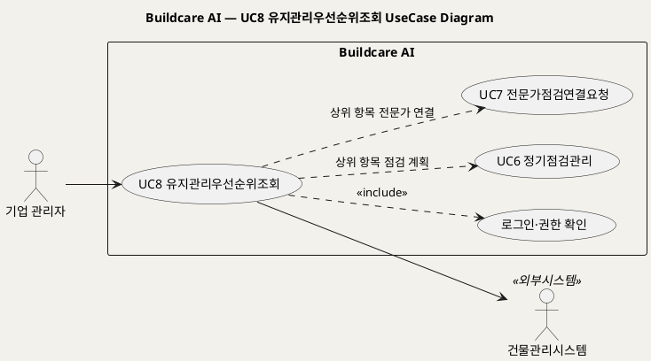
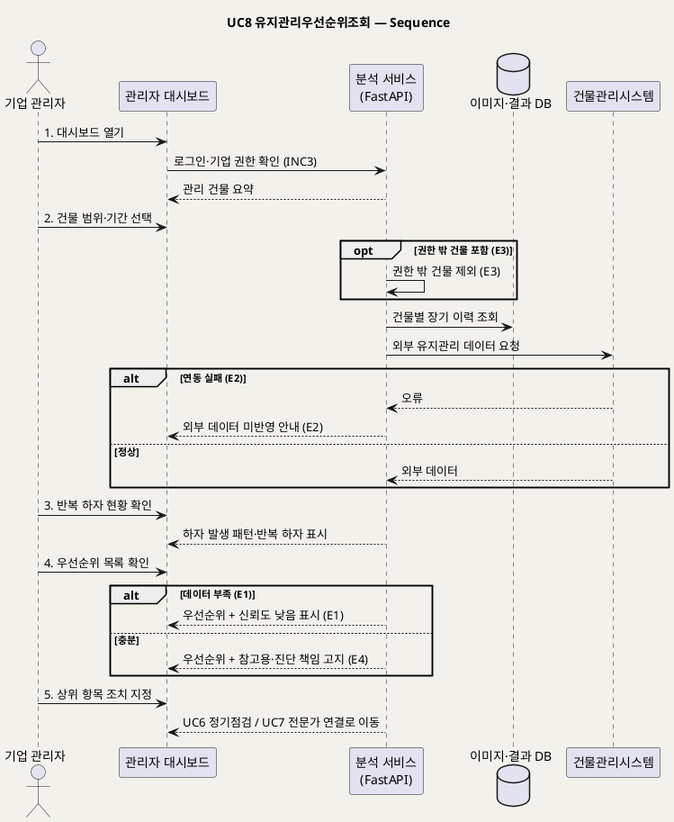

# UseCase 명세 — #8 유지관리우선순위조회 (Buildcare AI 3단계)
**Buildcare AI · UC8 · UML 2.5.1 표준 (UseCase Diagram + UseCase 기술 + Sequence Diagram)**

---

> **문서 식별**: `Design/usecases/UC_08_유지관리우선순위조회.md`
> **작성일**: 2026-10-02 · **표준**: UML 2.5.1 (OMG)
> **원천(SoT)**: `Intent-Specify.md` — Buildcare AI 의도명세 (`[미션] 3단계`, `[가치제안] 3단계`, `[핵심 이네이블러] 3단계`, `[핵심 데이터] 3단계`, `[수익] 3단계`, `[핵심 장벽] 3단계`)
> **다이어그램**: 모든 PlantUML 소스는 렌더 검증 완료(HTTP 200 · image/svg+xml). 아래 링크로 브라우저에서 열 수 있다.

---

## 목차

1. 범위·개요
2. UseCase Diagram
3. Actor 카탈로그
4. UseCase 목록 (원천 매핑)
5. UseCase 기술 + Sequence Diagram
6. 업무규칙(Business Rules) 종합
7. UML 표준 준수 노트

---

## 1. 범위·개요

3단계 미션은 "건물관리자의 의사결정을 지원하는 AI 유지관리 플랫폼"이고, 가치제안은 "반복 하자를 조기에 발견하고 유지관리 우선순위를 제시해 시간·비용·관리 부담을 절감"이다. 이 UC는 기업 관리자가 **기업용 관리자 대시보드**에서 관리 건물 전체의 반복 하자 현황과 **유지관리 우선순위**를 확인하고, 상위 항목을 정기점검(UC6)이나 전문가 연결(UC7)로 넘기는 행위를 다룬다.

우선순위는 `[핵심 데이터] 3단계` 의 "건물별 장기 유지관리 이력과 하자 발생 패턴"을 분석해 산출한다. 산출 산식·가중치·예측 모델은 원천에 **없다**.

| 항목 | 값 |
|---|---|
| 대상 시스템 | Buildcare AI (기업용 관리자 대시보드, 분석 자동화, 건물관리시스템 연계) |
| 상위 프로세스 | 3단계 유지관리 플랫폼 — 의사결정 지원 |
| 원천 근거 | `[미션] 3단계`, `[가치제안] 3단계`, `[핵심 이네이블러] 3단계`, `[핵심 데이터] 3단계`, `[수익] 3단계`, `[핵심 장벽] 3단계` |
| 핵심 UseCase | 1개 (UC8) + include 1 (로그인·권한 확인) |
| 주요 액터 | 기업 관리자(주), 건물관리시스템(보조) |

## 2. UseCase Diagram

**[「UC8 유지관리우선순위조회 UseCase Diagram」 PlantUML 뷰어로 열기](https://plantuml.sumzip.com/plantuml/svg/eNqFks1Kw0AURvfzFJe4riiFtoiU2tpCF3UjrmVMpnEwTSSZ4EKEiBXEH3BhEUuUCqIoFWItbRaufBSXyeQdnKSxVBBchu_cfOdepmQxbDK7pYEtb27ZVFNkbJLNhQKydqi-i03cgi0s76imYetKxdAME-Zq2dpitTxDWNtYMfaorkITaxZBGmkyYAaYVN1moFCTyIwaOmKUaQTKPzWwUocv5wo2KgXgbo8_OcHQCR_7vOvxdo-fuNxt83sv6p7DhkUq2CKwSrEqGhHCMhMqUuB7_PoY0rm7SwmwBdXGNH4bhv2PND1z-elDdOwmTLmxDsvL_MYPR840KRYRil2xrgpPaVZUgn0EYFtEjjWk_5WTFoHNToX3bjD2-a3_OQ5G51HHheimIz4Ttr5Wyf6uyAHvdeINe5fBIC1Kf5v7TeYF2Q77fuA5E5hfe8HA490rPnhNR_LoAKFqAzKZYuIVrzA_X0x6YUkcg-qyZitEHCGOYkwcaYrFOkvAjw7FhhB1XsOXZ5h0QfDejroXM2T-DzLVg4kZKhFdEc_uG05MHjg=)** — 클릭 시 브라우저로 연결됩니다.

#### 다이어그램 쉽게 읽기 (유저 관점)

- **누가 쓰나** — 여러 건물을 관리하는 기업(관리회사·FM기업 등)의 관리자가 주인공이다. 건물관리시스템은 회사의 기존 관리 데이터를 넘겨준다.
- **무슨 순서로** — 대시보드를 열고 → 건물·기간을 고르면 → 반복 하자 현황과 "먼저 손봐야 할 곳" 순위가 나오고 → 상위 항목을 정기점검이나 전문가 연결로 넘긴다.
- **«include» = 항상 함께** — 대시보드를 보려면 **언제나** 로그인과 "우리 회사·내 담당 건물인지" 권한 확인이 먼저 일어난다.
- **«extend» = 특정 상황에서만** — 이 UC에는 조건부 확장이 없다. 점선은 우선순위 항목에서 정기점검(UC6)·전문가 연결(UC7)로 이어지는 흐름이다.
- **Generalization(◁)** — 이 UC에는 상속 관계가 없다.

| 기호 | 의미 |
|---|---|
| 사람 모양(actor) | 시스템 밖의 사용자 또는 외부 시스템 |
| 타원(usecase) | 액터가 달성하려는 목표 |
| 사각형(rectangle) | 시스템 경계 |
| 점선 `<<include>>` | 항상 포함되는 하위 행위 |
| 점선(라벨) | 다른 UC로 이어지는 조치 흐름(의존) |

## 3. Actor 카탈로그

| 구분 | Actor | 이 UC에서의 역할 | 원천 근거 |
|:--:|---|---|---|
| Primary | 기업 관리자 | 대시보드에서 우선순위를 보고 조치를 지정한다 | `[핵심 이네이블러] 3단계` 기업용 관리자 대시보드, `[핵심 파트너] 3단계` 공동주택 관리회사·FM기업, `[수익] 3단계` 기업 라이선스 |
| Secondary | 건물관리시스템 | 건물별 기존 유지관리 데이터를 제공한다 | `[핵심 이네이블러] 3단계` 건물관리시스템 연계 |

## 4. UseCase 목록 (원천 매핑)

| ID | 명칭 | 유형 | 원천 근거 |
|:--:|---|:--:|---|
| UC8 | 유지관리우선순위조회 | 기본 UC | `[가치제안] 3단계` 유지관리 우선순위 제시 |
| INC3 | 로그인·권한 확인 | «include» | `[핵심 장벽] 3단계` 권한관리 |

## 5. UseCase 기술 + Sequence Diagram

### 5.8 UC8 유지관리우선순위조회

> **쉽게 말하면** — 회사가 관리하는 건물들을 한 화면에 모아, 어디서 같은 하자가 되풀이되는지와 어느 곳부터 손봐야 하는지 순서를 보여준다. 관리자는 순위가 높은 곳을 골라 바로 점검 일정을 잡거나 전문가를 부를 수 있다.

#### 유스케이스 기술

| 속성 | 내용 |
|---|---|
| **ID** | UC8 (원천: `[가치제안] 3단계`, `[핵심 이네이블러] 3단계`) |
| **유스케이스명** | 관리 건물 전체의 유지관리 우선순위를 조회하고 조치를 지정한다 |
| **액터** | 주: 기업 관리자 / 보조: 건물관리시스템 |
| **사전조건** | (1) 기업 관리자가 로그인되어 있다(INC3). (2) 기업 라이선스가 유효하다(`[수익] 3단계`) — 라이선스 검증 방식은 자료 없음 — 확인 필요. (3) 관리 대상 건물이 기업 계정에 등록되어 있다. (4) 건물관리시스템 연계가 설정되어 있다(연계 방식 자료 없음 — 확인 필요). |
| **사후조건** | (1) 권한 범위 건물의 반복 하자 현황과 우선순위가 표시되었다. (2) 우선순위는 참고용이며 진단 책임 범위가 고지되었다(BR-DEF-01, BR-DEF-11). (3) 선택한 상위 항목이 UC6 또는 UC7로 넘어갔다. |
| **기본흐름** | ↓ 별도 기본흐름표 |
| **대체흐름** | A1. 우선순위만 확인하고 조치 지정 없이 종료한다 — 5단계 생략. A2. `[추론]` 예측 서비스(`[핵심 데이터] 3단계` "예측 서비스에 활용")가 준비되면 향후 하자 발생 가능성을 함께 표시한다 — 예측 범위·모델 자료 없음 — 확인 필요. |
| **예외흐름** | E1. 이력이 부족해 우선순위 신뢰도가 낮다 → "데이터 부족·신뢰도 낮음"을 함께 표시한다(`[핵심 장벽] 2단계` 데이터 부족). E2. 건물관리시스템 연동이 실패한다 → 내부 데이터만으로 산출하고 "외부 데이터 미반영"을 알린다(`[핵심 장벽] 3단계` 기업 시스템 연동 문제). E3. 권한 밖 건물이 조회 범위에 포함된다 → 해당 건물을 제외하고 표시한다(`[핵심 장벽] 3단계` 권한관리·보안). E4. 우선순위를 확정 판단으로 과신할 위험 → 참고용 표시와 진단 책임 고지를 항상 붙인다(`[부정적 영향]`, `[핵심 장벽] 3단계` 진단 책임). |
| **포함/확장** | «include» INC3 로그인·권한 확인 |
| **우선순위** | Medium — 3단계 가치제안의 핵심이나 1·2단계 데이터 축적이 선행 조건 |
| **사용빈도** | 자료 없음 — 확인 필요 |
| **업무규칙** | BR-DEF-01, BR-DEF-08, BR-DEF-10, BR-DEF-11, BR-DEF-12 |
| **특별 요구사항** | (1) 역할 기반 권한관리(`[핵심 장벽] 3단계`). (2) 분석 자동화(`[핵심 이네이블러] 3단계`) — 집계 주기 자료 없음 — 확인 필요. (3) 건물 수·사용자 수 기반 요금 적용(`[수익] 3단계`, BR-DEF-10). (4) 보안·데이터 품질관리 비용(`[비용] 3단계`). |
| **비고** | 원천 추적성: `[미션] 3단계` 의사결정 지원 / `[가치제안] 3단계` "반복 하자를 조기에 발견하고 유지관리 우선순위를 제시" → 3·4단계 / `[핵심 이네이블러] 3단계` 기업용 관리자 대시보드·분석 자동화·건물관리시스템 연계 → 1·2단계, 보조 액터 / `[핵심 데이터] 3단계` → BR-DEF-12, A2 / `[수익] 3단계` → BR-DEF-10 / `[핵심 장벽] 2·3단계` → E1~E3 / `[부정적 영향]` → E4 |

#### 기본흐름 (Basic Flow)

| 단계 | 액터 행위 | 시스템 행위 |
|:--:|---|---|
| 1 | 기업 관리자가 로그인 후 기업용 관리자 대시보드를 연다 | 기업·역할 권한을 확인하고 관리 건물 요약을 표시한다(INC3) |
| 2 | 기업 관리자가 조회할 건물 범위와 기간을 선택한다 | 내부 이력과 건물관리시스템 데이터를 집계한다 |
| 3 | 기업 관리자가 반복 하자 현황을 확인한다 | 하자 발생 패턴을 분석해 반복 하자를 표시한다 |
| 4 | 기업 관리자가 유지관리 우선순위 목록을 확인한다 | 우선순위를 산출해 참고용 표시·진단 책임 고지와 함께 제시한다 |
| 5 | 기업 관리자가 상위 항목에 조치(정기점검·전문가 연결)를 지정한다 | 선택 항목을 UC6 또는 UC7로 넘긴다 |

#### Sequence Diagram

**[「UC8 유지관리우선순위조회 Sequence」 PlantUML 뷰어로 열기](https://plantuml.sumzip.com/plantuml/svg/eNqFVE1PE1EU3c-vuMENjQHlQyUuDLaUhAXGhODKhDzaERtKC51p3A50SIitASMj02ZKpgaEmqJDW9uS4Iaf4nLenf_gnS9sy4Ltm3PPOffce2dWkllOzm-kQRK3VlbzqXQywXLiyuMZQVpPZTZZjm3AKkusr-Wy-Uwylk1nc_Bgfmp-Ih7tQ0jvWTL7IZVZg3csLYmCnJLTIizHZgANE88Uu63w7w2sWKiauGegoWLNciol-KscwpK4lRczCVEQWEIm-hG7Z-HRLgRFxwcjwCSILwqkJacSqU2WkQkUfgVeUrBo8FabfzE86PLCIJR3VFSrgKrBr1T8ePI2MzrPJPnl64WIh196ExOSTGarTBJhBKtt_qtHpm-6dtOyW9cwF_Vgc9EhB5dt3rgOfBQNInZ2fQPRxSVBiC_C2AvyAs9hYnzAJOBRm3oU6BshSJ0gvGbY3R5We6QatN8pOZoBTlmjVxhdeBWbiggueCyk9aXB9wFYOUTtT7_s5Hj4jTcPKXOP2rZUSsJ0ClUhuymHKtz6GmKd_YajncNonOTAc3dr8i4YTQPLPR8sZpJCAJ-LumgPwlukd3xKyuAma56CP_oQSlkRlkh4RxnYFuCfLKpwVMtrrXkhsLRM0Vl8vwxYPHFKrslJ16TLMXbrEvUTfqqH3sMwAoX_pDRkbumobwNqe3yn7ZOJtL7UlYaF7bvEQxRex315T9GYLZ23foOj6e5mOrrqlOvBCAdnFyC4ZWChCtSLo7ZvukPlnw3amX6F6XHoPyLgP-q8Vg0F3Hz6-usoWLukriYid7Lo53hIYZr8G8VKfDs_sVoKhP1SP5BOnY7oPhqrZ7dMrNRvunim8uI54OUuHqvgvp4pRDcdGY7sCTVU2HbrHe2CunGXA690IDwNYTCy5dhTdzLueZgHdlOBR_T0jJ5U3ujZluLuBl0sXZK3aftlYZbU6N_2D9WMXbA=)** — 클릭 시 브라우저로 연결됩니다.

기본흐름 단계 1~5는 메시지 `1.`~`5.` 에 1:1로 대응한다.

## 6. 업무규칙(Business Rules) 종합

| BR ID | 규칙 | 적용 UC | 근거 |
|---|---|---|---|
| BR-DEF-01 | AI 분석 결과(우선순위 포함)는 '1차 참고용'임을 명확히 표시한다 | UC1, UC8 | `[부정적 영향]` |
| BR-DEF-08 | 개인정보·건물정보 접근은 권한관리로 제한한다 | UC2~UC8 | `[핵심 장벽] 3단계` |
| BR-DEF-10 | 기업 요금은 건물 수·사용자 수를 기준으로 한다 (요율 자료 없음 — 확인 필요) | UC8 | `[수익] 3단계` |
| BR-DEF-11 | 결과 제공 시 진단 책임 범위를 고지한다 | UC1, UC7, UC8 | `[핵심 장벽] 3단계` |
| BR-DEF-12 | 반복 하자·우선순위 판단은 건물별 장기 유지관리 이력과 하자 발생 패턴에 근거한다 | UC5, UC8 | `[핵심 데이터] 3단계`, `[가치제안] 3단계` |

## 7. UML 표준 준수 노트

- UC는 "우선순위를 보고 조치를 정한다"는 의사결정 목표 단위이며, 대시보드 위젯은 기본흐름 단계로 내렸다.
- 건물관리시스템은 경계 밖 Secondary actor, 시퀀스에서 별도 lifeline으로 분리했다.
- UC8 → UC6·UC7 은 조치 인계 의존이며 «include» 가 아니다 — 조치 지정은 선택 사항(A1)이다.

---

*Buildcare AI · UC8 유지관리우선순위조회 · UML 2.5.1 · 원천 `Intent-Specify.md`*
