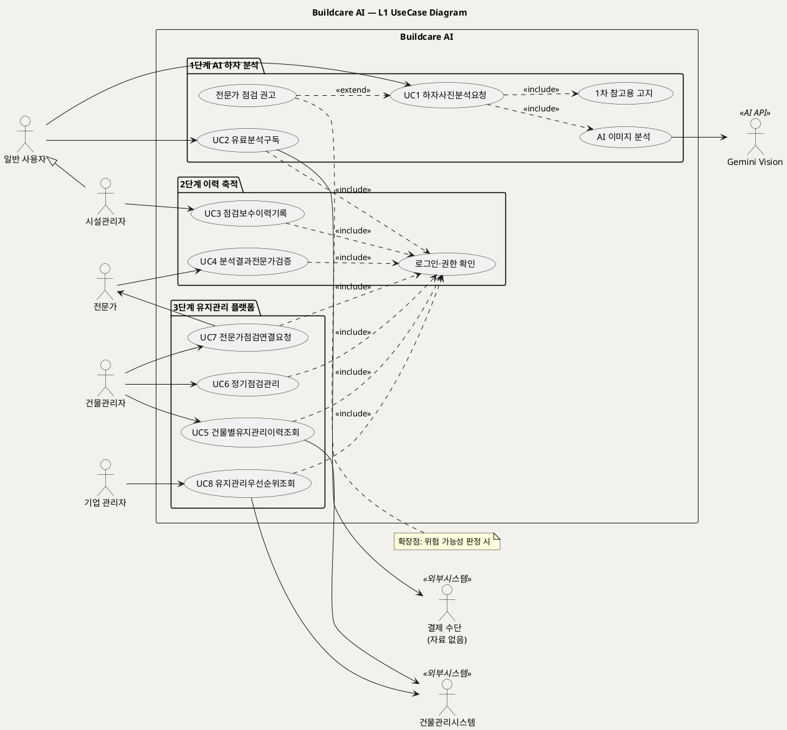

# UseCase Diagram — Buildcare AI
**Buildcare AI · L1 UseCase Diagram · UML 2.5.1 표준**

---

> **문서 식별**: `Design/유스케이스다이어그램_Buildcare AI.md` (소스: `Design/유스케이스다이어그램_Buildcare AI.puml`)
> **작성일**: 2026-10-02 · **표준**: UML 2.5.1 (OMG)
> **원천(SoT)**: `Intent-Specify.md` — Buildcare AI 의도명세
> **작성 프롬프트**: `Design/분석설계 프롬프트 - 유스케이스.md`
> **다이어그램**: 사내 Kroki `plantuml.sumzip.com` 에서 렌더 검증 완료(HTTP 200 · image/svg+xml · Syntax Error 없음).

---

## 유스케이스 목록

| UC ID | 단계 | 유스케이스명 | 주액터 | 원천 근거 |
|:--:|:--:|---|---|---|
| UC1 | 1 | 하자사진분석요청 | 일반 사용자 | `[개요]`, `[핵심 활동] 1단계`, `[부정적 영향]` |
| UC2 | 1 | 유료분석구독 | 일반 사용자 | `[수익] 1단계` |
| UC3 | 2 | 점검보수이력기록 | 시설관리자 | `[핵심 활동] 2단계`, `[핵심 데이터] 2단계` |
| UC4 | 2 | 분석결과전문가검증 | 전문가 | `[핵심 활동] 2단계`, `[핵심 장벽] 2단계` |
| UC5 | 3 | 건물별유지관리이력조회 | 건물관리자 | `[핵심 활동] 3단계`, `[핵심 데이터] 3단계` |
| UC6 | 3 | 정기점검관리 | 건물관리자 | `[핵심 활동] 3단계` |
| UC7 | 3 | 전문가점검연결요청 | 건물관리자 | `[핵심 활동] 3단계`, `[수익] 3단계` |
| UC8 | 3 | 유지관리우선순위조회 | 기업 관리자 | `[가치제안] 3단계`, `[핵심 이네이블러] 3단계` |

포함·확장: «include» AI 이미지 분석(UC1, Gemini Vision) · «include» 1차 참고용 고지(UC1) · «include» 로그인·권한 확인(UC2~UC8) · «extend» 전문가 점검 권고(UC1, 위험 가능성 판정 시).

## L1 UseCase Diagram

**[「Buildcare AI L1 UseCase Diagram」 PlantUML 뷰어로 열기](https://plantuml.sumzip.com/plantuml/svg/eNp1VU1P20AQve-vGKWX9gAiCZAIoQiSkgqprZBaqh4qIZOYYBEcZDsqVYuUVqZCEAkORAmRg4zKV9VUNYSGHDj1p_Ror_9DZ_0RHJecspv3Znbmzdv1jKxwklJeL0I5t7RcFor5HCfxS2NjRF4TxA1O4tZhmcutFaRSWcxnSsWSBI-y8Wx0Lh1gyKtcvvReEAuwwhVlnhT5FQWUEkhCYVWBvCDxOUUoiUQRlCIPaf8YmJ2Hv5VDeB6FRZnPcDIPTwWugBkJ4XIKHhWhrTvLaAD90qbN7_T4IAKczMhSn7CnUfXUvKlY520fz77wUfPqxmrfDaLpe7Rn0Po2DMJzfZjqqtXumUbF_X9zg5cUH3vGrwuiAG8EGftycO-f6WlsanZhPpV6sAasdvfU3ta8Sl4hnx71rG6ljwQCrw2qa0B3Gtbe5TvxMVZofasCrX-lreoTJ8MC9-HBDIRJBNOfRkaYGITpz4kF1D4SFD8CHwnABo6XKyAUxWPMjsqmYtcaeBpYXZWqLZcGUJb5HJtRZDET9RhsLheqS6PNQ3r90x1QJhqOiAHVdCzf5Zq_29b-tseNDXLxeNq6sX716EWlXwES51-Gs0apcQnU6JkdHd0B7Oei4nNDWfvDBKofmNcVMLtVDHBH-_Y1y7wVFCPmicFK0c-AdmtU__yAEnEvn9W5wUG5bPSVddLyuouHI8a9pnC8ZueuXxfmoOd-0PhgkHWimbc92ur9ucWy7ZoG9lENt36v8XD1cb96jUnieg_sw6p1_MPev3ugjQlwbWp11GCM2w89Mexm1SttIhw6iQrU2FVydHDjPO5kmJuAfr8undYNZvOgdRLhoORAG7RpUFWnOxrV1IHCko4IW573R0ZSjg0DmxjJvvCWceJeZ287TtI-MnG_nLxfJsicv0wS1gZbey8CYddhdDTlGBSm8D4KYq5YzvN4DwNQLAQx0znYohfFbyq8mHeCYn5Q_L988eHQ-HBoYjg0ORxKDIeSwyDiqMDkcR9Epxu2xafKKYSt8eFzcvhrIpYU3vtalFb8-8g8fnyGPplCA6h2vQFoG2v3jKpXYFcP0HWAbx5B0YDFkxlc4ZfsH0Ybw8I=)** — 클릭 시 브라우저로 연결됩니다.

#### 다이어그램 쉽게 읽기 (유저 관점)

- **누가 쓰나** — 왼쪽 사람 모양이 서비스를 쓰는 사람(일반 사용자·시설관리자·건물관리자·기업 관리자·전문가)이고, 오른쪽은 서비스가 도움을 받는 바깥 시스템(Gemini Vision AI, 건물관리시스템, 결제 수단)이다.
- **무슨 순서로** — 1단계에서 누구나 사진을 올려 AI 분석을 받고(UC1), 2단계에서 시설관리자가 점검·보수 기록을 남기고 전문가가 AI 결과를 검증하며(UC3·UC4), 3단계에서 건물관리자와 기업이 쌓인 이력으로 점검·전문가 연결·우선순위 판단을 한다(UC5~UC8).
- **«include» = 항상 함께** — 사진 분석을 요청하면 AI 이미지 분석과 '1차 참고용' 안내가 **반드시** 같이 일어난다. 2단계 이후 기능은 모두 로그인·권한 확인을 거친다.
- **«extend» = 특정 상황에서만** — 분석 결과에 위험 가능성이 보일 때**만** 전문가 점검 권고가 덧붙는다.
- **Generalization(◁)** — 시설관리자는 일반 사용자의 한 종류라서 사진 분석 요청(UC1)도 그대로 할 수 있다.

| 기호 | 의미 |
|---|---|
| 사람 모양(actor) | 시스템 밖에서 시스템을 쓰는 주체 또는 외부 시스템 |
| 타원(usecase) | 액터가 달성하려는 목표 |
| 사각형(rectangle) | 시스템 경계 — 안쪽이 Buildcare AI 책임 |
| package | 원천의 단계(1·2·3단계) 구분 |
| 실선 → | 액터와 유스케이스의 연관 |
| 점선 `<<include>>` | 기본 UC가 항상 포함하는 하위 행위 |
| 점선 `<<extend>>` | 조건부로 기본 UC를 확장하는 행위 |
| 삼각 화살표(◁) | 일반화(상속) |

---

*Buildcare AI · UseCase Diagram · UML 2.5.1 · 원천 `Intent-Specify.md`*
